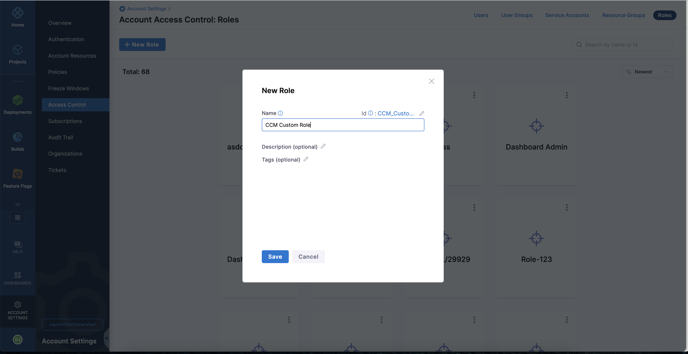
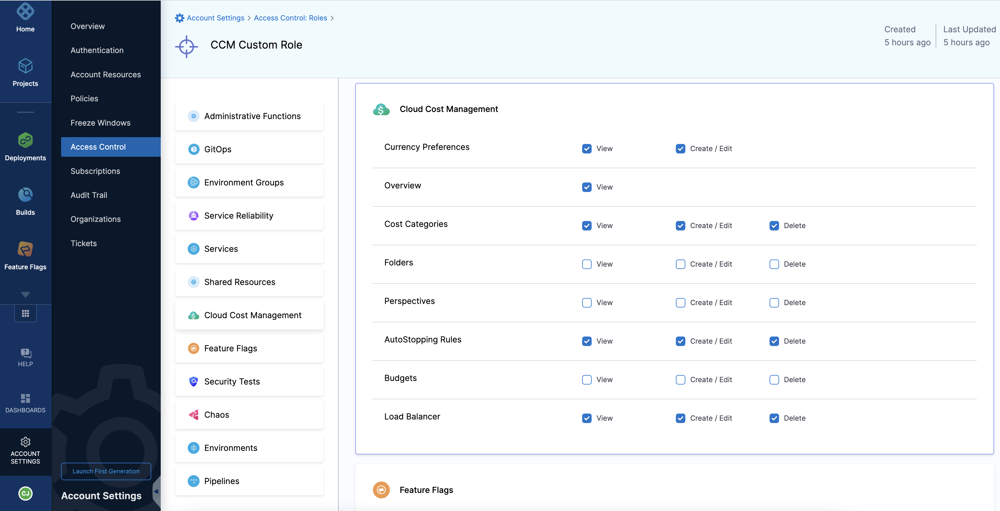
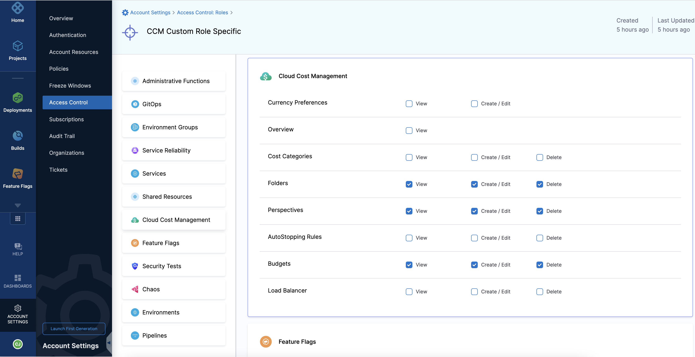
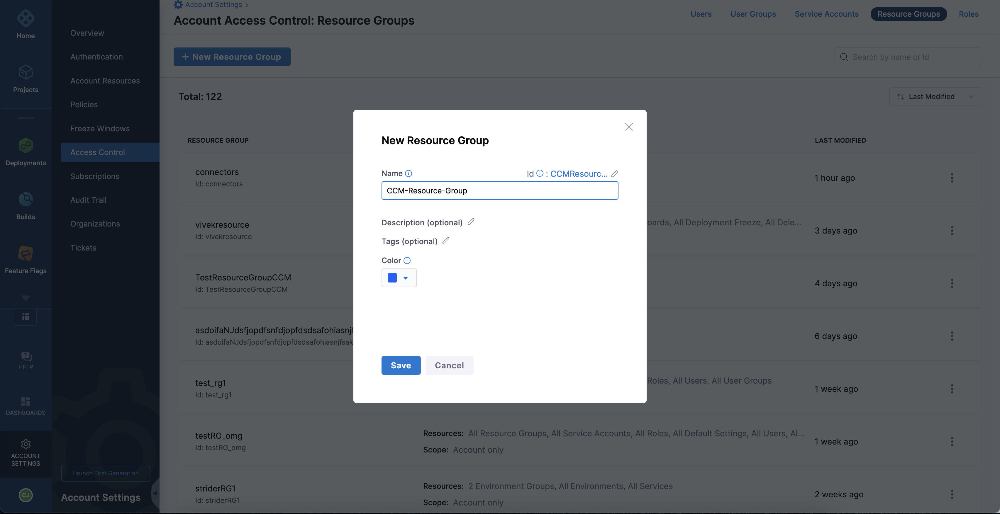
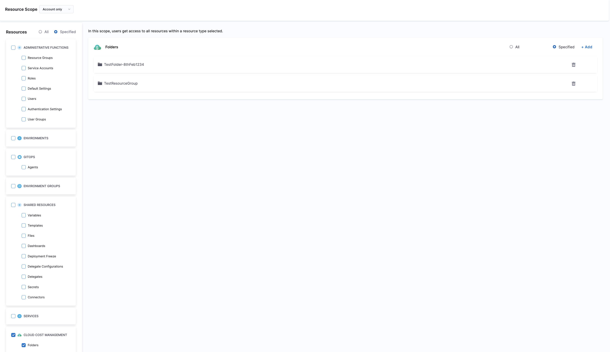
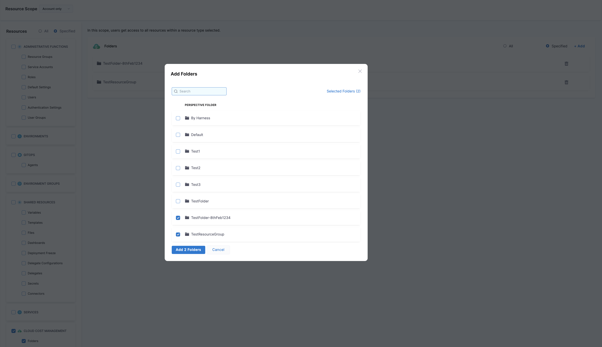
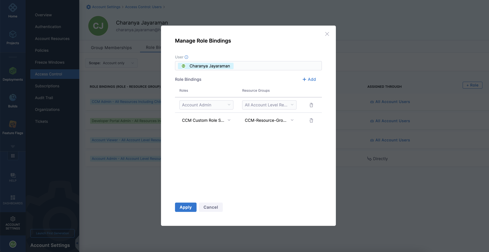

# Manage access control for CCM perspective folders

You can now manage access to Perspective folders by assigning Resource Groups to users bound by the roles assigned to them.

Perform the following steps to restrict access to a Resource Group:

1. In **Harness**, go to **Account Settings**.
2. Select **Access Control**.
3. Select **Roles**.
4. Click **+ New Role** to create a custom role with the following permissions. For example, CCM Custom Role. 
   
     
     
     
     

5. Create another custom role with a different set of permissions. 
   
      

6. Select **Resource Groups**.
7. Click **+ New Resource Group** to create a new resource group.

    

8.  Select **Account only** in the **Resource Scope** dropdown list.
9.  In the **Resources** pane, select **Cloud Cost management** > **Folders**. 
    
      
	
10.  To restrict access to specific folders, select **Specified** and then click **Add**. 
    
      

11. Add the selected folders and save the resource group settings.
12. To bind the **Role** with the **Resource Group**, go to the **Users** tab on the **Access Control** page.
13. Select the user you want to restrict access to.
14. Click **Manage Roles**. 
15. Click **Add** in the **Manage Role Bindings** window.
16. Select the **Role** and the newly created **Resource Group** to restrict access to folders.
17. Select another **Role** and **Resource Group** to provide access to all other resources.
18. Click **Apply**. 
    
      

In Harness, the **Perspectives** page shows only the folders that the user has been granted access to. This means that the user cannot see or interact with any folder that they do not have permission to access.

A user can create **Budgets** for Perspectives only within the folders that they have been granted access to. For more information about Budgets, go to [Create a Budget](../../5-use-ccm-cost-governance/ccm-budgets/create-a-budget.md).

Similarly, on the **Anomalies** page, users can only view those anomalies associated with the perspectives located within specific folders that they have access to. The anomalies displayed also depend on the Perspective rule that restricts the user to a particular cloud provider account or a cost category, or a region. The out-of-the-box perspectives provided by Harness, as well as any other perspectives outside these folders, are not displayed. For more information about Anomalies, go to [Detect Cloud Cost Anomalies](../../3-use-ccm-cost-reporting/4-detect-cloud-cost-anomalies-with-ccm.md).

For users with restricted access, **Recommendations** are displayed only for the Perspectives located within specific folders that they have access to. The user will be able to view and apply these recommendations. For more information, go to [Recommendations](../../4-use-ccm-cost-optimization/1-ccm-recommendations/1-home-recommendations.md).

A user with folder restrictions does not have permission to create new folders. This means that the user can only work within the existing folder structure that has been set up for them by an administrator.

