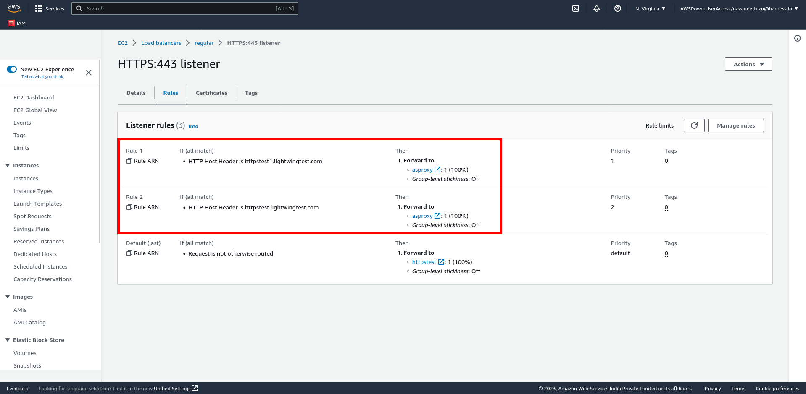
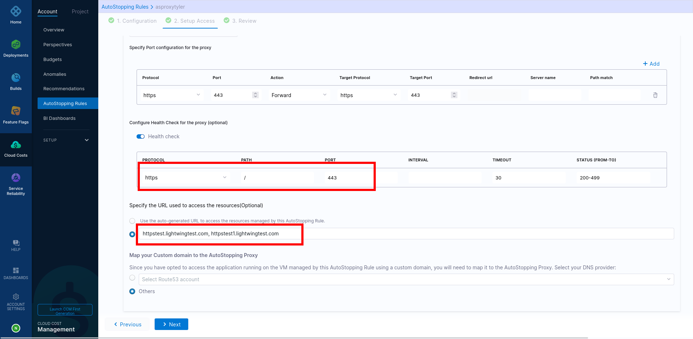

This use case provides the steps to configure an AutoStopping proxy as a downstream system of an Application Load Balancer in AWS.
The following image illustrates the network architecture:

Perform the following steps to configure AutoStopping proxy as a downstream system of ALB:
  
**On the AWS console**:
1. Create a target group for the proxy VM with a health check configuration. 

2. Edit ALB rules and add forwarding action to the proxy target group.

**In Harness**:

3. Create AutoStopping rule with HTTP/HTTPS workload and configure custom domains in the AutoStopping rule.

### Create a target group for the proxy VM with a health check configuration

1. On the AWS console, navigate to **Target Groups** and create a new target group. Go to [Create a target group](https://docs.aws.amazon.com/elasticloadbalancing/latest/application/create-target-group.html) for more information.

2. Choose the proxy VM and register it as a target.

3. The port should match the port details that the application is using.

4. Configure the health check settings as per the port information. Go to [Health checks for your target groups](https://docs.aws.amazon.com/elasticloadbalancing/latest/application/target-group-health-checks.html) for more information.

5. If the proxy needs to handle multiple ports (80, 443), create one target group for each of the ports.

### Edit ALB rules and add forwarding action to the proxy target group
All the URLs configured in the AutoStopping rules should point to the AutoStopping proxy target group.

### Create an AutoStopping rule with custom domains

### See also
[Create AutoStopping rules for AWS](../../4-use-ccm-cost-optimization/1-optimize-cloud-costs-with-intelligent-cloud-auto-stopping-rules/4-create-auto-stopping-rules/create-autostopping-rules-aws.md)