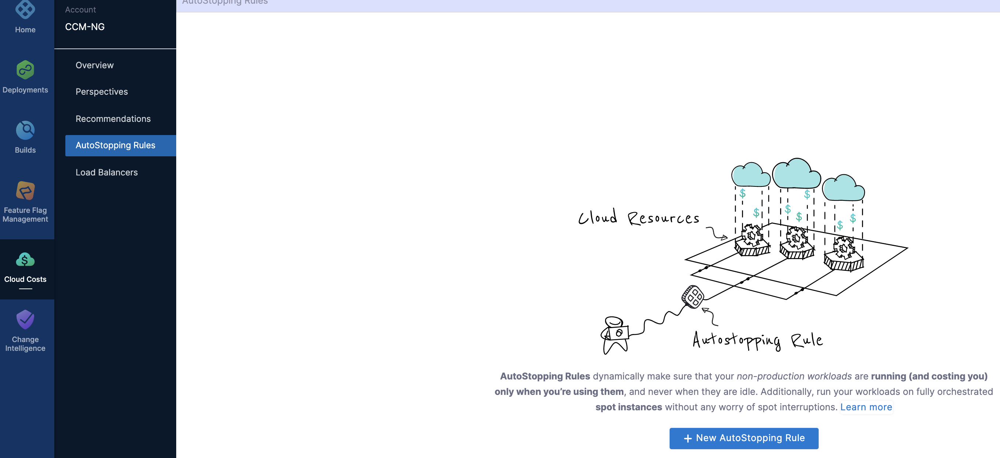

Connectors allow Harness to connect to your deployment environments, such as Kubernetes Clusters, AWS, Google Cloud Platform, Azure, etc. To create an AutoStopping Rule for your AWS instances, you first need to connect Harness to your AWS account. This topic describes how to connect your AWS cloud account to Harness.

### Before you begin

* [AutoStopping Rules Overview](/docs/cloud-cost-management/2-use-cloud-cost-management/1-optimize-cloud-costs-with-intelligent-cloud-auto-stopping-rules/1-add-connectors/1-auto-stopping-rules.md)

### Add an AWS Connector

Perform the following steps to add an AWS connector for AutoStopping Rules:

1. In **Cloud Costs**, click **New AutoStopping Rule**.

  
2. In **AutoStopping Rules**, select **AWS**. It is the cloud account in which your workloads are running that you want to manage using AutoStopping Rules.

  
3. Click **Connect to your AWS account** drop-down list and then click **New Connector**.
4. See [Set up Cloud Cost Management for AWS](/docs/cloud-cost-management/1-onboard-with-cloud-cost-management/set-up-cloud-cost-management/set-up-cost-visibility-for-aws.md) for further instructions.

### Next Steps

* [Create AutoStopping Rules for AWS](/docs/cloud-cost-management/2-use-cloud-cost-management/1-optimize-cloud-costs-with-intelligent-cloud-auto-stopping-rules/3-create-auto-stopping-rules/create-autostopping-rules-aws.md)
* [Use AutoStopping Rules Dashboard](/docs/cloud-cost-management/2-use-cloud-cost-management/1-optimize-cloud-costs-with-intelligent-cloud-auto-stopping-rules/3-create-auto-stopping-rules/autostopping-dashboard.md)

