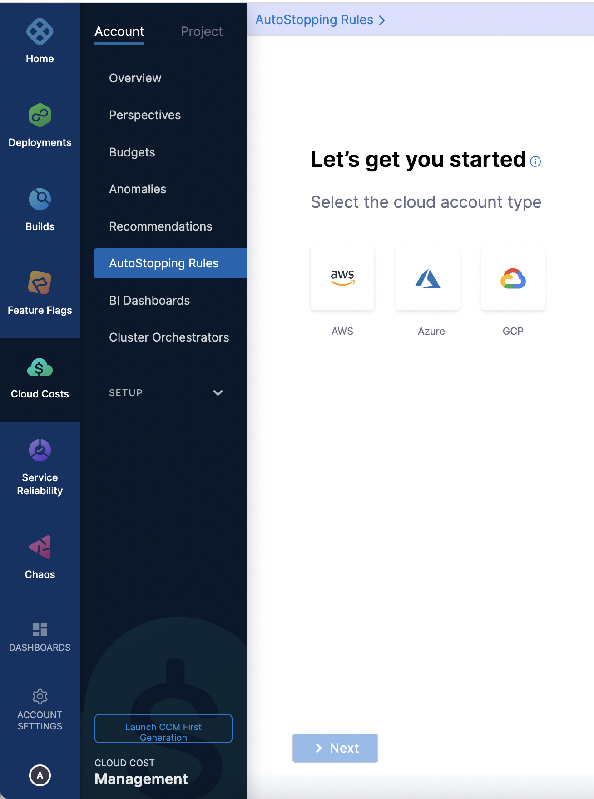
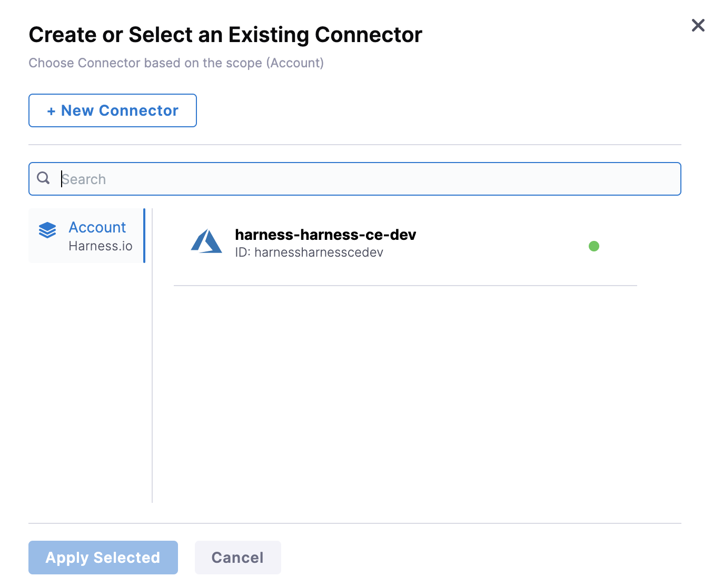
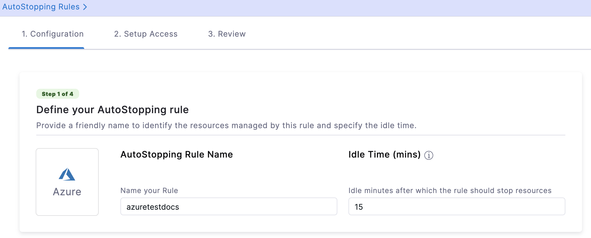
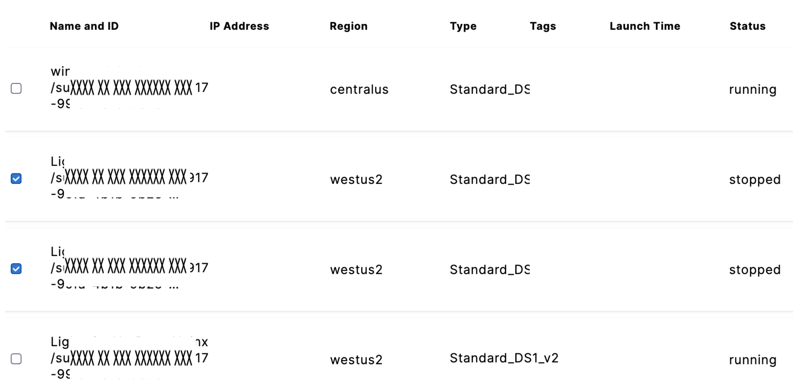
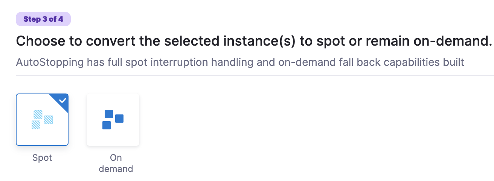
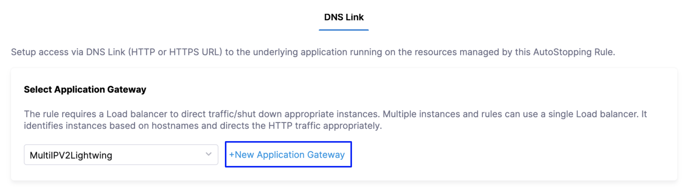
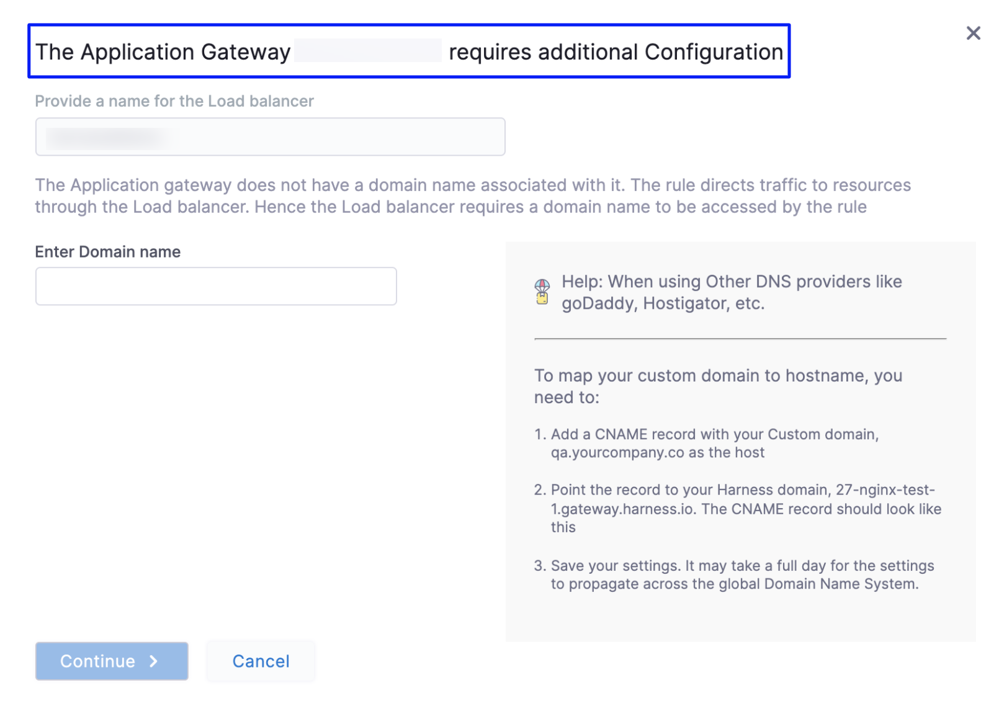
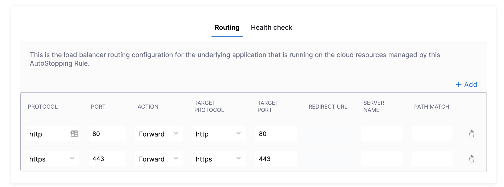
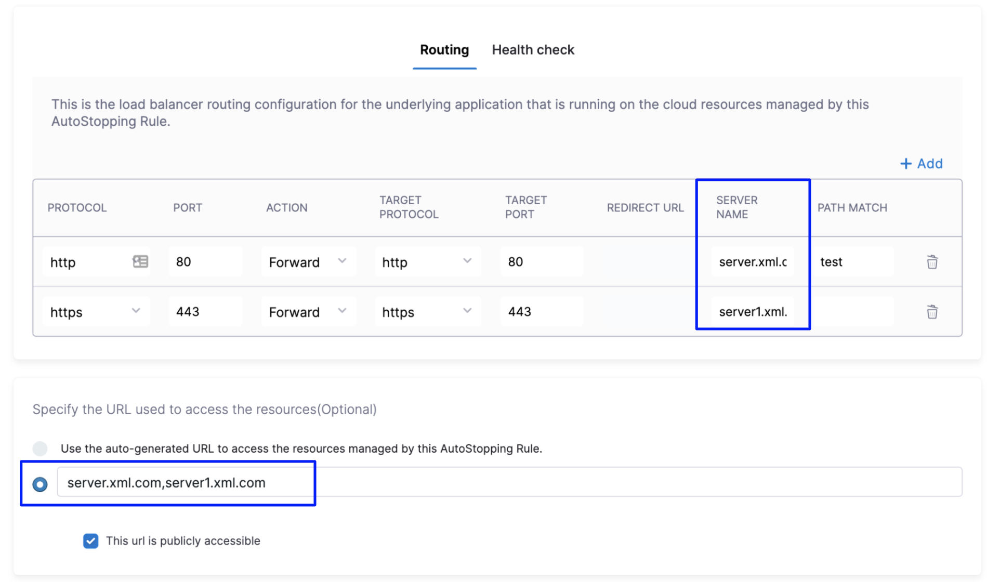
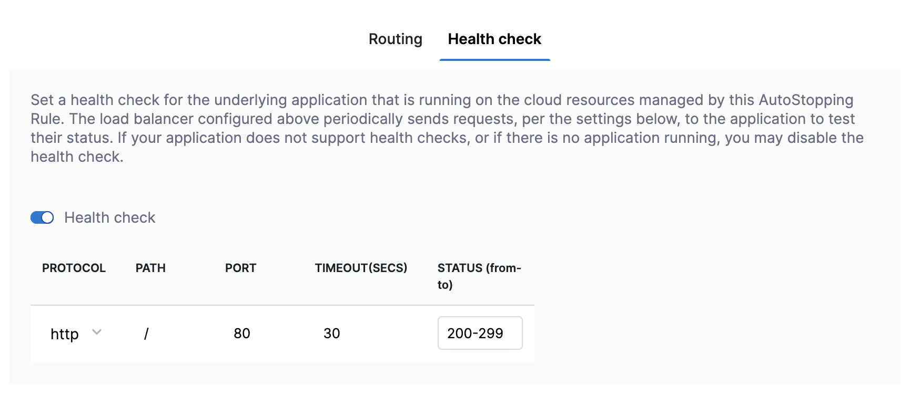

AutoStopping Rules make sure that your non-production resources run only when used, and never when idle. It also allows you to run your workloads on fully orchestrated spot instances without any worry of spot interruptions.

## Before You Begin

* [Create an Azure Connector for Autostopping Rules](../1-add-connectors/add-azure-connector.md)
* [Create a Kubernetes Connector for AutoStopping Rules](create-autostopping-rules-for-kubernetes.md)
* [AutoStopping Rules Overview](../1-add-connectors/1-auto-stopping-rules.md)

## Prerequisites

* Make sure that you have Azure on-demand VMs created
* Make sure that you have the **Application Administrator** role assigned for your Azure AD. Users in this role can create and manage all aspects of enterprise applications, application registrations, and application proxy settings. See [Application Administrator](https://docs.microsoft.com/en-us/azure/active-directory/roles/permissions-reference#application-administrator)
* Many Azure CLI commands act within a subscription. Ensure that you have selected the right subscription before executing the commands. If you need to switch the subscription, use the following command:  
`az account set -s <`*`subs id/name`*`>`  
For more information, see [Manage Subscriptions](https://docs.microsoft.com/en-us/cli/azure/manage-azure-subscriptions-azure-cli).
* Permissions to create an application gateway:
	+ A dedicated subnet with no other resources
	+ A public IP belonging to the same VPN as the application gateway
		- SKU: Basic for V1 Application gateway and Standard for V2 application gateway
		- Type: Static or Dynamic
* Permissions to create Azure function and a dedicated storage account
* SSL certificate in **\*.pfx** format to support HTTPS traffic if required. You can use a wild card certificate or specific to the domain certificate

## Step 1: Add a Cloud Provider

Perform the following steps to link your Azure cloud account to Harness.

1. In **Cloud Costs**, click **New AutoStopping Rule**.
   
     
2. In **AutoStopping Rules**, select **Azure**. It is the cloud account in which your workloads are running that you want to manage using AutoStopping rules.
   
     
3. If you have already linked your Azure account and want to use that account, then select the Azure account from the list.
4. If you have not added your cloud account, click **New Connector**. For the detailed steps, see [Connect to an Azure Connector](../1-add-connectors/add-azure-connector.md).
   
     

## Step 2: Add a new AutoStopping rule

Perform the following steps to add a new AutoStopping rule for Azure:

* Configuration: In this step, do the following:
	+ Step 1: Define an AutoStopping Rule
	+ Step 2: Select the Resources to be Managed by the AutoStopping Rule
	+ Step 3: Select the Instance Fulfillment Type
	+ (Optional) Step 4: Set Up Advanced Configuration
* Setup Access: In this step, do the following:
	+ Setup Access Using DNS Link
* Verify the configurations.

### Step 1: Define an AutoStopping rule

Perform the following steps to get started with AutoStopping Rule.

1. In **Cloud Costs,** in **AutoStopping Rules**, click **New AutoStopping Rule**.
2. In the cloud account type, select **Azure**. It is the cloud account in which your workloads are running that you want to manage using AutoStopping rules.
3. Select your Azure account from the **Connect to your Azure account**.  
  
  If you have not added an Azure cloud account, see [Connect to an Azure Connector](../1-add-connectors/add-azure-connector.md).
4. In **Define your AutoStopping rule**, in **Name your Rule**, enter a name for your rule. This is the name of your AutoStopping rule.
5. In **Idle time**, enter the idle time in minutes. This is the time that the AutoStopping rule will wait before stopping the idle instances.  
AutoStopping will shut down (for on-demand) or snapshot and terminate (for spot) the instances after the idle time period has elapsed.

  

### Step 2: Select the resources to be managed by the AutoStopping rule

Select the cloud resources that you want to manage using this rule. AutoStopping Rule will monitor the selected resources and stop them when they are idle beyond the configured idle time.

#### Option 1: Select Instances

:::note
You can add multiple instances to a single Rule. However, all the VMs should be part of the same region.
:::

1. Select **Instances** and click **Add an Instance**.
2. Select the instances that you want to manage using the AutoStopping rules. You can use the search option to search the instances.
   
     
3. Once you have finished selecting the instances, click **Add selected**.

#### Option 2: Select Kubernetes Clusters

Add a cluster to be managed by the AutoStopping Rule.

1. Select **Kubernetes Cluster** and then click **Add a cluster**.
2. Select the Kubernetes cluster that you want to manage using the AutoStopping rules. If you wish to create a new connector for the Kubernetes cluster, see [Create a Kubernetes Connector for AutoStopping Rules](../1-add-connectors/k8s-connector-autostopping.md).
3. Once you have finished selecting the Kubernetes cluster, click **Add selected**.  

:::note
If you have selected a Kubernetes cluster, follow the steps in [Create AutoStopping Rules for Kubernetes Cluster](create-autostopping-rules-for-kubernetes.md).

:::


### Step 3: Select the Instance Fulfillment Type

You can convert the fulfillment type of your selected instances. Select **Spot** or **On-Demand**.



### (Optional) Step 4: Set Up Advanced Configuration

In this step, you can configure the following settings:

#### Add Dependency

Set dependencies between two or more AutoStopping Rules when you want one Rule to make one or more Rules to be active based on the traffic that it receives. For example for an application server dependant on a database server, create two AutoStopping Rules managing both the servers. Add a dependency on the Rule managing the application server to be dependant on the Rule managing the database server.

1. Click **add dependency** to add a dependency on any existing rule.
2. Select the rule from the **RULES** drop-down list.
3. In **DELAY IN SECS**, enter the number of seconds that rule should wait after warming up the dependent rule. For example, you have Rule 1 dependent on Rule 2 and you have set 5 seconds delay. In that case, when the request is received to warm up Rule 1, then first Rule 2 (dependent rule) is warmed up, and then there will be a delay of 5 seconds before warming up Rule 1.
4. Once you're done with all the configurations, click **Next**.  
  
Now that you have the AutoStopping Rule configured, define how to access the instances.

#### Fixed Schedule

Create fixed uptime or downtime schedules for the resources managed by this AutoStopping Rule. When a resource is configured to go up or down on a fixed schedule, it is unaffected by activity or idleness during that time period.

In certain scenarios, you would not want your resources to go down or up. For example, every Friday at 5 p.m. you want your `ABC` resource to go down. You can schedule downtime for your `ABC` resource. During this window, the resource will be forced to go down regardless of the defined rule. You can choose to specify uptime for your resources in the same way.

:::note
The fixed schedule takes precedence over the defined AutoStopping Rule.
:::

To create a fixed schedule for your rule, do the following:

1. In **Fixed Schedules**, click **Add Fixed Schedule**.
   
     

2. In **New Fixed Schedule**, enter a **Name** for your schedule.
3. In **Type**, select the type for your schedule. You can schedule an **Uptime** or **Downtime** for your rule. As per your schedule, the resources will go up or down.
4. Select the **Time Zone** from the drop-down list.
5. In **Set schedule period**, use the date picker to set the start and end time for your schedule.
	1. In **Begins on**, select the start date and time for your schedule. You can select a date and specify the time.
	2. In **Ends on**, select the end date and time for your schedule. You can select a date and specify the time. Ensure that **Never ends** checkbox is unselected to set the end time.  
	  
	  If you don't specify an end time, the schedule will continue to run until you manually update the settings or remove the schedule.
5. Select the checbox **Never ends** if you do not want to set end time for your schedule.
6. You can also set a recurring schedule for the rule. If you want to set a recurring schedule, in **Uptime/Downtime in the selected period**, in **Repeats**, select the repeat frequency.
	1. Select which days of the week you'd like your schedule to repeat. You can choose any day between Sunday and Saturday.
	2. Select **Everyday**, to set the schedule for all seven days of the week.
	3. Set your repeat schedule's beginning and ending time. In the **Time** field, specify the start and end time for the fixed schedule.
	4. Select **All Day**, if you wish to set your schedule for the entire day. If you choose All Day for your schedule, you won't be able to choose a start and end time.  
	  
	**Example 1**:  
	In the following example, resources will be up every Mon, Tue, Wed starting from 12:00 a.m. on February 14, 2022 till April 30, at 10:00 p.m.
	
	  
	**Example 2**:  
	In the following example, resources will be down every day (all day) starting from 12:00 a.m. on February 14, 2022 till April 30, at 12:00 a.m.
	  
7. Click **Apply**.

### Setup Access Using DNS Link

A DNS link allows you to access the resources managed by the AutoStopping rule using an HTTP or HTTPS URL. Select DNS Link if the underlying application running on the resources managed by this AutoStopping Rule is currently accessed by an HTTP or HTTPS URL.

AutoStopping integrates with the cloud provider's native load balancing technologies (Application Load Balancer, Azure AppGateway, etc.) to provide start and stop capability for the AutoStopping-managed cloud services.


To create a DNS Link, you need to:

* **Select an Application Gateway**: The rule requires an application gateway to detect traffic and shut down appropriate instances. Multiple instances and rules can use a single load balancer. It identifies instances based on hostnames and directs the HTTP traffic appropriately.
* **Enter Routing Configuration and Health Check Details**: This is an application gateway routing configuration for the underlying application that is running on the cloud resources managed by this AutoStopping Rule.
* **Select the URL Used to Access the Resources**: You can use either of the following methods:
	+ **Auto-generated URL**: You can use the auto-generated URL to access the resources managed by this AutoStopping Rule.
	+ **Custom URL**: If using a custom URL:
		- The domain name should be entered without prefixing the scheme.
		- A rule can have multiple URLs.
		- You can enter comma-separated values into a custom URL to support multiple URLs.

#### Select an Application Gateway

A DNS link allows you to access the resources managed by the AutoStopping rule using an URL.

1. In **Setup Access**, select **DNS Link**.
2. Select an application gateway from the drop-down list. If your application gateway is not added, click **New Application Gateway**. For detailed steps, see [Create an Application Gateway for Azure](../4-load-balancer/create-an-application-gateway-for-azure.md).
   
     
	 
	 The list will populate the application gateway if the application gateway has previously been created in your environment but not yet mapped to Harness. In that case, you must [configure the DNS mapping settings](../4-load-balancer/create-an-application-gateway-for-azure.md).  

  
  
  
:::note
  Multiple instances and rules can use a single application gateway. It identifies instances based on hostnames and directs the HTTP traffic appropriately.
:::


#### Enter Routing Configuration and Health Check Details

1. Verify listeners information under the **Routing** tab. If the security groups are configured for the selected instances, then the routing information is auto-populated for those instances.  

:::note
You can edit or delete the routing information. However, it is mandatory to have at least one port listed. For more information, see [Listeners](https://docs.aws.amazon.com/elasticloadbalancing/latest/application/load-balancer-listeners.html).
:::


  
   
    
  Click **Add** if you wish to add more ports. The following are some points to consider:  
	  
  * If you are forwarding the same action to different ports, then specify the server name and/or path match.   
	  
  * If you specify the server name, then the host will use the custom URL to access the resources. You cannot use an auto-generated URL to access the resources.
  
    
2. Toggle the **Health check** button to configure the health check. Health check status should be successful for the AutoStopping rules to come into effect.  
  
	By default, the health check is turned on.
	1. In PROTOCOL, select **http** or **https**.
	2. Enter Path, port, and timeout details. For example, if you have configured port 80 and the timeout as 30 seconds for your instance, then the AutoStopping rule will check these specified parameters before bringing the AutoStopping Rule into effect.
   
     

#### Select the URL for Accessing the Resources

You can use either of the following methods:

* Auto-generated URL
* Custom URL

**Auto-generated URL**

Every AutoStopping rule will have an auto-generated URL. This URL will be a subdomain to the domain name specified for the application gateway. Since the application gateway configures a wildcard domain such as `*.autostopping.yourcompany.com`, the auto-generated URL will work automatically and point to the correct load balancer.

Select **Use the auto-generated URL to access the resources managed by this AutoStopping Rule**.

**Custom URL**

AutoStopping rule can use multiple custom domains. In such a case, it should be configured in the DNS provider. AutoStopping Rules also allows you to use custom domains or change the root of your site's URL from the default, like,`autostop.harness.io`, to any domain you own. To point your site's default domain to a custom domain, you can set it up in your DNS provider.

Enter the custom URL currently used to access the instances. The domain name should be entered without prefixing the scheme. A rule can have multiple URLs. You can enter comma-separated values into a custom URL to support multiple URLs.


#### Setup Access Using SSH/RDP

SSH and RDP allow you to access the resources managed by the AutoStopping rule via SSH or RDP HTTPS URL. Select this option if the underlying applications running on the resources managed by AutoStopping Rule are accessed via SSH or RDP.

1. In **Setup Access**, select **SSH/RDP**.
2. Select your operating system to download the Harness CLI for your system.
3. Click **Download CLI**.
4. You can connect using SSH or RDP.

#### SSH Commands

To connect to remote servers via SSH/RDP, such as PuTTY, use the Harness CLI `connect` command. The `connect` command opens a proxy connection in your machine which can be used from other applications.


```
harness connect --host hostname --port <ssh/rdp port>
```
You can simply copy the hostname from the AutoStopping Rule dashboard view. Click on the AutoStopping Rule that you want to connect and copy the hostname.

For example:


```
harness connect --host default-test-ssh-1.abc1000test.lightwingtest.com --port 22 -- -i ~/.ssh/ry-jupyter.pem
```
Here is the output:


```
Proxy listening details:  
    Rule name:           Test SSH 1  
    Listen address:      127.0.0.1  
    Port forwarding:     14527 => 22  
    Protocol:            tcp  
    Started at:          2021-05-19 21:53:38.320943 +0530 IST m=+48.950643931
```
Harness `connect` created a secure tunnel from your computer to the given port after bringing up the VM. Now open the RDP/SSH client and use the hostname and port information provided above to connect.


```
harness ssh --host default-test-ssh-1.abc1000test.lightwingtest.com --user ubuntu --config lwc.toml -- -i ~/.ssh/ry-jupyter.pem
```
#### RDP Commands

For RDP run the following command:


```
harness rdp --host default-test-rdp-1.abc1000test.lightwingtest.com
```
Run the following command to connect via private IP:


```
harness rdp --host default-test-rdp-1.abc1000test.lightwingtest.com --internal-ip
```
1. Click **Next**.

### Review

In Review, verify all the configuration details and click **Save Rule**. To edit any of the configuration settings, click **EDIT** and modify the settings.  
  
Your AutoStopping rule is listed under the [AutoStopping Rules dashboard](../3-create-auto-stopping-rules/autostopping-dashboard.md).

## Next Step

* [Create AutoStopping Rules for a Kubernetes Cluster](create-autostopping-rules-for-kubernetes.md)
* [Use AutoStopping Rules Dashboard](../3-create-auto-stopping-rules/autostopping-dashboard.md)

