AutoStopping Rules make sure that your non-production resources run only when used, and never when idle. It also allows you to run your workloads on fully orchestrated spot instances without any worry of spot interruptions.

## Before You Begin

* [Create an AWS Connector for Autostopping Rules](create-autostopping-rules-aws.md)
* [Create a Kubernetes Connector for AutoStopping Rules](create-autostopping-rules-for-kubernetes.md)
* [AutoStopping Rules Overview](../1-add-connectors/1-auto-stopping-rules.md)

## Prerequisites

* Ensure that you have AWS EC2 VMs or Auto Scaling Groups created.
* Ensure that you have access to CUR. See [Review: Cost and Usage Reports (CUR) and CCM Requirements](../../../1-onboard-with-cloud-cost-management/set-up-cloud-cost-management/set-up-cost-visibility-for-aws.md).
* Permissions to create a cross-account role. See [AWS Access Permissions](../../../1-onboard-with-cloud-cost-management/set-up-cloud-cost-management/set-up-cost-visibility-for-aws.md).

## How Spot Orchestration Works?

For spot instances, periodic snapshots are taken every two minutes. A snapshot is also taken before the instance is shut down. It is important to note here that only the last three successful snapshots are kept, while the rest are deleted. When an interruption occurs, or when the next activity after idleness occurs, the last known snapshot is used to create a new spot instance. If there is no available spot capacity, we fall back to an on-demand instance. AWS spot instance creation API is used to create a new spot instance.

When there is idleness, the spot instance, along with the root EBS volume, is terminated after a successful snapshot is taken (snapshots in AWS are incremental, so subsequent snapshots after the first one are very fast). When a new spot instance is created, the root EBS volume is recreated from the most recent successful snapshot and the additional EBS volumes are reattached. As a result, there is no data loss. All network interfaces and metadata will also be saved. As a result, even though it's a new spot instance, the user sees it to be the same machine.

## Visual Summary

This section provides an overview of AutoStopping Rules.
<figure><iframe src="//fast.wistia.com/embed/iframe/8wo6shjqqh" width="560" height="315" frameborder="0" allowfullscreen=""></iframe></figure>

## AutoStopping Architecture

Here is an AutoStopping architecture for AWS resources:

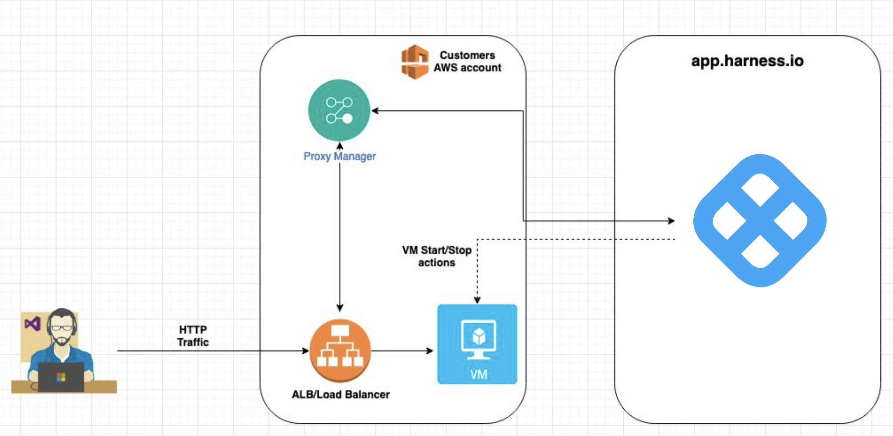

## Step 1: Add a Cloud Provider

Perform the following steps to link your AWS cloud account to Harness.

1. In **Cloud Costs**, click **New AutoStopping Rule**.
     
	   
2. In **AutoStopping Rules**, select **AWS**. It is the cloud account in which your workloads are running that you want to manage using AutoStopping rules.
   
      
3. If you have already linked your AWS account and want to use that account, then select the AWS account from the **Connect to your AWS account** drop-down list.
4. If you have not added your cloud account, click **Connect to your AWS account** drop-down list and then click **New Connector**. For the detailed steps, see [Connect to an AWS Connector](../1-add-connectors/connect-to-an-aws-connector.md).
   
     

## Step 2: Add a New AutoStopping Rule

Perform the following steps to add a new AWS AutoStopping rule:

* Configuration: In this step, do the following:
	+ Step: Define an AutoStopping Rule
	+ Step: Select the Resources to be Managed by the AutoStopping Rule
		- Option 1: Select EC2 VM(s)
		- Option 2: Select Auto Scaling Groups]
		- Option 3: Select Kubernetes Clusters
		- Option 4: Select ECS Service
		- Option 5: Select RDS Instances
	+ (Optional) Step: Set Up Advanced Configuration
* Setup Access: In this step, do the following:
	+ Setup Access Using DNS Link
	+ Setup Access Using SSH/RDP
* Review: Verify the configurations.

### Step: Define an AutoStopping Rule

Perform the following steps to get started with AutoStopping Rule.

1. In **Cloud Costs,** in **AutoStopping Rules**, click **New AutoStopping Rule**.
2. In the cloud account type, select **AWS**. It is the cloud account in which your workloads are running that you want to manage using AutoStopping rules.
3. Select your AWS account from the **Connect to your AWS account** drop-down list and click **Next**. If you have not added an AWS cloud account, see [Connect to an AWS Connector](../1-add-connectors/connect-to-an-aws-connector.md).
   
     
4. In **Define your AutoStopping rule**, in **Name your Rule**, enter a name for your rule. This is the name of your AutoStopping rule.
5. In **Idle time**, enter the idle time in minutes. This is the time duration for which the AutoStopping rule waits before stopping the idle instances.  
  
  After the idle time elapses:  
  
  - For Spot Instances, a snapshot is taken and then the instances are terminated. See **How Spot Orchestration Works?** section.  
  
  - On-Demand Instances are shut down without a snapshot.
  
   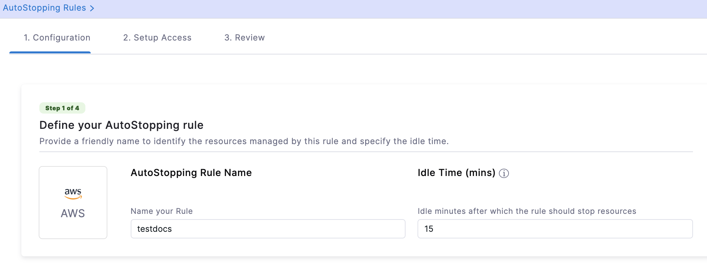

### Step: Select the Resources to be managed by the AutoStopping Rule

Select the cloud resources that you want to manage using this rule. AutoStopping Rule will monitor the selected resources and stop them when they are idle beyond the configured idle time. You can select any of the following:

* Instances
* Auto Scaling Groups
* Kubernetes Cluster
* ECS Service
* RDS Instance

#### Option 1: Select EC2 VM(s)

Add instance/s to be managed by your AutoStopping rule.

:::note
You can add multiple instances to a single Rule. However, all the VMs should be part of the same region.
:::

1. Select **Instances** and click **Add an Instance**.
2. Select the instances that you want to manage using the AutoStopping rules. You can use the search option to search the instances.
   
     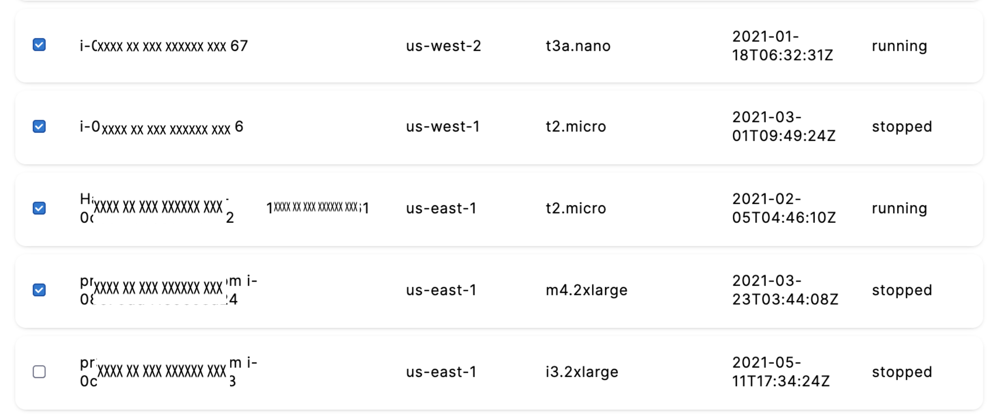
3. After selecting the instances, click **Add selected**.
4. You can convert the fulfillment type of your selected instances. Select **Spot** or **On-Demand**.

#### Option 2: Select Auto Scaling Groups

Add an Auto Scaling Group to be managed by the AutoStopping rule.

:::note
You can add only one Auto Scaling Group to a rule.
:::

1. Select **Auto scaling groups** and click **Add a auto-scaling group**.
2. Select the Auto Scaling Group that you want to manage using the AutoStopping rule. You can also use the search option to find the Auto Scaling Group.
   
   
     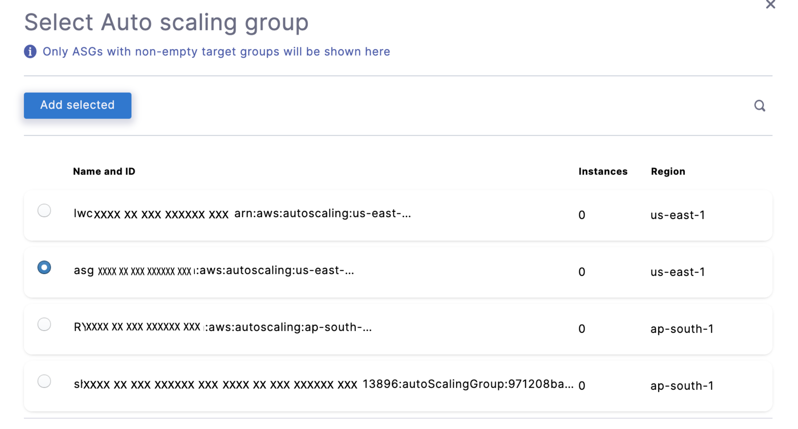
3. After selecting the Auto Scaling Group, click **Add selected**.
4. You can convert the fulfillment type of your selected Auto Scaling Group. Enter the number of instances for **Spot** and **On-Demand**. Depending on the size of your Auto Scaling group, you can specify the values for each fulfillment type. The total number of Spot and On-Demand instances should always be equal to or less than the maximum capacity of the group.  
  
  If the maximum capacity of your group is 3, then you can enter the ratio of your instances like the following:  


  | **On-Demand** | **Spot** |
  | ------------- | -------- |
  | 1             | 2        |
  | 2             | 1        |
  | 0             | 3        |
  | 3             | 0        |

  
In this example, all the instances are of On-Demand type.

  

#### Option 3: Select Kubernetes Clusters

Add a cluster to be managed by the AutoStopping Rule.

1. Select **Kubernetes Cluster** and then click **Add a cluster**.
2. Select the Kubernetes cluster that you want to manage using the AutoStopping rules. If you wish to create a new connector for the Kubernetes cluster, see [Create a Kubernetes Connector for AutoStopping Rules](create-autostopping-rules-for-kubernetes.md).
3. Once you have finished selecting the Kubernetes cluster, click **Add selected**.  

:::note
If you select a Kubernetes cluster, follow the steps in [Create AutoStopping Rules for Kubernetes Cluster](create-autostopping-rules-for-kubernetes.md).
:::


#### Option 4: Select ECS Service

Add an ECS Service to be managed by the AutoStopping Rule. See [Create AutoStopping Rules for Amazon ECS](create-auto-stopping-rules-for-ecs.md).

#### Option 5: Select RDS Instances

Add the RDS instance to be managed by this Autostopping Rule.

1. Select **RDS instances** and then click **Add RDS instances**.
2. Select a region from the **All Regions** drop-down list to see all the databases.
3. Select the RDS instance for which you want to implement the AutoStopping Rule and click **Add Selected**.
   
     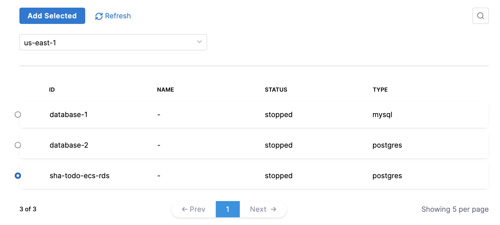

### (Optional) Step: Set Up Advanced Configuration

In this step, you can configure the following settings:

#### Add Dependency

Set dependencies between two or more AutoStopping Rules when you want one Rule to make one or more Rules to be active based on the traffic that it receives. For example for an application server dependant on a database server, create two AutoStopping Rules managing both the servers. Add a dependency on the Rule managing the application server to be dependant on the Rule managing the database server.

1. In **Dependencies**, click **add dependency** to add a dependency on any existing rule.
2. Select the rule from the **RULES** drop-down list.
3. In **DELAY IN SECS**, enter the number of seconds that rule should wait after warming up the dependent rule. For example, you have Rule 1 dependent on Rule 2 and you have set 5 seconds delay. In that case, when the request is received to warm up Rule 1, then first Rule 2 (dependent rule) is warmed up, and then there will be a delay of 5 seconds before warming up Rule 1.
4. Once you're done with all the configurations, click **Next**.

#### Fixed Schedules

Create fixed uptime or downtime schedules for the resources managed by this AutoStopping Rule. When a resource is configured to go up or down on a fixed schedule, it is unaffected by activity or idleness during that time period.

In certain scenarios, you would not want your resources to go down or up. For example, every Friday at 5 p.m. you want your `ABC` resource to go down. You can schedule downtime for your `ABC` resource. During this window, the resource will be forced to go down regardless of the defined rule. You can choose to specify uptime for your resources in the same way.

The fixed schedule takes precedence over the defined AutoStopping Rule.To create a fixed schedule for your rule, do the following:

1. In **Fixed Schedules**, click **Add Fixed Schedule**.
2. In **New Fixed Schedule**, enter a **Name** for your schedule.
3. In **Type**, select the type for your schedule. You can schedule an **Uptime** or **Downtime** for your rule. As per your schedule, the resources will go up or down.
4. Select the **Time Zone** from the drop-down list.
5. In **Set schedule period**, use the date picker to set the start and end time for your schedule.
	1. In **Begins on**, select the start date and time for your schedule. You can select a date and specify the time.
	2. In **Ends on**, select the end date and time for your schedule. You can select a date and specify the time. Ensure that **Never ends** checkbox is unselected to set the end time.  
	  
	If you don't specify an end time, the schedule will continue to run until you manually update the settings or remove the schedule.
6. Select the checbox **Never ends** if you do not want to set end time for your schedule.
7. You can also set a recurring schedule for the rule. If you want to set a recurring schedule, in **Uptime/Downtime in the selected period**, in **Repeats**, select the repeat frequency.
	1. Select which days of the week you'd like your schedule to repeat. You can choose any day between Sunday and Saturday.
	2. Select **Everyday**, to set the schedule for all seven days of the week.
	3. Set your repeat schedule's beginning and ending time. In the **Time** field, specify the start and end time for the fixed schedule.
	4. Select **All Day**, if you wish to set your schedule for the entire day. If you choose All Day for your schedule, you won't be able to choose a start and end time.  
	  
	**Example 1**:  
	In the following example, resources will be up every Mon, Tue, Wed starting from 12:00 a.m. on February 14, 2022 till April 30, at 10:00 p.m.**Example 2**:  
	In the following example, resources will be down every day (all day) starting from 12:00 a.m. on February 14, 2022 till April 30, at 12:00 a.m.
8. Click **Apply**.

Now that you have the AutoStopping rule configured, define how you would want to access the underlying application running on the resources managed by this Rule. You can use any of the following methods:

* [**DNS Link**](/article/7025n9ml7z-create-autostopping-rules-aws#setup_access_using_dns_link): If the underlying applications running on the resources managed by the AutoStopping Rule are accessed by an HTTP or HTTPS URL.
* [**SSH/RDP**](/article/7025n9ml7z-create-autostopping-rules-aws#setup_access_using_ssh_rdp): If the underlying applications running on the resources managed by AutoStopping Rule are accessed via SSH or RDP.

### Setup Access Using DNS Link

A DNS link allows you to access the resources managed by the AutoStopping rule using an HTTP or HTTPS URL. Select DNS Link if the underlying application running on the resources managed by this AutoStopping Rule is currently accessed by an HTTP or HTTPS URL.

AutoStopping integrates with the cloud provider's native load balancing technologies (Application Load Balancer, Azure AppGateway, etc.) to provide start and stop capability for the AutoStopping-managed cloud services. Each load balancer is identified by its DNS hostname (autostopping.example.com, www.example.com, etc.).

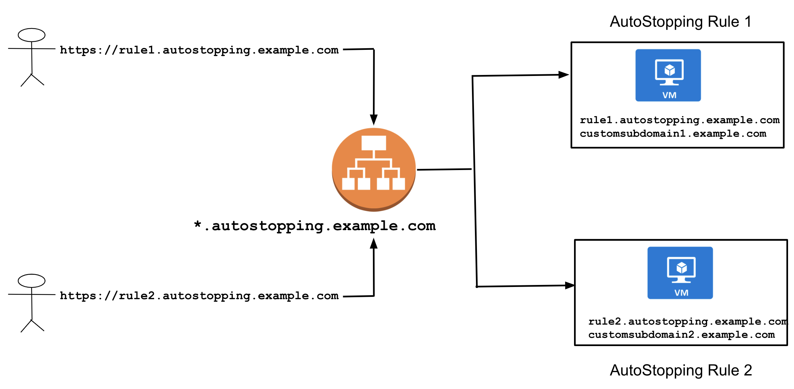

To create a DNS Link, you need to:

* **Select a Load Balancer**: The rule requires a load balancer to detect traffic and shut down appropriate instances. Multiple instances and rules can use a single load balancer. It identifies instances based on hostnames and directs the HTTP traffic appropriately.
* **Enter Routing Configuration and Health Check Details**: This is the load balancer routing configuration for the underlying application that is running on the cloud resources managed by this AutoStopping Rule.
* **Select the URL Used to Access the Resources**: You can use either of the following methods:
	+ **Auto-generated URL**: You can use the auto-generated URL to access the resources managed by this AutoStopping Rule.
	+ **Custom URL**: If using a custom URL:
		- The domain name should be entered without prefixing the scheme.
		- A rule can have multiple URLs.
		- You can enter comma-separated values into a custom URL to support multiple URLs.
		- AutoStopping rule can also use an additional custom domain. In such a case, it should be configured in the DNS provider.

#### Select a Load Balancer

1. In **Setup Access**, select **DNS Link**.
2. Select a load balancer from the drop-down list. If you have not added your load balancer yet, click **New Load Balancer** to add a load balancer. For detailed steps, see [Create an Application Load Balancer for AWS](/article/eba1bn2jm6-create-load-balancer-aws).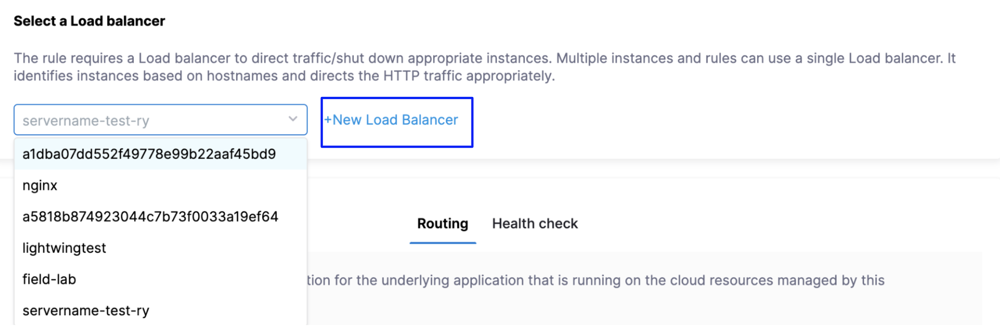The list will populate the load balancer if the load balancer has previously been created in your environment but not yet mapped to Harness. In that case, you must [configure the DNS mapping settings](/article/eba1bn2jm6-create-load-balancer-aws).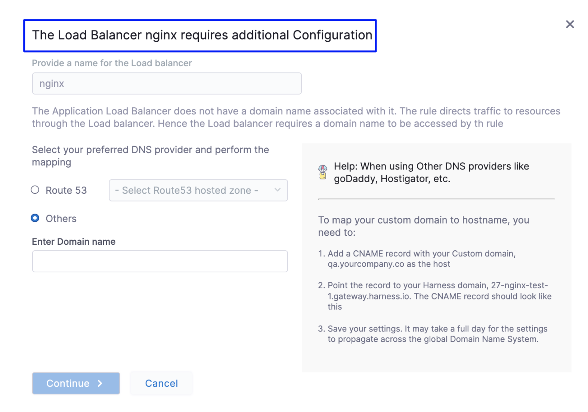Multiple instances and rules can use a single load balancer. It identifies instances based on hostnames and directs the HTTP traffic appropriately.

#### Enter Routing Configuration and Health Check Details

1. Verify listeners information under the **Routing** tab. If the security groups are configured for the selected instances, then the routing information is auto-populated for those instances.  
You can edit or delete the routing information. However, it is mandatory to have at least one port listed. For more information, see [Listeners](https://docs.aws.amazon.com/elasticloadbalancing/latest/application/load-balancer-listeners.html).

  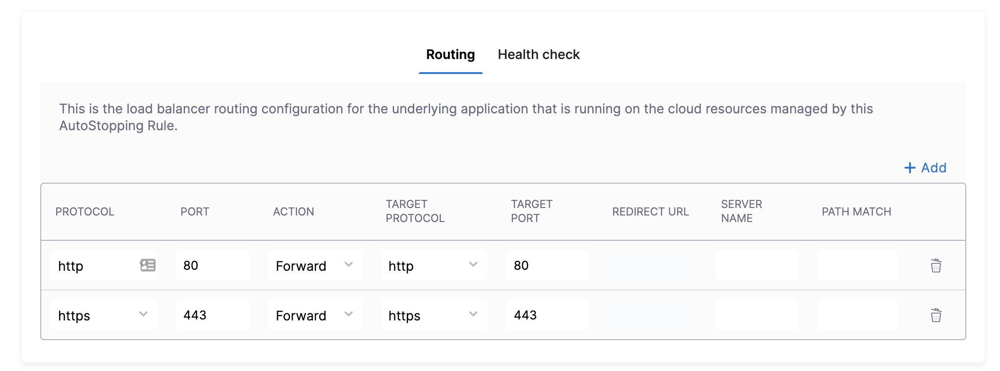

1. Click **Add** if you wish to add more ports. The following are some points to consider:  
	  
  * If you are forwarding the same action to different ports, then specify the server name and/or path match.  
	  
  * If you specify the server name, then the host will use the custom URL to access the resources. You cannot use an auto-generated URL to access the resources.
3. Toggle the **Health check** button to configure the health check. Health check status should be successful for the AutoStopping rules to come into effect.  
  
By default, the health check is turned on.
1. In PROTOCOL, select **http** or **https**.
2. Enter Path, port, and timeout details. For example, if you have configured port 80 and the timeout as 30 seconds for your instance, then the AutoStopping rule will check these specified parameters before bringing AutoStopping Rule into effect.

#### Select the URL for Accessing the Resources

You can use either of the following methods:

* Auto-generated URL
* Custom URL

**Auto-generated URL**

Every AutoStopping rule will have an auto-generated URL. This URL will be a subdomain to the domain name specified for the [load balancer](../4-load-balancer/create-load-balancer-aws.md). Since the load balancer configures a wildcard domain such as `*.autostopping.yourcompany.com`, the auto-generated URL will work automatically and point to the correct load balancer.

Select **Use the auto-generated URL to access the resources managed by this AutoStopping Rule**.


**Custom URL**

AutoStopping rule can use multiple custom domains. In such a case, it should be configured in the DNS provider. AutoStopping Rules also allows you to use custom domains or change the root of your site's URL from the default, like,`autostop.harness.io`, to any domain you own. To point your site's default domain to a custom domain, you can set it up in your DNS provider.

Enter the custom URL currently used to access the instances. The domain name should be entered without prefixing the scheme. A rule can have multiple URLs. You can enter comma-separated values into a custom URL to support multiple URLs.


**DNS Configuration for the AutoStopping Rule**

Since you've chosen to use a custom URL to access the resources, you need to map your custom domain to the hostname generated by this AutoStopping Rule. Select your DNS Provider from the list (Route 53 or Others) to proceed with the mapping.

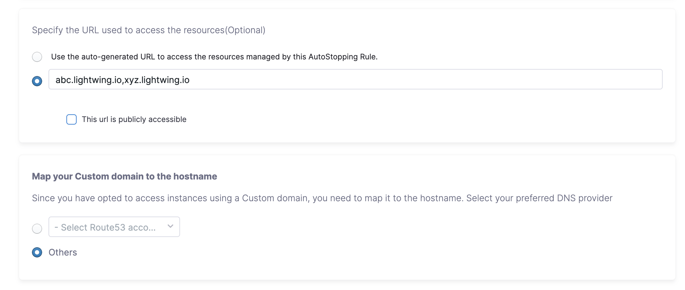

**DNS configuration using Route 53**: If you select Route 53 account, AutoStopping manages Route 53 configuration automatically. You don’t have to do any changes manually when using Route 53.


**DNS configuration using other providers:** Perform the following steps:

1. Select **Others**.
   
     
2. Click **Next**.
3. In **Review**, verify all the configuration details and click **Save Rule**.
4. From the [AutoStopping Rules dashboard](autostopping-dashboard.md), click the AutoStopping Rule that you just created.
5. Copy the auto-generated hostname of the rule.
6. In your DNS provider’s configuration page, add a CNAME record. See [Add DNS CNAME record](https://docs.aws.amazon.com/managedservices/latest/ctexguide/ex-dirserv-cname-record-add-col.html). For example:  
  

```
CNAME yourcustomdomain.com -> allowed-snapper-c7bsac7jepl4q05rc1j0.autostopping.harness.io
```

#### Configure custom exclusions and inclusions

Before you begin, make sure that you've enabled ALB access logs in your AWS account to be able to configure custom exclusions and inclusions while creating AutoStopping rules. Go to [ALB access logs](https://docs.aws.amazon.com/elasticloadbalancing/latest/classic/enable-access-logs.html) for more information.

Custom exclusions and inclusions allow you to keep the cloud resources managed by AutoStopping remain idle by defining rules. These rules prevent the cloud resource from detecting traffic by the AutoStopping rule. For example, you can use custom exclusions and inclusions to filter out repeated traffic such as health checks, which would otherwise keep the cloud resource active at all times. The minimum idle time for the exclusion or inclusion-enabled AutoStopping rule is 15 minutes.

You can configure exclusions by defining either of the following options:

* **Path-based match**: Specify the path that you want to exclude from invoking the instance. You can use wildcards in the path.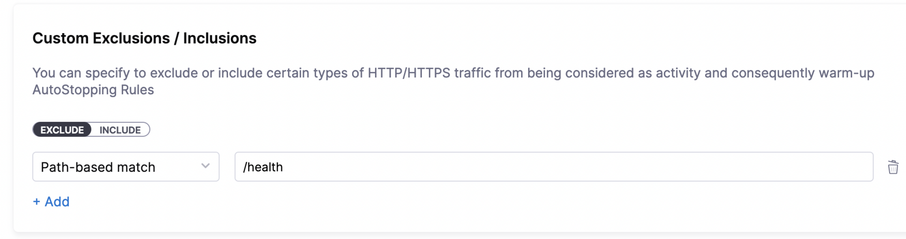An error message is displayed to the user trying to access the path if the managed resource is in a stopped state. If the resource is active and running, this request is not considered as traffic and is ignored by the AutoStopping rule.
* **Source IP-based match**: Specify one or more IP addresses that you want to exclude from accessing the instance. You could specify an entire range of IP addresses. Use commas to separate the IP addresses.
  
    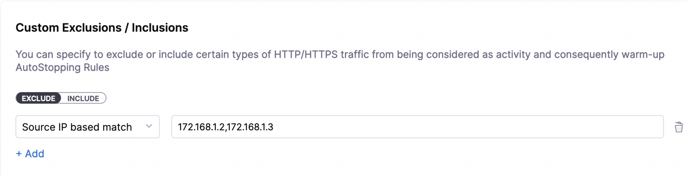
	
Any requests from the specified IP addresses are ignored by the AutoStopping rule.

Requests from these IP addresses or to these paths do not disturb the idle time configured for the AutoStopping rule.

Similarly, you can configure custom inclusions. Requests to the specified path or from the specified IP address alone can invoke the cloud resource managed by AutoStopping. Only these requests are detected as traffic by the AutoStopping rule.

#### Setup Access Using SSH/RDP

SSH/RDP allows you to access the resources managed by the AutoStopping rule via SSH or RDP HTTPS URL. Select this option if the underlying applications running on the resources managed by AutoStopping Rule are accessed via SSH or RDP.

1. In **Setup Access**, select **SSH/RDP**.
2. Select your operating system to download the Harness CLI for your system.
   
     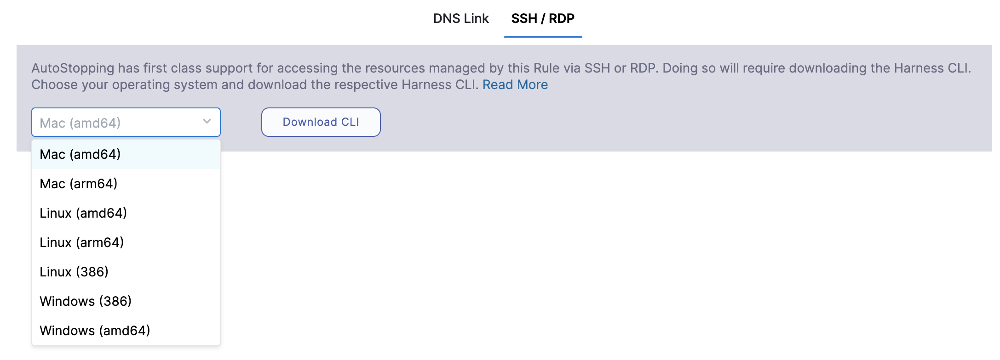
3. Click **Download CLI**.
4. You can connect using SSH or RDP.

#### SSH Commands

To connect to remote servers via SSH/RDP, such as PuTTY, use the Harness CLI `connect` command. The `connect` command opens a proxy connection in your machine which can be used from other applications.


```
harness connect --host hostname --port <ssh/rdp port>
```
You can simply copy the hostname from the AutoStopping Rule dashboard view. Click on the AutoStopping Rule that you want to connect and copy the hostname.


For example:


```
harness connect --host default-test-ssh-1.abc1000test.lightwingtest.com --port 22 -- -i ~/.ssh/ry-jupyter.pem
```
Here is the output:


```
Proxy listening details:  
    Rule name:           Test SSH 1  
    Listen address:      127.0.0.1  
    Port forwarding:     14527 => 22  
    Protocol:            tcp  
    Started at:          2021-05-19 21:53:38.320943 +0530 IST m=+48.950643931
```
Harness `connect` created a secure tunnel from your computer to the given port after bringing up the VM. Now open the RDP/SSH client and use the hostname and port information provided above to connect.


```
harness ssh --host default-test-ssh-1.abc1000test.lightwingtest.com --user ubuntu --config lwc.toml -- -i ~/.ssh/ry-jupyter.pem
```
#### RDP Commands

For RDP run the following command:


```
harness rdp --host default-test-rdp-1.abc1000test.lightwingtest.com
```
Run the following command to connect via private IP:


```
harness rdp --host default-test-rdp-1.abc1000test.lightwingtest.com --internal-ip
```
1. Click **Next**.

### Review

In Review, verify all the configuration details and click **Save Rule**. To edit any of the configuration settings, click **EDIT** and modify the settings.

Your AutoStopping rule is listed under the [AutoStopping Rules dashboard](autostopping-dashboard.md).

### Next Steps

* [Create AutoStopping Rules for a Kubernetes Cluster](create-autostopping-rules-for-kubernetes.md)
* [Use AutoStopping Rules Dashboard](autostopping-dashboard.md)

