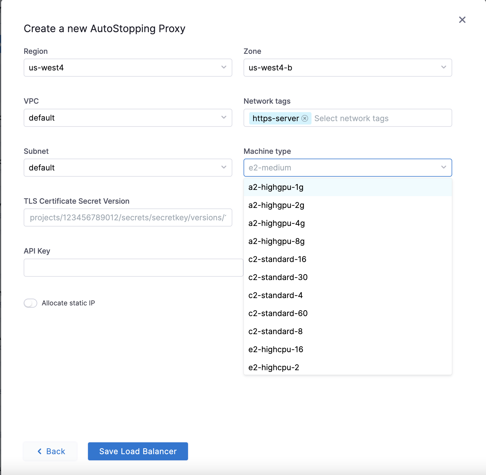
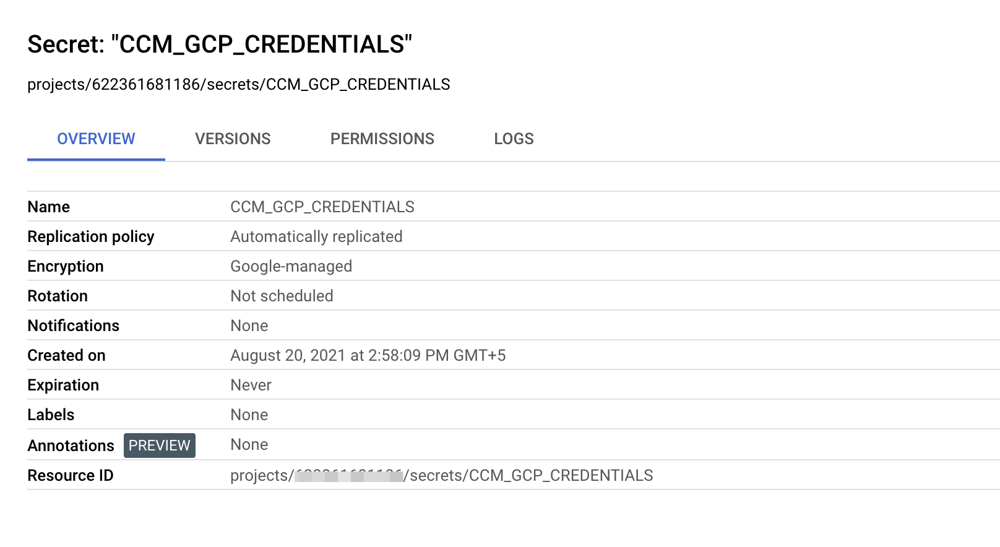

An AutoStopping proxy load balancer automatically distributes user traffic across multiple instances of your applications coupled with the capabilities of the CCM AutoStopping feature that makes sure that your non-production resources run only when used. Load balancing reduces the chances of performance issues in your applications by spreading the load.

You can create a custom load balancer using the AutoStopping proxy option. This feature allows you to launch a VM with the load balancer. 

Perform the following steps to create an AutoStopping proxy for your resources in GCP:  

1. In **Harness**, go to the **Cloud Costs** module.
2. Under **Setup**, click **Load Balancers**.
3. Click **Create New Load Balancer**.
4. Select **GCP**.
5. Choose an existing connector or [create a new one](/docs/cloud-cost-management/2-use-cloud-cost-management/1-optimize-cloud-costs-with-intelligent-cloud-auto-stopping-rules/1-add-connectors/create-a-gcp-connector-for-auto-stopping-rules.md).
6. Click **Create AutoStopping Proxy**.
7. In the **Create a new AutoStopping Proxy** window, enter the following information:
    1. Provide a name for the AutoStopping Proxy.
    2. Enter the URL to specify the domain. 
    3. Click **Continue**.
   
     

8. Select the region where you have your cloud resources hosted.
9. Select the zone from the dropdown list.
10. Select the **VPC** and **Subnet** to which the resource belongs.
11. Select the **Network tags** to enable ports on the proxy VM which would be receiving traffic or which would be used to access the proxy.
12. Select the **Virtual Network**.
13. In the **Machine type** dropdown list, select the instance type.
14. **TLS Certificate Secret Version**: Create a secret in your GCP account. Go to [Create a secret](https://cloud.google.com/secret-manager/docs/creating-and-accessing-secrets). Enter the **Resource ID** displayed in the **Overview** tab.

:::note
Ensure that the file uploaded in the Secret value field is not encrypted or encoded. It must be a plaintext certificate.
:::

15. **TLS Private Key Secret Version**: Create another secret for private key and enter the resource ID in this field.
16. **API Key**: Enter the NG API key. Choose **No Expiration** in the Expiration dropdown list while creating this API key. Go to [Create an API Key](/docs/platform/16_APIs/api-quickstart.md) for more information.

17. Enable **Allocate Static IP** if you need to assign an elastic IP address to make the VM publicly accessible.
18. 19.   Click **Save Load Balancer**.
