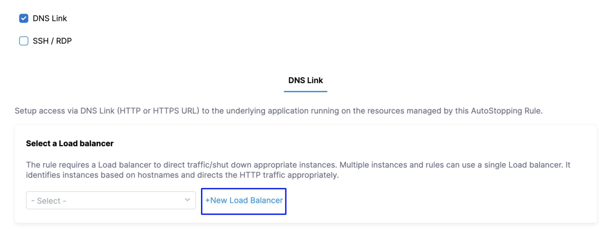

:::note
Currently, this feature is in Beta and behind Feature Flag. Contact [Harness Support](mailto:support@harness.io) to enable the feature.
:::

A load balancer distributes user traffic across multiple instances of your applications. Load balancing reduces the chances of performance issues in your applications by spreading the load.

This topic describes how to create a custom load balancer for creating AutoStopping Rules for Google Compute Engine VM(s).

### Before You Begin

* [Create a GCP Connector for AutoStopping Rules](../1-add-connectors/create-a-gcp-connector-for-auto-stopping-rules.md)
* [Create AutoStopping Rules for GCP](../3-create-auto-stopping-rules/create-auto-stopping-rules-for-gcp.md)

### Why do You Need a Custom Load Balancer?

A single custom load balancer can be set up to handle multiple AutoStopping Rules from the same VPC. Since VPC spans multiple regions, it allows saving costs by using a single custom load balancer for multiple rules.

### How Does Custom Load Balancer Work?

Harness' intelligent cloud AutoStopping Rules use Envoy and other proprietary services for the custom load balancer that routes traffic to configured Google Compute Engine VMs.

Envoy consists of clusters and listeners. Listeners represent the incoming port through which requests are routed to clusters based on route configurations and route path matches.

### Custom Load Balancer Requirements

* Harness creates and manages a custom load balancer, allowing you to use your preferred instance type.
* The load balancer must be located in the same VPC as the virtual machines that it will manage.
* Multiple AutoStopping rules can use a single load balancer to manage virtual machines in different regions and zones but within the same VPC.

### Create a Custom Load Balancer

Perform the following steps to create a new custom load balancer for GCP:

#### Choose a Domain Name

To choose a domain name, perform the following task:

1. In **Cloud Costs**, click **New AutoStopping Rule**.
2. In **AutoStopping Rules**, select **GCP**. It is the cloud account in which your workloads are running that you want to manage using AutoStopping rules.
   3. If you have already linked your GCP account and want to use that account, then select the GCP account from the **Connect to your GCP account** drop-down list.
4. If you have not added your cloud account, click **Connect to your GCP account** drop-down list and then click **New Connector**. For the detailed steps, see [Create a GCP Connector](../1-add-connectors/create-a-gcp-connector-for-auto-stopping-rules.md).
5. Define an AutoStopping Rule. See [Step: Define an AutoStopping Rule](../3-create-auto-stopping-rules/create-auto-stopping-rules-for-gcp.md).
6. In Select the resources to be managed by the AutoStopping Rule, select **GCE VM(s)**. 
7. (Optional) Set up advanced configuration. 
8. In **Setup Access**, select **DNS Link**.
9.  In **Select a load balancer**, click **New Load Balancer** to add a load balancer.
    
	  
10. In **Create a new Load Balancer**, in **Provide a name for the Load balancer**, enter a name for your load balancer. This name appears in your load balancer list.
11. In **Enter Domain Name**, enter the domain name. A domain name is required to route traffic to the load balancer. For example, `autostopping.yourcompany.com`.
    
	  
12. Click **Continue**.

#### Configure a Custom Load Balancer

Harness creates and manages a custom load balancer, allowing you to use your preferred instance type. The load balancer must be located in the same VPC as the virtual machines that it will manage. Multiple AutoStopping rules can use a single load balancer to manage virtual machines in different regions and zones but within the same VPC.

Provide the following details to configure the custom load balancer:

1. Select a Region from the drop-down list to install the Access Point.
2. Select a **Zone** from the drop-down list.
3. Select **VPC**.
4. Select **Network tags**.
5. Select **Subnet**.
6. Select **Machine type**.
7. Click **Save Load Balancer**.
      
	  
	  Your load balancer is now listed.
	
	

### Next Step

* [Create AutoStopping Rules for GCP](../3-create-auto-stopping-rules/create-auto-stopping-rules-for-gcp.md)

