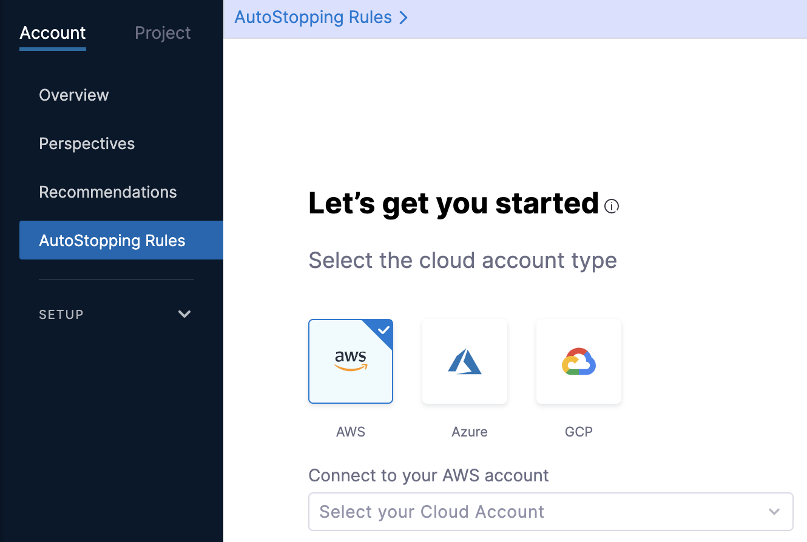

A load balancer serves as the single point of contact for clients. The load balancer distributes incoming application traffic across multiple targets, such as EC2 instances, in multiple Availability Zones. This increases the availability of your application.

An Application Load Balancer makes routing decisions at the application layer (HTTP/HTTPS), supports path-based routing, and can route requests to one or more ports on each container instance in your cluster.

This topic describes how to create a new application load balancer for creating AutoStopping Rules for AWS. 


## Before You Begin

* [Connect to an AWS Connector](/docs/cloud-cost-management/2-use-cloud-cost-management/1-optimize-cloud-costs-with-intelligent-cloud-auto-stopping-rules/1-add-connectors/connect-to-an-aws-connector.md)
* [Create AutoStopping Rules for AWS](/docs/cloud-cost-management/2-use-cloud-cost-management/1-optimize-cloud-costs-with-intelligent-cloud-auto-stopping-rules/3-create-auto-stopping-rules/create-autostopping-rules-aws.md)

## Why do You Need a Load Balancer?

AutoStopping integrates with the cloud provider's native load balancing technologies (Application Load Balancer, Azure AppGateway, etc.) to provide start and stop capability for the AutoStopping-managed cloud services.

  

* The rule requires a load balancer to direct traffic/shut down appropriate instances. Each load balancer is identified by its DNS hostname `(autostopping.example.com`, `www.example.com`, etc.).
* AutoStopping can use the same load balancer for multiple AutoStopping rules. This means multiple instances can be added under one single load balancer and AutoStopping manages the traffic based on the HTTP host details.
* DNS configuration for load balancer is a one-time setup.
* When configuring a load balancer, it is required to choose a domain name. This domain name will be used for all the AutoStopping rules created under this load balancer. For example:  
  

```
*.autostopping.example.com -> Load balancer IP
```

## Create a New Application Load Balancer

A DNS link allows you to access the resources managed by the AutoStopping rule using an HTTP or HTTPS URL. Select DNS Link if the underlying application running on the resources managed by this AutoStopping Rule is currently accessed by an HTTP or HTTPS URL.

Perform the following steps to create a new Application Load Balancer in AWS.

1. In **Cloud Costs**, click **New AutoStopping Rule**.

2. In **AutoStopping Rules**, select **AWS**. It is the cloud account in which your workloads are running that you want to manage using AutoStopping rules.
   
     
3. If you have already linked your AWS account and want to use that account, then select the AWS account from the **Connect to your AWS account** drop-down list.
4. If you have not added your cloud account, click **Connect to your AWS account** drop-down list and then click **New Connector**. For the detailed steps, see [Connect to an AWS Connector](/docs/cloud-cost-management/2-use-cloud-cost-management/1-optimize-cloud-costs-with-intelligent-cloud-auto-stopping-rules/1-add-connectors/connect-to-an-aws-connector.md).
   
     
5. Define an AutoStopping Rule. See [Step: Define an AutoStopping Rule](/docs/cloud-cost-management/2-use-cloud-cost-management/1-optimize-cloud-costs-with-intelligent-cloud-auto-stopping-rules/1-add-connectors/1-auto-stopping-rules.md).
6. Select the resources to be managed by the AutoStopping Rule. See Step: Select the Resources to be Managed by the AutoStopping Rule in [Create AutoStopping Rules for AWS](/docs/cloud-cost-management/2-use-cloud-cost-management/1-optimize-cloud-costs-with-intelligent-cloud-auto-stopping-rules/3-create-auto-stopping-rules/create-autostopping-rules-aws.md).
7. (Optional) Set up advanced configuration. See Step: Set Up Advanced Configuration.
8. In **Setup Access**, select **DNS Link**.
9.  In **Select a load balancer**, click **New Load Balancer** to add a load balancer.
    
	  
10. In **Create a new Load Balancer**, in **Provide a name for the Load balancer**, enter a name for your load balancer. This name will appear in your load balancer list.

The Application Load Balancer (ALB) does not have a domain name associated with it. The AutoStopping Rule directs traffic to resources through the load balancer. Hence the load balancer requires a domain name to be accessed by the rule. You can configure DNS using **Route 53** or **Others** DNS providers to do the mapping.

### Configure DNS Using Route 53

AutoStopping Rule has first-class integration with Route 53. 


:::note
This works only if Route 53 is in the same AWS account as the instance you want to include in the AutoStopping rule.1. In **Select your preferred DNS provider and perform the mapping**, select **Route 53**.
:::
1. Select the correct Route 53 hosted zone from the drop-down list.
   
     
2. In **Enter Domain name**, enter the domain name. For example, `autostopping`.
   
     
3. Click **Continue**.
4. Select region from the drop-down list to install the Access Point.
5. Select a certificate from the drop-down list.
6. Select VPC.
7. Select security groups.
8. Click **Save Load Balancer**.
     
	   
	 
After saving your load balancer, AutoStopping Rule creates an entry similar to the following example in your Route 53 account.  
  

```
A record: *.autostopping.yourdomain.com<lightwing.io> -> up-a1thp0i3k1k7ment50l0-4225468.ap-south-1.elb.amazonaws.com
```

### Configure DNS Using other DNS Providers

1. In **Select your preferred DNS provider and perform the mapping**, select **Others**.
2. In **Enter Domain name**, enter the domain name. For example, `autostopping.yourcompany.com`.
   
     
3. Click **Continue**.
4. Select region from the drop-down list to install the Access Point.
5. (Optional) Select a certificate from the drop-down list.
6. Select VPC.
7. Select security groups.
8. Click **Save Load Balancer**.
   
     
9.  In your DNS provider’s configuration page, add CNAME record.  See [Add DNS CNAME record](https://docs.aws.amazon.com/managedservices/latest/ctexguide/ex-dirserv-cname-record-add-col.html). For example:  
  

```
*.autostopping.test.com -> Load balancer DNS address
```

Your Load Balancer is now listed.

