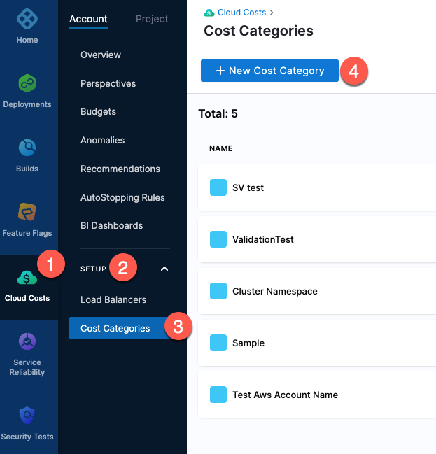
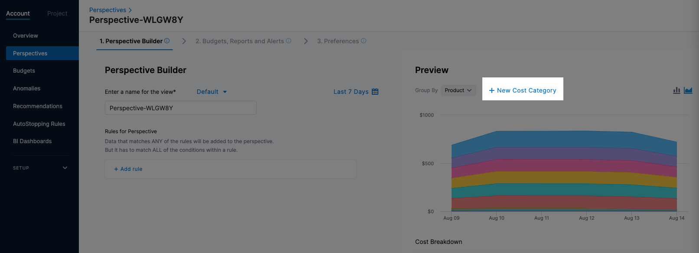
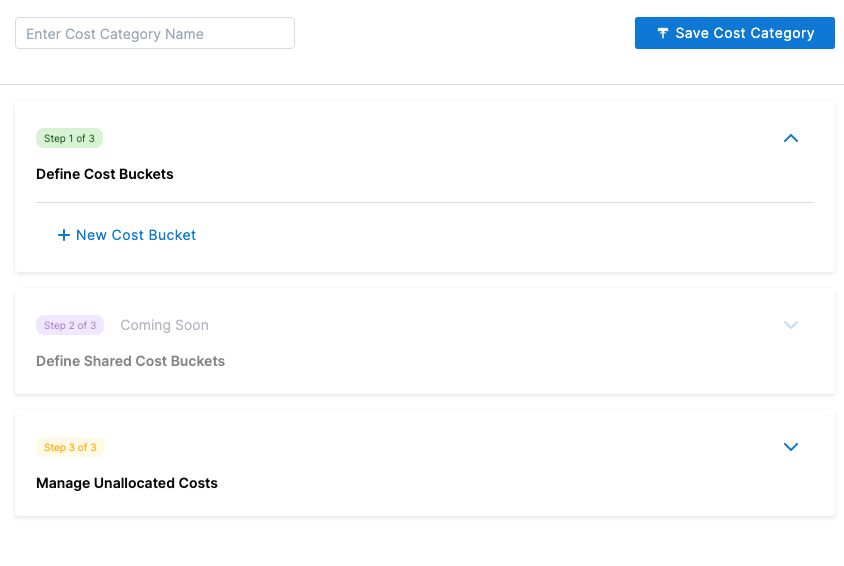
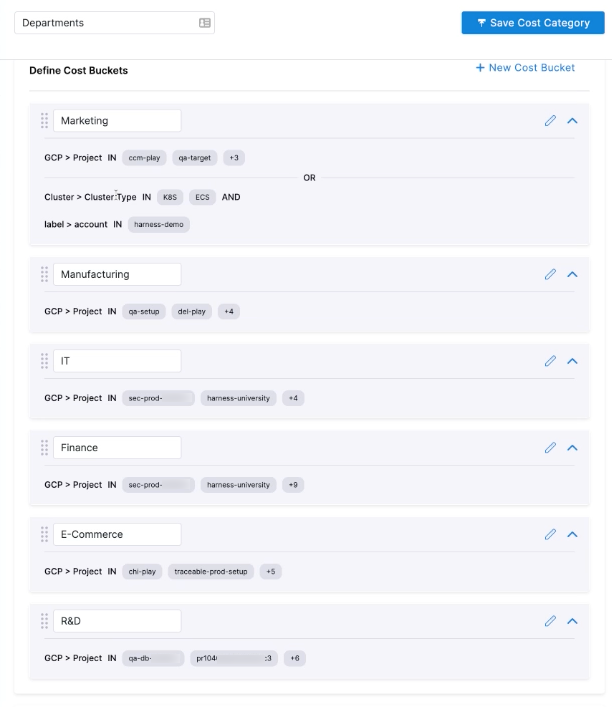
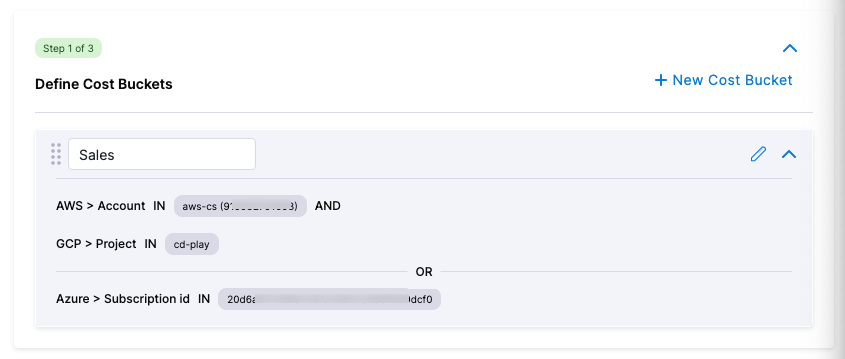
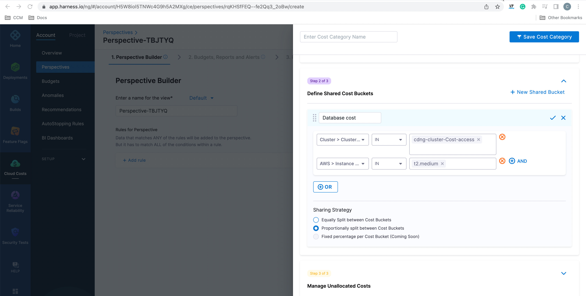
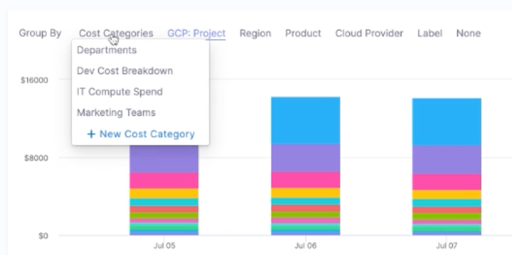
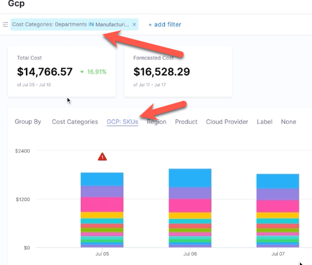
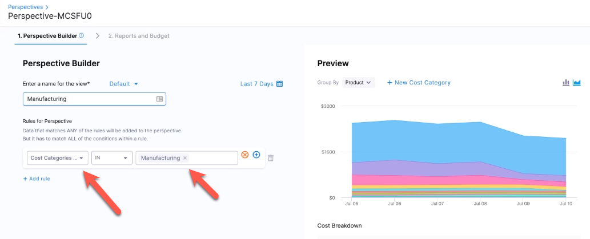

**CCM Cost Categories** provide an understanding of where and how your money is being spent. Cost categories allow you to take data across multiple sources and attribute it to business contexts, such as departments, teams, and other spend categories. For example, if your business is organized by teams with multiple accounts, you can create a Cost Category named Teams and map costs to each team from all your accounts. The cost category called Teams shows you what each team is spending across AWS, GCP, Clusters, etc. You could drill down further into the cost data available for every item in your cost category. For example, in a cost category called Teams, you could view cost data for a particular team (cost bucket) such as Operations. You can then use Cost Categories in CCM Perspectives to filter across accounts, products, etc.

Apart from viewing costs based purely on different data sources (AWS, GCP, Clusters, etc.) without context, cost categories allow you to view spending across these data sources according to different business contexts and help you gain useful insights.

### How does it work?

1. **Create cost categories** — Allows you to categorize based on business requirements and get a contextual view of your expenses.
2. **Create cost buckets** — A cost category is composed of one or more buckets. A bucket is one or more filters that collect data from a data source. For example, a Cost Category called Departments would have a separate cost bucket for each department. Each bucket collects the data sources that belong to each department.​
3. **Create shared buckets** — You can create a shared bucket to share the cost across cost buckets in a given category. For example, let us consider the cost category Departments — the cost incurred in maintaining a database is attributed to multiple departments in an organization. So, you can create a shared bucket named Database Cost (enter a name that's relevant to your scenario) and define the rules and conditions to visualize cost data as per your requirement. You could choose to split this cost equally between all the cost buckets, or you could split the cost proportionally based on usage.​
4. **View your expense data** — After creating Cost Categories, you can use them in Perspective filters and Group By. You can even use Cost Categories to define Perspectives. The Cost Categories used in Perspectives are updated separately from the Perspectives. This allows you to update a single Cost Category and have the result automatically reflected in all the Perspectives that use that Cost Category.

If there are items that don't belong to any of these cost categories, the cost associated is displayed as unallocated costs.

### Prerequisites and Permissions

To use Cost Categories, your Harness User account must belong to a User Group with the following Role permissions:

* **Cloud Cost Management**: **Cost Categories**: **Create/Edit**

For more details, go to [CCM Roles and Permissions](../../4-cloud-cost-technical-reference/ccm-ref/ccm-roles-and-permissions.md).

### Visual Summary

How to create a Cost Category:
<!-- Video:
https://harness-1.wistia.com/medias/rpv5vwzpxz-->
<docvideo src="https://www.youtube.com/watch?v=zbmWB0yUN4s" />

How to use a Cost Category:
<!-- Video:
https://harness-1.wistia.com/medias/rpv5vwzpxz-->
<docvideo src="https://www.youtube.com/watch?v=2gqvz47efuQ" />

### Creating Cost Categories

You can create a Cost Category

1. In your Harness account, click **Cloud Costs**, click **Setup**, and then click **Cost Categories**.
2. Click **New Cost Category**.

You can also create a new Cost Category when you create a Perspective.

The new Cost Category appears.

3. In the new Cost Category, enter a name. For example, if this Cost Category is for departments, you could name it **Departments**.

#### Creating Cost Buckets

1. Click **New Cost Bucket**.
2. Enter a name for the cost bucket, such as the name of a department.
3. Define the rules (data sources) for the cost bucket. You could add multiple conditions to this rule using the AND operator.  
Add a new row for each rule until the cost bucket correctly includes all the costs incurred for this bucket. These rules are defined using the OR operator.  
Typically, you want to create multiple cost buckets in the cost category. For example, if the Cost Category is for departments, you would create a cost bucket for each department such as finance, operations, facilities, and so on.

  

**AND and OR**  
The AND and OR operators are used to filter data based on more than one condition:

 * AND: use AND to filter data sources that include both criteria.
 * OR: use OR to filter data sources that include one of the criteria.You can use AND and OR together.
  
    

#### Creating shared cost buckets

1. Click **+ New Shared Bucket**.
2. Enter a relevant name for the shared bucket.
3. Define rules and conditions as per requirement.
4. Select the sharing strategy.  
For example, consider two cost targets named team A and team B. These two teams use the same database. To enable sharing of cost between these two teams, you need to create a shared cost bucket named sharedDB (enter a name that relates to the shared bucket).
  * **Equally**: This option enables sharing of the DB cost equally (50%) between both teams A and B. You can view it in the grid and chart.
  * **Proportionally**: This option enables sharing of the DB cost proportionally between both teams. If the cost for team A is $60 and that of team B is $40. Then, 60% of DB cost is borne by team A and 40% by team B.

  

#### Manage Unallocated Costs

When used in a Perspective as a filter or **Group By**, the Cost Category shows data that matches its filters.

Unallocated Costs are costs that do not match the Cost Categories in the Perspective graph and rows.

In **Manage Unallocated Costs**, you can choose to show or ignore unallocated costs, and choose a name for how those costs are displayed.

### Using Cost Categories

Cost Categories can be used in Perspectives in the following ways.

#### Group By

Select a Cost Category in **Group By**:

#### Filter

Select one or more Cost Categories as a filter.

You can use Group By and filters together. For example, your filter could select **Manufacturing** from the Department Cost Category, and then you can select **GCP: SKUs** in **Group By**.

#### Perspectives

When creating a Perspective, you can define a rule using Cost Categories.

The benefit of using a Cost Category as a rule in a Perspective is that the Cost Category definition is separated from all the Perspectives that use it.

When you change the definition of the Cost Category, it automatically changes what is displayed by all the Perspectives that use that Cost Category.

For example, if a new product is added to the Manufacturing department, you can simply update the Manufacturing bucket in the Departments Cost Category, and that change is automatically reflected in all the Perspectives that use that Cost Category.

### See Also

* [Create Cost Perspectives](../2-ccm-perspectives/1-create-cost-perspectives.md)

