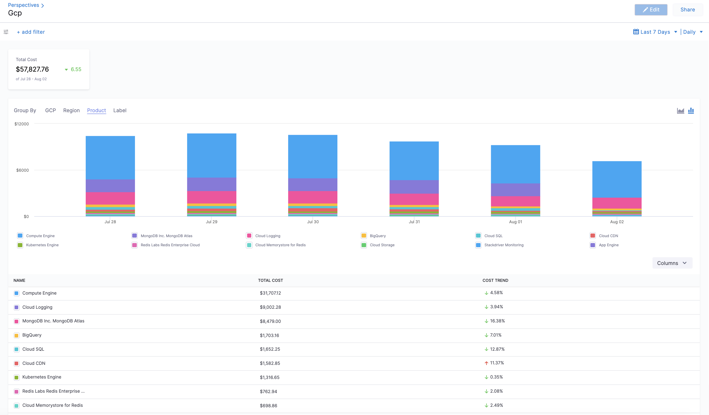
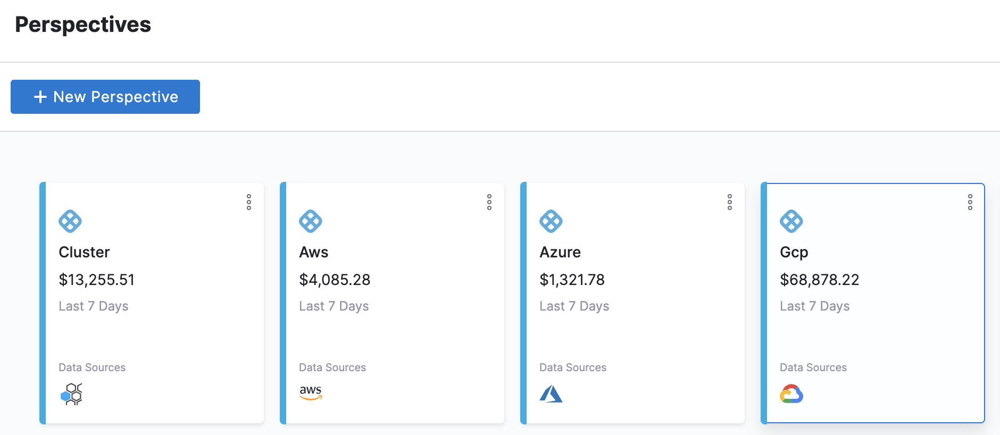
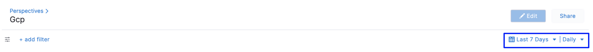
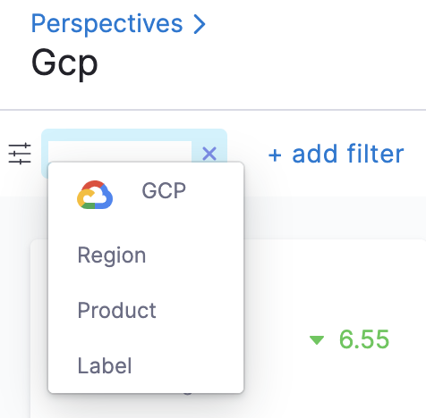
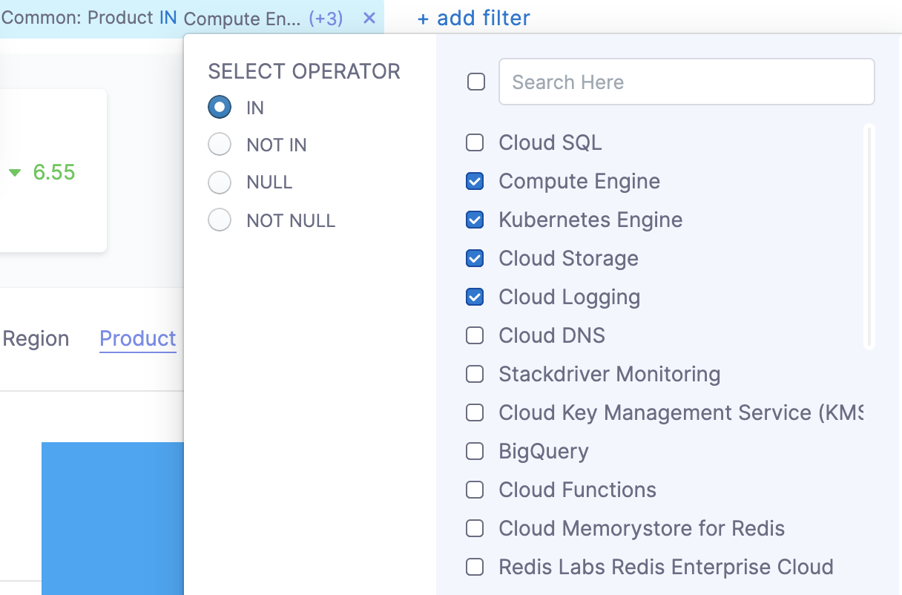

Harness Cloud Cost Management (CCM) allows you to view your Google Cloud Platform (GCP) costs, understand what is costing the most, and analyze cost trends. CE displays data for all your GCP products (such as Compute Engine, Cloud Storage, BigQuery, and so on), projects, SKUs, location, and labels and also provides details on:

* GCP cloud cost spending trends
* The GCP products costing the most in a selected time range. For example, how much Compute Engine cost last week
* Primary cost contributors, such as product, project, SKUs, or region
* GCP spendings by region, such as us-west1 or us-east4
  
    

Time periods in the GCP Cloud Billing report use the Pacific Time Zone (PST) and observe daylight saving time shifts. However, Harness CCM explorer uses the UTC time zone. You may notice some cloud cost differences between Harness CCM explorer and the GCP Cloud Billing report due to the time zone difference.

### Before You Begin

* [Set Up Cloud Cost Management for GCP](../../1-onboard-with-cloud-cost-management/set-up-cloud-cost-management/set-up-cost-visibility-for-gcp.md)

### Step: Analyze GCP Cost

The **Perspectives** page provides deep insights into your GCP costs. The cost includes all the applicable discounts.

1. In **Cloud Costs**, click **Perspectives**,and then click **GCP**. The GCP products are displayed.
   
     
2. Select the **date range** for the costs you want to analyze.
   
     
3. You can use the following options to Group By:
	* **GCP**: Under AWS, you can Group by:
		+ **Products**: Each of your active products with their cloud costs is displayed.
		+ **Projects**: Each of your Cloud projects with their cloud costs is displayed.
		+ **SKUs**: Each [SKU](https://cloud.google.com/skus) you are using.
	* **Region**: Each GCP region you are currently running services in.
	* **Product**: Each of your active products with its cloud costs.
	* **Label**: Each [label](https://cloud.google.com/resource-manager/docs/creating-managing-labels) that you are using to organize your Google Cloud instances.

### Option: Add Filter

Perform the following steps to add filters.

1. In **Cloud Costs**, click **Perspectives**,and then click **GCP**.
2. Click **add filter**.
   
     

3. Select GCP, Region, Product, or Label.
4. Select the operator. The supported operators are:
	* **IN: The exact match operation is used to filter for the value specified.**
	* **NOT IN: The exact match operation is used to filter for the value that is not specified.**
5. Select value for your filter. You can select multiple values. You can also filter and customize your result using the search option.
   
     

### Next Steps

* [Create Cost Perspectives](../2-ccm-perspectives/1-create-cost-perspectives.md)

