Most cost reporting tools provide a high-level view of resource consumption that is useful for seeing the big picture. But these tools are not helpful when you want to see the low-level, root causes of your cloud costs.

Harness Cloud Cost Management (CCM) lets you drill down to see which clusters, namespaces, nodes, tasks, workloads, labels, storage, and Harness components are costing you the most money.

With CCM, you can find the low-level root cause of your cloud costs and reduce unnecessary consumption.

### Option: Root Cost Analysis for Clusters

Perspectives provide deep insights into your total, idle, utilized, and unallocated cluster costs. You pick a cluster to analyze and then drill down into its components to see where you're spending money.

Each of the cluster's components is exposed, along with its costs.

  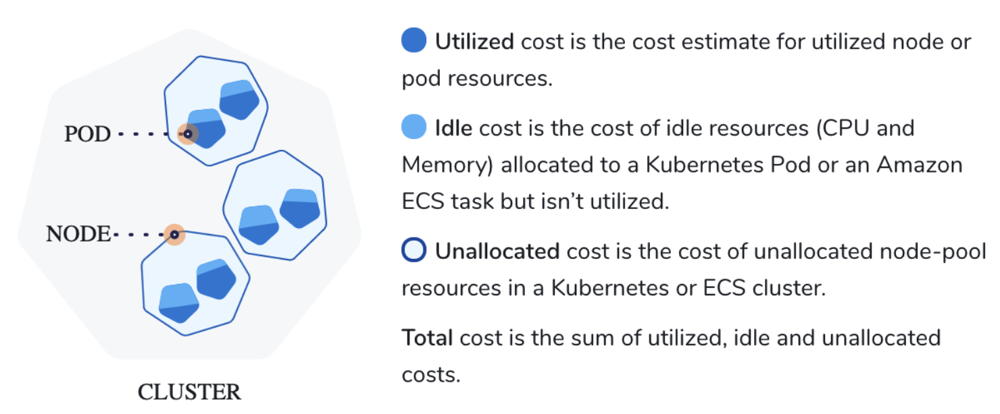]

The following steps take you through the process.

1. Navigate to **Cloud Cost Management** module and click **Perspectives.**
2. Click the Perspective with your clusters as Data Sources, for which you want to analyze the cost**.** Perspectives provide a single-pane view of the costs for different products, for example, clusters, applications, AWS, GCP, and Azure. See [Create Cost Perspectives](../2-ccm-perspectives/1-create-cost-perspectives.md).
   
     
3. Select the **date range** for the costs you want to analyze. You can either click **Select custom range** to customize the date range or select an option from the pre-defined list.
   
     
4. In **Group by**, select one of the following options to view the costs:
	* **Cluster Name**: Total cost, Cost trend, Idle cost, Unallocated cost, and efficiency score for each cluster name.
	* **Namespace**: The cost of each Kubernetes namespace in the cluster. This does not apply to ECS clusters.
	* **Namespace ID**: The cost of each Kubernetes namespace Id in the cluster.
	* **Workload**: The cost of each Kubernetes workload or ECS service. You can see the workload type also. Workloads identified by Pod as Kubernetes pods or ECS tasks.
	* **Workload ID**: The cost of each Kubernetes workload ID.
	* **Node**: The cost of each Kubernetes node or ECS instance.
	* **Storage**: These are the cost of the persistent volumes present in your Kubernetes cluster. For more information, see [Persistent Volumes](https://kubernetes.io/docs/concepts/storage/persistent-volumes/).
	* **Application**: These are the sum of your Harness Application costs. The supported Group by filters are, Application, Service, Environment, Tag, and Cloud Provider.
	* **Environment**: Environments organize and name the deployment infrastructures in your cloud platforms, such as Dev, QA, Stage, Production, etc. These are your cloud platform infrastructures costs, grouped by team, department, and so on.
	* **Service**: Services represent your microservices and applications. These are your microservice costs.
	* **Cloud Provider**: These are your cloud platform costs. Cloud Providers describe your public or private cloud or physical infrastructures, like AWS and Kubernetes.
	* **ECS Service**: The cost of an ECS service that specifies the number of task definition instances running in an Amazon ECS cluster. For a detailed description of ECS services, see [Services](https://docs.aws.amazon.com/AmazonECS/latest/developerguide/ecs_services.html) from AWS.
	* **ECS Launch Type:** The cost of an Amazon ECS launch type. An Amazon ECS launch type determines the type of infrastructure on which your tasks and services are hosted. There are two types:
		+ Fargate - Run containers without having to manage servers or clusters of Amazon EC2 instances.
		+ EC2 - Run containers on a cluster of Amazon EC2 instances that you manage.
	* **Region**: Each Cluster region you are currently running services in.
	* **Product**: Each of your active products with its cloud costs.
	* **Label**: Each label that you assign to your Cluster resources. You can select a label name to get further granular details of your label.
  
    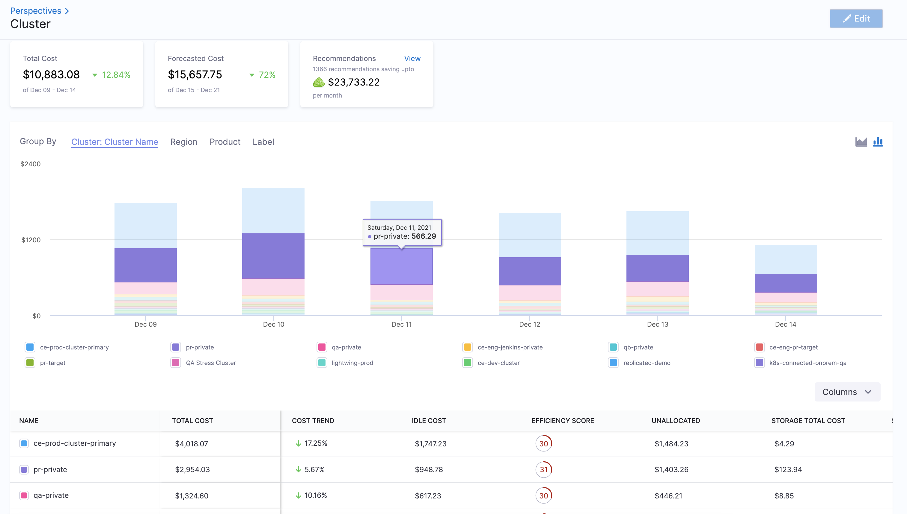
5. Select all the checkboxes in the column selector to display all the cluster costs. You can uncheck the checkbox for which you do not want to view the cost.
   
     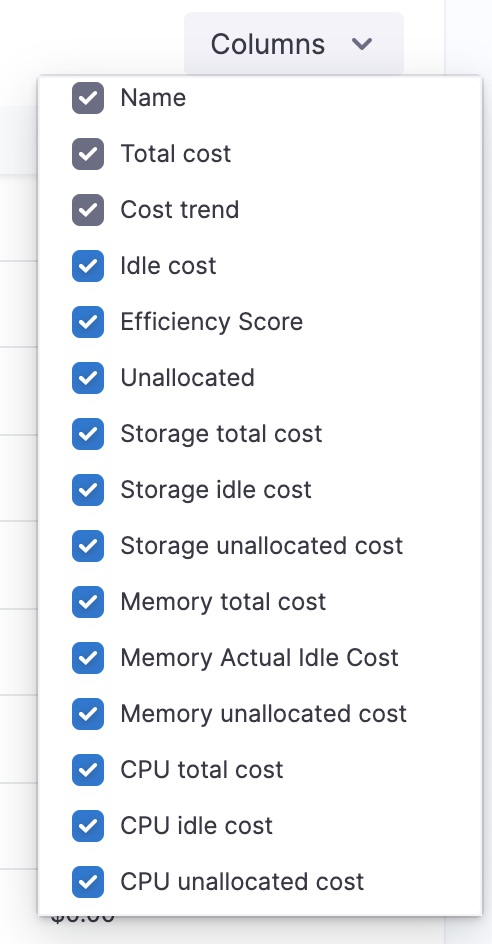

### Option: Root Cost Analysis for Namespace

The cost of each Kubernetes namespace in the cluster.

The following steps take you through the process.

1. Navigate to **Cloud Cost Management** module and click **Perspectives.**
2. Click the Perspective with your clusters as Data Sources, for which you want to analyze the cost**.** Perspectives provide a single-pane view of the costs for different products, for example, clusters, applications, AWS, GCP, and Azure. See [Create Cost Perspectives](../2-ccm-perspectives/1-create-cost-perspectives.md).
   
     
3. Select the **date range** for the costs you want to analyze. You can either click **Select custom range** to customize the date range or select an option from the pre-defined list.
   
     
4. In **Group by**, select **Namespace** to list all the namespaces.

     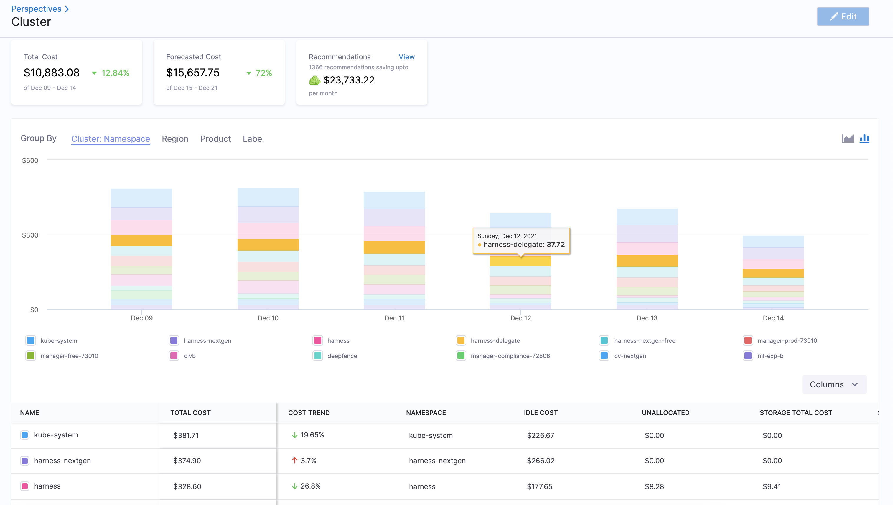
5. Select all the checkboxes in the column selector to display all the namespace costs. You can uncheck the checkbox for which you do not want to view the cost.
   
     

### Option: Root Cost Analysis for Workload

The cost of each Kubernetes workload or ECS service. You can see the workload type also.

The following steps take you through the process.

1. Navigate to **Cloud Cost Management** module and click **Perspectives.**
2. Click the Perspective with your clusters as Data Sources, for which you want to analyze the cost**.** Perspectives provide a single-pane view of the costs for different products, for example, clusters, applications, AWS, GCP, and Azure. See [Create Cost Perspectives](../2-ccm-perspectives/1-create-cost-perspectives.md).

  
3. Select the **date range** for the costs you want to analyze. You can either click **Select custom range** to customize the date range or select an option from the pre-defined list.
   
     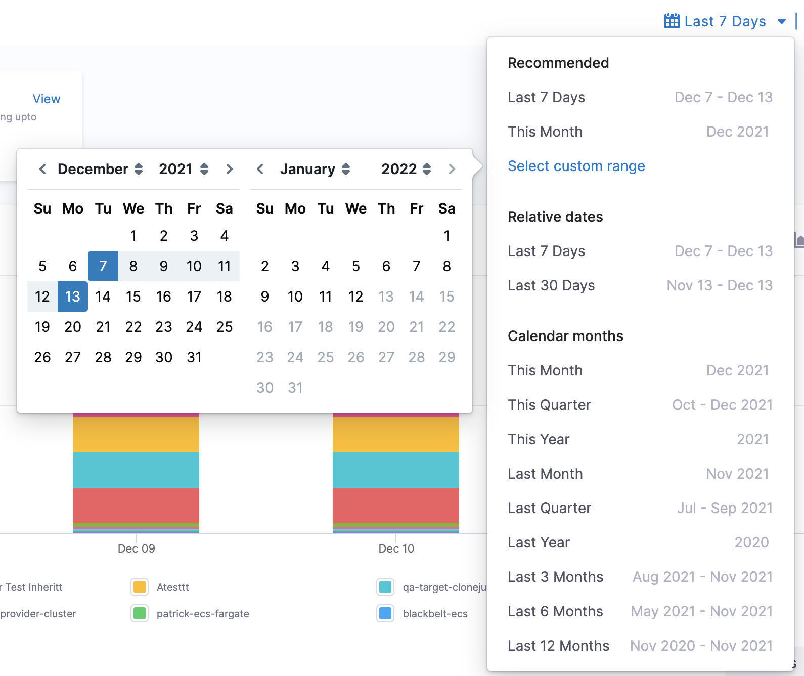
4. In **Group by**, select **Workload** to list all the workloads. You can also Group by **Workload Id** to list all the workload IDs.
   
     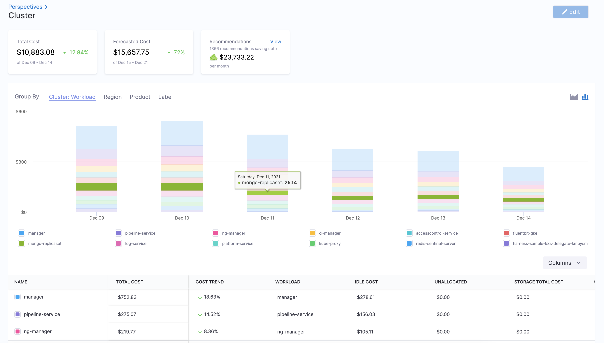
5. Select all the checkboxes in the column selector to display all the workload costs. You can uncheck the checkbox for which you do not want to view the cost.
   
     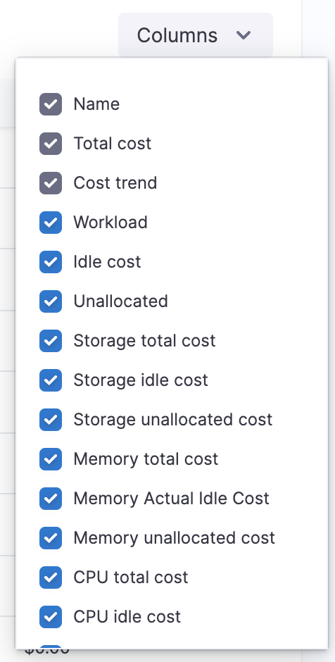

### Option: Root Cost Analysis for Nodes

The cost details of a node provide:

* Deep insights into the total, idle, utilized, unallocated, and system costs of a node
* CPU and memory utilization for nodes and pods
* CPU and memory allocatable data
* Pod counts

The following steps take you through the process.

1. Navigate to **Cloud Cost Management** module and click **Perspectives.**
2. Click the Perspective with your clusters as Data Sources, for which you want to analyze the cost**.** Perspectives provide a single-pane view of the costs for different products, for example, clusters, applications, AWS, GCP, and Azure. See [Create Cost Perspectives](../2-ccm-perspectives/1-create-cost-perspectives.md).
     
	  
3. Select the **date range** for the costs you want to analyze. You can either click **Select custom range** to customize the date range or select an option from the pre-defined list.

    
4. In **Group by**, select **Node** to list all the nodes.
   
     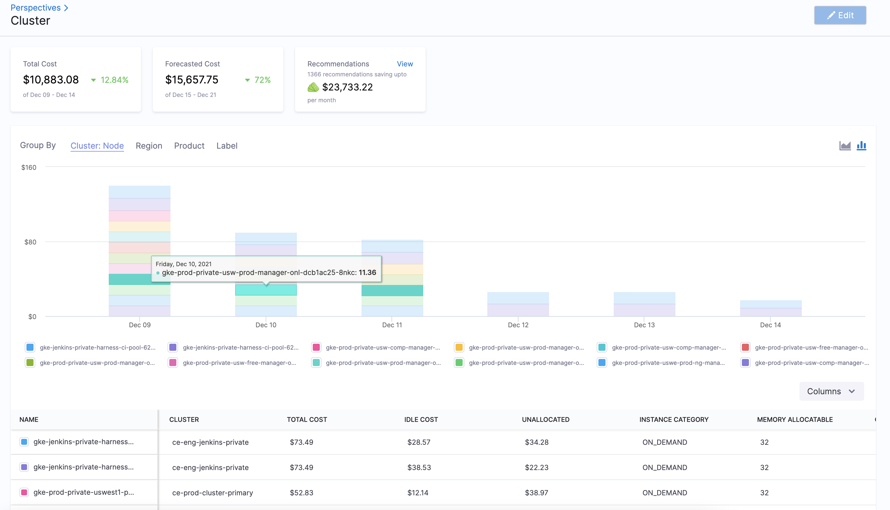
5. Select all the checkboxes in the column selector to display all the node costs. You can uncheck the checkbox for which you do not want to view the cost.
   
     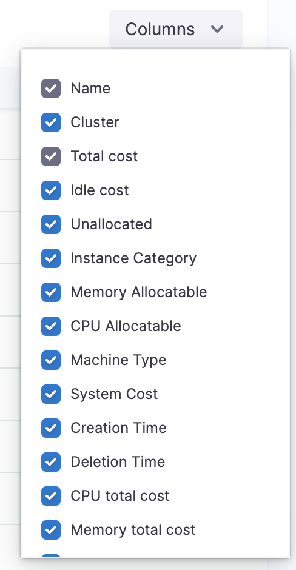

If your Pod and Node are stopped for 30 and 180 days respectively, the following information is purged from the Node Explorer view:  
  
- Creation Time  
- Deletion Time  
- CPU Requested  
- Memory Requested  
- Workload  
- Namespace  
- Machine Type  
- Node Pool  
- Instance Category
  

### Option: Root Cost Analysis for Harness Applications

CCM provides deep insights into your total cloud costs and resources. It helps you to understand the primary cost contributors. You can use this data to manage and optimize your cost and resources.

To perform root cost analysis on Harness Applications and subordinate components, it's important to review how Harness organizes and models your projects using Applications.

The following steps take you through the process.

1. Navigate to **Cloud Cost Management** module and click **Perspectives.**
2. Click the Perspective with your clusters as Data Sources, for which you want to analyze the cost**.** Perspectives provide a single-pane view of the costs for different products, for example, clusters, applications, AWS, GCP, and Azure. See [Create Cost Perspectives](../2-ccm-perspectives/1-create-cost-perspectives.md).
   
     
3. Select the **date range** for the costs you want to analyze. You can either click **Select custom range** to customize the date range or select an option from the pre-defined list.
   
     
4. In **Group by**, select **Application** to list all the applications.
   
     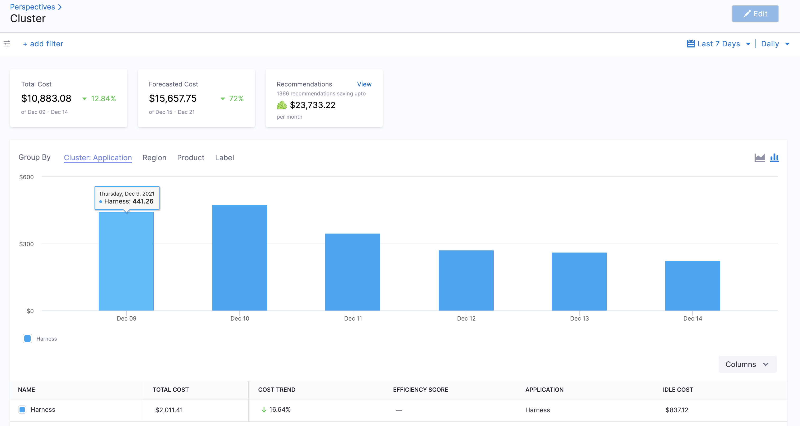

In order for an Application to appear, a Workflow in the Application must be deployed by Harness.1. Select all the checkboxes in the column selector to display all the application costs. You can uncheck the checkbox for which you do not want to view the cost.

  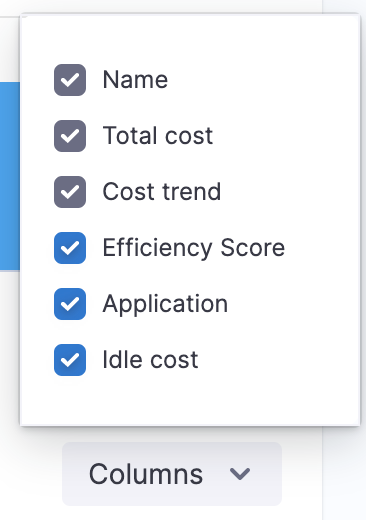

### Option: Root Cost Analysis for Service

Services represent your microservices and applications. These are your microservice costs.

The following steps take you through the process.

1. Navigate to **Cloud Cost Management** module and click **Perspectives.**
2. Click the Perspective with your clusters as Data Sources, for which you want to analyze the cost**.** Perspectives provide a single-pane view of the costs for different products, for example, clusters, applications, AWS, GCP, and Azure. See [Create Cost Perspectives](../2-ccm-perspectives/1-create-cost-perspectives.md).
   
     
3. Select the **date range** for the costs you want to analyze. You can either click **Select custom range** to customize the date range or select an option from the pre-defined list.
   
     
4. In **Group by**, select **Service** to list all the services.
   
     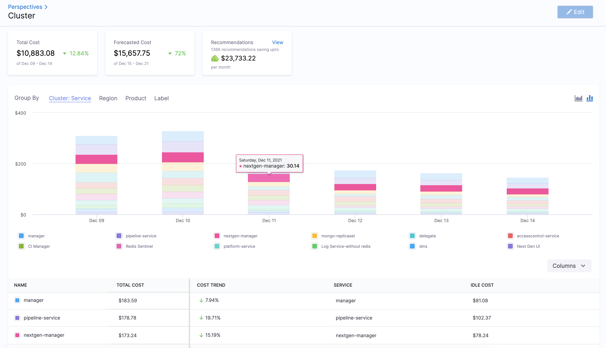
5. Select all the checkboxes in the column selector to display all the service costs. You can uncheck the checkbox for which you do not want to view the cost.
   
     

### Option: Root Cost Analysis for Environment

Environments organize and name the deployment infrastructures in your cloud platforms, such as Dev, QA, Stage, Production, etc. These are your cloud platform infrastructures costs, grouped by team, dept, and so on.

The following steps take you through the process.

1. Navigate to **Cloud Cost Management** module and click **Perspectives.**
2. Click the Perspective with your clusters as Data Sources, for which you want to analyze the cost**.** Perspectives provide a single-pane view of the costs for different products, for example, clusters, applications, AWS, GCP, and Azure. See [Create Cost Perspectives](../2-ccm-perspectives/1-create-cost-perspectives.md).
   
     
3. Select the **date range** for the costs you want to analyze. You can either click **Select custom range** to customize the date range or select an option from the pre-defined list.
   
     
4. In **Group by**, select **Environment** to list all the environments.
   
     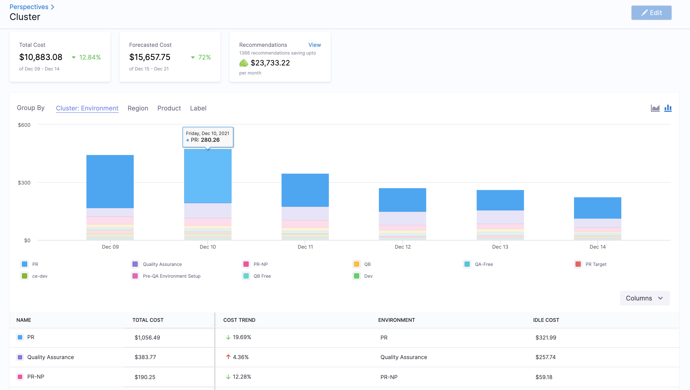
5. Select all the checkboxes in the column selector to display all the environment costs. You can uncheck the checkbox for which you do not want to view the cost.
   
     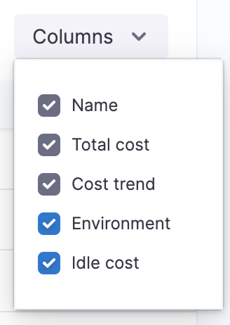

### Option: Root Cost Analysis for Storage

Storage represents the cost of the persistent volumes present in your Kubernetes cluster. Persistent volumes are used to manage durable storage in a cluster. For more information, see [Persistent Volumes](https://kubernetes.io/docs/concepts/storage/persistent-volumes/).

The following steps take you through the process.

1. Navigate to **Cloud Cost Management** module and click **Perspectives.**
2. Click the Perspective with your clusters as Data Sources, for which you want to analyze the cost**.** Perspectives provide a single-pane view of the costs for different products, for example, clusters, applications, AWS, GCP, and Azure. See [Create Cost Perspectives](../2-ccm-perspectives/1-create-cost-perspectives.md).
   
   
   
3. Select the **date range** for the costs you want to analyze. You can either click **Select custom range** to customize the date range or select an option from the pre-defined list.
   
     
4. In **Group by**, select **Storage** to list all the storage.
   
     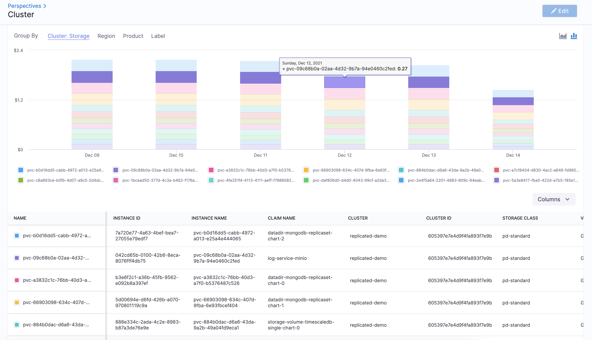
5. Select all the checkboxes in the column selector to display all the storage costs. You can uncheck the checkbox for which you do not want to view the cost.
   
     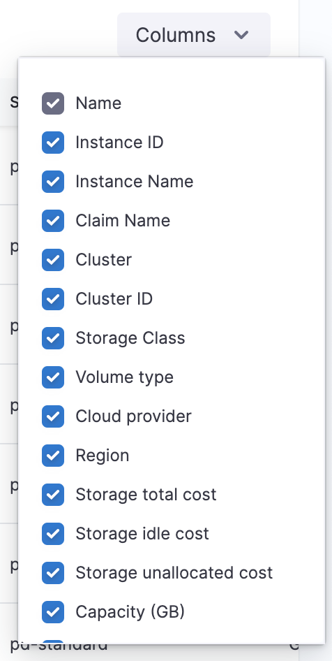

The storage costs are displayed:

* **Name**: Name of the persistent volume (PV).
* **Instance ID:**
* **Instance Name:**
* **Claim name**: Claim name is the name of a PV claim in the same namespace as the pod using this volume.
* **Cluster**: Name of the Kubernetes cluster where the PV is present.
* **Cluster ID:**
* **Storage class**: A storage class provides a way for administrators to describe the classes of storage they offer. Different classes might map to quality-of-service levels, or to backup policies, or to arbitrary policies determined by the cluster administrators. For more information, see [Storage Classes](https://kubernetes.io/docs/concepts/storage/storage-classes/).
* **Volume type**: Persistent volume types are implemented as plugins. For details on the supported Kubernetes plugins, see [Types of Persistent Volumes](https://kubernetes.io/docs/concepts/storage/persistent-volumes/#types-of-persistent-volumes).
* **Cloud provider**: A cloud service provider, for example, AWS or GCP.
* **Region**: The region where PV exists.
* **Storage total cost**: The total cost of your PV.
* **Storage idle cost**: The idle cost of your PV.
* **Storage unallocated cost**: The unallocated cost of your PV.
* **Capacity**: Generally, a persistent volume (PV) has a specific storage capacity. This is set by using the `capacity` attribute of the PV.
* **Storage utilization value**: This is a measure of how well the available data storage space in your cluster is utilized.
* **Claim namespace**: Namespace where the claim exists.
* **Creation time**: The time at which the PV was created.
* **Deletion time**: The time at which the PV was deleted.

### Option: Root Cost Analysis for Region

The following steps take you through the process.

1. Navigate to **Cloud Cost Management** module and click **Perspectives.**
2. Click the Perspective with your clusters as Data Sources, for which you want to analyze the cost**.** Perspectives provide a single-pane view of the costs for different products, for example, clusters, applications, AWS, GCP, and Azure. See [Create Cost Perspectives](../2-ccm-perspectives/1-create-cost-perspectives.md).
   
     
3. Select the **date range** for the costs you want to analyze. You can either click **Select custom range** to customize the date range or select an option from the pre-defined list.
   
     
4. In **Group by**, select **Region** to list all the regions.
   
     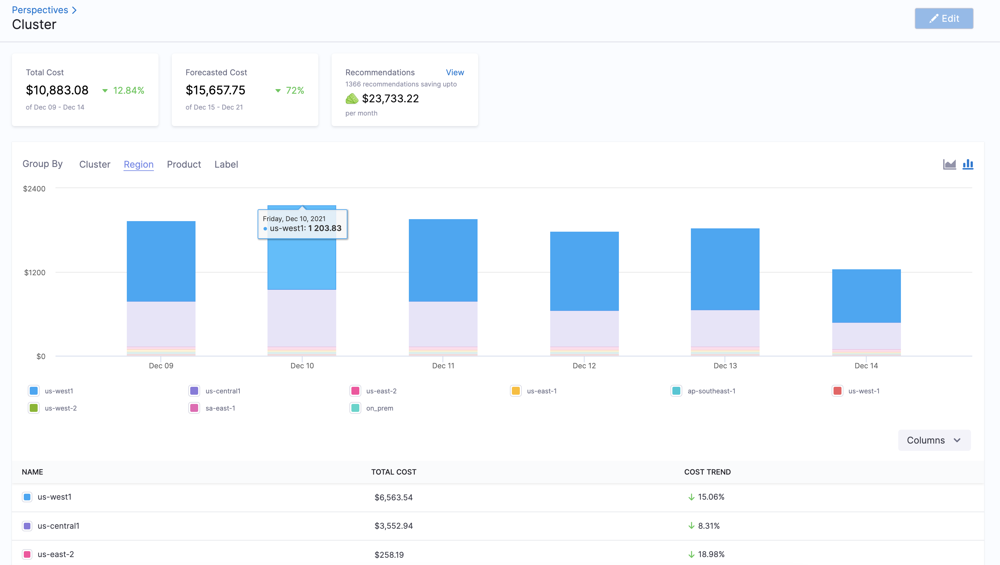
5. Select all the checkboxes in the column selector to display all the regions costs. You can uncheck the checkbox for which you do not want to view the cost.
   
     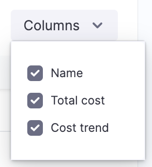

### Option: Root Cost Analysis for Product

The cost of each product in the cluster.

The following steps take you through the process.

1. Navigate to **Cloud Cost Management** module and click **Perspectives.**
2. Click the Perspective with your clusters as Data Sources, for which you want to analyze the cost**.** Perspectives provide a single-pane view of the costs for different products, for example, clusters, applications, AWS, GCP, and Azure. See [Create Cost Perspectives](../2-ccm-perspectives/1-create-cost-perspectives.md).
   
     
3. Select the **date range** for the costs you want to analyze. You can either click **Select custom range** to customize the date range or select an option from the pre-defined list.
   
     
4. In **Group by**, select **Product** to list all the products.
   
     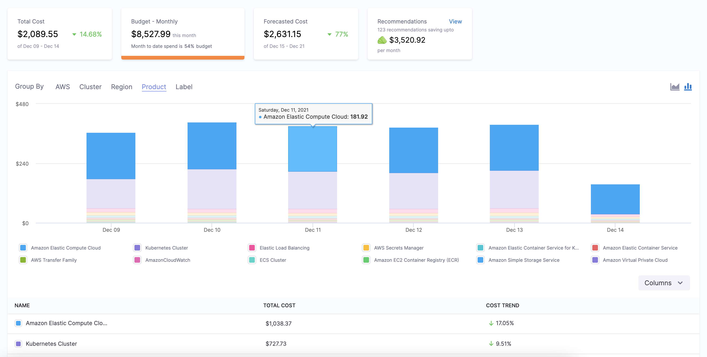
5. Select all the checkboxes in the column selector to display all the product costs. You can uncheck the checkbox for which you do not want to view the cost.
   
     

### Option: Root Cost Analysis for Label

The cost of each Kubernetes label.

The following steps take you through the process.

1. Navigate to **Cloud Cost Management** module and click **Perspectives.**
2. Click the Perspective with your clusters as Data Sources, for which you want to analyze the cost**.** Perspectives provide a single-pane view of the costs for different products, for example, clusters, applications, AWS, GCP, and Azure. See [Create Cost Perspectives](../2-ccm-perspectives/1-create-cost-perspectives.md).
   
     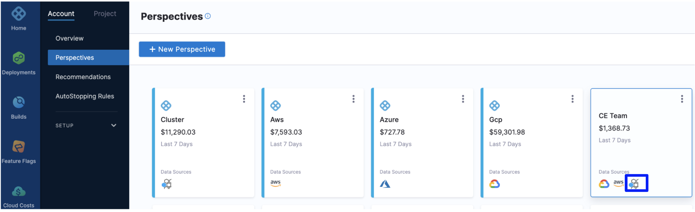
3. Select the **date range** for the costs you want to analyze. You can either click **Select custom range** to customize the date range or select an option from the pre-defined list.
   
     
4. In **Group by**, select **Label** to list all the labels.
   
     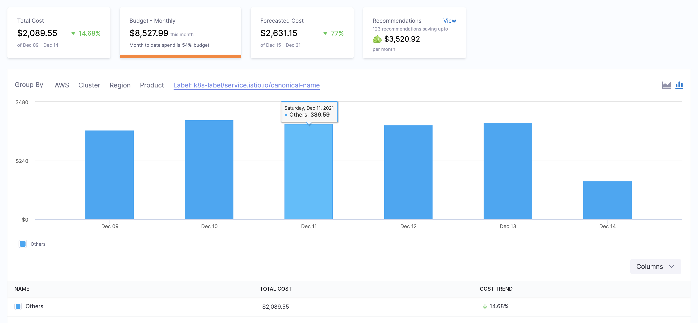
5. Select all the checkboxes in the column selector to display all the label costs. You can uncheck the checkbox for which you do not want to view the cost.
   
     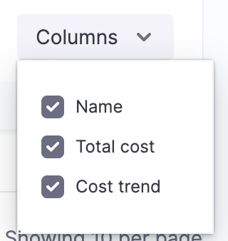

