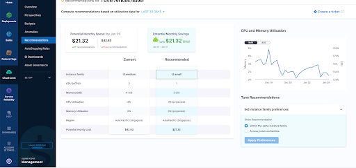
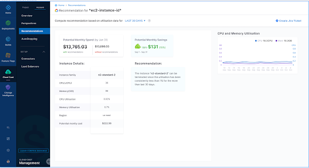
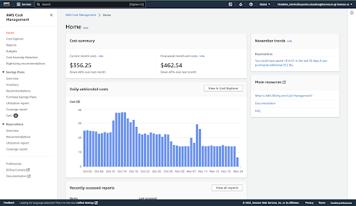
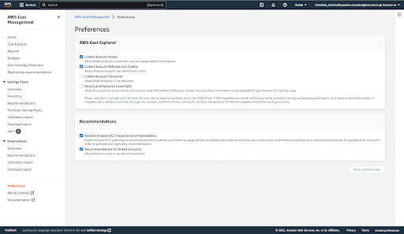
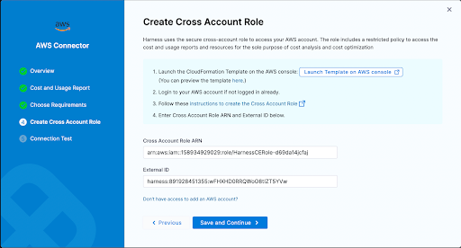
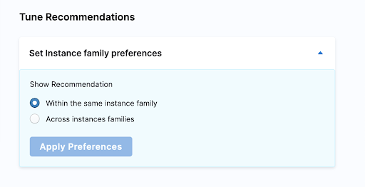

An effective way to reduce AWS EC2 instance costs is to optimize VM utilization. This involves resizing instances based on active tasks and decommissioning unused instances.

Harness helps you reduce costs with recommendations.

You can view the recommendations for all of your AWS accounts on the recommendations page. 

You can also tune these recommendations by instance family or across instance families (General Purpose, Compute Optimized, etc.).


:::note
Before using recommendations in your environment, ensure that you evaluate their impact thoroughly. The person reviewing the recommendations should be able to understand the impacts identified in the recommendations, as well as the impact on the infrastructure and business.

Using recommendations without proper assessment could result in unexpected changes, such as issues with system performance or poor reliability.
:::


## Before you begin


* Connect your AWS cloud account in Harness and set up CCM for cost management. For more information, go to  [Set up cost visibility for AWS](https://developer.harness.io/docs/cloud-cost-management/onboard-with-cloud-cost-management/set-up-cloud-cost-management/set-up-cost-visibility-for-aws).
* To obtain EC2 recommendations, configure a Harness AWS CCM connector with the Inventory Management feature enabled.
* Go to [Perspectives](https://developer.harness.io/docs/cloud-cost-management/use-cloud-cost-management/ccm-perspectives/create-cost-perspectives) to learn how to create perspectives. Perspectives allow you to group your resources in ways that are more meaningful to your business needs.


## How are EC2 recommendations computed?


The recommendations are computed by analyzing the past utilization of the CPU and memory of your EC2 instance. Harness CCM leverages the AWS EC2 recommendations. CCM uses the AWS APIs and fetches the data from the AWS account.


### Types of EC2 recommendations

Harness CCM provides two types of recommendations to optimize your EC2 instances:


* **Instance resizing**: In this type of recommendation, CCM recommends resizing your instance within the same instance family or using a different instance family based on instance usage. For information about the different instance families in AWS, go to [Available instance types](https://docs.aws.amazon.com/AWSEC2/latest/WindowsGuide/instance-types.html#AvailableInstanceTypes). 
 




* **Decommissioning**: In this type of recommendation, the instance is terminated or decommissioned if not in use for a long time.
 




## Enable EC2 Recommendations


:::note
If you are an existing customer, you need to:
* Edit the IAM Role in the AWS Connector corresponding to the account.
* Add _ce:GetRightsizingRecommendation_ permission to the **HarnessEventsMonitoringPolicy**.
:::


Once you have the `ce:GetRightsizingRecommendation` permission added to the **HarnessEventsMonitoringPolicy** in the IAM role, perform the following tasks on your AWS console to enable recommendations.

1. On your AWS console, go to the **Cost Explorer** service.

  
  

2. Click **Preferences** on the left pane.
3. Enable the following recommendations:
 * Receive Amazon EC2 resource recommendations 
 * Recommendations for linked accounts
  
    


4. Verify that you have enabled these recommendations correctly. 

  Open AWS CloudShell and run the following command: 

```
  aws ce get-rightsizing-recommendation --service AmazonEC2
```
 
 If the recommendations are not enabled, the following error message is displayed:

     
  "An error occurred (AccessDeniedException) when calling the GetRightsizingRecommendation operation: Rightsizing EC2 recommendation is an opt-in only feature. You can enable this feature from the PAYER account’s Cost Explorer Preferences page. Normally it may take up to 24 hours in order to generate your rightsizing recommendations."

5. You must install the Amazon CloudWatch agent on your EC2 instance to enable memory metrics.

You need to perform the following steps in Harness:


1. While creating a new AWS connector, select the **Inventory Management** feature to enable the recommendations. For more information, go to [Set up CCM for your AWS account.](https://developer.harness.io/docs/cloud-cost-management/onboard-with-cloud-cost-management/set-up-cloud-cost-management/set-up-cost-visibility-for-aws#choose-requirements)

 
2. Add the required **Cost Explorer** permissions to the CCM template as shown in the screenshot below:

    

  

### View your EC2 recommendations


1. In the **Harness** application, go to **Cloud Costs**.
2. Click **Recommendations**.
3. Click the filter icon.
4. In the **Resource Type** dropdown list, select **EC2_INSTANCE**.
5. Click **Apply**. 

  All the AWS accounts with EC2 instances are displayed. 

6. Click the row to view the recommendations for that account.  The CPU and Memory utilization graph shows the current utilization data. Go to [View and apply recommendations](https://developer.harness.io/docs/cloud-cost-management/use-cloud-cost-management/ccm-recommendations/home-recommendations) to learn how to apply these recommendations.


### Tune the EC2 recommendations

You can tune the recommendations by providing your preferred instance type. Select one of the following options:


  


* **Within the same instance family**: If you select this option, the recommendations stay within the same family.
* **Across instance families**: If you select this option, CCM recommends instance types across instance families. The priority is to provide maximum cost savings.


### Sharing Recommendations​


When you tune a recommendation, the URL for the recommendation captures your changes.


You can see the changes following `details?` in the URL. For example, `details?buffer=10&QoS="GUARANTEED"`.


Capturing your changes in the URL enables you to share your tuned recommendation and ensure others can see your tuning. Simply tune the recommendation and then share the URL.

