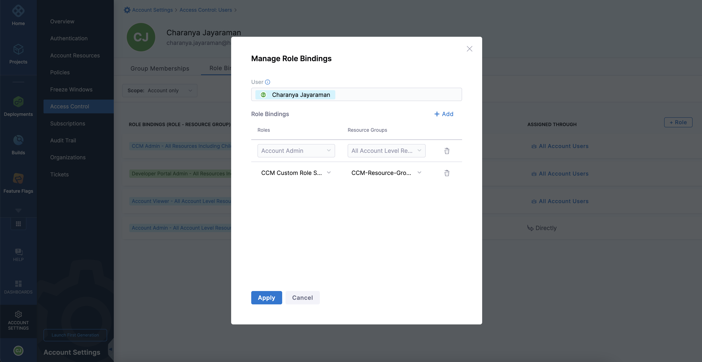

You can now manage access to Perspective folders by assigning Resource Groups to users bound by the roles assigned to them.

The following steps illustrate how to restrict access to a Resource Group:

1. In **Harness**, go to** Account Settings**.
2. Select **Access Control**.
3. Select **Roles**.
4. Click **+ New Role** to create a custom role with the following permissions. For example, CCM Custom Role. 
   
     
     
     
     

5. Create another custom role with a different set of permissions. 
   
      

6. Select **Resource Groups**.
7. Click **+ New Resource Group** to create a new resource group.

    

8.  Select **Account only** in the **Resource Scope** dropdown list.
9.  In the **Resources** pane, select **Cloud Cost management** > **Folders**. 
    
      
	
10.  To restrict access to specific folders, select **Specified** and then, click **Add**. 
    
      

11. Add the selected folders and save the resource group settings.
12. You need to bind the **Role** with the **Resource Group**. Go to the **Users** tab on the **Access Control** page.
13. Select the user you want to restrict access to.
14. Click **Manage Roles**.
15. Select the **Role** and **Resource Group** in the **Manage Role Bindings **window.
16. Click **Apply**. 
    
      

In Harness, the **Perspectives** page displays only the folders to which the user has access. The user can create Budgets for Perspectives only in the folders that the user can access. A user with restrictions to folders does not have permission to create new folders.
