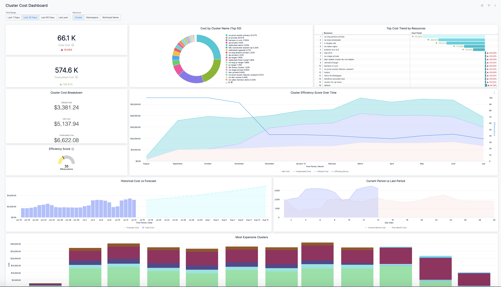
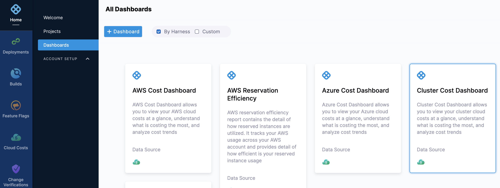
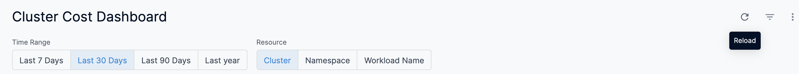
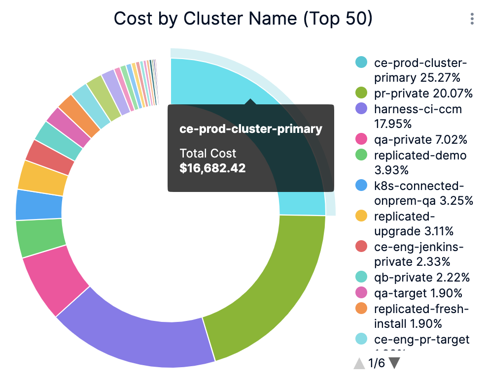
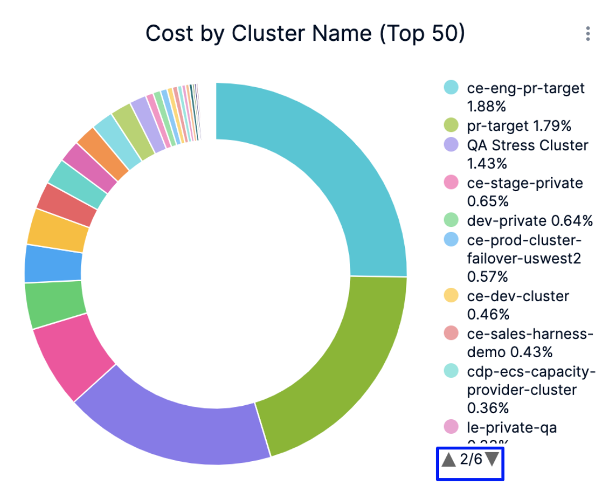
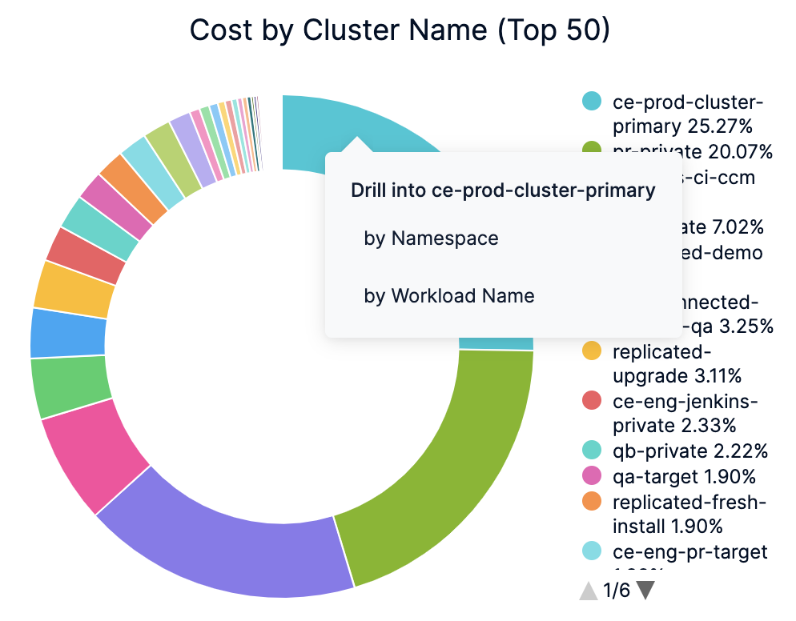
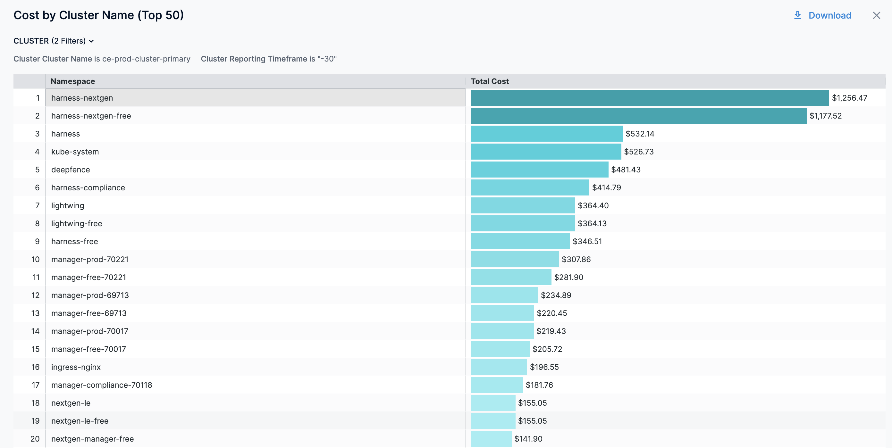
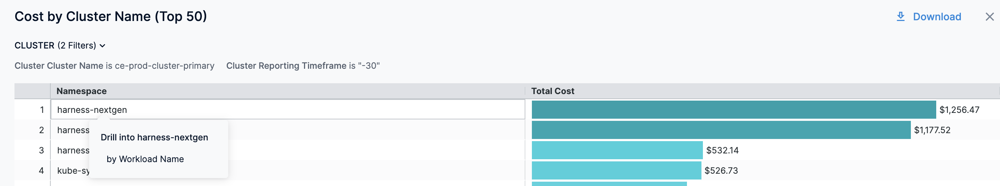
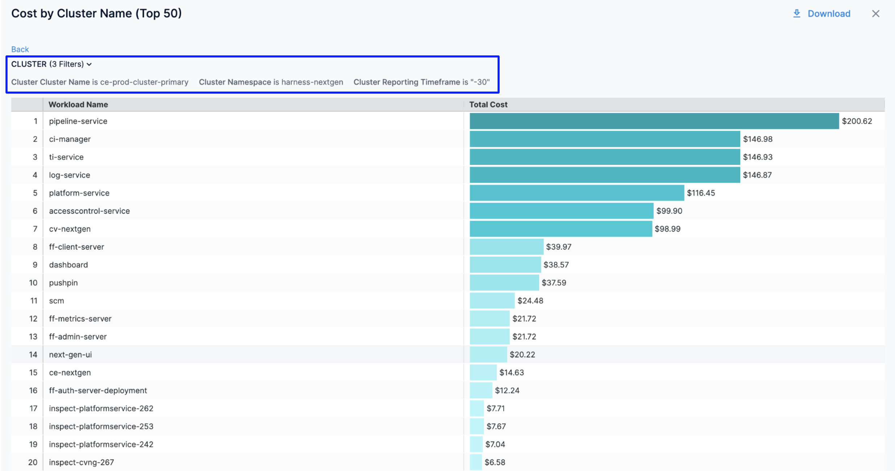
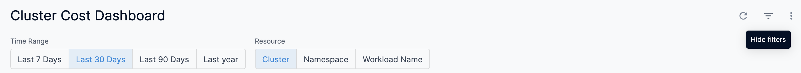

**Dashboards** are a collection of charts and data tables with filters that you can use to get at the data you're interested in. Dashboards serve as a platform for data modeling and analytics using a combination of available business metrics and operational data. You can use this data to make data-driven informed business decisions.

For information on core Dashboard functionality, see [Create Dashboards](/article/ardf4nbvcy-create-dashboards).Harness provides **By Harness** (pre-defined) and **Custom** (user-defined) Dashboards to visualize cloud cost data across cloud providers. Using the Cluster Cost Dashboard you can:

* Discover new analytical insights into your Kubernetes cluster costs
* Track various cloud cost indicators across different zones and time range
* Explore the Kubernetes cloud cost data in a logical and structured manner
* View your cloud costs at a glance, understand what is costing the most, and analyze cost trends
* View the cost of each Kubernetes workload and namespace in your account

This topic describes how to view the **By Harness Cluster Cost Dashboard** and get more information about that data.

### Before You Begin

* [Set Up Cloud Cost Management for Kubernetes](/article/ltt65r6k39-set-up-cost-visibility-for-kubernetes)
* [Manage Access Control for CCM Dashboards](/article/ng6yaxqi2r-manage-access-control-for-ccm-dashboards)

### Prerequisites

* Review [Set Up Cloud Cost Management for Kubernetes](/article/ltt65r6k39-set-up-cost-visibility-for-kubernetes).
* Ensure that you have **Dashboard-All View** permissions assigned. See [Manage Access Control for CCM Dashboards](https://ngdocs.harness.io/article/ng6yaxqi2r-manage-access-control-for-ccm-dashboards).
* Ensure that you have set up Cloud Cost Management (CCM) for the [Kubernetes clusters](/article/ltt65r6k39-set-up-cost-visibility-for-kubernetes).
* Ensure that you have added all the required permissions for your cluster. The data available in the Dashboard depends on the permissions you provided to the Kubernetes clusters when setting up CCM.

### Data Ingestion for Cluster Dashboard

Once you have set up cost visibility for the [Kubernetes clusters](/article/ltt65r6k39-set-up-cost-visibility-for-kubernetes) and the data is available in the Perspective, you can view **Cluster Cost Dashboard**. The data in the Dashboard is updated dynamically.

### Step: View Cluster Cost Dashboard

Perform the following steps to view Cluster Cost Dashboard:

1. In Harness, click **Dashboards**.
2. In **All Dashboards**, select **By Harness** and click **Cluster Cost Dashboard**.The Cluster Cost Dashboard is displayed:  

|  |  |
| --- | --- |
| **Dimensions** | **Description** |
| Total Cost | The total cloud cost across clusters with cost trend. |
| Forecasted Cost | The forecasted cluster cost with cost trend. Forecasted cost is the prediction based on your historical cost data and it is predicted for the same future time period as your selected time range. |
| Cost by Cluster Name (Top 50) | The cost of top 50 Kubernetes clusters. |
| Top Cost Trend by Resources | Top cost trend by resources. The cost trend is calculated based on the previous spending. |
| Cluster Cost Breakdown | The utilized, idle, and unallocated cost details.
	* Utilized cost is the cost estimate for the utilized node or pod resources.
	* Idle cost is the cost of idle resources (CPU and memory) allocated to a Kubernetes pod.
	* Unallocated cost is the cost of unallocated node resources in a Kubernetes cluster. |
| Efficiency Score | A measure of how cost-optimized your resource usage is across your clusters. It is derived from the total and idle (and or unallocated) spend of your resources. |
| Cluster Efficiency Score Over Time | A measure of how cost-optimized your resource usage is across your clusters over time. |
| Historical Cost vs Forecast | The historical and forecasted cluster cost. Forecasted cost is the prediction based on your historical cost data and it is predicted for the same future time period as your selected time range. |
| Current Period vs Last Period | The cost of the current and previous time range. |
| Most Expensive Clusters | The cost of the most expensive Kubernetes clusters. A cluster refers to a collection of nodes that run workloads as containers in any cloud provider. |
| Most Expensive Namespaces | The cost of the most expensive Kubernetes namespaces in the cluster.  |
| Most Expensive Workloads | The cost of the most expensive Kubernetes workloads in the cluster. |
| Most Expensive Nodes | The cost of the most expensive Kubernetes nodes in the cluster. |
3. Select **Time Range** to filter the data based on pre-defined time range filters. The available filters are:
	* Last 7 Days
	* Last 30 Days
	* Last 90 Days
	* Last year
4. Select **Resource** to filter the data based on pre-defined resource filters. The available filters are:
	* Cluster
	* Namespace
	* Workload Name
5. Once you have selected the **Time Range** and **Resource** filter, click **Reload**. The data is refreshed with the latest data from the database. By default, the **Last 30 Days** and **Cluster** are selected.
6. Hover over the chart to see the cost details.
7. In **Cost by Cluster Name (Top 50)**, click the up or down arrow button to scroll up or down the list. The list shows the percentage of each account with respect to the cost contribution.
8. In **Cost by Cluster Name (Top 50)**, click on the chart to further drill into the cost details of Product, Region, or SKU. You can drill down by:
	* by Namespace
	* by Workload Name
9. The dashboard displays the cost data based on the selection in the previous step.
10. You can further drill down and view the cloud cost of a specific **Namespace**. For example, drill into harness-nextgen and view the cost **by Workload Name**.The details in the Dashboard are displayed. You can also view the details of the filters applied.
11. Click **Back** to go back to the previous page in the Dashboard.
12. Click **Download** to download the Dashboard. See [Download Dashboard Data](https://ngdocs.harness.io/article/op59lb1pxv-download-dashboard-data).
13. You can also drill into **Cluster Efficiency Score Over Time**, **Most Expensive Clusters**, **Most Expensive Workloads**, and **Most Expensive Namespaces** and view details in the Dashboard.
14. Click the **Filter** icon to hide or show the filters.

### See Also

Once you have set up cost visibility for your [Kubernetes clusters](https://ngdocs.harness.io/article/ltt65r6k39-set-up-cost-visibility-for-kubernetes), [AWS](https://ngdocs.harness.io/article/80vbt5jv0q-set-up-cost-visibility-for-aws), [GCP](https://ngdocs.harness.io/article/kxnsritjls-set-up-cost-visibility-for-gcp), and [Azure](https://ngdocs.harness.io/article/v682mz6qfd-set-up-cost-visibility-for-azure) cloud providers, you can create your own Dashboards. Refer to the following topics to create your own Dashboard and chart data.

* [Create Dashboards](https://ngdocs.harness.io/article/ardf4nbvcy-create-dashboards)
* [Create Visualizations and Graphs](https://ngdocs.harness.io/article/n2jqctdt7c-create-visualizations-and-graphs)

### Next Steps

* [Use Dashboard Actions](https://ngdocs.harness.io/article/y1oh7mkwmh-use-dashboard-actions)
* [Download Dashboard Data](https://ngdocs.harness.io/article/op59lb1pxv-download-dashboard-data)
* [Create Conditional Alerts](https://ngdocs.harness.io/article/ro0i58mvby-create-conditional-alerts)
* [Schedule and Share Dashboards](https://ngdocs.harness.io/article/35gfke0rl8-share-dashboards)
* [View AWS Cost Dashboard](https://ngdocs.harness.io/article/u3yxrebj6r-aws-dashboard)

