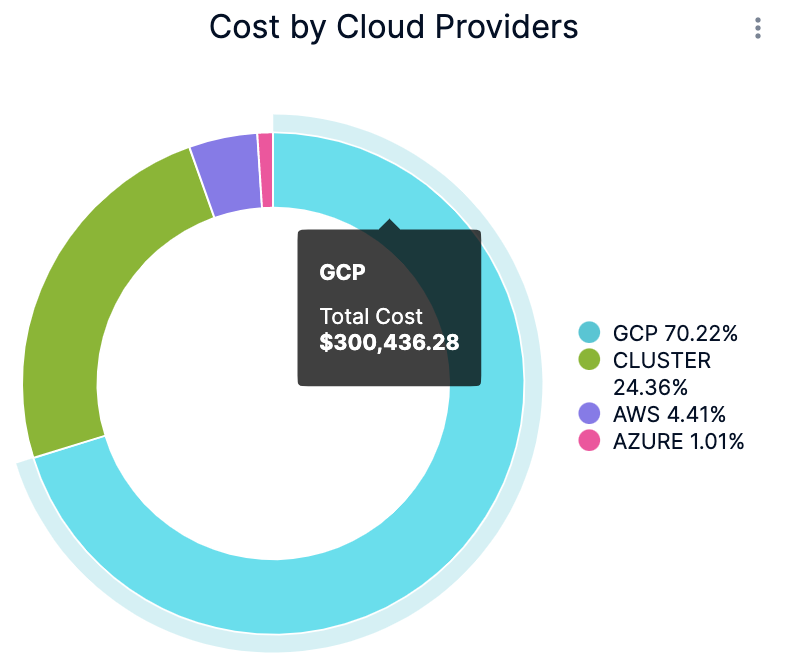

**Dashboards** are a collection of charts and data tables with filters that you can use to get at the data you're interested in. Dashboards serve as a platform for data modeling and analytics using a combination of available business metrics and operational data. You can use this data to make data-driven informed business decisions.

For information on core Dashboard functionality, see [Create Dashboards](/article/ardf4nbvcy-create-dashboards).Harness provides **By Harness** (pre-defined) and **Custom** (user-defined) Dashboards to visualize cloud cost data across cloud providers. Using the **Multi-cloud Cost Overview Dashboard** you can:

* Get a unified view of your cloud cost data across the cloud environment. For example, AWS, Azure, GCP, and Cluster
* Discover new analytical insights into your cluster costs across cloud providers
* Track various cloud cost indicators across different zones and time range
* Explore the cloud cost data in a logical and structured manner
* View your cloud costs at a glance, understand what is costing the most, and analyze cost trends

This topic describes how to view the **By Harness** **Multi-cloud Cost Overview** **Dashboard** and get more information about that data.

In this topic:

* [Before You Begin](/article/ff5f08g4v4-multi-cloud-cost-overview-dashboard#before_you_begin)
* [Prerequisites](/article/ff5f08g4v4-multi-cloud-cost-overview-dashboard#prerequisites)
* [Data Ingestion for Multi-cloud Cost Overview Dashboard](/article/ff5f08g4v4-multi-cloud-cost-overview-dashboard#data_ingestion_for_multi_cloud_cost_overview_dashboard)
* [Step: View Multi-cloud Cost Overview Dashboard](https://ngdocs.harness.io/article/ff5f08g4v4-multi-cloud-cost-overview-dashboard#step_view_multi_cloud_cost_overview_dashboard)
* [See Also](https://ngdocs.harness.io/article/ff5f08g4v4-multi-cloud-cost-overview-dashboard#see_also)
* [Next Steps](https://ngdocs.harness.io/article/ff5f08g4v4-multi-cloud-cost-overview-dashboard#next_steps)

### Before You Begin

* Review the following topics:
	+ [Set Up Cloud Cost Management for Kubernetes](/article/ltt65r6k39-set-up-cost-visibility-for-kubernetes)
	+ [Set Up Cloud Cost Management for GCP](/article/kxnsritjls-set-up-cost-visibility-for-gcp)
	+ [Set Up Cloud Cost Management for AWS](/article/80vbt5jv0q-set-up-cost-visibility-for-aws)
	+ [Set Up Cloud Cost Management for Azure](/article/v682mz6qfd-set-up-cost-visibility-for-azure)

### Prerequisites

* Ensure that you have **Dashboard-All View** permissions assigned. See [Manage Access Control for CCM Dashboards](/article/ng6yaxqi2r-manage-access-control-for-ccm-dashboards).
* Ensure that you have set up Cloud Cost Management (CCM) for the [Kubernetes clusters](/article/ltt65r6k39-set-up-cost-visibility-for-kubernetes), [AWS](/article/80vbt5jv0q-set-up-cost-visibility-for-aws), [GCP](/article/kxnsritjls-set-up-cost-visibility-for-gcp), and [Azure](/article/v682mz6qfd-set-up-cost-visibility-for-azure) cloud accounts.
* Ensure that you have added all the required permissions for your cloud account. The data available in the Dashboard depends on the permissions you provided to the cloud accounts or clusters when setting up CCM.

### Data Ingestion for Multi-cloud Cost Overview Dashboard

Once you have set up cost visibility for your clusters and cloud accounts and the data is available in the Perspective, you can view the **Multi-cloud Cost Overview Dashboard**. The data in the Dashboard is updated dynamically.

### Step: View Multi-cloud Cost Overview Dashboard

Perform the following steps to view the Multi-cloud Cost Overview Dashboard:

1. In **Harness**, click **Dashboard****s**.
2. In **All Dashboards**, select **By Harness** and click **Multi-cloud Cost Overview Dashboard**.The cost data is displayed.  

|  |  |
| --- | --- |
| **Dimension** | **Description** |
| Total Cost | The total cloud cost across clusters and cloud accounts with cost trend. |
| Forecasted Cost | The forecasted cluster and cloud accounts cost with cost trend. Forecasted cost is the prediction based on your historical cost data and it is predicted for the same future time period as your selected time range. |
| Cost by Cloud Providers | The cost of each cloud provider. For example, AWS, GCP, Azure, and Kubernetes cluster. |
| Cost by Services or Products | The cost of each Service and Product across cloud providers. |
| Weekly Cost Trend | The weekly cost trend across cloud providers. |
3. Select **Time Range** to filter the data based on pre-defined time range filters. The available filters are:
	* Last 7 Days
	* Last 30 Days
	* Last 90 Days
	* Last year
4. Once you have selected the **Time Range**, click **Reload**. The data is refreshed with the latest data from the database. By default, **Last 30 Days** is selected.
5. Hover over the chart to see the cost details.
6. In **Cost by Cloud Providers**, click the cloud provider to view the cost of a specific cloud provider. For example, click GCP to update the dashboard data only for GCP.
7. In the resulting dashboard, you can further refine your view. In **Weekly Cost Trend**, click **Time period/Week** for which you want to view the cost.
8. In **Cost by Services or Products**, hover over the chart to view the cost of **Products**. The applied filters are also displayed.
9. Click the **Filter** icon to hide or show the filters.

### See Also

Once you have set up cost visibility for your [Kubernetes clusters](/article/ltt65r6k39-set-up-cost-visibility-for-kubernetes), [AWS](/article/80vbt5jv0q-set-up-cost-visibility-for-aws), [GCP](/article/kxnsritjls-set-up-cost-visibility-for-gcp), and [Azure](/article/v682mz6qfd-set-up-cost-visibility-for-azure) cloud providers, you can create your own Dashboards. Refer to the following topics to create your own Dashboard and chart data.

* [Create Dashboards](/article/ardf4nbvcy-create-dashboards)
* [Create Visualizations and Graphs](/article/n2jqctdt7c-create-visualizations-and-graphs)

### Next Steps

* [Create Conditional Alerts](/article/ro0i58mvby-create-conditional-alerts)
* [Schedule and Share Dashboards](/article/35gfke0rl8-share-dashboards)
* [Use Dashboard Actions](/article/y1oh7mkwmh-use-dashboard-actions)
* [Download Dashboard Data](/article/op59lb1pxv-download-dashboard-data)

