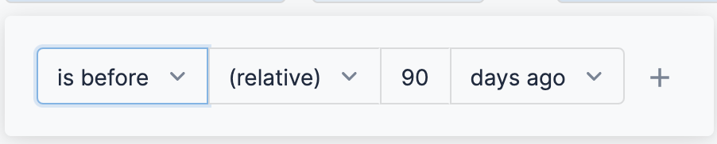

**Dashboards** are a collection of charts and data tables with filters that you can use to get at the data you're interested in. Dashboards serve as a platform for data modeling and analytics using a combination of available business metrics and operational data. You can use this data to make data-driven informed business decisions.

For information on core Dashboard functionality, see [Create Dashboards](/article/ardf4nbvcy-create-dashboards).Harness provides pre-loaded **By Harness** (pre-defined) and **Custom** (user-defined) Dashboards to visualize cloud cost data across clusters and cloud accounts. Using the **Orphaned EBS Volumes and Snapshots** **Dashboard** you can:

* Discover new analytical insights into your EBS volumes and snapshots
* Explore the cloud cost data in a logical and structured manner
* View your cloud costs at a glance, understand what is costing the most, and analyze cost trends

This Dashboard will not be available if you have not selected **AWS ECS and Resource Inventory Management** feature when setting up [CCM for AWS](https://ngdocs.harness.io/article/80vbt5jv0q-set-up-cost-visibility-for-aws).This topic describes how to view the **Orphaned EBS Volumes and Snapshots** **Dashboard** and get more information about that data.

In this topic:

* [Before You Begin](https://ngdocs.harness.io/article/itn49ytd8u-orphaned-ebs-volumes-and-snapshots-dashboard#undefined)
* [Prerequisites](https://ngdocs.harness.io/article/itn49ytd8u-orphaned-ebs-volumes-and-snapshots-dashboard#prerequisites)
* [Data Ingestion for Dashboard](https://ngdocs.harness.io/article/itn49ytd8u-orphaned-ebs-volumes-and-snapshots-dashboard#undefined)
* [Step: View Orphaned EBS Volumes and Snapshots Dashboard](https://ngdocs.harness.io/article/itn49ytd8u-orphaned-ebs-volumes-and-snapshots-dashboard#undefined)
* [See Also](https://ngdocs.harness.io/article/itn49ytd8u-orphaned-ebs-volumes-and-snapshots-dashboard#see_also)
* [Next Steps](https://ngdocs.harness.io/article/itn49ytd8u-orphaned-ebs-volumes-and-snapshots-dashboard#undefined)

### Before You Begin

* [Set Up Cloud Cost Management for AWS](/article/80vbt5jv0q-set-up-cost-visibility-for-aws)
* [Manage Access Control for CCM Dashboards](/article/ng6yaxqi2r-manage-access-control-for-ccm-dashboards)

### Prerequisites

* Review [Set Up Cloud Cost Management for AWS](https://ngdocs.harness.io/article/80vbt5jv0q-set-up-cost-visibility-for-aws)
* Ensure that you have **Dashboard-All View** permissions assigned. See [Manage Access Control for CCM Dashboards](https://ngdocs.harness.io/article/ng6yaxqi2r-manage-access-control-for-ccm-dashboards).
* Ensure that you have set up Cloud Cost Management (CCM) for the [AWS](/article/80vbt5jv0q-set-up-cost-visibility-for-aws) cloud provider.
* Ensure that you have selected **AWS ECS and Resource Inventory Management** feature when creating the AWS connector. See [Select Features](/article/80vbt5jv0q-set-up-cost-visibility-for-aws#step_3_select_features).

### Data Ingestion for Dashboard

Once you have set up cost visibility for the [AWS](https://ngdocs.harness.io/article/80vbt5jv0q-set-up-cost-visibility-for-aws) cloud provider and the data is available for root cost analysis, you can view the dashboard. The data in the Dashboard is updated dynamically.

### Step: View Orphaned EBS Volumes and Snapshots Dashboard

Perform the following steps to view Orphaned EBS Volumes and Snapshots Dashboard:

1. In Harness, click **Dashboards**.
2. In **All Dashboards**, click **Orphaned EBS Volumes and Snapshots Dashboard**.
3. In **EBS Volume Creation Date**, select the date. You can add multiple OR conditions.
4. In **EBS Volume Cost Date**, select the date range.  
  
By default, **This Month** is selected.
	1. **Presets**: Select a Preset filter. For example, Today, Yesterday, etc.
	2. **Custom**: Custom allows you to select the date range.
5. In **Snapshot Creation Date**, select the date. You can add multiple OR conditions.
6. Once you have selected all the filters, click **Update**.  
  
The **Orphaned EBS Volumes and Snapshots Dashboard** is displayed.

### See Also

Once you have set up cost visibility for your [Kubernetes clusters](/article/ltt65r6k39-set-up-cost-visibility-for-kubernetes), [AWS](/article/80vbt5jv0q-set-up-cost-visibility-for-aws), [GCP](/article/kxnsritjls-set-up-cost-visibility-for-gcp), and [Azure](/article/v682mz6qfd-set-up-cost-visibility-for-azure) cloud providers, you can create your own Dashboards. Refer to the following topics to create your own Dashboard and chart data.

* [Create Dashboards](/article/ardf4nbvcy-create-dashboards)
* [Create Visualizations and Graphs](/article/n2jqctdt7c-create-visualizations-and-graphs)

### Next Steps

* [Use Dashboard Actions](https://ngdocs.harness.io/article/y1oh7mkwmh-use-dashboard-actions)
* [Download Dashboard Data](https://ngdocs.harness.io/article/op59lb1pxv-download-dashboard-data)
* [Schedule and Share Dashboards](/article/35gfke0rl8-share-dashboards)
* [Create Conditional Alerts](https://ngdocs.harness.io/article/ro0i58mvby-create-conditional-alerts)

