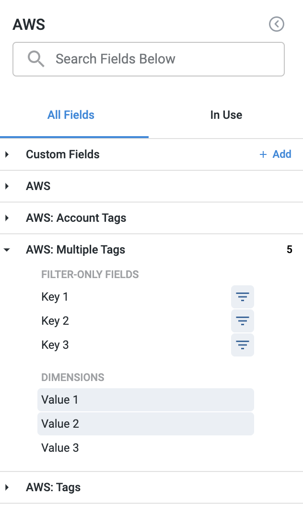
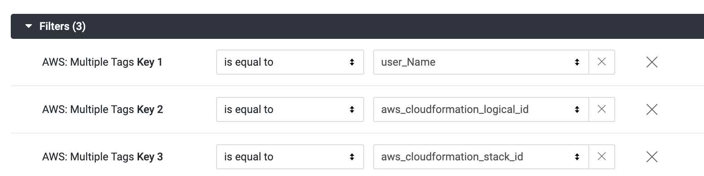
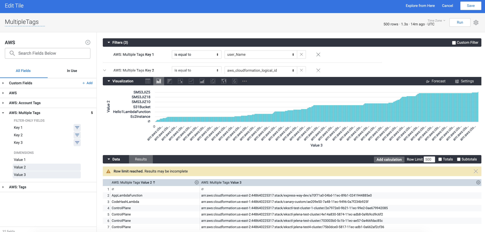

Multiple Tags in AWS Dashboards can be used to filter and visualize data based on unique Tags and their values. This can be used to drill down the data for specific key values. If you filter `AWS: Multiple Tags - Key 1` with the environment or application, then `Dimension Value 1` will contain the values for that specific Tag. For example, the cost of `XYZ` application in the `ABC` cost center in the `QA` environment only.

For information on core Dashboard functionality, see [Create Dashboards](/article/ardf4nbvcy-create-dashboards).This topic explains how to use Multiple Tags in AWS Dashboards.

### Prerequisites

* Review [Set Up Cloud Cost Management for AWS](/article/80vbt5jv0q-set-up-cost-visibility-for-aws).
* Ensure that you have **Dashboard-All View** permissions assigned. See [Manage Access Control for CCM Dashboards](https://ngdocs.harness.io/article/ng6yaxqi2r-manage-access-control-for-ccm-dashboards).
* Ensure that you have set up Cloud Cost Management (CCM) for the [AWS](/article/80vbt5jv0q-set-up-cost-visibility-for-aws) cloud provider.
* Ensure that you have added all the required permissions for your cloud provider. The data available in the Dashboard depends on the permissions you provided to the AWS cloud provider when setting up the CCM. For more information, see [Select Features](/article/80vbt5jv0q-set-up-cost-visibility-for-aws#step_3_select_features).

### Data Ingestion for Dashboard

Once you have set up cost visibility for the [AWS](/article/80vbt5jv0q-set-up-cost-visibility-for-aws) cloud provider and the data is available in the Perspective, you can view **AWS Cost Dashboard**. The data in the Dashboard is updated dynamically.

### Step: Use Multiple Tags

1. Click **Edit Tile** in your AWS Dashboard.
2. In **All Fields**, click **AWS: Multiple Tags**.
3. In **Filter-only fields**, click **Key 1** and select the filters. Depending on your requirement, you can select filters for **Key 2** and/or **Key 3** also.
4. In **Dimensions**, click **Value 1**, **2**, and/or **3** (for which you want to visualize the data) and click **Run**. Data for all the specified Keys (Filter-only fields) and Values (Dimensions) are displayed.

### See Also

Once you have set up cost visibility for your [Kubernetes clusters](/article/ltt65r6k39-set-up-cost-visibility-for-kubernetes), [AWS](/article/80vbt5jv0q-set-up-cost-visibility-for-aws), [GCP](/article/kxnsritjls-set-up-cost-visibility-for-gcp), and [Azure](/article/v682mz6qfd-set-up-cost-visibility-for-azure) cloud providers, you can create your own Dashboards. Refer to the following topics to create your own Dashboard and chart data.

* [Create Dashboards](/article/ardf4nbvcy-create-dashboards)
* [Create Visualizations and Graphs](/article/n2jqctdt7c-create-visualizations-and-graphs)

### Next Steps

* [Use Dashboard Actions](https://ngdocs.harness.io/article/y1oh7mkwmh-use-dashboard-actions)
* [Download Dashboard Data](https://ngdocs.harness.io/article/op59lb1pxv-download-dashboard-data)
* [Create Conditional Alerts](/article/ro0i58mvby-create-conditional-alerts)
* [Schedule and Share Dashboards](/article/35gfke0rl8-share-dashboards)

