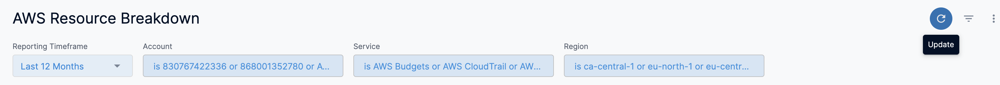

Harness provides preloaded **By Harness** (pre-defined) and **Custom** (user-defined) Dashboards to visualize cloud cost data across clusters and cloud accounts. Using the **AWS Resource Breakdown Dashboard** you can:

* Discover new analytical insights into your AWS Services
* Track various cloud cost indicators across different zones and time range
* View instance metrics
* Explore the cloud cost data in a logical and structured manner
* View your cloud costs at a glance, understand what is costing the most, and analyze cost trends

This Dashboard will not be available if you have not selected **AWS** **Resource Breakdown Dashboard** feature when setting up [CCM for AWS](../../../1-onboard-with-cloud-cost-management/set-up-cloud-cost-management/set-up-cost-visibility-for-aws.md). This topic describes how to view the **By Harness AWS Resource Breakdown Dashboard** and get more information about that data.

## Prerequisites

* Ensure that you have **Dashboard-All View** permissions assigned. See [Manage Access Control for CCM Dashboards](../access-control/manage-access-control-for-ccm-dashboards.md).
* Ensure that you have set up Cloud Cost Management (CCM) for the [AWS](../../../1-onboard-with-cloud-cost-management/set-up-cloud-cost-management/set-up-cost-visibility-for-aws.md) cloud provider.
* Ensure that you have added all the required permissions for your cloud provider. The data available in the Dashboard depends on the permissions you provided to the AWS cloud provider when setting up the CCM. 

## Data Ingestion for AWS Resource Breakdown Dashboard

Once you have set up cost visibility for the [AWS](../../../1-onboard-with-cloud-cost-management/set-up-cloud-cost-management/set-up-cost-visibility-for-aws.md) cloud provider and the data is available in the Perspective, you can view **AWS Cost Dashboards**. The data in the Dashboard is updated dynamically.

## View AWS Resource Breakdown Dashboard

Perform the following steps to view AWS Resource Breakdown Dashboard:

1. In Harness, click **Dashboards**.
2. Select **By Harness** and click **AWS** **Resource Breakdown**.  
  
The **AWS Resource Breakdown Dashboard** is displayed:  

| **Dimension** | **Description** |
| --- | --- |
| Monthly Cost Breakdown | Includes the monthly cost of all the AWS resources. |
| Resource Level Cost Breakdown | Includes the resource level cost breakdown. |
3. In **Reporting Timeframe**, select the time duration.
4. In **Account**, select the account for which you want to view the cost. You can select multiple accounts.
   
     
5. In **Service**, select the service for which you want to view the cost. You can select multiple Services.
6. In **Region**, select the region. You can select multiple regions.
7. Once you have made all the selections, click **Update**.  The data is refreshed with the latest data from the database.
   
     

### See Also

Once you have set up cost visibility for your Kubernetes clusters, AWS, GCP, and Azure cloud providers, you can create your own Dashboards. Refer to the following topics to create your own Dashboard and chart data.

* [Create Dashboards](../../../../platform/18_Dashboards/create-dashboards.md)
* [Create Visualizations and Graphs](../../../../platform/18_Dashboards/create-visualizations-and-graphs.md)

### Next Steps

* [Use Dashboard Actions](../../../../platform/18_Dashboards/use-dashboard-actions.md)
* [Download Dashboard Data](../../../../platform/18_Dashboards/download-dashboard-data.md)
* [Create Conditional Alerts](../../../../platform/18_Dashboards/create-conditional-alerts.md)
* [Schedule and Share Dashboards](../../../../platform/18_Dashboards/share-dashboards.md)

