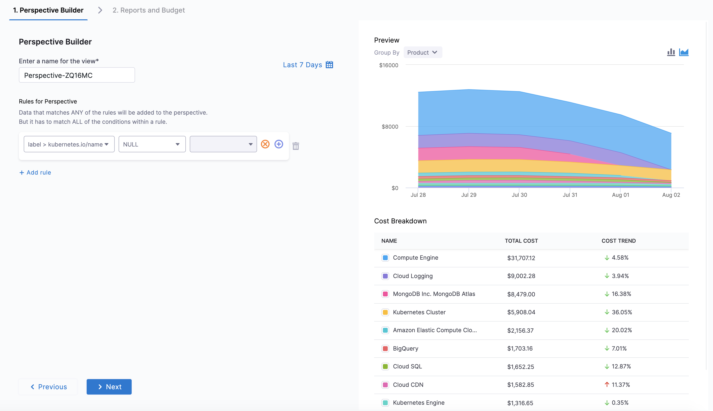
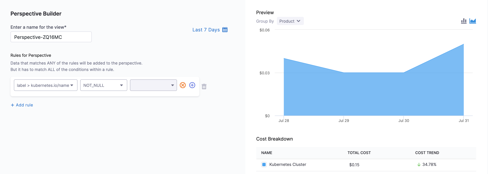
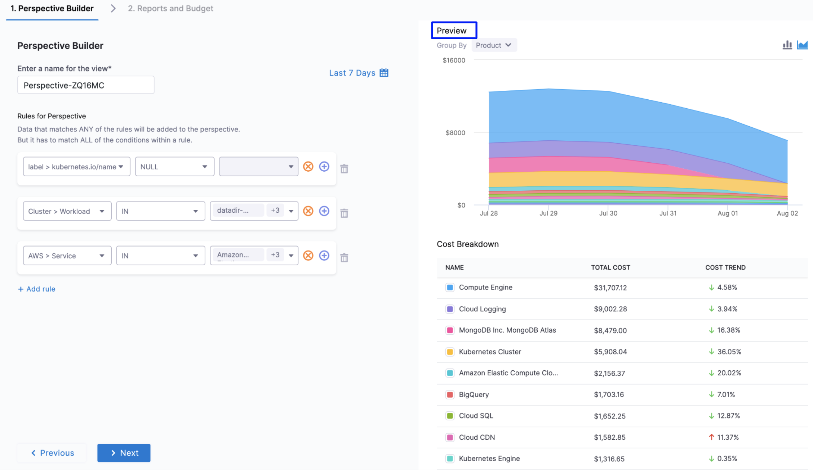
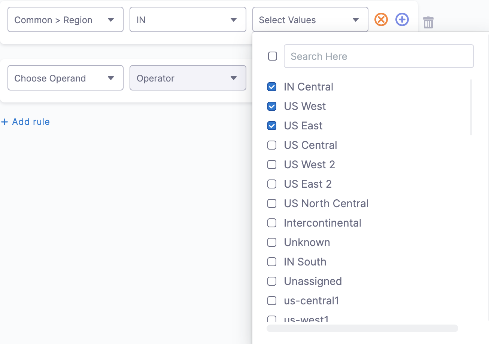
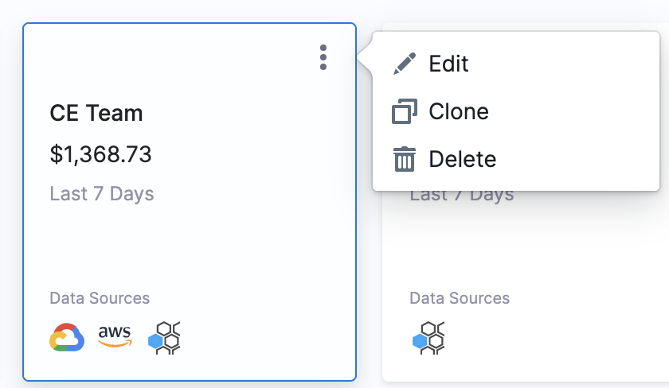
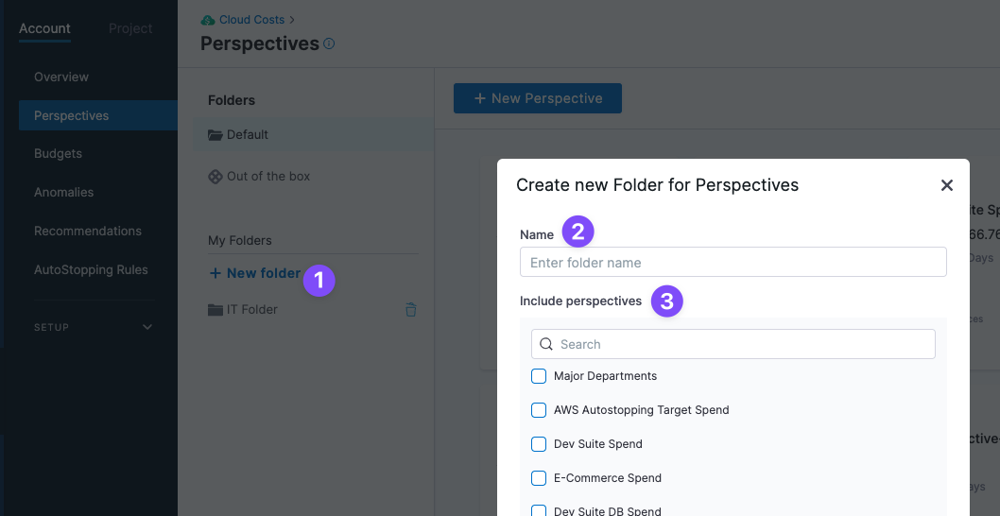
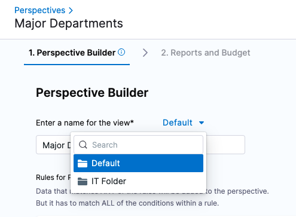
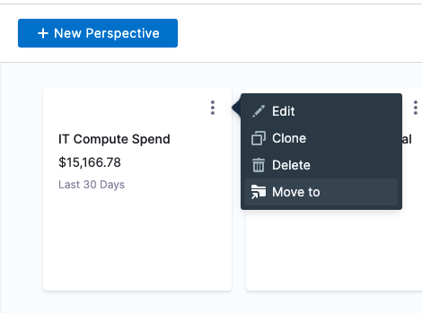

You can add business context to your Harness Cloud Cost Management (CCM) data using perspectives. Perspectives allow you to group your resources in ways that are more meaningful to your business needs.

### Before You Begin

* [Set Up Cloud Cost Management for your cloud service provider](https://developer.harness.io/docs/category/set-up-cloud-cost-management)
* [Use Cost Categories](../2-ccm-cost-categories/1-ccm-cost-categories.md)

## Cloud Costs Perspective Concepts

This section describes Perspective concepts.

### Perspectives

Perspectives allow you to group your resources in ways that are more meaningful to your business needs.

For example, you can group and filter by Account, Environment, Service, Region, Product, Label, Namespace, Workload, etc., and create a Perspective for your business, finance, and engineering teams.

Here are some examples where you could use Perspectives:

* Build your own visual interface using flexible rules and filters. With Perspectives, business units can create views that align with their business needs based on groups of resources determined by different rules and filters.
* Create Perspectives broken down by project, team, department, or business unit to gain granular visibility into all your cloud environments. Perspectives provide a single-pane view of different products, for example, clusters, applications, AWS, GCP, and Azure.
* Schedule and share the reports with the key stakeholders for maximum business impact.
* Estimate costs consumed by specific teams, groups, departments, BUs, LOBs, cost centers, etc.

### Rule-based Engine

Perspectives use a rule-based engine to organize and display your cloud costs. Each Perspective has a set of rules and each rule can have multiple conditions. The following operators are supported for each condition:

* **IN**: The exact match operation is used to filter for the exact value specified.
* **NOT IN**: The exact match operation is used to filter for all values except the one specified.
* **NULL**: Null means the selected filter has no value. If you select NULL for your filter, then the cost of the selected filter isn't included in the Perspective.  
For example, in **Rules for Perspective**, if you select `Label: kubernetes.io/name` as `NULL`, then your Perspective won't include the cost for the selected label (`kubernetes.io/name`). It will include the cost of all the other resources.

  
* **NOT NULL**: Not null means that the selected filter has a value. If you choose NOT NULL for your filter, then only the cost of the selected filter is included in the perspective.  
  
For example, in **Rules for Perspective**, if you select `Label: kubernetes.io/name` as `NOT_NULL`, then your Perspective will list the cost of the selected label only (`kubernetes.io/name`). It won't include the cost of any other resource.

  
* **LIKE**: Use the Like operator to include the cost of all items in the selected filter that match the specified condition. For example, if you have selected the Cost category filter, you could use the Like operator to specify condition "database" to filter all cost categories that is related to database. 

### Filters

You can create a Perspective for your resources using rules and filters. The filters are used to group the resources. The following are the supported filters:

* **Cost Categories**: You can create a perspective by filtering based on the cost categories you have created. To create cost categories, see [Use Cost Categories](../2-ccm-cost-categories/1-ccm-cost-categories.md).
* **AWS**: CCM allows you to view your AWS costs at a glance, understand what is costing the most, and analyze cost trends. CE displays the data for all your Amazon Web Services (ECS, EC2, and so on). For more information, see [Analyze Cost for AWS Using Perspectives](../3-root-cost-analysis/analyze-cost-for-aws.md).
* **GCP**: CCM allows you to view your Google Cloud Platform (GCP) costs, understand what is costing the most, and analyze cost trends. CE displays data for all your GCP products (such as Compute Engine, Cloud Storage, BigQuery, and so on), projects, SKUs, and location. For more information, see [Analyze Cost for GCP ​Using Perspectives](../3-root-cost-analysis/analyze-cost-for-gcp-using-perspectives.md).
* **Azure**: CCM allows you to view your Azure costs at a glance, understand what is costing the most, and analyze cost trends. CE displays the data for all your Azure services (Storage accounts, Virtual machines, Containers, and so on). For more information, see [Analyze Cost for Azure Using Perspectives](../3-root-cost-analysis/analyze-cost-for-azure.md).
* **Cluster**: Total cost, Cost trend, Idle cost, and Unallocated cost for each cluster.
* **Region**: Each AWS, GCP, or Azure region you're currently running services in.
* **Product**: Each of your active products with its cloud costs.
* **Label**: Costs organized by the Kubernetes labels used in the workload manifests. In GCP, it refers to each [label](https://cloud.google.com/resource-manager/docs/creating-managing-labels) that you are using to organize your Google Cloud instances.

### Preview

As you add your resources in the **Perspective Builder**, a **Preview** of your Perspective is displayed.

The following are the key advantages of preview:

* Provides a quick visual representation of your resources in the Perspective without saving them.
* Allows you to group resources in the preview mode itself. You can group by **Common**, **Custom** (if Custom Fields are available), **Cluster**, **AWS**, **GCP**, and **Azure**.
* Helps you to review your changes faster.

:::note
**Grouped by** Product in Preview.
:::

## Create a Perspective

You can create a Perspective by grouping your resources the way you wish. For example, if you want to create a perspective for your CFO, first add default or custom filters and then further group by Service, Account, Workload, Namespace, etc. that you would want to include in your Perspective.

:::note
You can create up to 250 Perspectives.
:::

Perform the following steps to create a Perspective:

1. In **Cloud Costs**, click **Perspectives**.
2. In **Perspectives**, click **New Perspective**.
3. In **Perspective Builder**, enter a name for your perspective. By default, a unique name is entered in the field. You can edit the pre-populated name of the perspective.

:::note
   Perspective names mustn't include any special characters.
:::

4. In **Perspective Builder**, in **Rules for Perspective**, click **+** **Add rule**.
5. Select one of the following:
   * Common
   * Cost Categories
   * Cluster
   * AWS
   * GCP
   * Azure
   * Region
   * Product
      
   As you add your resources in the Perspective Builder, a preview of your Perspective is displayed.
6. Select the operator. See the **Rule-based Engine** section for more information.
7. Select the value for your filter. You can select multiple values. You can also filter and customize your result using the search option.
   
     
8. After adding all the filters, click **Next** to add a report-sharing schedule and budget.

:::note
When you create a new Perspective, data across all cloud service providers and clusters are displayed. If you want to restrict the data to a particular cloud service provider, you must apply a filter in the Cloud Provider field.
:::

:::note
If you've added labels and cluster rules in the perspective builder section, it's considered a cluster perspective, hence all cluster labels are considered. In this case, data from cloud service providers such as GCP, Azure, and AWS are not considered. However, if you have applied a label that belongs to the cloud provider data, and you want to view the cluster data as well, then you have to add a Cloud Provider filter.
:::

## Budgets, Reports, and Alerts
For details on adding Budgets, Reports, and Alerts go to:

* [Create a Budget for Your Perspective](../../3-use-ccm-cost-reporting/1-ccm-perspectives/3-create-a-budget-perspective.md)
* [Share Your Cost Perspective Report](../../3-use-ccm-cost-reporting/1-ccm-perspectives/4-share-cost-perspective-report.md)
* [Detect Cloud Cost Anomalies with CCM](../../3-use-ccm-cost-reporting/4-detect-cloud-cost-anomalies-with-ccm.md)

## Perspective Preferences

Go to [Perspective Preferences](perspective-preferences.md) to learn about these settings.

### Review: No Account/Project/etc

It's important to understand the difference between the **Others** and **No Account/Project/etc** categories.

When a Perspective includes multiple data sources (for example, AWS, GCP, and Cluster) and you select one data source in a Perspective **Group By**, such as **AWS: Account**, the costs for the AWS data source are displayed individually. The costs for the other data sources (GCP, Cluster) are grouped under **No Account**.

In other words, a row with No followed by the selected `Group by` is displayed for costs that don’t have any relation with the selected `Group by`. For example, **No SKUs** is displayed for costs (AWS, clusters, etc.) that don’t have any GCP SKUs associated with it.

Another example is if the **Group By** is **Project**. For example, if you selected GCP: Project, then the **No Project** item in the graph represents the AWS and Cluster project costs.

## Edit a Perspective

To edit a Perspective, do the following:

1. Select the Perspective that you want to edit, and click **Edit**.
   
     
2. The **Perspective Builder** appears. Follow the steps in **Create Cost Perspectives** to edit the Perspective.

## Clone a Perspective

When you clone a Perspective, all its settings are cloned. You simply add a new name. Once it is cloned, you can edit it just as you would any Perspective. To clone a Perspective, do the following:

1. Select the Perspective that you want to clone, and click **Clone**.
   
     
2. The cloned Perspective appears.

## Delete a Perspective

To delete a Perspective, do the following:

1. Select the Perspective that you want to delete, and click **Delete**.  
  
The Perspective is deleted and no longer appears in the Perspective dashboard.

## Organize Perspectives using Folders

You can organize Perspectives by adding them to folders.

Click **New folder**, name the folder, and then select the Perspectives you want to add.

You can also add a Perspective to a folder when you create it or move it to a folder when you edit it.

You can also move a Perspective to a folder from its more options (⋮) setting.

