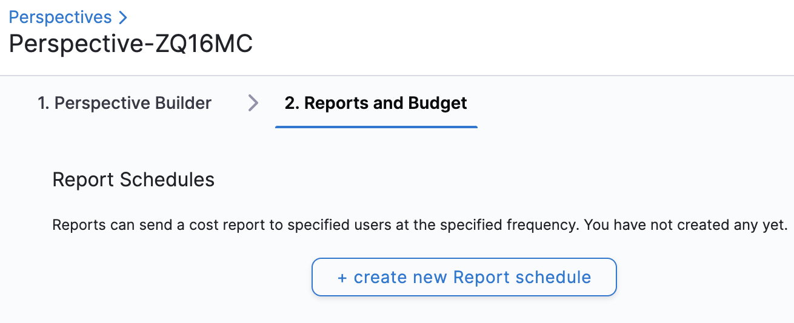
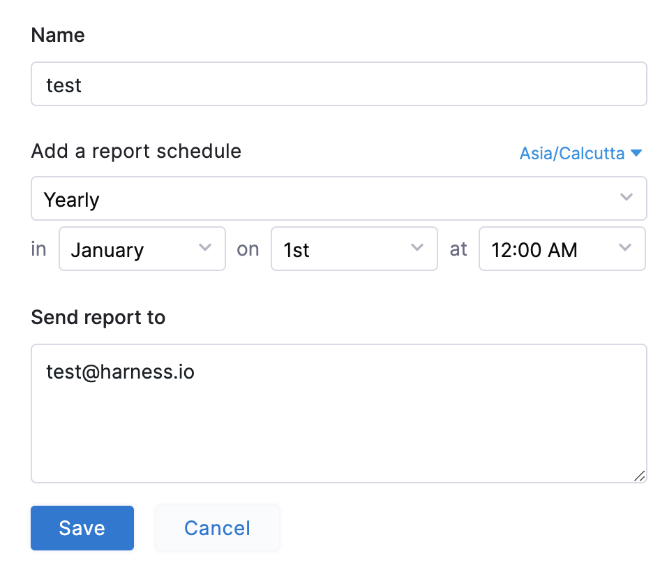
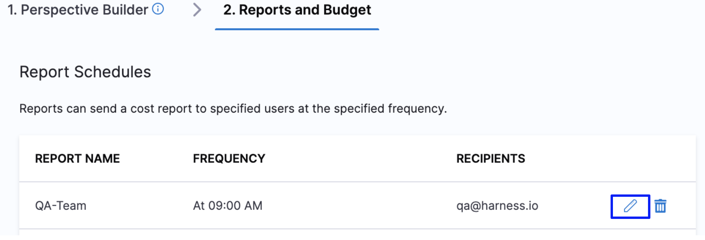
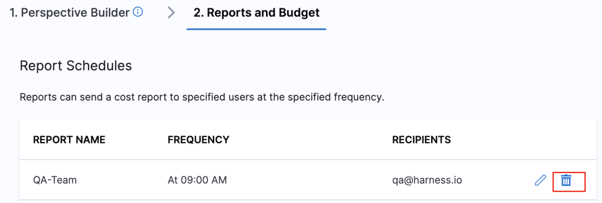

You can share the cost report of your Perspective with your stakeholders. Create a daily, weekly, monthly, or yearly sharing schedule. The report is sent as per the set frequency.

This topic describes how to create a schedule to share your Perspectives' reports.

## Create a New Report

You can create a schedule for sharing the cost report from your Perspective. Perform the following steps to create a schedule:

1. In **Perspectives**, in **Reports and Budget**, click **create new Report schedule**.
   
     
2. In **Name**, enter a name for your Perspective report.
3. In **Add a report schedule**, select the timezone.
4. Select the **frequency** for sharing the report.
	1. **Daily**: Select the time from the drop-down list.
	In minutes, you can select zero or thirty minutes only.
	2. **Weekly**: Select the day and time from the drop-down list.
	3. **Monthly**: Select date and time from the drop-down list.
	4. **Yearly**: Select the month, date, and time from the drop-down list.
5. In **Send report to**, enter an email ID of the recipient.You can add up to 50 email IDs for sharing the report schedule. Email IDs are separated by a comma.
6. Click **Save**.
   
     
7. Click **Save Perspective**.

## Edit a Report Sharing Schedule

To edit your report sharing schedule, perform the following steps:

1. Click Edit.
   
     
2. The **Report Sharing Schedule** settings appear. Follow the steps in **Create a New Report** to edit the details of the schedule.

## Delete a Report Sharing Schedule

Once a schedule is deleted, it cannot be restored. To delete your report sharing schedule, perform the following steps:

1. Click **Delete**.
   
     

2. Click **Confirm Delete**.

The schedule no longer appears in the Perspective Builder.

