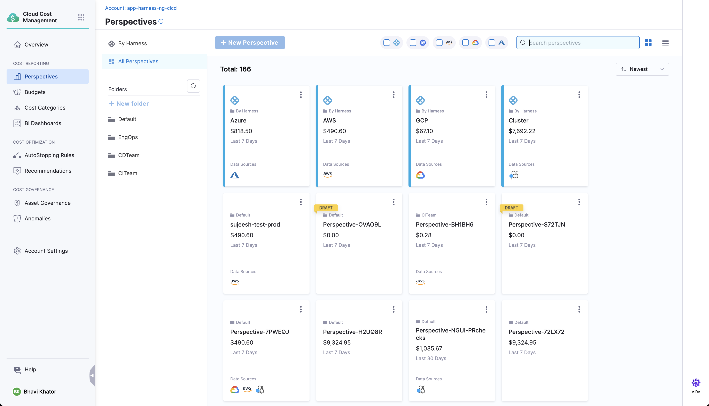
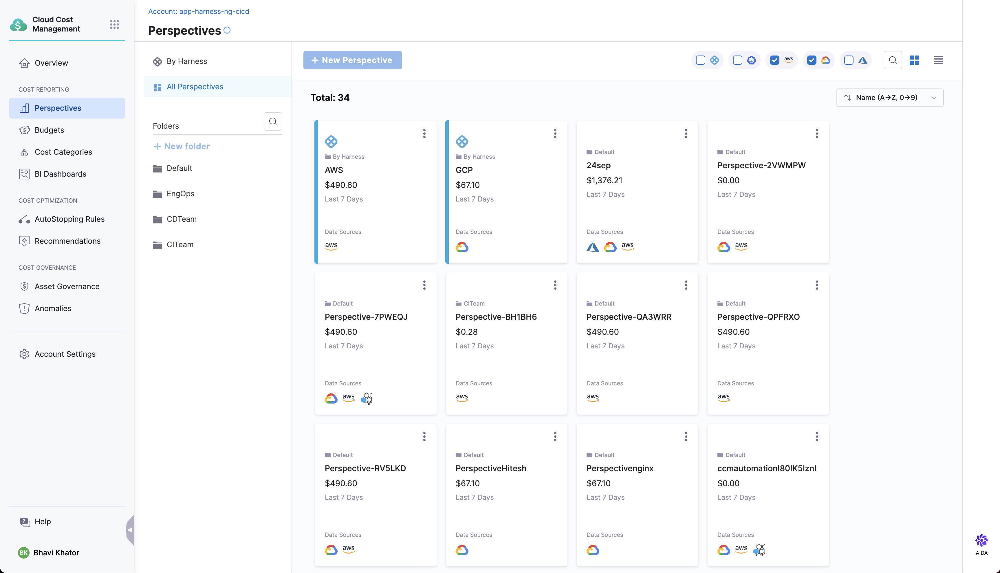
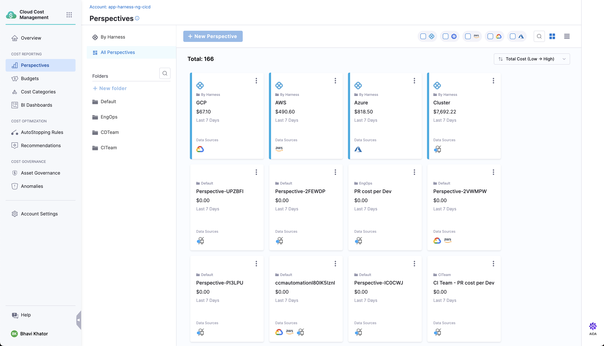
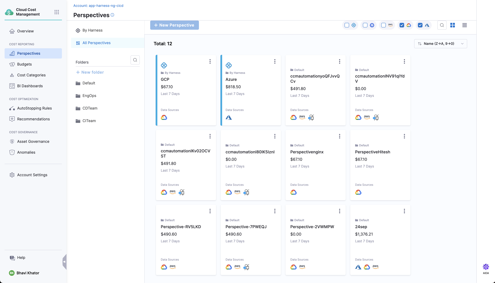
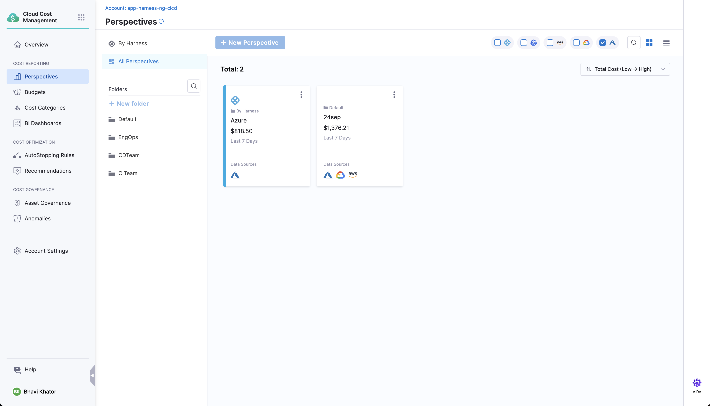
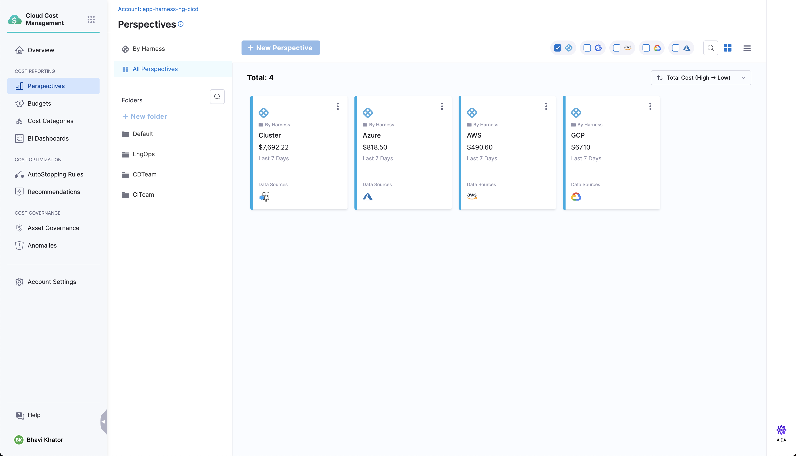

### Filters on Perspectives

Perspectives can be ordered based upon:
* Time of creation   
  
* Name
  
* Cost
  
* Data Sources (AWS, Azure, GCP, Kubernetes)
      
Users can also choose the sorting order of Perspectives:
* Ascending
  
* Descending
  

 

**Pagination** has also been introduced for faster loading times of perspectives. 
Each page will have twenty perspectives. Out of box perspectives will be shown at the top 
of the first page only.

