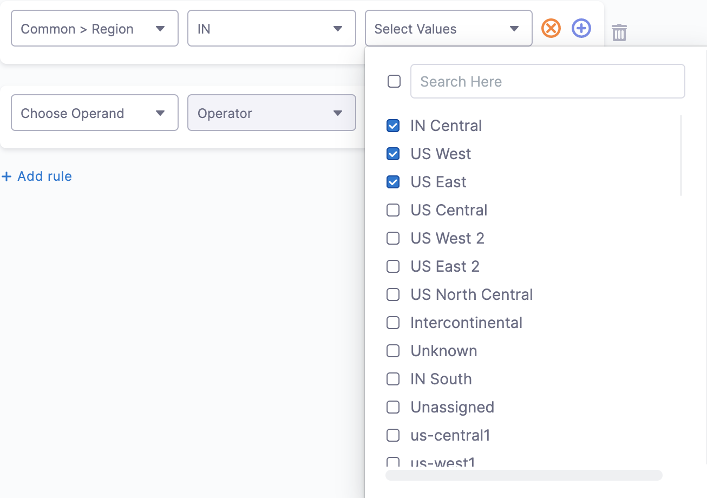

## Create a Perspective

You can create a Perspective by grouping your resources the way you wish. For example, if you want to create a perspective for your CFO, first add default or custom filters and then further group by Service, Account, Workload, Namespace, etc. that you would want to include in your Perspective.

:::note
You can create up to 10,000 Perspectives.
:::

Perform the following steps to create a Perspective:

1. In **Cloud Costs**, click **Perspectives**.
2. In **Perspectives**, click **New Perspective**.
3. In **Perspective Builder**, enter a name for your perspective. By default, a unique name is entered in the field. You can edit the pre-populated name of the perspective.

:::note
   Perspective names mustn't include any special characters.
:::

4. In **Perspective Builder**, in **Rules for Perspective**, click **+** **Add rule**.
5. Select one of the following:
   * Common
   * Cost Categories
   * Cluster
   * AWS
   * GCP
   * Azure
   * Region
   * Product
      
   As you add your resources in the Perspective Builder, a preview of your Perspective is displayed.
6. Select the operator. See the **Rule-based Engine** section for more information.
7. Select the value for your filter. You can select multiple values. You can also filter and customize your result using the search option.
   
     
8. After adding all the filters, click **Next** to add a report-sharing schedule and budget.

:::note
- When you create a new Perspective, data across all cloud service providers and clusters are displayed. If you want to restrict the data to a particular cloud service provider, you must apply a filter in the Cloud Provider field.

:::

:::note
If you've added labels and cluster rules in the perspective builder section, it's considered a cluster perspective, hence all cluster labels are considered. In this case, data from cloud service providers such as GCP, Azure, and AWS are not considered. However, if you have applied a label that belongs to the cloud provider data, and you want to view the cluster data as well, then you have to add a Cloud Provider filter.
:::

### Step 2: Budgets, Reports and Alerts

#### Budgets, Reports, and Alerts
For details on adding Budgets, Reports, and Alerts go to:

* [Create a Budget for Your Perspective](../../3-use-ccm-cost-reporting/1-ccm-perspectives/3-create-a-budget-perspective.md)
* [Share Your Cost Perspective Report](../../3-use-ccm-cost-reporting/1-ccm-perspectives/4-share-cost-perspective-report.md)
* [Detect Cloud Cost Anomalies with CCM](/docs/cloud-cost-management/use-ccm-cost-reporting/anomaly-detection/a-detect-cloud-cost-anomalies-with-ccm)

:::note
You can add multiple budgets for a single Perspective.
:::

Perform the following steps to create a budget:
1. If you do not have a Perspective of the resources you would like to budget, [create a new Perspective](1-create-cost-perspectives.md) and then proceed to set a budget.
   After creating a Perspective, in **Perspective Builder**, click **Next**.
2. If you wish to set a budget for an existing Perspective, select the Perspective for which you want to set a budget, and click **Edit**.
     <DocImage path={require('./static/create-a-budget-perspective-06.png')} width="50%" height="50%" title="Click to view full size image" />

3. In **Perspective Builder**, click **Next**.
4. In **Reports and Budget**, click **create new Budget**.
         
     <DocImage path={require('./static/create-a-budget-perspective-07.png')} width="50%" height="50%" title="Click to view full size image" />

5. In **Define target**, in **Budget Name**, enter a name for your budget that will appear in the budget dashboard to identify this budget.
      <DocImage path={require('./static/create-a-budget-perspective-08.png')} width="50%" height="50%" title="Click to view full size image" />

:::note
   Budgets are created on Perspectives. You cannot select a new Perspective here.
:::
6. Click **Continue**.
7. In **Set Budget Amount**, do the following:
	1. In **Budget Period**, select the period for which you want to set the budget.
	2. Use the date picker to set the start date for your budget.
   	1. In **Budget Type**, select a budget type.  
	
		* **Specified Amount**: Enter the amount that you want to set as the budget limit.
		* **Previous Month Spend**: Sets the previous month spent as your budget.
	4. To add growth rate to your budgeted amount, select the checkbox **Add growth rate to budget amount**. Growth rate refers to the percentage change of the budgeted amount within the specified time period. When you've decided to add growth rate to the budget amount, specify the growth rate percentage.
     
       In **Specify Growth rate**, enter the percentage of the growth rate to the budget amount.  
		  
		You can view the increased amount of your budget in the graph. The graph displays the amount and budget period. The following example considers a 5% increase to the monthly budget amount.

     <DocImage path={require('./static/create-a-budget-perspective-10.png')} width="50%" height="50%" title="Click to view full size image" />

		
8. Click **Continue**.
9. In **Configure Alerts**, set a threshold for the **Percentage of Budget** based on the **Actual Cost** or **Forecasted Cost**. Harness sends alerts when the Actual Cost or Forecasted Cost exceeds the threshold.

  Harness sends an alert to the specified email addresses and Harness User Groups when the actual or forecasted cost exceeds a percentage of your monthly budget.

10. In **Send report to**, add email addresses to receive budget notifications.
    
   <DocImage path={require('./static/create-a-budget-perspective-11.png')} width="50%" height="50%" title="Click to view full size image" />

11. Click **Save**.
12. Click **Save Perspective**.

### Edit a Budget

To edit a budget:

1. In **Perspectives**, select the Perspective for which you want to edit the budget.
2. Click **Edit**.
   
   <DocImage path={require('./static/create-a-budget-perspective-12.png')} width="50%" height="50%" title="Click to view full size image" />

3. In **Perspective Builder**, click **Next**.
4. In **Reports and Budget**, in **Budget**, click the **Edit** icon.
   
  <DocImage path={require('./static/create-a-budget-perspective-13.png')} width="50%" height="50%" title="Click to view full size image" />

5. The Budget settings appear. Follow the steps in **Create a New Budget** to edit the details of the budget.

### Delete a Budget

:::note
Once a budget is deleted, it cannot be restored.
:::

To delete a budget:

1. In **Perspectives**, select the Perspective for which you want to edit the budget.
2. Click **Edit**.
   
     <DocImage path={require('./static/create-a-budget-perspective-14.png')} width="50%" height="50%" title="Click to view full size image" />

3. In **Perspective Builder**, click **Next**.
4. In **Reports and Budget**, in **Budget**, click **Delete**.
   
     <DocImage path={require('./static/create-a-budget-perspective-15.png')} width="50%" height="50%" title="Click to view full size image" />

### Step 3: Preferences

### General Preferences

You can customize your perspective view with the following display preferences:

- **Show Others**: The graph displayed in a Perspective shows the top 12 costs only. Enable this setting to include the remaining costs as an **Others** item in the graph.

- **Show Anomalies**: Highlights unusual spending patterns or sudden cost changes in your visualization. This feature helps you quickly identify potential issues or unexpected charges that may require investigation.

- **Show Negative Cost**: Displays instances where discounts exceed the actual billing amount, resulting in negative cost values in your reports.

## Exporting Perspective Reports

You can export your Perspectives reports as comma-separated values (CSV) files. Exporting allows you to use the data in other software.

## Limitations

* Only comma-separated values files (CSV) are supported.
* The maximum number of rows allowed in one export is 10,000 rows. If you have more rows, you can export separate CSV files using the **Export rows up to** option.
* The more rows you export, the slower the export will be.

## Create a Perspective Export

1. Open a Perspective.

    Below the **Group By** graph, you can see the **Export CSV** option.

  
2. Click **Export CSV**.

3. Enter a name for the CSV file.

4. In **Export rows up to**, enter the number of rows you want exported. The number of rows should be greater than or equal to 1.

### Option: Exclude rows with cost below

Use **Exclude rows with cost below** to set a cost ceiling on the cost data exported.

The amount must be a number. You cannot use symbols or punctuation.

### Export the CSV

Click **Download**. 

Depending on your browser, you might be prompted to allow downloads.

 

The file is downloaded to your local computer.

## Edit a Perspective

To edit a Perspective, do the following:

1. Select the Perspective that you want to edit, and click **Edit**.
   
2. The **Perspective Builder** appears. Follow the steps in **Create Cost Perspectives** to edit the Perspective.

## Clone a Perspective

When you clone a Perspective, all its settings are cloned. You simply add a new name. After it is cloned, you can edit it just as you would edit any perspective. To clone a Perspective, do the following:

Select the more actions icon on the Perspective tile that you want to clone, and select **Clone**.
   
  
    
  The cloned Perspective appears. 

## Delete a Perspective

To delete a Perspective, do the following:

Select the more actions icon on the Perspective tile that you want to delete, and select **Delete**.  
  
The Perspective is deleted and no longer appears in the Perspective dashboard.
