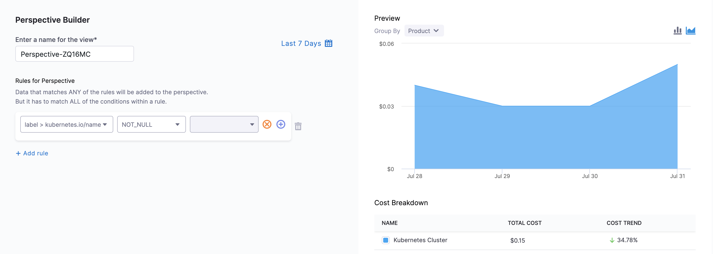
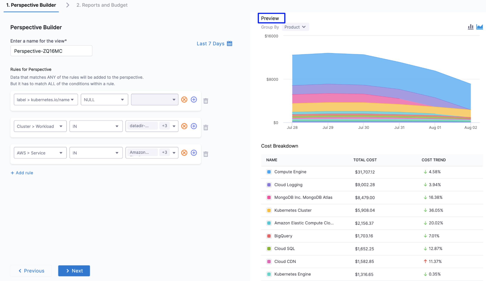

## Cloud Costs Perspective Concepts

This section describes Perspective concepts.

### Perspectives

Perspectives allow you to group your resources in ways that are more meaningful to your business needs.

For example, you can group and filter by Account, Environment, Service, Region, Product, Label, Namespace, Workload, etc., and create a Perspective for your business, finance, and engineering teams.

Here are some examples where you could use Perspectives:

* Build your own visual interface using flexible rules and filters. With Perspectives, business units can create views that align with their business needs based on groups of resources determined by different rules and filters.
* Create Perspectives broken down by project, team, department, or business unit to gain granular visibility into all your cloud environments. Perspectives provide a single-pane view of different products, for example, clusters, applications, AWS, GCP, and Azure.
* Schedule and share the reports with the key stakeholders for maximum business impact.
* Estimate costs consumed by specific teams, groups, departments, BUs, LOBs, cost centers, etc.

### Rule-based Engine

Perspectives use a rule-based engine to organize and display your cloud costs. Each Perspective has a set of rules and each rule can have multiple conditions. The following operators are supported for each condition:

* **IN**: The exact match operation is used to filter for the exact value specified.
* **NOT IN**: The exact match operation is used to filter for all values except the one specified.
* **NULL**: Null means the selected filter has no value. If you select NULL for your filter, then the cost of the selected filter isn't included in the Perspective.  
For example, in **Rules for Perspective**, if you select `Label: kubernetes.io/name` as `NULL`, then your Perspective won't include the cost for the selected label (`kubernetes.io/name`). It will include the cost of all the other resources.

  
* **NOT NULL**: Not null means that the selected filter has a value. If you choose NOT NULL for your filter, then only the cost of the selected filter is included in the perspective.  
  
For example, in **Rules for Perspective**, if you select `Label: kubernetes.io/name` as `NOT_NULL`, then your Perspective will list the cost of the selected label only (`kubernetes.io/name`). It won't include the cost of any other resource.

  
* **LIKE**: The Like operator uses `REGEXP_CONTAINS` provided by the BigQuery at the backend. This function is used to check if a given value partially matches a specified regular expression. 

  - Retrieves result even if the value partially matches the regular expression. 
  - To search for a full match (the entire value matches the regular expression), use `^` at the beginning of the regular expression and `$` at the end of the regular expression. These symbols signify the beginning and end of the text, respectively.

  For example, `AWS Account ID LIKE ‘abc’`. This means REGEXP_CONTAINS(aws_account_id, r'abc). User input is 'abc' in this example.

### Filters

You can create a Perspective for your resources using rules and filters. The filters are used to group the resources. The following are the supported filters:

* **Cost Categories**: You can create a perspective by filtering based on the cost categories you have created. To create cost categories, see [Use Cost Categories](../2-ccm-cost-categories/1-ccm-cost-categories.md).
* **AWS**: CCM allows you to view your AWS costs at a glance, understand what is costing the most, and analyze cost trends. CE displays the data for all your Amazon Web Services (ECS, EC2, and so on). For more information, see [Analyze Cost for AWS Using Perspectives](../3-root-cost-analysis/analyze-cost-for-aws.md).
* **GCP**: CCM allows you to view your Google Cloud Platform (GCP) costs, understand what is costing the most, and analyze cost trends. CE displays data for all your GCP products (such as Compute Engine, Cloud Storage, BigQuery, and so on), projects, SKUs, and location. For more information, see [Analyze Cost for GCP ​Using Perspectives](../3-root-cost-analysis/analyze-cost-for-gcp-using-perspectives.md).
* **Azure**: CCM allows you to view your Azure costs at a glance, understand what is costing the most, and analyze cost trends. CE displays the data for all your Azure services (Storage accounts, Virtual machines, Containers, and so on). For more information, see [Analyze Cost for Azure Using Perspectives](../3-root-cost-analysis/analyze-cost-for-azure.md).
* **Cluster**: Total cost, Cost trend, Idle cost, and Unallocated cost for each cluster.
* **Region**: Each AWS, GCP, or Azure region you're currently running services in.
* **Product**: Each of your active products with its cloud costs.
* **Label** and **Label V2**: Costs organized by the cloud and K8s labels that you are using to organize your Cloud instances.

### Preview

As you add your resources in the **Perspective Builder**, a **Preview** of your Perspective is displayed.

The following are the key advantages of preview:

* Provides a quick visual representation of your resources in the Perspective without saving them.
* Allows you to group resources in the preview mode itself. You can group by **Common**, **Custom** (if Custom Fields are available), **Cluster**, **AWS**, **GCP**, and **Azure**.
* Helps you to review your changes faster.

:::note
**Grouped by** Product in Preview.
:::
