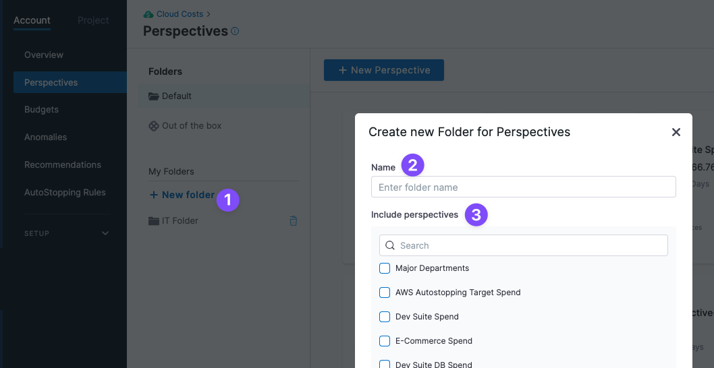
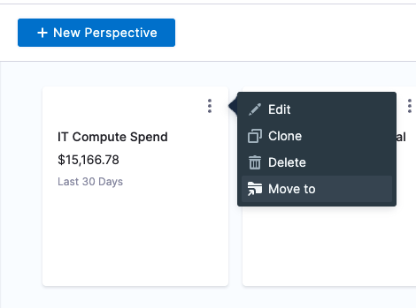

import Tabs from '@theme/Tabs';
import TabItem from '@theme/TabItem';

:::tip Important Update: Label V2 Now Available
<Tabs>
  <TabItem value="Label V2" label="Label V2">
    
## What's New with Label V2

We've upgraded from `Label` to `Label V2` to enhance your experience with the following benefits:

You can add business context to your Harness Cloud Cost Management (CCM) data using perspectives. Perspectives allow you to group your resources in ways that are more meaningful to your business needs.

You can view any perspective by clicking on it. The perspective overview page provides a comprehensive dashboard with the following information:

On the overview page you can see:
- Total cost
- Budget
- Forecasted cost
- Recommendations
- Filter
- Cost visualization graph. The interactive cost graph allows you to organize and segment your cost data using the **Group By** function. This grouping functionality determines how your costs are categorized and displayed in the visualization. You can group your data by any of the following dimensions:
    - **[Cost Categories](https://developer.harness.io/docs/cloud-cost-management/use-ccm-cost-reporting/ccm-cost-categories/ccm-cost-categories)**: Group costs by your defined cost categories
    - Any custom data source selected
    - **Cloud Provider**: View costs by cloud service provider (AWS, Azure, GCP) with provider-specific options
    - **Region**: Break down costs by geographical regions
    - **Product**: Analyze costs by specific cloud products and services
    - **Label**: Group by GCP, Azure, Cluster tags and (Harness-normalized) AWS tags 
    - **Label V2**: Group by same labels exactly as they appear in your AWS, Azure, or GCP environments. See the differences between [Label and Label V2](/docs/cloud-cost-management/use-ccm-cost-reporting/ccm-perspectives/key-concepts#understanding-the-difference-label-vs-label-v2).
    - **None**: View aggregated costs without grouping
- Preferences


## Organize Perspectives using Folders

You can organize Perspectives by adding them to folders.

Click **New folder**, name the folder, and then select the Perspectives you want to add.



You can also add a Perspective to a folder when you create it or move it to a folder when you edit it.


You can also move a Perspective to a folder from its more options (⋮) setting.



:::important note
The maximum number of folders that can be created is limited to 500.
:::

## Important: Migration from `Label` to `Label V2`

Harness CCM is transitioning from the traditional `Label` system to the enhanced `Label V2` system. **Support for the legacy `Label` system will be discontinued in the coming months**.

### Required Action

**For AWS users**: Migration to Label V2 is **mandatory**. [Learn more about the migration process](#important-migration-from-label-to-labelv2).

**For new implementations**: Always use Label V2 instead of the legacy Label system.
  </TabItem>
</Tabs>
:::

# Understanding Perspectives in Cloud Cost Management

Perspectives in Harness Cloud Cost Management (CCM) provide a powerful way to contextualize your cloud spending according to your business needs. By creating custom views of your cost data, you can gain insights that align with your organizational structure, projects, or any other business dimension.

## The Perspective Dashboard

When you select a perspective, you'll see a comprehensive dashboard that includes:

- **Financial Overview**:
  - Total cost for the selected time period
  - Budget allocation and utilization
  - Forecasted future costs
  - Cost-saving recommendations

- **Interactive Cost Visualization**: A dynamic graph that lets you analyze costs using the **Group By** function, with options to segment by:
  - **[Cost Categories](https://developer.harness.io/docs/cloud-cost-management/use-ccm-cost-reporting/ccm-cost-categories/ccm-cost-categories)**: Your custom-defined cost groupings
  - **Cloud Provider**: Breakdown by AWS, Azure, GCP with provider-specific details
  - **Region**: Geographic distribution of costs
  - **Product**: Specific cloud services and products
  - **Label**: GCP, Azure, Cluster tags and normalized AWS tags
  - **Label V2**: Cloud tags displayed exactly as they appear in your environments
  - **Custom Data Sources**: Any additional data sources you've configured
  - **None**: Aggregated view without grouping

- **Customizable Filters**: Refine your view to focus on specific aspects of your cloud spending

- **Display Preferences**: Adjust how your data is presented
## Organizing Your Perspectives

Keep your workspace tidy by organizing perspectives into folders. There's no limit to how many folders you can create.

### Creating and Managing Folders

1. **Create a New Folder**:
   - Click the **New folder** button
   - Name your folder
   - Select which perspectives to include
   
   

2. **Add Perspectives to Folders**:
   - When creating a new perspective
   - When editing an existing perspective
   
   

3. **Move Perspectives Between Folders**:
   - Click the more options menu (⋮) for any perspective
   - Select the move option
   - Choose the destination folder
   
   

## Important: Migrating from Label to Label V2

Harness CCM is transitioning to the enhanced Label V2 system, which provides better performance and more accurate representation of your cloud tags. **Support for the legacy Label system will be discontinued soon.**

### Migration Timeline and Requirements

| Cloud Provider | Migration Status | Action Required |
|---------------|------------------|----------------|
| AWS | **Immediate action required** | You must manually update all AWS Label references |
| GCP, Azure, Cluster | Pending | Automatic migration will occur after AWS migration |

### Migration Methods

#### Option 1: Using the UI

Follow this step-by-step process to migrate your perspectives:

1. **Identify Affected Components**
   - Review all perspectives using AWS Label-based grouping or filtering

2. **Update Each Component**
   - Edit the perspective
   - Find all rules, filters, or groupings using AWS Labels
   - Switch from "Label" to "Label V2"
   - Save your changes

3. **Verify Your Updates**
   - Confirm cost data appears correctly
   - Verify all label-based filters work as expected

Follow this visual guide for the migration process:

<iframe 
   src="https://app.tango.us/app/embed/44d091fd-3177-44a1-b575-1a5a8febf36d" 
   title="Migrating Label to Label V2" 
   style={{minHeight:'480px'}}
   width="100%" 
   height="100%" 
   referrerpolicy="strict-origin-when-cross-origin" 
   frameborder="0" 
   webkitallowfullscreen="webkitallowfullscreen" 
   mozallowfullscreen="mozallowfullscreen" 
   allowfullscreen="allowfullscreen"></iframe>

#### Option 2: Using the API

If you're using the API to manage perspectives, update your requests as follows:

##### For labels.value:

**Before:**
```json
{
    "field": {
        "fieldId": "labels.value",
        "fieldName": "key1",
        "identifier": "LABEL",
        "identifierName": "Label"
    },
    "operator": "IN",
    "values": ["value1"]
}
```

**After:**
```json
{
    "field": {
        "fieldId": "labels.value",
        "fieldName": "key1",
        "identifier": "LABEL_V2",
        "identifierName": "Label v2"
    },
    "operator": "IN",
    "values": ["value1"]
}
```

##### For labels.key:

**Before:**
```json
"idFilter": {
    "field": {
        "fieldId": "labels.key",
        "fieldName": "",
        "identifier": "LABEL",
        "identifierName": "Label V2"
    },
    "operator": "IN",
    "values": []
}
```

**After:**
```json
"idFilter": {
    "field": {
        "fieldId": "labels.key",
        "fieldName": "",
        "identifier": "LABEL_V2",
        "identifierName": "Label V2"
    },
    "operator": "IN",
    "values": []
}
```

**Key Change**: Replace `"identifier": "LABEL"` with `"identifier": "LABEL_V2"` in all API requests.

### Additional Resources

For detailed API documentation, refer to:
- [Creating Perspectives](https://apidocs.harness.io/tag/Cloud-Cost-Perspectives#operation/createPerspective)
- [Updating Perspectives](https://apidocs.harness.io/tag/Cloud-Cost-Perspectives#operation/updatePerspective)

### Understanding Label vs. Label V2

For more information about the differences between Label and Label V2, see the [key concepts documentation](/docs/cloud-cost-management/use-ccm-cost-reporting/ccm-perspectives/key-concepts#understanding-the-difference-label-vs-label-v2).
