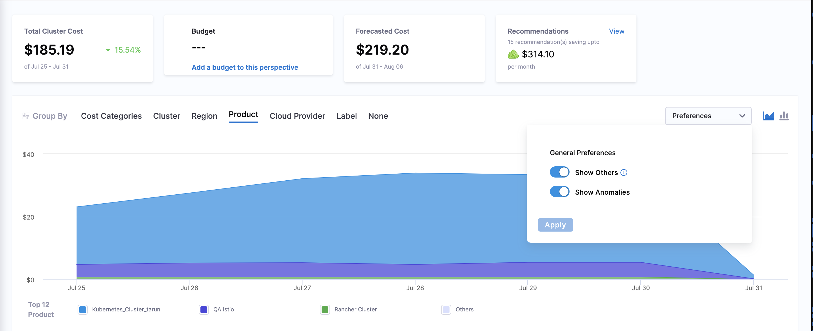
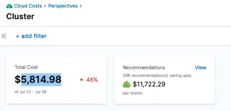

With perspective preferences, you have the flexibility to tailor the cost data presented in your perspective. You can opt to include or exclude specific cost data provided by the Cloud Service Providers (CSPs) according to your needs and requirements. This can help customize your CSP dashboard with Harness perspective view by ensuring accurate and comprehensive cost analysis.

## Default settings for perspective preferences
You can configure perspective preferences in the **Cloud Costs** > **Setup** > **Default Settings** page. You can override these settings at the perspective level if needed. The following table provides the default values of perspective preferences:  

| **General** | **AWS** | **GCP** |
| --- | --- | --- |
| Show Anomalies - Enabled | Include Discounts - Enabled | Include Discounts - Disabled |
| Show Others - Disabled | Include Credit - Enabled | Include Taxes - Enabled |
| Show Unallocated cost in Clusters - Disabled | Include Refunds - Enabled | - |
| - | Include Taxes - Enabled | - |
| - | Show costs as:<ul><li>Amortised</li><li>Net-amortised</li><li>Unblended</li><li>Blended</li><li>Effective</li></ul>Default value: Unblended | - |

  <docimage path={require('./static/default-preferences-settings.png')} width="60%" height="60%" title="Click to view full size image" />

:::important Note
Changes made to these settings affect all CCM perspectives. To ensure smooth operations, it is advisable not to update these settings frequently. If changes are necessary, it's recommended to allow a time gap of at least 5 minutes between updates. 
:::

:::important note
Even if GCP discounts are included in the default settings, the overview page will not take the discounted costs into account. In other words, any available discounts for GCP services will not be reflected in the cost calculations and summary provided in the overview section. 
:::

To edit preferences for a specific perspective: 
1. Go to **Cloud Costs**.
2. Select **Perspectives**. 
3. Select the required perspective. 
4. Open the **Preferences** dropdown.
5. Enable and disable preferences based on your requirements.
6. Select **Apply**.

  The cost data shown in the perspective chart is influenced by the set preferences. But it's important to note that for these changes to be permanent and take effect, you need to edit the perspective and update the preferences accordingly. Applying the preferences on the perspective page will not make the changes persistent. To learn how to edit a perspective, go to [Edit a perspective](https://developer.harness.io/docs/cloud-cost-management/use-ccm-cost-reporting/ccm-perspectives/create-cost-perspectives#edit-a-perspective).
## General preferences

The following preferences are applicable to all perspectives. By default, some of these preferences are enabled. However, you could choose to disable or enable these preferences in individual perspectives. 

* **Show anomalies**

 Displays the anomalies in the perspective. This option is enabled by default. For more information about cloud cost anomalies, go to [Detect anomalies](../4-detect-cloud-cost-anomalies-with-ccm.md).

* **Show others**

  The graphs displayed in a Perspective show the top 12 costs only. The remaining data is displayed as **Others**.
  **Others** is always the total cost minus the top 12 costs listed in the graph you are viewing.
  
  
    
    

* **Show "unallocated" costs on clusters**

  In certain graphs, you may come across an item labeled as **Unallocated**. This entry is included to provide a comprehensive view of all costs. When you examine the **Total Cost** in the perspective, it encompasses the costs of all items, including the unallocated cost. This option is available only in perspectives with cluster rules. For more information, go to [Unallocated Cost](https://developer.harness.io/docs/cloud-cost-management/getting-started-ccm/harness-key-cloud-cost-concepts/#unallocated-cost).
  
    
    
  The **Show "unallocated" costs on clusters** option is only available in the chart when the **Group By** is using **Cluster** and the following options are selected:
  
  * Namespace
  * Namespace ID
  * Workload
  * Workload ID
  * ECS Task
  * ECS Task ID
  * ECS Service ID
  * ECS Service
  * ECS Launch Type ID
  * ECS Launch Type

To know how to analyze your cluster perspective data, go to [Analyze cost for Kubernetes or AWS ECS](../3-root-cost-analysis/analyze-cost-for-k8s-ecs-using-perspectives.md).

## AWS preferences

When creating your perspective, the **Preferences** section allows you to include specific cost factors sourced from the AWS Cost and Usage Reports (AWS CUR). These selected cost factors will be incorporated into your perspective for a more tailored and comprehensive view of your cloud costs. 

* **Include Discounts**: Includes any discounts that AWS applied to your usage. 
* **Include Credit**: Includes any credits that AWS has applied to your bill.
* **Include Refunds**: Includes the negative charges that AWS refunded money for. 
* **Include Taxes**: Includes any taxes that AWS applied to your bill. For example, VAT or US sales tax. 
* **Show costs as**: The following are the various AWS cost types supported by Perspectives.

  * **Net amortized**

    Net amortized cost in AWS is the actual cost of using resources, accounting for upfront payments made for Reserved Instances. It evenly spreads the upfront costs over the reservation term, considers monthly fees, and includes discounts like RI volume discounts. 

  * **Blended**
  
    Blended Cost is the total cost of using AWS services, which includes both upfront and usage-based charges, divided by the total number of usage units. Blended rates are the rates associated with total usage in an organization averaged across accounts. For a line item, the blended cost is usage multiplied by the blended rate. The blended cost is the cost attributed to the account's usage as a linked account in an organization. 

  * **Unblended**
  
    A vast majority of AWS customers use the unblended cost dataset to understand their usage. This is the default cost type.Unblended cost is the direct cost incurred for using AWS services, without factoring in any upfront payments or volume discounts. Unblended rates are the rates associated with an individual account's service usage. For a line item, the unblended cost is usage multiplied by the unblended rate. The unblended cost would be the cost of the account's usage if it were a standalone account. Unblended costs represent your usage costs on the day they are charged to you. In finance terms, they represent your costs on a cash basis of accounting.
    
  * **Amortized**

    Amortized cost refers to the total upfront payment for reserved instances spread evenly over the term of the reservation. This method is used to allocate the upfront costs equally across the duration of the reservation, making it easier to analyze the cost distribution.
    
      For example, Alejandro decides to buy a Partial Upfront t2.micro Reserved Instance (RI) with a one-year term. The upfront cost for this RI is $30, which he pays at the beginning. Additionally, there is a monthly fee of $2.48 associated with the RI. In this case, the Cost Explorer chart will show Alejandro's RI costs as a spike on the first day of each month. This spike represents the monthly fee of $2.48 being charged. When Alejandro chooses "Amortized costs" in the Cost Explorer settings, it provides a different perspective on the cost data. Amortization is a process of spreading the upfront cost of a reserved instance over its duration (one year in this case). Instead of showing a large upfront cost, Amortized costs evenly distribute the upfront cost over the term of the RI. Selecting **Amortized costs** and considering a 30-day month, the Cost Explorer chart will display a daily effective rate. This daily effective rate is calculated by taking the EC2 effective rate (which is the hourly cost of running an instance) and multiplying it by the number of hours in a day. So, if the EC2 effective rate for the t2.micro instance is $0.165 per hour, the daily effective rate will be $0.165 multiplied by 24 hours, resulting in $3.96.
    
  * **Effective**

    Effective Cost, in the context of Reserved Instances (RI), is the average hourly rate obtained by combining both the upfront payment and the hourly rate. `EffectiveCost` is calculated by adding the `amortizedUpfrontCostForUsage` to the `recurringFeeForUsage`. 

#### AWS discount types supported by Harness CCM
Currently, Harness CCM considers only three types of discounts under the LineItemType:

* **BundledDiscount**: A usage-based discount that provides free or discounted usage of a service or feature based on the usage of another service or feature.

* **PrivateRateDiscount**: Discount provided by AWS for using private pricing rates. When customers negotiate custom pricing with AWS, they may receive discounted rates for specific services based on their agreement.

* **EdpDiscount**: Discounts associated with the use of AWS Enterprise Discount Program (EDP). The AWS Enterprise Discount Program offers volume-based discounts to customers who commit to certain usage levels and financial commitments with AWS.

<!--The table below provides details on the AWS `LineItemType` that is associated or utilized with each AWS cost type: 

| **AWS Cost Type**  | **Discount** | **Refund** | **Tax** | **Credit** |
| --- | --- | --- | --- | --- |
-->

To know how to analyze the AWS perspective data, go to [Analyze cost for AWS](../3-root-cost-analysis/analyze-cost-for-aws.md).

## GCP preferences
The following cost factors retrieved from your GCP Billing Export data can be included or excluded in your perspectives for a more comprehensive view of your cloud costs.
* **Include Discounts**: Includes any discounts that GCP applied to your usage. 
* **Include Taxes**: Includes any taxes that GCP applied to your bill. For example, VAT or US sales tax. This option is enabled by default.
  
To know how to analyze the perspective data, go to [Analyze cost for GCP](../3-root-cost-analysis/analyze-cost-for-gcp-using-perspectives.md).

For details about the **GCP Invoice Month** filter, go to [Add filters](https://developer.harness.io/docs/cloud-cost-management/use-ccm-cost-reporting/root-cost-analysis/analyze-cost-for-gcp-using-perspectives#option-add-filter).