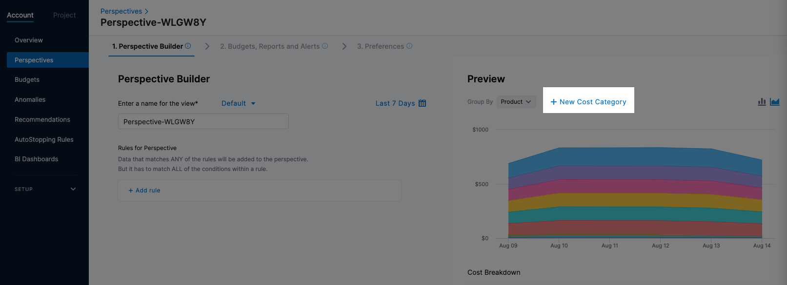
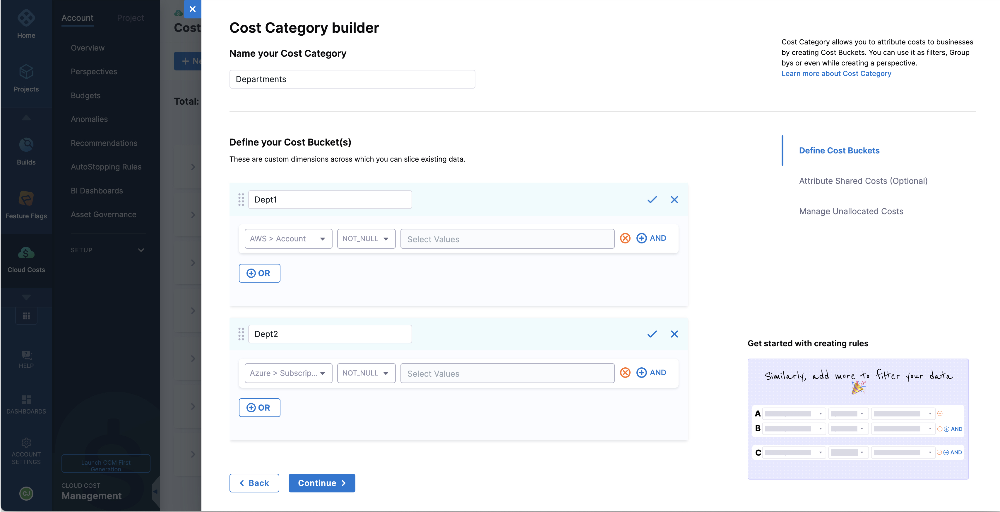
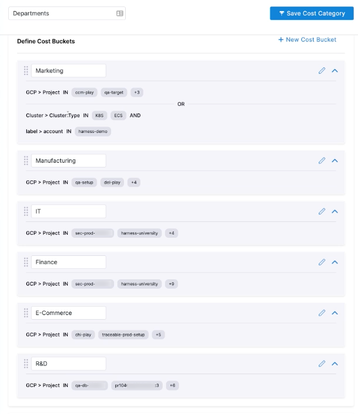
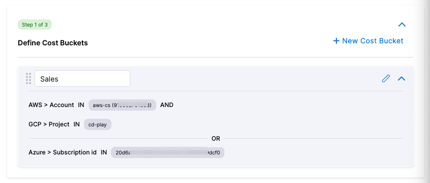
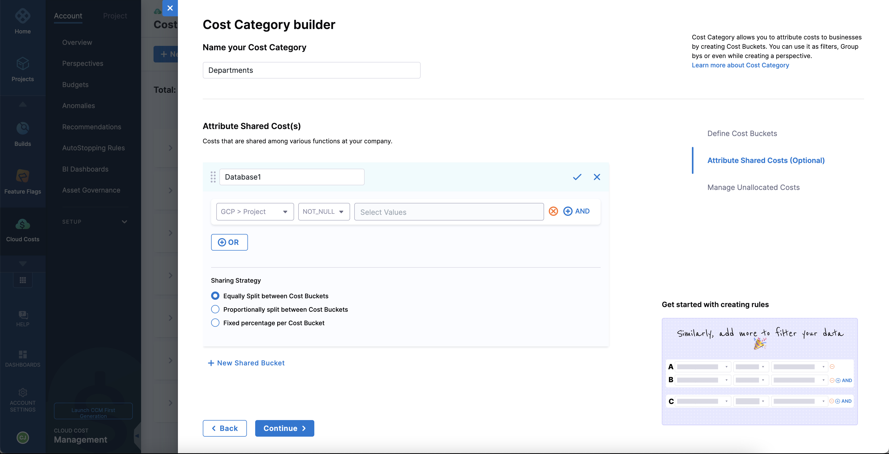
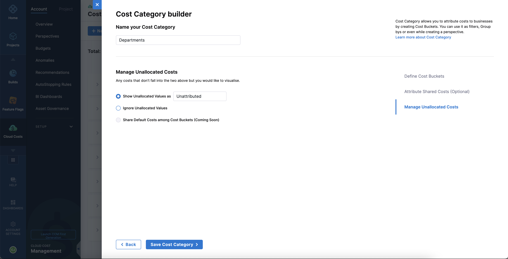
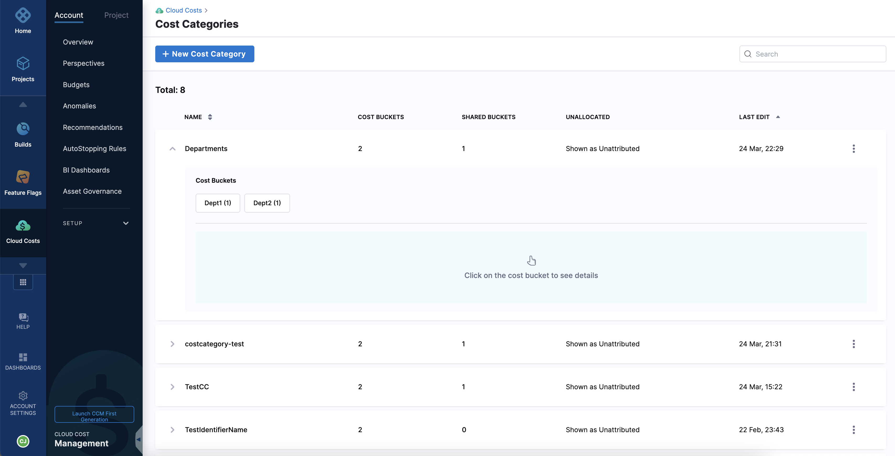

Cost categories provide an understanding of where and how your money is being spent. Cost categories allow you to take data across multiple sources and attribute it to business contexts, such as departments, teams, and other spend categories. For example, if your business is organized by teams with multiple accounts, you can create a Cost Category named Teams and map costs to each team from all your accounts. The cost category called Teams shows you what each team is spending across AWS, GCP, Clusters, etc. You could drill down further into the cost data available for every item in your cost category. For example, in a cost category called Teams, you could view cost data for a particular team (cost bucket) such as Operations. You can then use Cost Categories in CCM Perspectives to filter across accounts, products, etc.

Apart from viewing costs based purely on different data sources (AWS, GCP, Clusters, etc.) without context, cost categories allow you to view spending across these data sources according to different business contexts and help you gain useful insights.

## How does it work?

1. **Create cost categories** — Allows you to categorize based on business requirements and get a contextual view of your expenses.
2. **Create cost buckets** — A cost category is composed of one or more buckets. A bucket is one or more filters that collect data from a data source. For example, a Cost Category called Departments would have a separate cost bucket for each department. Each bucket collects the data sources that belong to each department.​
3. **Create shared buckets** — You can create a shared bucket to share the cost across cost buckets in a given category. For example, let us consider the cost category Departments — the cost incurred in maintaining a database is attributed to multiple departments in an organization. So, you can create a shared bucket named Database Cost (enter a name that's relevant to your scenario) and define the rules and conditions to visualize cost data as per your requirement. You could choose to split this cost equally between all the cost buckets, or you could split the cost proportionally based on usage, or you could allocate a fixed percentage of cost for each cost bucket.​
4. **View your expense data** — After creating Cost Categories, you can use them in Perspective filters and Group By. You can even use Cost Categories to define Perspectives. The Cost Categories used in Perspectives are updated separately from the Perspectives. This allows you to update a single Cost Category and have the result automatically reflected in all the Perspectives that use that Cost Category.

If there are items that don't belong to any of these cost categories, the cost associated is displayed as unallocated costs.

## Prerequisites and permissions

To use cost categories, your Harness user account must belong to a user group with the following role permissions:

* **Cloud Cost Management**: **Cost Categories**: **Create/Edit**

For more details, go to [CCM Roles and Permissions](../../2-getting-started-ccm/5-access-control/ccm-roles-and-permissions.md).

## Visual summary

How to create a Cost Category:
<!-- Video:
https://harness-1.wistia.com/medias/rpv5vwzpxz-->
<docvideo src="https://www.youtube.com/watch?v=zbmWB0yUN4s" />

How to use a Cost Category:
<!-- Video:
https://harness-1.wistia.com/medias/rpv5vwzpxz-->
<docvideo src="https://www.youtube.com/watch?v=2gqvz47efuQ" />

## Create cost categories

To create a cost category perform the following steps:

1. In your Harness application, go to **Cloud Costs**.
2. Go to **Setup**, and then select **Cost Categories**.
3. Select **New Cost Category**.

You can also create a new cost category when you create a perspective.

The new cost category appears.

4. In the new cost category, enter a name. For example, if this cost category is for departments, you could name it **Departments**.

  

### Create cost buckets
1. Select **New Cost Bucket**.
2. Enter a name for the cost bucket, such as the name of a department.
3. Define the rules (data sources) for the cost bucket. You could add multiple conditions to this rule using the AND operator.  
Add a new row for each rule until the cost bucket correctly includes all costs incurred. These rules are defined using the OR operator. You can add another cost category as a rule when defining your cost buckets.

   
:::important important
* You cannot include a nested cost category as a rule within another cost category if either of these cost categories contains a shared bucket.

 To illustrate, consider the scenario of creating a cost category, `CC1`, which includes a cost bucket, `CB1`. While defining the cost bucket rules for `CB1`, if you intend to nest a cost category, `CC2` that contains a cost bucket, `CB2`, you must ensure that neither `CC1` nor `CC2` includes a shared cost bucket.
* You cannot add the same cost category as a rule in the cost bucket.
* You cannot create cyclic nested cost categories, where a cost category is nested within each other.

 Consider an example where you have a cost category named `CC1`, which includes a cost bucket called `CB1`. Additionally, you have another cost category named `CC2`, which includes a cost bucket called `CB2`. When defining the cost bucket rules, it is essential to avoid adding `CC2` as a rule in `CC1` and adding `CC1` as a rule in `CC2`. Similarly, it is not allowed to create a nested structure where CC1 nests CC2, which in turn nests CC3, then CC4, and finally circles back to CC1.
* You can nest cost categories to a maximum of 20 levels.
:::

Typically, you want to create multiple cost buckets in the cost category. For example, if the Cost Category is for departments, you would create a cost bucket for each department such as finance, operations, facilities, and so on.

  

**AND and OR**  
The AND and OR operators are used to filter data based on more than one condition:

 * AND: use AND to filter data sources that include both criteria.
 * OR: use OR to filter data sources that include one of the criteria. You can use AND and OR together.
  
    

:::important note
You can create a maximum of 1000 cost buckets.
:::

### Create shared cost buckets

1. Select **+ New Shared Bucket**.
2. Enter a relevant name for the shared bucket.
3. Define rules and conditions as per requirement.
4. Select the sharing strategy.  
For example, consider two cost targets named team A and team B. These two teams use the same database. To enable sharing of cost between these two teams, you need to create a shared cost bucket named sharedDB (enter a name that relates to the shared bucket).
  * **Equally**: This option enables sharing of the shared bucket cost equally (50%) between both teams A and B. You can view it in the grid and chart.
  * **Proportionally**: This option enables sharing of the shared bucket cost proportionally between both teams. If the cost for team A is $60 and that of team B is $40. Then, 60% of DB cost is borne by team A and 40% by team B.
  *  **Fixed percentage**: This option allows the distribution of the cost of the shared bucket by a fixed percentage between cost buckets. For example, 30% to team A and 70% to team B.

  
  
   
:::important note
You can create a maximum of 10 shared cost buckets.
:::

### Manage unallocated costs

When used in a Perspective as a filter or **Group By**, the Cost Category shows data that matches its filters.

Unallocated Costs are costs that do not match the Cost Categories in the Perspective graph and rows.

In **Manage Unallocated Costs**, you can choose to show or ignore unallocated costs, and choose a name for how those costs are displayed.

  

Save the cost category. Now, you can view the cost bucket details in a cost category on the **Cost Categories** page.

  

  

