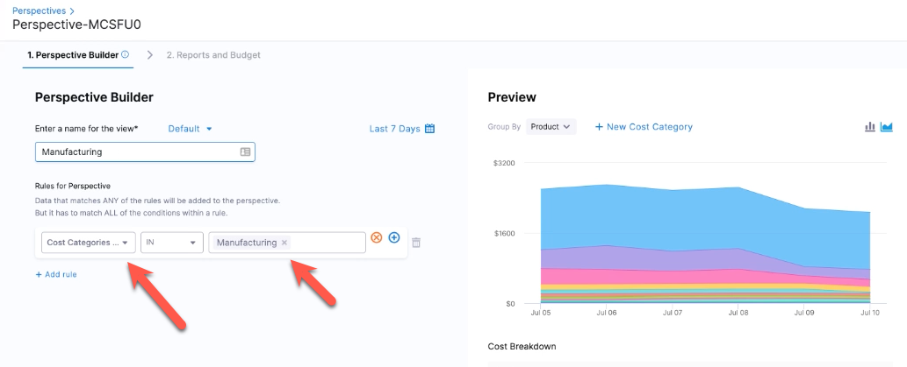

You can use cost categories in both perspectives and dashboards. When you create or modify a cost category, the changes are immediately reflected in perspectives, including historical data. However, in Dashboards, it may take up to 24 hours for the changes to be reflected on the current month or the last three days' data, depending on the cloud service provider.

## Use cost categories in perspectives

The cost categories can be used in perspectives in the following ways.

### Group By

Consider the following scenario where the Perspective rule has a cost category:

| **Cost category** | **Cost bucket** | **Shared Cost buckets** |
| --- | --- | --- |
| CC1 | <ul><li>B1 - AWS</li><li>B2- GCP</li></ul> | <ul><li>SB1 - AWS</li><li>SB2 - GCP</li> </ul>|

In this setup, if you group the Perspective by `AWS > Account`, the cost of B1 and SB1 are displayed against the respective AWS accounts. However, the total cost of the cost bucket B2, and the shared cost bucket SB2 in GCP are displayed under **No Account**. 

   

Consider the following scenario with two cost categories:

 **Cost category** | **Cost bucket** | **Shared cost buckets** |
| --- | --- | --- |
| CC1 | <ul><li>CB1 - AWS1 - $10, AWS7 - $20</li><li>CB2- AWS2 - $20</li></ul> | <ul><li>SB1 - AWS3 - $30</li><li>SB2 - AWS4 - $40</li> </ul>|
| CC2 | <ul><li>CB3 - AWS1 - $10</li><li>CB4- AWS2 - $20</li></ul>| <ul><li>SB3 - AWS5 - $30</li><li>SB4 - AWS6 - $40</li> </ul>|

If you have added CC1 (CB1, CB2, and Unattributed) in your Perspective rule and grouped by the same cost category, then the Perspective displays the following costs:

|Name | Total Cost|
| --- | --- |
| CB1 | $30 + shared cost (SB1 and SB2) |
| CB2 | $20 + shared cost (SB1 and SB2) |
| Unattributed | The sum of all the other costs |

If you have added CC1 (CB1, CB2, and Unattributed) in your Perspective rule and grouped by the cost category CC2, then the Perspective displays the following costs:

| Name|Total Cost |
| --- | --- |
| CB3 | $10 + shared cost (SB3 and SB4) |
| CB4 | $20 + shared cost (SB3 and SB4) |
| No CC2 | $20 + shared cost (SB1 and SB2) |
| Unattributed | The sum of all the other cost |

Here, the _No CC2_ cost includes the costs that are not in CC2 but in CC1. 

### Filter

Select one or more cost categories as a filter.

You can use Group By and filters together. For example, your filter could select **Manufacturing** from the Department Cost Category, and then you can select **GCP: SKUs** in **Group By**.

:::caution
When including multiple cost categories in your filter, it is important to check for any shared cost buckets between them. If you have shared cost buckets with overlapping rules in both cost categories, the cost of these buckets is counted twice, resulting in duplication of costs. Therefore, it is recommended not to have multiple cost category filter in a Perspective. However, if you must add a multiple cost category filter, avoid overlapping shared cost buckets between cost categories to prevent any potential errors.
:::

### Perspective rule

When creating a Perspective, you can define a rule using cost categories.

The benefit of using a cost category as a rule in a Perspective is that the cost category definition is separated from all the Perspectives that use it.

If you modify the definition of a cost category, any Perspective that uses the cost category automatically displays the changes.

For example, if a new product is added to the Manufacturing department, you can simply update the Manufacturing bucket in the Departments Cost Category, and that change is automatically reflected in all the Perspectives that use that Cost Category.

Consider the following scenario where the Perspective rule has two cost categories:

 **Cost category** | **Cost bucket** | **Shared buckets** |
| --- | --- | --- |
| CC1  | <ul><li>B1 - AWS1</li><li>B2- GCP1</li></ul> | <ul><li>SB1 - AWS2</li><li>SB2 - GCP2</li> </ul>|
| CC2  | <ul><li>C1 - AWS1</li><li>C2- GCP1</li></ul> | <ul><li>SB1 - AWS2</li><li>SB2 - GCP2</li> </ul>| 

 In this scenario, if you choose to include both cost categories in your Perspective rule, the total cost of the cost buckets in both categories is counted only once. However, the cost of the shared buckets between the two categories is duplicated because of overlapping rules. Therefore, it is recommended to avoid using multiple cost categories with overlapping shared cost buckets in your perspective rule to prevent any potential errors.

## Use cost categories in dashboards

You can visualize cost categories in your custom dashboard. To learn how to create a custom dashboard, go to [Create Dashboards](../../../platform/dashboards/create-dashboards.md).

**Cost Categories** is available in the **Unified** explore on the **Dashboards** page. 

  <docimage path={require('./static/cost-categories-dashboards.png')} width="40%" height="40%" title="Click to view full size image" />

* When you create a new cost category or make changes to an existing one, it may take up to 24 hours for the changes to be reflected in the dashboard data.
* If you are using AWS or Azure, cost categories update the data fetched from the current month onwards through CUR and Billing Exports. It is not applied to historical data. On the other hand, if you are using GCP, cost categories update the data that is equal to or more recent than the last three days' data.
* When you delete a cost category, the deleted category remains visible in the dashboard until the end of the month, as it is applied to data for the ongoing month. For instance, if you delete a cost category on January 24th, the category is visible in the dashboard until the end of January 31st.
* Shared cost buckets are ignored when you add cost category context.

:::note
In AWS, you cannot use cost categories as a dimension in custom dashboards if you have selected any of the following fields in the explore:

- Resource ID 
- Line Item Type 
- Market Type 
- Amortised Cost 
- Net Amortised Cost 

:::

## Behaviour

Below is the table where we have outlined the contrasting behavior of cost categories in Perspective and Dashboard.

<table width="900" cellspacing="0" cellpadding="0">
    <tr>
        <td width="300"><b></b></td>
        <td width="600"><b>Perspective</b></td>
        <td width="600"><b>Looker/Dashboard</b></td>
    </tr>
    <tr>
        <td>Using and Grouping Cost Category</td>
        <td>We can utilize cost categories as rules to create perspectives. Additionally, we can perform groupBy operations on any cost category to view the costs associated with each cost bucket.</td>
        <td>Users have the ability to select the columns on which they want to perform groupBy operations. This allows them to view the costs associated with each cost bucket for a specific cost category.</td>
    </tr>
    <tr>
        <td>Filtering Cost Category</td>
        <td>Users have the capability to apply filters on cost categories and specific cost buckets they want to see. These filters can be applied either in the rules section or in the filter panel.</td>
        <td>Users have the flexibility to apply filters on any columns supported in the BigQuery table. This allows them to filter cost categories or cost buckets based on their specific criteria.</td>
    </tr>
    <tr>
        <td>Shared Cost</td>
        <td>If a shared bucket is specified in the cost category used in rules or groupBy, the cost of the shared bucket will be divided and allocated among the respective cost buckets based on the sharing strategy.</td>
        <td>Not Supported.</td>
    </tr>
    <tr>
        <td>Nested Cost Category</td>
        <td>Supported.</td>
        <td>Supported.</td>
    </tr>
    <tr>
        <td>Cluster Data</td>
        <td>Supported. Users have the capability to create cost categories with cluster rules. These cost categories can be used in cluster perspectives.</td>
        <td>Not Supported. Currently, we are updating the cost category exclusively for the cloud provider data only.</td>
    </tr>
    <tr>
        <td>
            Behaviour 
        </td>
        <td>
            If there is an update in the cost category rule, we will utilize the updated rules to display the cost accordingly, even for past data.
        </td>
        <td>
        cWe keep track of cost category changes on a monthly basis and update data accordingly for that month.
          <b>Caveat:</b> For GCP data, we update the data for last 3 days only.
        </td>
    </tr>
</table>

## See Also

* [Create Cost Perspectives](../../3-use-ccm-cost-reporting/1-ccm-perspectives/1-create-cost-perspectives.md)

