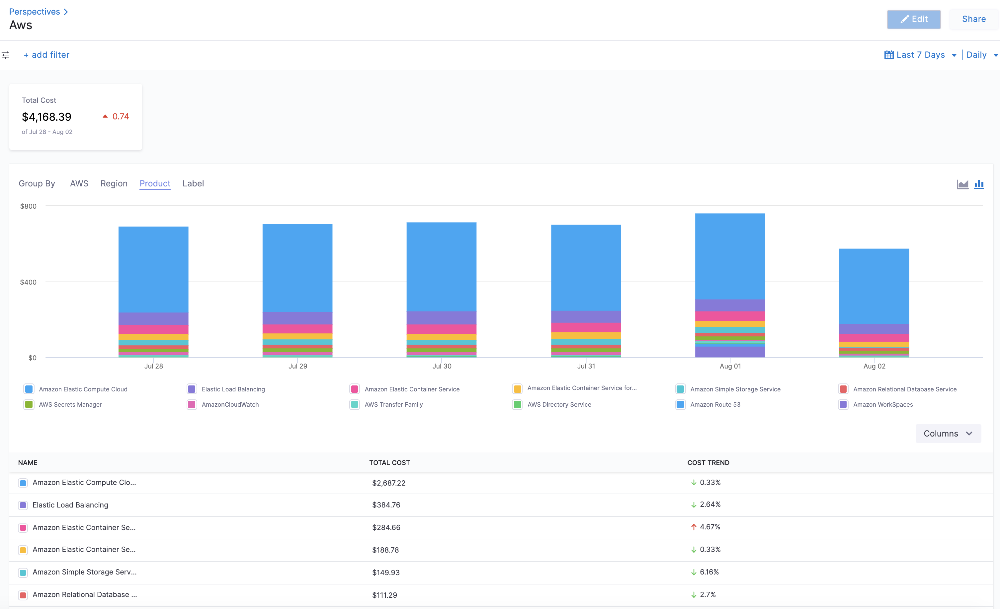
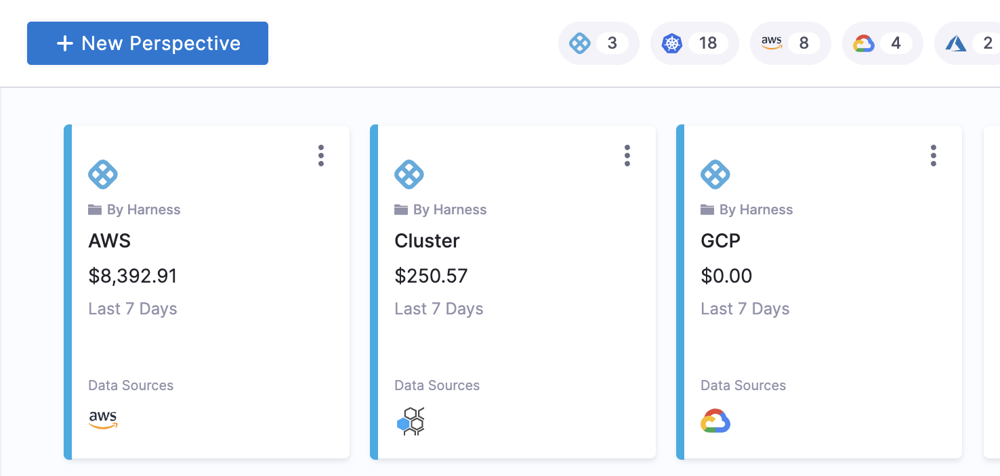
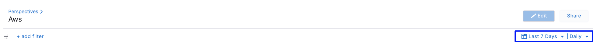

# Analyze cost for AWS

Harness Cloud Cost Management (CCM) allows you to view your AWS costs at a glance, understand what is costing the most, and analyze cost trends. CCM perspectives display cost data of all your Amazon Web Services (ECS, EC2, and so on) and also helps you get details of:

* AWS cloud cost spending trend
* AWS service costing the most in the selected time range, for example, EC2 spent last month
* Primary cost contributor, for example, region, account, instance type, or usage type
* AWS spending by region, for example, US East or US West

### Before You Begin

* [Set Up Cloud Cost Management for AWS](../../2-getting-started-ccm/4-set-up-cloud-cost-management/set-up-cost-visibility-for-aws.md)

### Analyze AWS Cost

The Perspectives provide deep insights into your AWS costs. The costs include all the applicable credits and discounts.

1. In **Cloud Costs**, select **Perspectives**, and then select **AWS**. The AWS services are displayed.
   
     
2. Select the date range for the costs you want to analyze.
   
     

3. You can use the following group-by options:

  * **Cost Categories**: Each [cost category](../2-ccm-cost-categories/1-ccm-cost-categories.md) that you have created based on your business requirements.
  
  * **AWS**: Under AWS, you can group by the following entities:
  
    + **Service**: Each of your active [AWS services](https://aws.amazon.com/) is displayed.

		<docimage path={require('./static/aws-services-groupby.png')} width="60%" height="60%" title="Click to view full size image" />

	+ **Account**: Each AWS account you are using to connect Harness to AWS via a Harness AWS Cloud Provider. The chart displays the account name and the account ID. If the account name is unavailable, it displays only the account ID.   
		
		 <docimage path={require('./static/analyze-cost-for-aws-09.png')} width="60%" height="60%" title="Click to view full size image" />
		 
	+ **Instance Type**: Each [Amazon EC2 instance type](https://aws.amazon.com/ec2/instance-types/) you are using.
	
	  <docimage path={require('./static/instance-type-groupby.png')} width="60%" height="60%" title="Click to view full size image" />
	  
	+ **Usage Type**: Usage types are the units that each service uses to measure the usage of a specific type of resource. For example, the BoxUsage:t2.micro(Hrs) usage type filters by the running hours of Amazon EC2 t2.micro instances.

	  <docimage path={require('./static/usage-type-groupby.png')} width="60%" height="60%" title="Click to view full size image" />

	+ **Billing Entity**: Helps you identify whether your invoices or transactions are for AWS Marketplace or for purchases of other AWS services. For more information, go to [Billing Entity](https://docs.aws.amazon.com/cur/latest/userguide/billing-columns.html).

	  <docimage path={require('./static/aws-billing-entity-groupby.png')} width="60%" height="60%" title="Click to view full size image" />

	+ **Line item Type**: Each line item type refers to the different types of charges applicable to your setup. For more information, go to [Line Item details](https://docs.aws.amazon.com/cur/latest/userguide/Lineitem-columns.html).

	  <docimage path={require('./static/aws-lineitemtype-groupby.png')} width="60%" height="60%" title="Click to view full size image" />

  * **Region**: Each AWS region you are currently running services in.
  * **Product**: Each of your active products with its cloud costs.
  * **Label**: Each label that you assign to your AWS resources. You can select a label name to get more granular details of your label. For more information, go to [Tagging your AWS resources](https://docs.aws.amazon.com/general/latest/gr/aws_tagging.html). For tags to appear in the Perspective, you must activate the user-defined cost allocation tags in the AWS Billing and Cost Management console. For more information, go to [Activating User-Defined Cost Allocation Tags](https://docs.aws.amazon.com/awsaccountbilling/latest/aboutv2/activating-tags.html). CCM updates the tag keys as follows:
	+ For the user-defined tags, `user_` prefix is added.
	+ For the AWS system tags, `aws_` prefix is added.
	+ The characters that do not follow regex `[a-zA-Z0-9_]` are changed to `_`.
	+ The tags are case-sensitive. If the tags are specified as `UserName` and `username`, then the number suffix `_<Number>`is added to the tag. For example, `UserName` and `username_1`.

### Add filters

Perform the following steps to add filters.

1. In **Cloud Costs**, select **Perspectives**, and then select **AWS**.
2. Select **add filter**.
   
3. Select AWS, Region, Product, Cloud Provider, or Label.
4. Select the operator. The supported operators are:
	* **IN**: Applies a filter to include only entries with the provided value.
	* **NOT IN**: Applies a filter to exclude entries with values that match the specified value.
	* **NULL**: Applies a filter to show only entries where the designated filter or field is empty.
	* **NOT NULL**: Applies a filter to display only entries where the designated filter has a value.
	* **LIKE**: Applies a filter to show entries with conditions that precisely match the specified pattern.
5. Select a value for your filter. You can select multiple values. You can also filter and customize your result using the search option.

  <docimage path={require('./static/analyze-cost-for-aws-11.png')} width="60%" height="60%" title="Click to view full size image" />

### Next Steps

* [Create Cost Perspectives](../../3-use-ccm-cost-reporting/1-ccm-perspectives/1-create-cost-perspectives.md)

