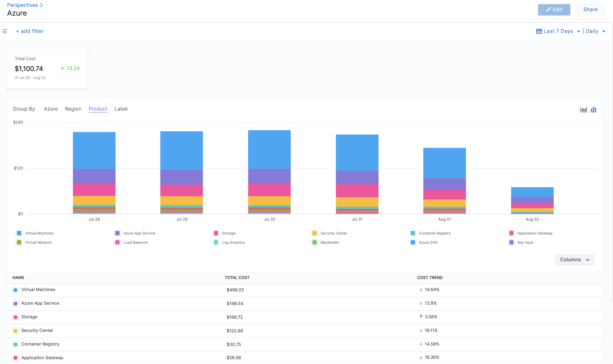
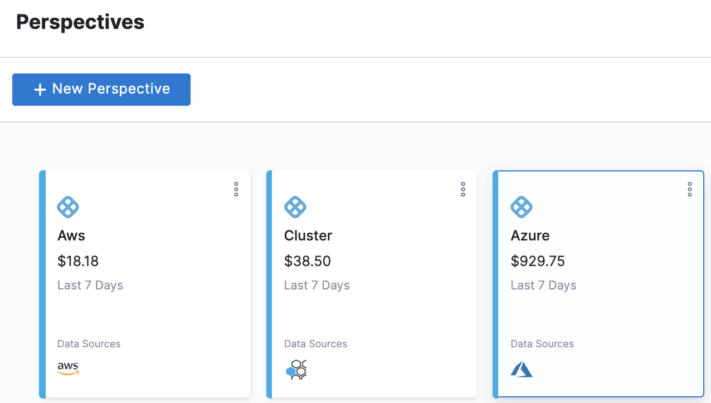
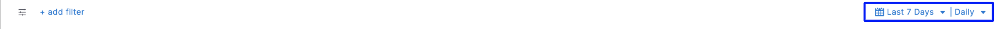
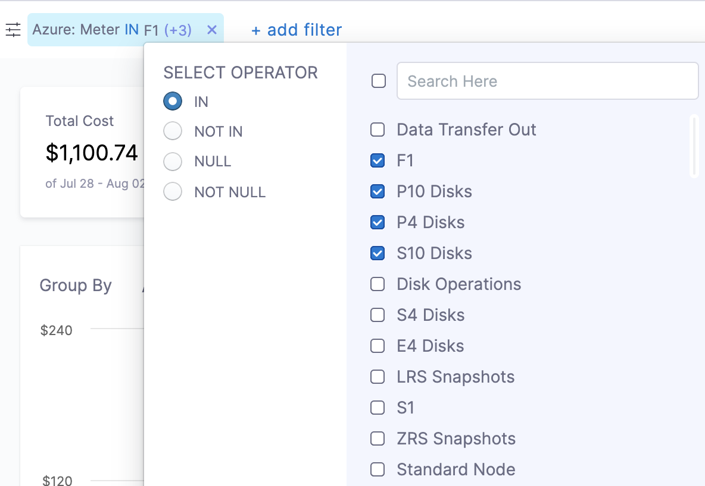

# Analyze cost for Azure 

Harness Cloud Cost Management (CCM) allows you to view your Azure costs at a glance, understand what is costing the most, and analyze cost trends. CCM Perspectives displays the data for all your Azure services (Storage account, Virtual machines, Containers, and so on) and also helps you get details of:

* Azure cloud cost spending trend
* Azure service costing the most in the selected time range, for example, Load Balancer
* Primary cost contributor, for example, region, service, or resource
* Resources that cost the most in the selected time range
* Azure spending by region, for example, US East or US West

### Before You Begin

* [Set Up Cloud Cost Management for Azure](../../2-getting-started-ccm/4-set-up-cloud-cost-management/set-up-cost-visibility-for-azure.md)

### Analyze Azure Cost

The Perspectives provides deep insights into your Azure costs. The cost includes all the applicable credits and discounts.

1. In **Cloud Costs**, select **Perspectives**,and then select **Azure**. The Azure services are displayed.
   
     
2. Select the **date range** for the costs you want to analyze.
     

3. You can use the following options to **Group By**:
	* **Azure**: Under Azure, you can Group by:
		+ **Resource group name**: Resource group is a container that holds related resources that you want to manage as a group. Grouping by resource group name shows the cost of various resource groups present in your account.
		+ **Meter category**: This is the cost of the meter, for example, Cloud services, Networking, etc.
		+ **Meter subcategory**: This is the cost of the subcategory of meter, for example, A6 Cloud services, ExpressRoute (IXP), etc.
		+ **Resource GUID**: The cost of your Resource GUIDs. The Resource GUID is a unique alphanumeric string that represents each resource for programming purposes.
		+ **Meter**: Cost of the resources' usage.  The meters track the resources' usage and generate a usage record that is used to calculate your bill. For example, you provision a virtual machine in Azure. Some meters that track its usage include: Compute Hours, IP Address Hours, Data Transfer In, Data Transfer Out, Standard Managed Disk, Standard Managed Disk Operations, Standard IO-Disk, Standard IO-Block Blob Read, Standard IO-Block Blob Write, Standard IO-Block Blob Delete.
		+ **Resource type**: The cost of resource instances.
		+ **Service name**: Cost of Azure service, for example, Virtual Machines, Azure App Service, Azure DNS, etc.
		+ **Service tier**: This is the cost of Azure services having service tiers. For example, VMs, Dv3, and Dsv3.
		+ If your Azure billing export contains the Azure usage and charges information, then the following details are listed:
			- **Subscription name**: Name of the subscription.
			- **Publisher name**: Publisher for Marketplace services.
			- **Publisher type**: Type of publisher. Break down Microsoft/Azure, Marketplace, and AWS costs.
			- **Reservation ID**: Unique identifier for the purchased reservation instance. Azure Reservations help you save money by committing to one-year or three-year plans for multiple products. Committing allows you to get a discount on the resources you use. See [Manage Reservations for Azure resources](https://docs.microsoft.com/en-us/azure/cost-management-billing/reservations/manage-reserved-vm-instance).
			- **Reservation name**: Name of the purchased reservation instance.
			- **Frequency**: Indicates whether a charge is expected to repeat. Charges can either happen once (OneTime), repeat on a monthly or yearly basis (Recurring), or be based on usage (UsageBased).
	* **Region**: Each Azure region you are currently running services in.
	* **Product**: Each of your active products with its cloud costs.
	* **Label**: Each label that you assign to your Azure resources. You can select a label name to get further granular details of your label.

### Add filters

Perform the following steps to add filters.

1. In **Cloud Costs**, select **Perspectives**, and then select **Azure**.
2. Select **add filter**. 
3. Select Azure, Region, Product, Cloud Provider, or Label.
4. Select the operator. The supported operators are:
	* **IN**: Applies a filter to include only entries with the provided value.
	* **NOT IN**: Applies a filter to exclude entries with values that match the specified value.
	* **NULL**: Applies a filter to show only entries where the designated filter or field is empty.
	* **NOT NULL**: Applies a filter to display only entries where the designated filter has a value.
	* **LIKE**: Applies a filter to show entries with conditions that precisely match the specified pattern.
5. Select a value for your filter. You can select multiple values. You can also filter and customize your result using the search option.
   
     

### Next Steps

* [Create Cost Perspectives](../1-ccm-perspectives/1-create-cost-perspectives.md)

