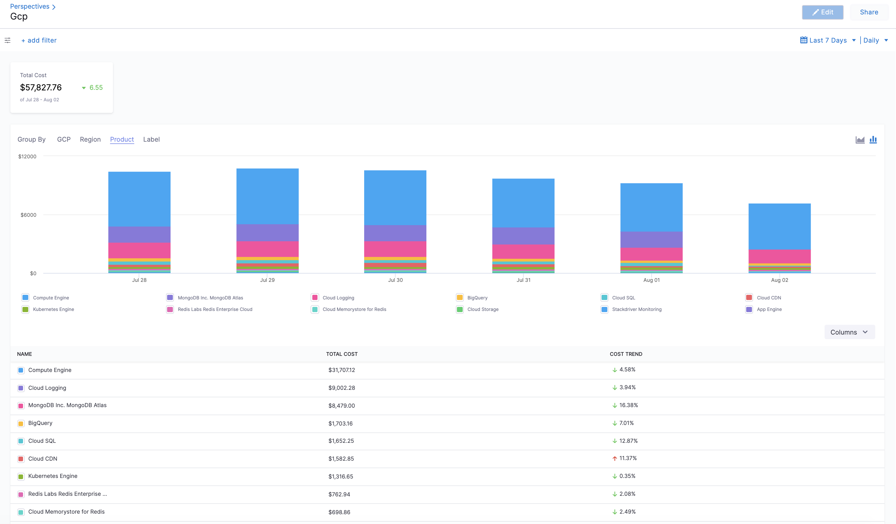
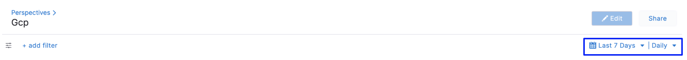

# Analyze cost for GCP 

Harness Cloud Cost Management (CCM) provides you with a comprehensive view of your Google Cloud Platform (GCP) costs. It enables you to gain insights into the major cost drivers and analyze cost trends effectively. Harness CCM displays data for all your GCP products, including Compute Engine, Cloud Storage, BigQuery, and more. It covers costs associated with projects, SKUs, locations, and labels, offering valuable details on various cost aspects. 
* GCP cloud cost spending trends: You can easily track how your costs have evolved over time and identify any significant changes in spending patterns.
* Cost Analysis for GCP Products: Harness CCM allows you to identify the GCP products that incurred the highest costs within a selected time range. For example, you can easily determine the total cost of Compute Engine usage over the past week.
* Primary Cost Contributors: With Harness CCM, you can pinpoint the key cost contributors, such as specific products, projects, SKUs (Stock Keeping Units), or regions. This helps you understand which factors are driving the majority of your GCP spending.
* GCP Spending by Region: Harness CCM provides detailed information on GCP costs categorized by regions, such as "us-west1" or "us-east4." 
  
    

:::important note
Time periods in the GCP Cloud Billing report use the Pacific Time Zone (PST) and observe daylight saving time shifts. However, Harness CCM explorer uses the UTC time zone. You may notice some cloud cost differences between Harness CCM explorer and the GCP Cloud Billing report due to the time zone difference.
:::

### Before You Begin

* [Set Up Cloud Cost Management for GCP](../../2-getting-started-ccm/4-set-up-cloud-cost-management/set-up-cost-visibility-for-gcp.md)

### Step: Analyze GCP Cost

The **Perspectives** page provides deep insights into your GCP costs. The cost includes all the applicable discounts.

1. In **Cloud Costs**, select **Perspectives**, and then select **GCP**. The GCP products are displayed.
   
     
2. Select the **date range** for the costs you want to analyze.
   
     
3. You can use the following options to Group By:
	* **GCP**: Under GCP, you can Group by:
		+ **Products**: Each of your active products with their cloud costs is displayed.
		+ **Projects**: Each of your Cloud projects with their cloud costs is displayed.
		+ **SKUs**: Each [SKU](https://cloud.google.com/skus) you are using.
	* **Region**: Each GCP region you are currently running services in.
	* **Product**: Each of your active products with its cloud costs.
	* **Label**: Each [label](https://cloud.google.com/resource-manager/docs/creating-managing-labels) that you are using to organize your Google Cloud instances.

### Option: Add Filter

Perform the following steps to add filters.

1. In **Cloud Costs**, select **Perspectives**, and then select the GCP perspective.
2. Select **add filter**.

 <docimage path={require('./static/analyze-cost-for-gcp-using-perspectives-15.png')} width="40%" height="40%" title="Click to view full size image" />
   

3. Select **GCP**.
4. Select from the following filter options. You can add more than one filter.

  - **Invoice Month**: Specific billing time frame during which usage of GCP resources and services is recorded, and the corresponding charges are calculated.
  - **Product**: The various cloud services and offerings provided by GCP. 
  - **Project**: A fundamental organizational unit that allows you to manage and organize your cloud resources.
  - **SKUs**: Stock Keeping Unit (SKU) is a unique identifier used to represent specific types or configurations of cloud resources and services offered by Google. Each SKU corresponds to a particular product, service plan, or pricing option available in GCP.

:::important note
   - If you select the **Invoice Month** filter, the time filter option in the perspective is disabled. 
   - If you Group By on **GCP: Invoice Month**, then the data in the grid and chart will be presented in `yyyymm` format.
:::

  <docimage path={require('./static/disabled-time-filter.png')} width="60%" height="60%" title="Click to view full size image" />

5. Select the operator. These operators are displayed depending on the selected filter. For example, for the Invoice Month filter, the only operator is IN. 

 The supported operators are:
	* **IN**: The exact match operation is used to filter for the value specified.
	* **NOT IN**: The exact match operation is used to filter for the value that is not specified.
	* **NULL**: The specified filter or field has no value.
	* **NOT NULL**: The specified filter has a value.
	* **LIKE**: Includes the cost of all items that matches the specified condition.
6. Select value for your filter. You can select multiple values. You can also filter and customize your result using the search option.
   
     <docimage path={require('./static/analyze-cost-for-gcp-using-perspectives-16.png')} width="60%" height="60%" title="Click to view full size image" />

### Next Steps

* [Create Cost Perspectives](../1-ccm-perspectives/1-create-cost-perspectives.md)

