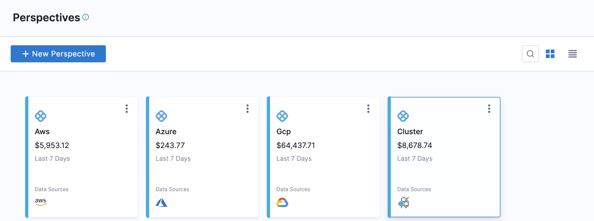
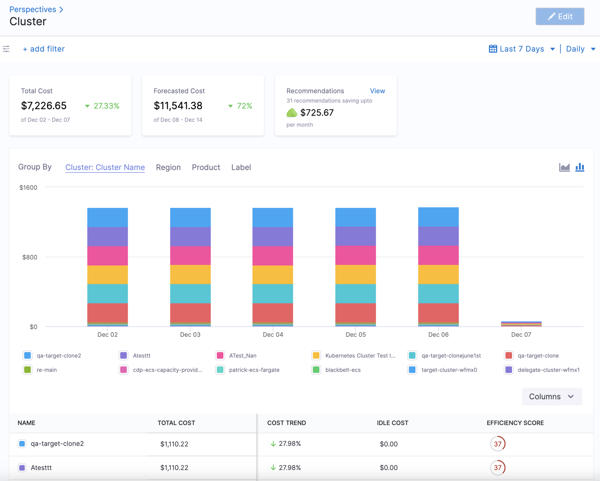
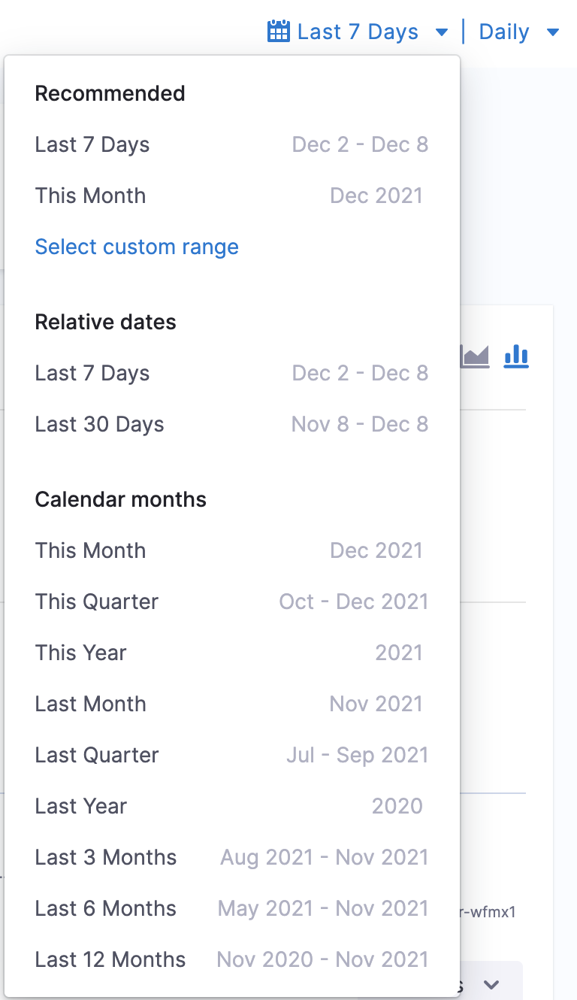
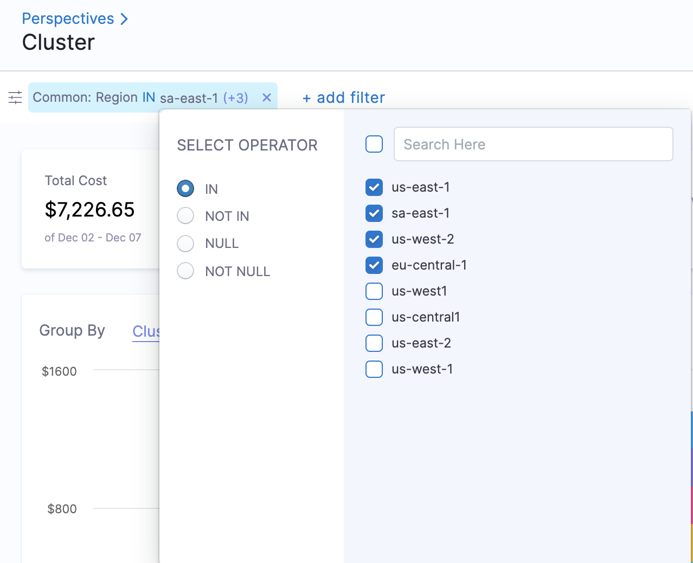

# Analyze cost for Kubernetes or AWS ECS

Harness Cloud Cost Management (CCM) allows you to view your cloud costs at a glance, understand what is costing the most, and analyze cost trends. CCM displays the data for all your resources and also provides the following details:

* Cloud cost spend trend
* Cluster or Harness Application costing the most in the specified time range
* Idle cost across clusters or Applications
* Primary cost contributors, for example, Kubernetes or ECS cluster, namespace, node/instances, workload/task, or label
* Forecast future costs based on historical trends
* Cost of resources by label
* Primary cost contributors, for example, Harness Service (microservices), Environment (infrastructure), or Tags (components tagged using Harness Tags)

### Before You Begin

* [Set up Cloud Cost Management for Kubernetes](../../2-getting-started-ccm/4-set-up-cloud-cost-management/set-up-cost-visibility-for-kubernetes.md)

### Step: Analyze Kubernetes Cost

The Perspectives provides deep insights into your Kubernetes Cluster costs. The cost includes all the applicable credits and discounts.

1. In **Cloud Costs**, click **Perspectives**, and then click **Cluster**.
   
     
   
   The Cluster services are displayed.
   
     

2. Select the date range, by clicking the calendar icon available in the top-right corner, for the costs you want to analyze. **Last 7 Days** is selected by default. You can choose **Select custom range** to customize it as per your preference.
   
     

3. Selecting options under **Group By** offers you a unified view of your cloud cost data. You can use the following to group and filter your cloud cost data.
* **Cluster**: Under Cluster, you can **Group By**:
	+ **Cluster Name**: Total cost, Cost trend, Idle cost, Unallocated cost, and efficiency score for each cluster name.
	+ **Cluster Type**: These are the cost by the cluster type. For example, ECS, Kubernetes, etc.
	+ **Namespace**: The cost of each Kubernetes namespace in the cluster. This does not apply to ECS clusters.
	+ **Namespace ID**: The cost of each Kubernetes namespace ID in the cluster.
	+ **Workload**: The cost of each Kubernetes workload or ECS service. You can see the workload type also. Workloads identified by Pod as Kubernetes pods or ECS tasks.
	+ **Workload ID**: The cost of each Kubernetes workload ID.
	+ **Node**: The cost of each Kubernetes node or ECS instance.
	+ **Storage**: These are the cost of the persistent volumes present in your Kubernetes cluster. For more information, see [Persistent Volumes](https://kubernetes.io/docs/concepts/storage/persistent-volumes/).
	+ **Application**: These are the sum of your Harness Application costs. The supported Group by filters are, Application, Service, Environment, Tag, and Cloud Provider.
	+ **Environment:** Environments organize and name the deployment infrastructures in your cloud platforms, such as Dev, QA, Stage, Production, etc. These are your cloud platform infrastructures costs, grouped by team, department, and so on.
	+ **Service:** Services represent your microservices and applications. These are your microservice costs.
	+ **Cloud Provider:** These are your cloud platform costs. Cloud Providers describe your public or private cloud or physical infrastructures, like AWS and Kubernetes.
	+ **ECS Service:** The cost of an ECS service that specifies the number of task definition instances running in an Amazon ECS cluster. For a detailed description of ECS services, see [Services](https://docs.aws.amazon.com/AmazonECS/latest/developerguide/ecs_services.html) from AWS.
	+ **ECS Launch Type:** The cost of an Amazon ECS launch type. An Amazon ECS launch type determines the type of infrastructure on which your tasks and services are hosted. There are two types:
		- Fargate - Run containers without having to manage servers or clusters of Amazon EC2 instances.
		- EC2 - Run containers on a cluster of Amazon EC2 instances that you manage.
* **Region**: Each Cluster region you are currently running services in.
* **Product**: Each of your active products with its cloud costs.
* **Label**: Each label that you assign to your Cluster resources. You can select a label name to get further granular details of your label.

### Option: Add Filter

Perform the following steps to add filters.

1. In **Cloud Costs**, click **Perspectives**,and then click **Cluster**.
2. Click **add filter**.
   
     

3. Select Cluster, Region, Product, or Label.
4. Select the operator. The supported operators are:
	* **IN:** The exact match operation is used to filter for the value specified.
	* **NOT IN:** The exact match operation is used to filter for the value that is not specified.
5. Select value for your filter. You can select multiple values. You can also filter and customize your result using the search option.
   
     

