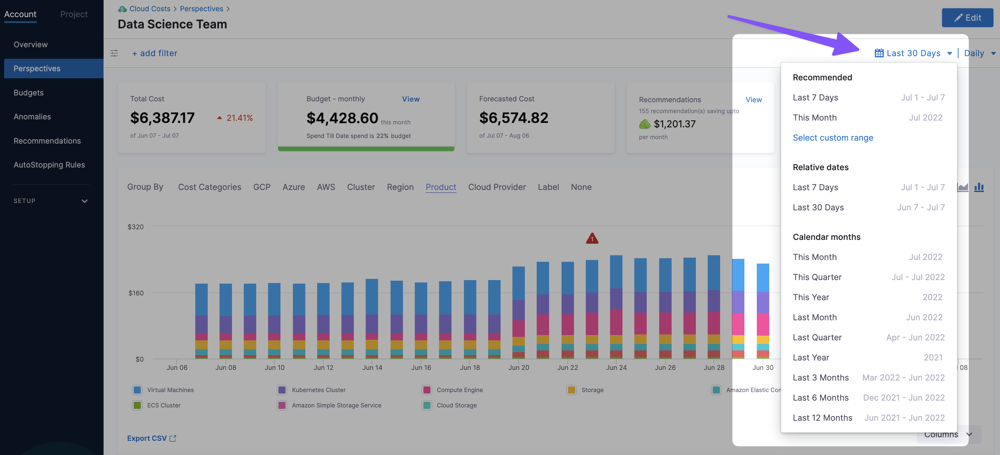

When you view a [CCM Perspective](../1-ccm-perspectives/1-create-cost-perspectives.md), you can adjust the date ranges of the Perspective:

It's important to understand how selecting different date ranges impacts the **Forecasted Cost**.

Let's look at an example where the current day is June 9th:

* **Last 7 Days:** the total cost is from Jun 03 - Jun 08. This is 6 days, not counting the current day because data is not generated yet. The **Forecasted Cost** is from Jun 09 - Jun 15 (showing data for 7 days).
* **This Month:** the total cost is from Jun 01 - Jun 08. This is 8 days, not counting the current day because data is not generated yet. The **Forecasted Cost** is from Jun 09 - Jun 17 (showing data for 9 days).
* **This Quarter:** the total cost is from Apr 01 - Jun 08. This is 68 days, not counting the current day because data is not generated yet. The **Forecasted Cost** is from Jun 09 - Aug 17 (showing data for 69 days).

