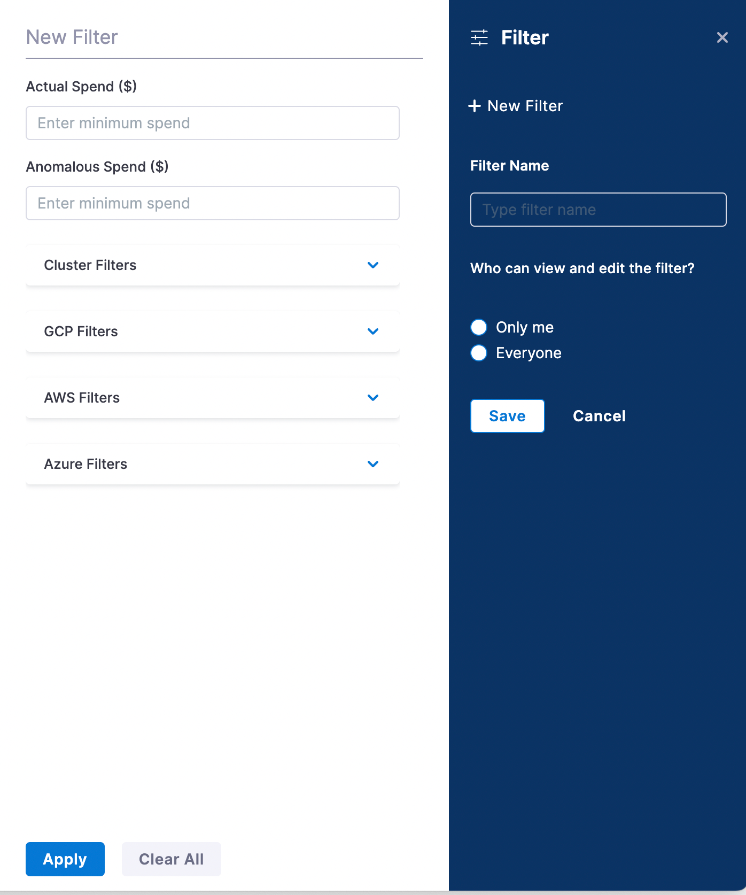
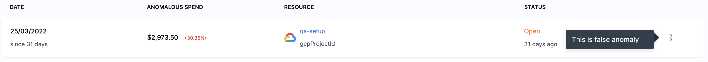
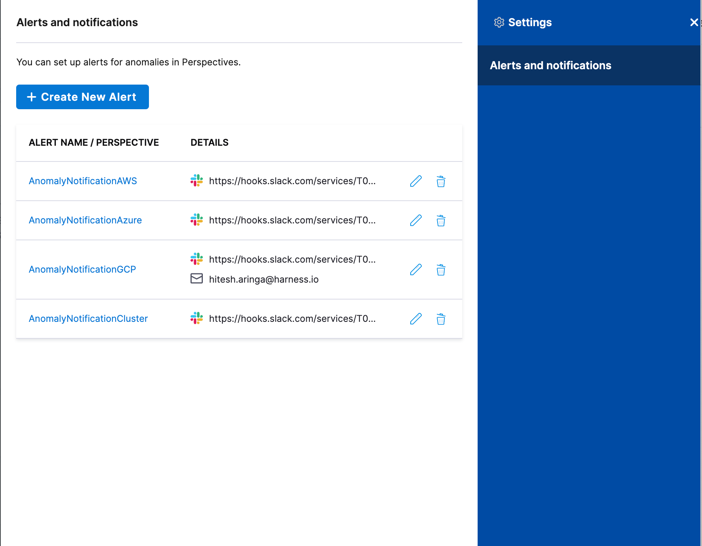
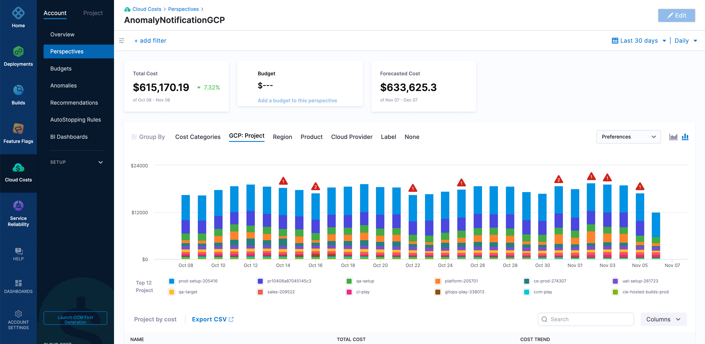

Harness Cloud Cost Management (CCM) detects cost anomalies for your Kubernetes clusters and cloud accounts. Cloud cost anomaly detection can be used as a tool to keep cloud costs under control. It also provides alerting capabilities (email and Slack) so that stakeholders are notified of each anomaly that's detected.

Currently, CCM detects anomalies for the following:

* **Clusters**: Kubernetes Clusters, Namespaces, and Workloads
* **AWS**: Service and Account
* **GCP**: Products, Projects, and SKUs
* **Azure**: Subscription ID, Service Name, and Resources

### What is Cost Anomaly Detection?

Cost anomaly detection points you to what you should be paying attention to keep your cloud costs under control. Whenever there is a significant increase in your cloud cost, an alert is triggered. This helps to keep track of potential waste and unexpected charges. It also keeps an account of the recurring events (seasonalities) that happen on a daily, weekly, or monthly basis.

CCM cost anomalies compare the previous cloud cost spends with the current spending to detect cost anomalies. If the actual cost incurred deviates substantially from the expected cost, then it can be a potential cost anomaly.

## How Does Cost Anomaly Detection Work?

CCM uses statistical anomaly detection techniques and [Forecasting at scale](https://peerj.com/preprints/3190/) to determine cost anomalies. These methods can detect various types of anomalies, such as a one-time cost spike, gradual, or consistent cost increases.

CCM analyzes 15 to 60 days of data to predict the cost. If the predicted cost and the actual cost incurred deviate beyond the fixed parameters (as described in the anomaly detection techniques), it is marked as a cost anomaly.

For example, you run a compute-intensive job that gets kicked off every Monday morning. The algorithm picks up on the pattern and updates its model. Based on these learnings predictions are made for what might happen in the future. Anything that doesn't align with these predictions is a potential anomaly.

The anomaly detection techniques are run every 24 hours and the alert is triggered for any anomaly that is detected.#### Anomaly Detection Techniques

One of the challenges of anomaly detection is reducing the number of false positives and noisy alerts. To avoid this, CE uses the following prediction techniques to detect cost anomalies:

### Absolute Difference Method

This method takes the absolute difference between the two variables in the dataset. CCM considers the actual and predicted cost as two variables. If the difference between the actual and predicted costs exceeds $75, then the cost is considered a potential anomaly.

`Actual cost - Predicted Cost > $75`

For example, the actual cost of your cloud resource is $120 and the predicted cost was $25.

The difference between the actual and predicted is $120 - $21 = $99 which is greater than the $75 fixed amount.

Hence, it is a potential cost anomaly.

### Relative Method

In this method, if the actual cost is a minimum of 1.25 times higher than the predicted cost, then it is a potential cost anomaly.

`Actual Cost / Predicted Cost >= 1.25X`

For example, the difference between the actual and predicted is 120 / 21 = 5.71 which is higher than the fixed 1.25x value.

Hence, it is a potential cost anomaly.

### Probability Method

In this method, the algorithm uses a probability of 99% within a range to predict the cost.

For example, the actual cost is predicted to be in the range of 10–14$ with a 99% probability. Anything that deviates from this range is a potential cost anomaly.

## View Cost Anomalies

You can view cost anomalies for the following:

* **Clusters**: Kubernetes Clusters, Namespaces, and Workloads
* **AWS**: Service and Account
* **GCP**: Products, Projects, and SKUs
* **Azure**: Subscription ID, Service Name, and Resources

Perform the following steps to view cost anomalies:

1. In **Cloud Costs**, click **Anomalies**. The **Anomalies** page is displayed.  
(Optional) You can create a filter to view details for the selected resources and spend amount. To create a filter:
   1. Click the filter icon.
   2. Enter a filter name and click **Save**.
   3. To filter based on the spend amount, enter the minimum amount in the **Actual Spend** and **Anomalous Spend** fields.
   4. Select the required cloud resources and/or clusters from the drop-down.
   5. Click **Apply**.
   
     

The Anomalies page displays the following information based on the selected filter:

|  |  |
| --- | --- |
| Anomalies Detected | The total number of anomalies detected across all of your cloud providers during the specified time period. |
| Total Cost Impact | The total cost impact because of the anomalous spend across all the resources in your cloud infrastructure. |
| Top 3 Anomalies | Top 3 anomalies across all resources. Hover on the resource to view the detail of the resource. |
| Anomalies by Cloud Providers | The number of anomalies by the cloud providers. For example, GCP, AWS. |
| Date | The date on which the anomaly was detected. |
| Anomalous Spend | The total amount of anomalous spend per resource. |
| Variance | The percentage variation between the actual spend and the predicted spend. |
| Resource | Detail of the resource on which the anomalous cost was detected. |

2. From the **Resource**, click the anomaly for which you want to view the details.
   
3. Click the more actions menu (three-dot) and then click **This is false anomaly** to determine if this is a false anomalous event. This feature helps CCM cost anomaly detection models to learn and improve the algorithm to be more tailored to your assessments.
   
     

### Create an anomaly alert for your Perspective

You can create alerts to receive notifications when an anomaly is detected. To create an alert, perform the following steps:

1. On the **Anomalies** page, click **Settings**.
2. In **Alerts and notifications**, click **Create New Alert**.
   
     
3. Select the **Perspective** for which you want to create an alert.
4. Click **add channel** to add anomaly alert channels.
5. Select **Slack Webhook URL** or **Email** and enter the details to receive notifications. To learn how to create a Slack webhook URL, see [Send Notifications Using Slack](../../platform/5_Notifications/send-notifications-using-slack.md).
6. Click **Save and Continue**.  
   An anomaly alert is created. Click the alert to view the anomalies on the **Perspectives** page.

   
   	  

7. Hover over the number of anomalies on the graph to apply anomaly filters and view anomalies as shown below:
   
     

For example, when you click the GCP perspective, it displays the data for the entire GCP ecosystem. There are multiple anomalies in the given example. Hovering over the graph displays two links:

* **View anomalies**: Clicking this option takes you to the **Anomalies** page filtered to that day.
* **Apply anomaly filters**: Clicking this option applies the set of filters and takes you to the resource that caused the anomaly. This is useful in identifying the root cause for further analysis. The **Apply anomaly filters** link is disabled if there are multiple anomalies on a given day.

:::note
Access to perspectives and the associated anomalies depends on the role assignment. For more information, go to [Manage access control for CCM Perspective folders](../get-started/5-access-control/manage-access-control-perspective-folders.md).
:::
