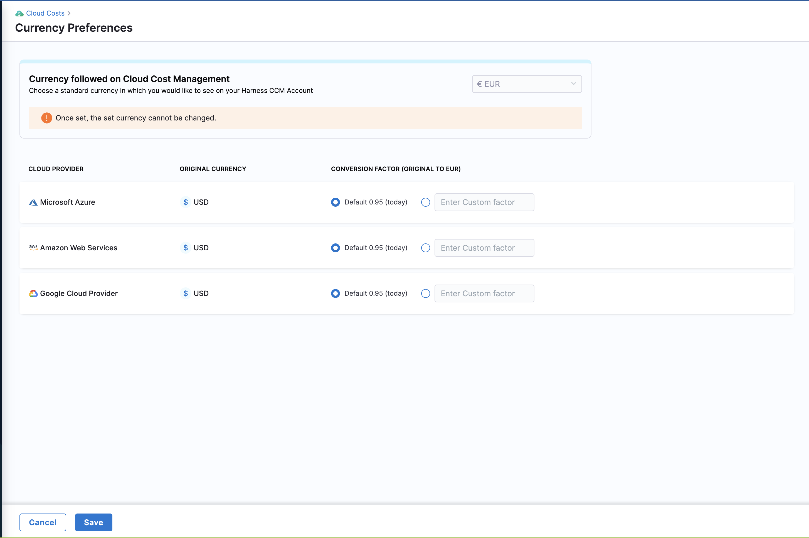
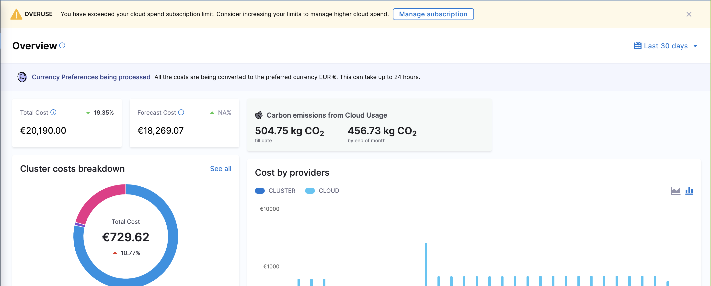
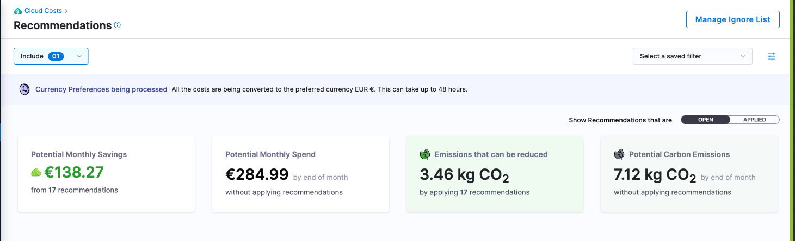
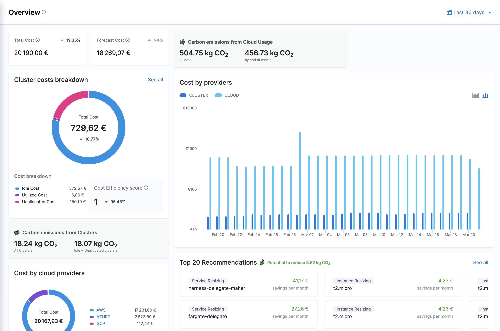
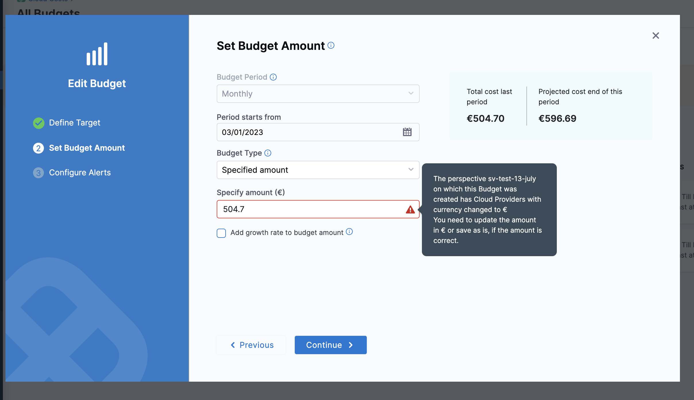
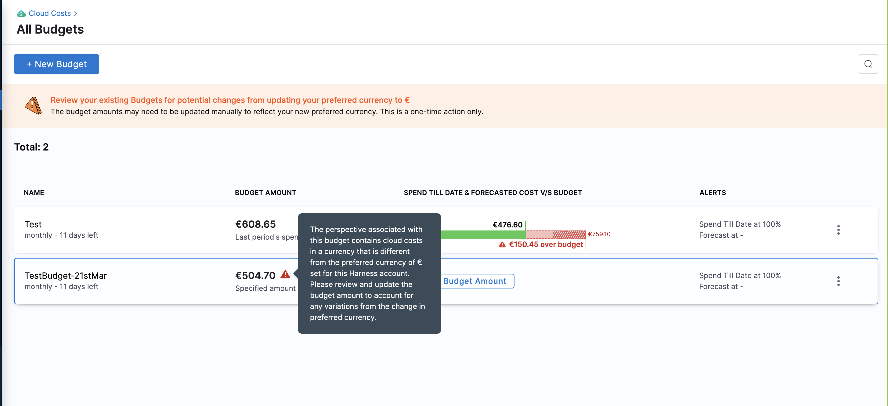

:::note
Currently, this feature is behind the feature flag **CCM_CURRENCY_PREFERENCES**. Contact Harness Support to enable the feature.
:::

Harness CCM allows you to view your cloud spend data in the currency of your choice. It is easier to view reports and dashboards in your preferred currency rather than having it in different currencies and then converting them to your preferred currency. It provides more consistent, easy-to-consume, and meaningful cloud analytics across the entire business. 

CCM allows you to choose from the following list of currencies and displays the cost data in the specified currency:

  - ARS
  - AUD
  - BRL
  - CAD
  - CNY
  - EUR
  - GBP
  - INR
  - JPY
  - MXN
  - NOK
  - NZD
  - RUB
  - SGD
  - USD

## Before you begin

You must integrate your cloud accounts with Harness CCM. For more information, refer to the following topics:

* [Set up cost visibility for AWS](../get-started/onboarding-guide/set-up-cost-visibility-for-aws.md)
* [Set up cost visibility for Azure](../get-started/onboarding-guide/set-up-cost-visibility-for-azure.md)
* [Set up cost visibility for GCP](../get-started/onboarding-guide/set-up-cost-visibility-for-gcp.md)
* [Set up cost visibility for Kubernetes](../get-started/onboarding-guide/set-up-cost-visibility-for-kubernetes.md)

## Set up your preferred currency 

To standardize the currency in which your cloud cost data is displayed, perform the following steps:

1. In the Harness application, go to **Cloud Costs**. 
2. Under **Setup**, click **Currency Preferences**.
3. Select the currency from the **Currency followed on Cloud Cost Management** dropdown list.

 

:::caution
Once configured, you cannot change the currency settings. It takes up to 24 hours for data to be shown in your preferred currency. Historical data is also converted and displayed in the preferred currency.
:::

4. You can use the default conversion factor or enter a custom value in the text box for each cloud service provider. This option is useful when you have a predefined negotiated rate of conversion, or you want to use a fixed rate of conversion for reporting purposes.

  
    :::note
    If you have selected **Default**, the conversion factor is taken from the CUR or the Billing Export reports. If the conversion factor is not available in these reports, a publicly available conversion factor for the selected currency is used. It's important to note that the conversion factor may vary slightly between different cloud accounts.

    For example, let’s say you have a GCP account and an Azure account. If the Billing Export for GCP provides the currency conversion factor, that factor will be used for GCP. However, if the report for Azure does not have the conversion factor, a public API is called to retrieve it. Consequently, the conversion factor used for Azure may differ from that used for GCP.
    :::

5. Click **Save**. 
  
    The currency standardization process begins. A banner is displayed on the Overview page. The selected currency is applied to the last two years of data. The conversion factor used for the ongoing month is applied to the current month's data, while the conversion factor used for the previous month is applied to the historical data from the past two years.

    

## Points to remember

* After configuring the currency settings, the currency symbol immediately changes to the preferred one. However, the cost data does not change and remains in the original currency. It may take up to 24 hours for the converted value to be displayed.
* It may take up to 48 hours for data on the **Recommendations** page to be updated.

  

* Currency standardization is supported only within CCM. Note that the currency symbol in **Dashboards** is not changed, but the cost is displayed in the preferred currency.
* You can configure these settings only for your cloud accounts. Contact Harness Support to view the Kubernetes cluster data in your preferred currency.
* The currency format defaults to the _en-us_ locale. If you wish to change this, contact Harness Support.
  In the following example, the locale is changed from _en-us_ to _fr-be_ which has changed the currency representation (currency symbol appears after the digits).
  The format differs based on the locale.

    

* If your preferred currency is not supported for the _en-us_ locale, the currency code will be displayed instead of the currency symbol. If you wish to view the currency symbol instead, contact Harness support.

* For existing budgets and new budgets, you must manually update the **Specify Amount** field with the converted value in the selected currency. This is because a **Perspective** may be associated with multiple cloud accounts and therefore cannot be updated automatically.

  

  

