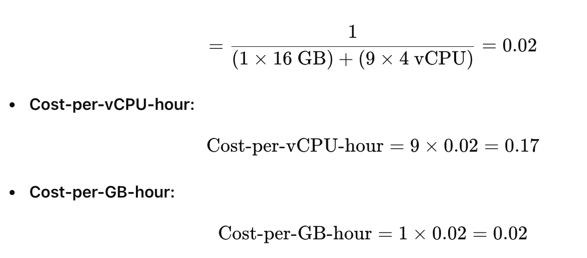
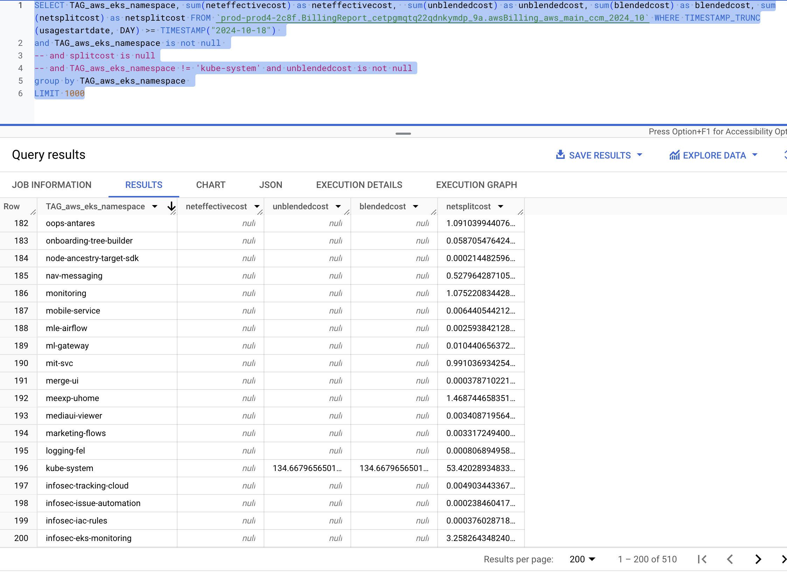

# View AWS Cost Dashboard

Harness provides pre-loaded **By Harness** (pre-defined) and **Custom** (user-defined) dashboards to visualize cloud cost data across clusters and cloud accounts. Using the **AWS Cost Dashboard** you can:

* Discover new analytical insights into your AWS cloud costs
* Track various cloud cost indicators across different zones and time range
* Explore the cloud cost data in a logical and structured manner
* View your cloud costs at a glance, understand what is costing the most, and analyze cost trends
  
This topic describes how to view the **By Harness AWS Cost Dashboard** and get more information about that data.

  

## Prerequisites

* Ensure that you have **Dashboard-All View** permissions assigned. See [Manage Access Control for CCM Dashboards](/docs/cloud-cost-management/access-control/manage-access-control-for-ccm-dashboards.md).
* Ensure that you have set up Cloud Cost Management (CCM) for the [AWS](../../get-started/onboarding-guide/set-up-cost-visibility-for-aws.md) cloud provider.
* Ensure that you have added all the required permissions for your cloud provider. The data available in the Dashboard depends on the permissions you provided to the AWS cloud provider when setting up the CCM. For more information, see Select Features in [Set up cost visibility for AWS](../../get-started/onboarding-guide/set-up-cost-visibility-for-aws.md#aws-access-permissions).

## Data Ingestion for Dashboard

After setting up cost visibility for the [AWS](../../get-started/onboarding-guide/set-up-cost-visibility-for-aws.md) cloud provider and the data is available in the Perspective, you can view **AWS Cost Dashboard**. The data in the Dashboard is updated dynamically.

## View AWS Cost Dashboard

Perform the following steps to view AWS Cost Dashboard:

1. In Harness, click **Dashboards**.
2. Select **By Harness** and then, click **AWS Cost Dashboard**.
      
  
    The AWS Cost Dashboard is displayed.
  
| **Dimensions** | **Description** | **Context and Visibility** |
|---|---|---|
| Total Cost | The total AWS cost with cost trend. |  |
| Forecasted Cost  |The forecasted cloud cost with cost trend. Forecasted cost is the prediction based on your historical cost data, and it is predicted for the same future time period as your selected time range.   |   |   
| Top 20 AWS accounts | The cost of the top 20 AWS account you are using to connect Harness to AWS via a Harness AWS Cloud Provider. |  |
| Top Cost Trend by Services | The top AWS services by cost increase or decrease |  |
| Historical and Forecasted Cost | The historical and forecasted AWS cost. Forecasted cost is the prediction based on your historical cost data and it is predicted for the same future time period as your selected time range. |  |
| Current Period vs Last Period | The cost of the current and previous time range. |  |
| Most Expensive Services by Month | Top five services that incurred the maximum cost per month. |  |

3. Select **Time Range** to filter the data based on pre-defined time range filters. The available filters are:
	* Last 7 Days
	* Last 30 Days
	* Last 90 Days
	* Last 12 months
	* Last 24 months
4. After selecting the Time Range filter, click the **Refresh** icon. The data is refreshed with the latest data from the database.
   
5. Hover on the chart to see the cost details.
   
     
6. In **Cost by AWS** **Account**, click the up or down arrow button to scroll up or down the list. The list shows the percentage of each AWS account with respect to the cost contribution.
   
     
7. In **Historical and Forecasted Cost**, click on the chart to further drill into the cost details **by Time Period/Time**.
   
     
	 
	 The cost for the selected Time period is displayed. You can toggle between the **Visualization** tab that displays the data in the form of a graph and the **Table** tab that displays the actual cost. You can download this data to your local system.
	 
	   
8. In **Most Expensive Services by Month**, click on the chart to further drill into the cost details:
  
	
	  	  	   

	The cost data for the selected filter is displayed.

	  	   

		
	

	  

9.  You can further drill into **by Time Period/Time** cost details in the resulting dashboard.
    
	  
	
	  The cost data for the selected filter is displayed.

    

10. Click **Download** to download the Dashboard. See [Download Dashboard Data](../../../platform/dashboards/download-dashboard-data.md).
11. Click the **Filter** icon to hide or show the filters.
    
	  

### See Also

Once you have set up cost visibility for your Kubernetes clusters, AWS, GCP, and Azure cloud providers, you can create your own Dashboards. Refer to the following topics to create your own Dashboard and chart data.

* [Create Dashboards](../../../platform/dashboards/create-dashboards.md)
* [Create Visualizations and Graphs](../../../platform/dashboards/create-visualizations-and-graphs.md)

### SCAD-Related Columns for AWS

[Split cost allocation data (SCAD)](https://docs.aws.amazon.com/cur/latest/userguide/split-cost-allocation-data.html) feature introduces cost and usage data for container-level resources—specifically ECS tasks and Kubernetes pods—into AWS Cost and Usage Reports (CUR). Previously, AWS CUR only provided costs at the EC2 instance level. Now, split cost allocation calculates container-level costs by analyzing each container’s consumption of EC2 instance resources, assigning costs based on the amortized cost of the instance and the percentage of CPU and memory resources utilized by containers running on it.

We have added support for the following SCAD-related columns:

- `parentresourceid`
- `reservedusage`
- `actualusage`
- `splitusage`
- `splitusageratio`
- `splitcost`
- `netsplitcost`
- `unusedcost`
- `netunusedcost`
- `publicondemandsplitcost`
- `publicondemandunusedcost`

Along with the following labels:

- `aws:eks:cluster-name`
- `aws:eks:deployment`
- `aws:eks:namespace`
- `aws:eks:node`
- `aws:eks:workload-name`
- `aws:eks:workload-type`

#### Example: Calculating Split Cost Allocation Data for Containers
 
**Scenario:**
- Usage in a single hour:
	- One instance (m5.xlarge) shared by two namespaces and four pods, running for a full hour.
	- Instance configuration: 4 vCPUs and 16 GB memory.
	- Amortized cost of the instance: $1/hr.

**Step 1: Compute the unit cost for CPU and memory**

- Unit-cost-per-resource: 
 

 

:::note

 Split cost allocation data uses relative unit weights for CPU and memory based on a 9:1 ratio. This is derived from per vCPU per hour and per GB per hour prices in AWS Fargate.

 :::
| Instance  | Instance Type   | vCPU-available  | Memory-available  |  Amortized-cost-per-hour | CPU-per-vCPU-hour | Cost-per-GB-hour |
|---|---|---|---|---|---|---|
| Instance1  | m5.xlarge  | 4  |  16 |  $1 |  $0.17 | $0.02  |

**Step 2: Compute the allocated capacity and instance unused capacity**

**Allocated capacity**
- The memory and vCPU allocated to the Kubernetes pod from the parent EC2 instance, defined as the maximum of used and reserved capacity.

**Instance unused capacity**
- Unused vCPU and memory capacity.

| Pod Name  | Namespace  | Reserved vCPU  |  Used vCPU | Allocated vCPU  | Reserved Memory  | Used Memory  | Allocated Memory |
|---|---|---|---|---|---|---|---|
| Pod1  | Namespace1  | 1  | 0.1  | 1  |  4 GB | 3 GB  | 4 GB  |
| Pod2  | Namespace2  |  1 | 1.9  | 1.9  | 4 GB  |  6 GB | 6 GB  |
| Pod3  | Namespace1  |  1 | 0.5  | 1  | 2 GB  |  2 GB |  2 GB |
| Pod4  | Namespace2  |  1 | 0.5  | 1  | 2 GB  | 2 GB  | 2 GB  |
| Unused  | Unused  |  - | -  | 0  | -  | -  | 2 GB  |
| Total  | -  |  - | -  | 4.9 vCPU  |   | -  | 16 GB  |
 

- `Pod1-Allocated-vCPU = Max (used, reeserved) = Max (1 vCPU, 0.1 vCPU)` = 1 vCPU
- `Pod1-Allocated-memory = Max (used, reeserved) = Max (4 GB, 3 GB)` = 4 GB
 
- `Instance-Unused-vCPU = Max (CPU-available - SUM(Allocated-vCPU), 0)` = Max (4 – 4.9, 0) = 0
- `Instance-Unused-memory = Max (Memory-available - SUM(Allocated-memory), 0)` = Max (16 – 14, 0) = 2 GB

In this example, there is CPU over-subscription, meaning the total vCPU used by the pods exceeds the available vCPU of the instance by 0.9 vCPU. This is attributed to Pod2, which uses more vCPU (1.9 vCPU) than what was reserved (1 vCPU).

**Step 3: Compute the split usage ratios**

**Split usage ratio**

The percentage of CPU or memory used by the Kubernetes pod compared to the overall CPU or memory available on the EC2 instance.  
  

-   **Pod1 vCPU split usage ratio** = Allocated vCPU / Total Allocated vCPU
    
    -   = 1 vCPU / 4.9 vCPU
        
    -   = 0.204
        
-   **Pod1 Memory split usage ratio** = Allocated Memory / Total Memory
    
    -   = 4 GB / 16 GB
        
    -   = 0.25
        
-   **Pod2 vCPU split usage ratio** = Allocated vCPU / Total Allocated vCPU
    
    -   = 1.9 vCPU / 4.9 vCPU
        
    -   = 0.388
        
-   **Pod2 Memory split usage ratio** = Allocated Memory / Total Memory
    
    -   = 6 GB / 16 GB
        
    -   = 0.375

**Unused ratio**

The percentage of CPU or memory used by the Kubernetes pod compared to the overall CPU or memory used on the EC2 instance (that is, not factoring in the unused CPU or memory on the instance).

-   **Pod1 vCPU unused ratio** = Pod1 vCPU split usage ratio / (Total vCPU split usage ratio - Instance unused vCPU)
    
    -   = 0 (since Instance unused vCPU is 0)
        
-   **Pod1 Memory unused ratio** = Pod1 Memory split usage ratio / (Total Memory split usage ratio - Instance unused memory)
    
    -   = 0.25 / (1 - 0.125)
        
    -   = 0.286

| Pod Name  | Namespace | vCPU Split Usage Ratio | vCPU Unused Ratio | Memory Split Usage Ratio  | Memory Unused Ratio |
|---|---|---|---|---|---|
| Pod1  | Namespace1  |  0.204  | 0 | 0.250  |  0.286 | 
| Pod2  | Namespace2  |  0.388 | 0  | 0.375 | 0.429  |  
| Pod3  | Namespace1  |  0.204 | 0  | 0.125 | 0.143  | 
| Pod4  | Namespace2  |  0.204 | 0  | 0.125  | 0.143 | 
| Unused  | Unused  | 0 |   | 0.125  |  |
|  |  |  1 |   | 1 |   | 

**Step 4: Compute the split cost and unused costs**

**Split cost**

The pay-per-use cost allocation of the EC2 instance cost based on allocated CPU and memory usage by the Kubernetes pod.

**Unused instance cost**

The cost of unused CPU or memory resources on the instance.

**Pod1 Split Cost** = `(Pod1 vCPU split usage ratio * Total vCPU * Cost per vCPU hour) + (Pod1 Memory split usage ratio * Total Memory * Cost per GB hour)`

= (0.204 * 4 vCPU * $0.17) + (0.25 * 16GB * $0.02) = $0.22

**Pod1 Unused Cost** =`(Pod1 vCPU unused ratio × Instance vCPU unused ratio × vCPU available × Cost per vCPU hour) + (Pod1 Memory unused ratio × Instance Memory unused ratio × Memory available × Cost per GB hour)`

= (0 * 0 * 4 * $0.17) + (0.286 * 0.125 * 16 * $0.02) = $0.01

**Pod1 Total Split Cost** = Pod1 Split Cost + Pod1 Unused Cost

= $0.23

| Pod Name  | Namespace | Split-cost | Unused-cost | Total-split-cost | 
|---|---|---|---|---|
| Pod1  | Namespace1  |  $0.22 | $0.01 | $0.23  |  
| Pod2  | Namespace2  |  $0.38 | $0.02  | $0.40 |
| Pod3  | Namespace1  |  $0.18 | $0.01  | $0.19 |
| Pod4  | Namespace2  |  $0.18 | $0.01  | $0.19  | 
| Unused  | Unused  | $0.04 |   |  |
|  |  |  $1 | $0.04  | $1 |

The cost of the service is the sum of the cost of pods associated with each namespace.
- Total cost of Namespace1 = $0.23 + $0.19 = $0.42
- Total cost of Namespace2 = $0.40 + $0.19 = $0.59

#### Example of a query and result with SCAD columns:

The `eks_namespace` labels won’t display `netamortisedcost` and `amortisedcost` values, as only SCAD-related columns and values are accessible from AWS.

The `kube-system` namespace is the only one that will reflect `netamortisedcost` and `amortisedcost` values. This is because AWS provides `blendedcost` and `unblendedcost` fields exclusively for this namespace, allowing us to calculate the amortised and net amortised cost values. These calculated values are stored in the `awscur_<<month_year>>` table and subsequently persisted in the `unifiedTable` as `awsAmortisedCost` and `awsNetAmortisedCost`.

 

### Next Steps

* [Use Dashboard Actions](../../../platform/dashboards/use-dashboard-actions.md)
* [Download Dashboard Data](../../../platform/dashboards/download-dashboard-data.md)
* [Create Conditional Alerts](../../../platform/dashboards/create-conditional-alerts.md)
* [Schedule and Share Dashboards](../../../platform/dashboards/share-dashboards.md)

