# View AWS Cost Dashboard

Harness provides pre-loaded **By Harness** (pre-defined) and **Custom** (user-defined) dashboards to visualize cloud cost data across clusters and cloud accounts. Using the **AWS Cost Dashboard** you can:

* Discover new analytical insights into your AWS cloud costs
* Track various cloud cost indicators across different zones and time range
* Explore the cloud cost data in a logical and structured manner
* View your cloud costs at a glance, understand what is costing the most, and analyze cost trends
  
This topic describes how to view the **By Harness AWS Cost Dashboard** and get more information about that data.

  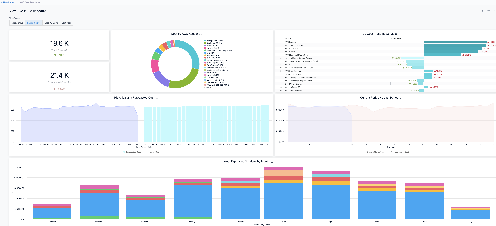

## Prerequisites

* Ensure that you have **Dashboard-All View** permissions assigned. See [Manage Access Control for CCM Dashboards](../../2-getting-started-ccm/5-access-control/manage-access-control-for-ccm-dashboards.md).
* Ensure that you have set up Cloud Cost Management (CCM) for the [AWS](../../2-getting-started-ccm/4-set-up-cloud-cost-management/set-up-cost-visibility-for-aws.md) cloud provider.
* Ensure that you have added all the required permissions for your cloud provider. The data available in the Dashboard depends on the permissions you provided to the AWS cloud provider when setting up the CCM. For more information, see Select Features in [Set up cost visibility for AWS](../../2-getting-started-ccm/4-set-up-cloud-cost-management/set-up-cost-visibility-for-aws.md#aws-access-permissions).

## Data Ingestion for Dashboard

After setting up cost visibility for the [AWS](../../2-getting-started-ccm/4-set-up-cloud-cost-management/set-up-cost-visibility-for-aws.md) cloud provider and the data is available in the Perspective, you can view **AWS Cost Dashboard**. The data in the Dashboard is updated dynamically.

## View AWS Cost Dashboard

Perform the following steps to view AWS Cost Dashboard:

1. In Harness, click **Dashboards**.
2. Select **By Harness** and then, click **AWS Cost Dashboard**.
      
  
    The AWS Cost Dashboard is displayed.
  
| **Dimensions** | **Description** | **Context and Visibility** |
|---|---|---|
| Total Cost | The total AWS cost with cost trend. | 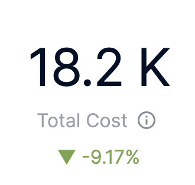 |
| Forecasted Cost  |The forecasted cloud cost with cost trend. Forecasted cost is the prediction based on your historical cost data, and it is predicted for the same future time period as your selected time range.   | 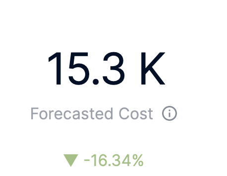  |   
| Top 20 AWS accounts | The cost of the top 20 AWS account you are using to connect Harness to AWS via a Harness AWS Cloud Provider. | 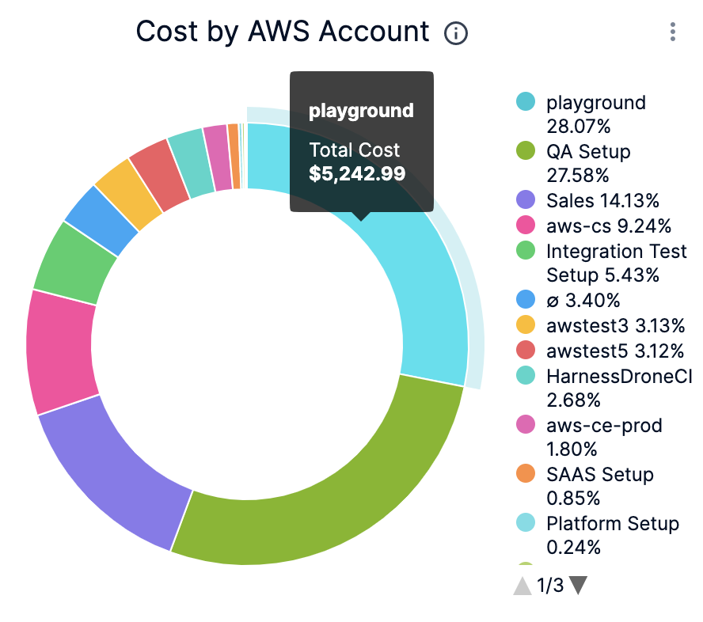 |
| Top Cost Trend by Services | The top AWS services by cost increase or decrease | 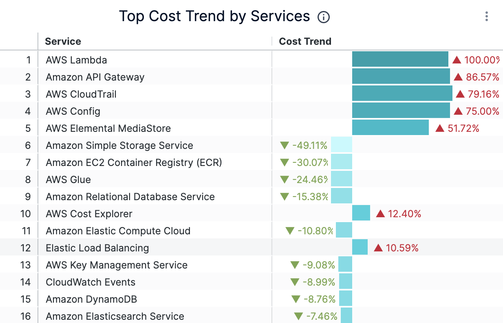 |
| Historical and Forecasted Cost | The historical and forecasted AWS cost. Forecasted cost is the prediction based on your historical cost data and it is predicted for the same future time period as your selected time range. | 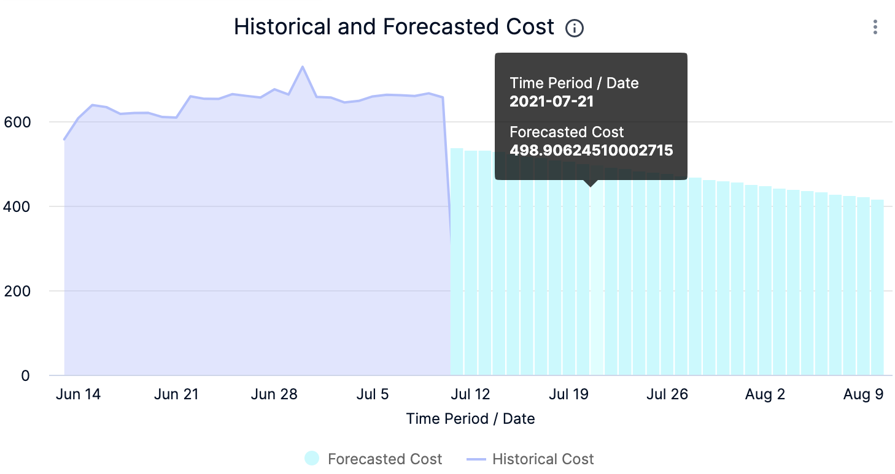 |
| Current Period vs Last Period | The cost of the current and previous time range. | 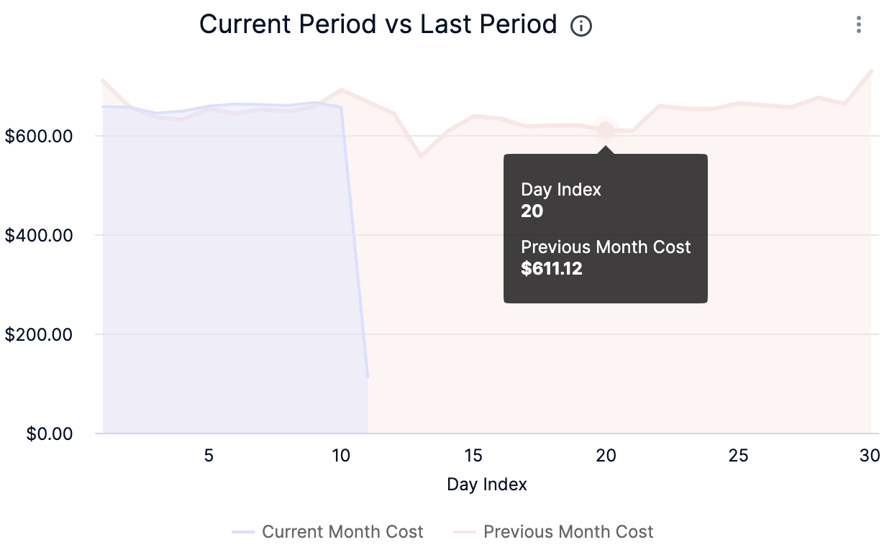 |
| Most Expensive Services by Month | Top five services that incurred the maximum cost per month. | 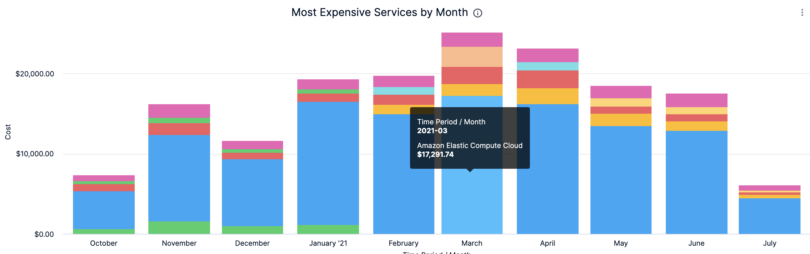 |

3. Select **Time Range** to filter the data based on pre-defined time range filters. The available filters are:
	* Last 7 Days
	* Last 30 Days
	* Last 90 Days
	* Last 12 months
	* Last 24 months
4. After selecting the Time Range filter, click the **Refresh** icon. The data is refreshed with the latest data from the database.
   
5. Hover on the chart to see the cost details.
   
     
6. In **Cost by AWS** **Account**, click the up or down arrow button to scroll up or down the list. The list shows the percentage of each AWS account with respect to the cost contribution.
   
     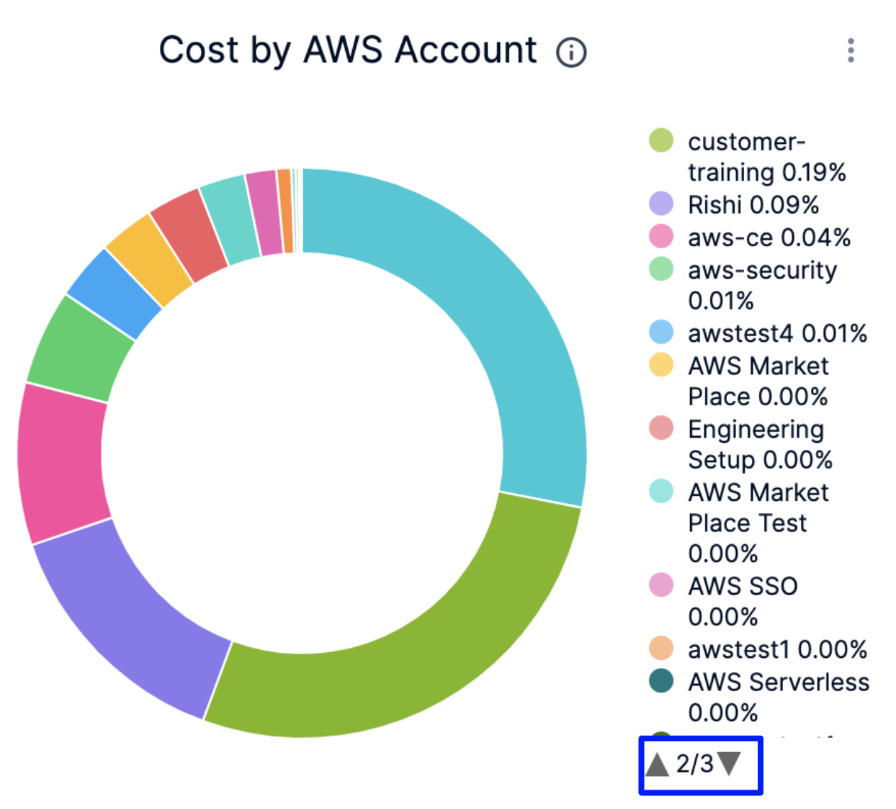
7. In **Historical and Forecasted Cost**, click on the chart to further drill into the cost details **by Time Period/Time**.
   
     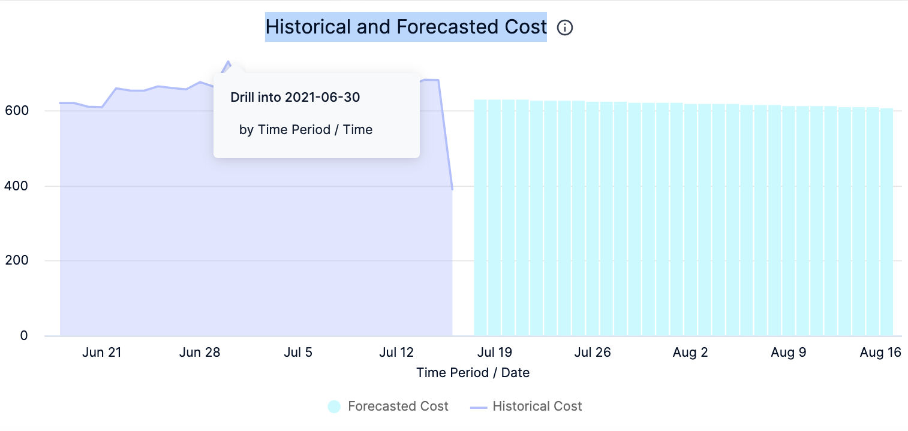
	 
	 The cost for the selected Time period is displayed. You can toggle between the **Visualization** tab that displays the data in the form of a graph and the **Table** tab that displays the actual cost. You can download this data to your local system.
	 
	   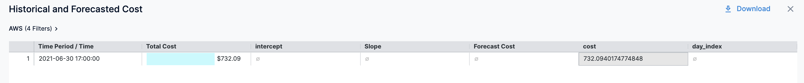
8. In **Most Expensive Services by Month**, click on the chart to further drill into the cost details:
  
	
	  	  	   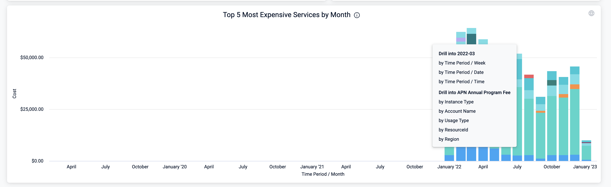

	The cost data for the selected filter is displayed.

	  	   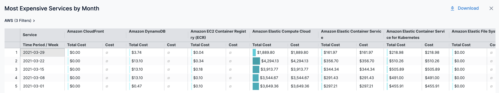

		
	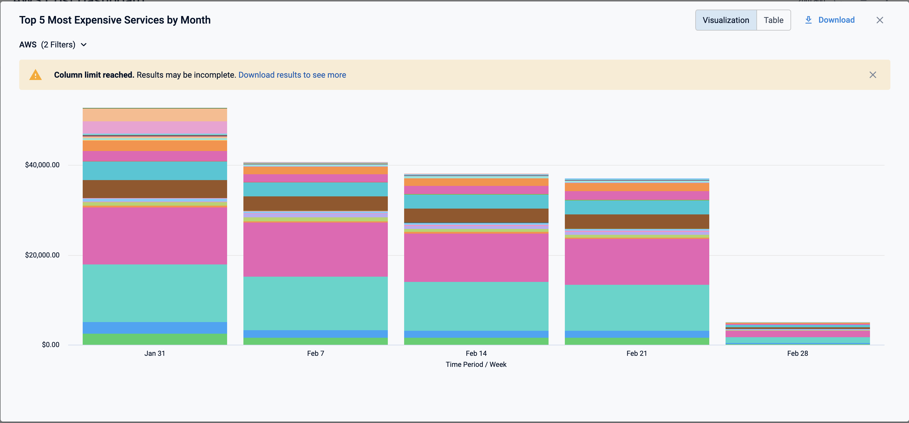

	  

9.  You can further drill into **by Time Period/Time** cost details in the resulting dashboard.
    
	  
	
	  The cost data for the selected filter is displayed.

    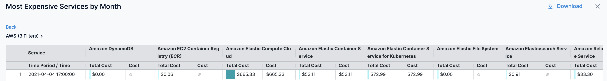

10. Click **Download** to download the Dashboard. See [Download Dashboard Data](../../../platform/18_Dashboards/download-dashboard-data.md).
11. Click the **Filter** icon to hide or show the filters.
    
	  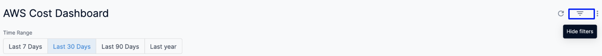

### See Also

Once you have set up cost visibility for your Kubernetes clusters, AWS, GCP, and Azure cloud providers, you can create your own Dashboards. Refer to the following topics to create your own Dashboard and chart data.

* [Create Dashboards](../../../platform/18_Dashboards/create-dashboards.md)
* [Create Visualizations and Graphs](../../../platform/18_Dashboards/create-visualizations-and-graphs.md)

### Next Steps

* [Use Dashboard Actions](../../../platform/18_Dashboards/use-dashboard-actions.md)
* [Download Dashboard Data](../../../platform/18_Dashboards/download-dashboard-data.md)
* [Create Conditional Alerts](../../../platform/18_Dashboards/create-conditional-alerts.md)
* [Schedule and Share Dashboards](../../../platform/18_Dashboards/share-dashboards.md)

