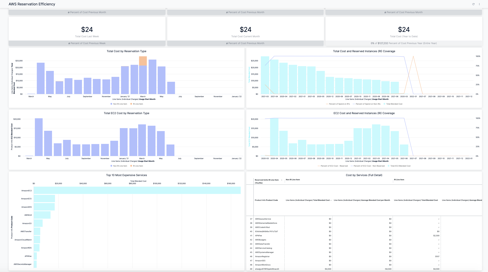
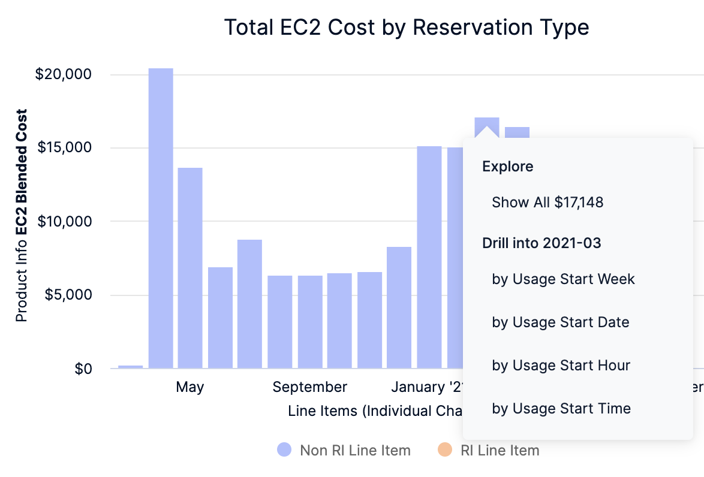
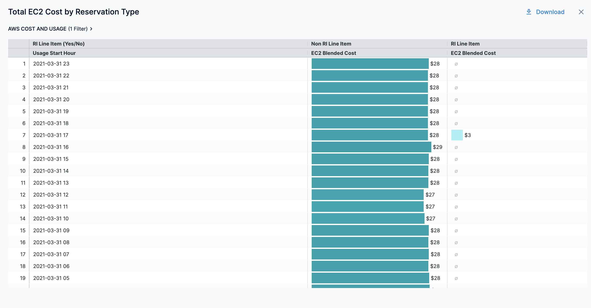
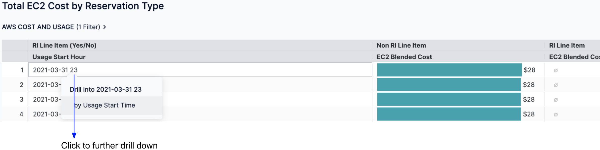
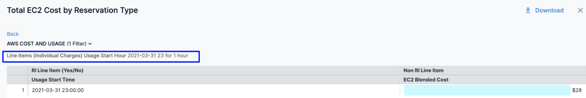
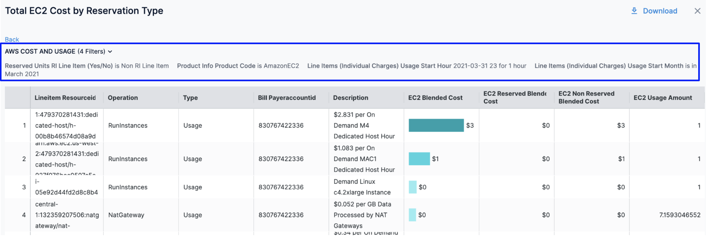

# View AWS Reservation Efficiency Dashboard

Harness provides **By Harness** (pre-defined) and **Custom** (user-defined) Dashboards to visualize cloud cost data across cloud providers.

This topic describes how to view the **By Harness** **AWS Reservation Efficiency Dashboard** and get more information about that data. For more information on Reserved Instances, see [Amazon EC2 Reserved Instances](https://docs.aws.amazon.com/whitepapers/latest/cost-optimization-reservation-models/amazon-ec2-reserved-instances.html).

Using the AWS reservation efficiency report you can:

* View your EC2 costs at a glance and understand what is costing the most
* Compare your weekly, monthly, and yearly EC2 spend (reserved and non-reserved)
* View details of EC2 blended cost
* Get details of how reserved instances are utilized
* View your reserved and non-reserved EC2 cost
* Analyze how efficiently you are using your reserved instances

## Prerequisites

* Review [Set Up Cloud Cost Management for AWS](../../2-getting-started-ccm/4-set-up-cloud-cost-management/set-up-cost-visibility-for-aws.md)
* Ensure that you have **Dashboard-All View** permissions assigned. Go to [Manage Access Control for CCM Dashboards](../../2-getting-started-ccm/5-access-control/manage-access-control-for-ccm-dashboards.md).
* Ensure that you have set up Cloud Cost Management (CCM) for your AWS account.
* Ensure that you have added all the required permissions for your cloud provider. The data available in the dashboard depends on the permissions you provided to the AWS cloud provider when setting up the CCM. 

## Data Ingestion for AWS Reservation Efficiency Dashboard

Once you have set up cost visibility for the AWS account and the data is available in the Perspective, you can view **AWS Cost Dashboards**. The data in the Dashboard is updated dynamically.

## View AWS Reservation Efficiency Dashboard

Perform the following steps to view AWS Reservation Efficiency Dashboard:

1. In the Harness application, click **Dashboards**.
2. Select **By Harness** and then, click **AWS Reservation Efficiency**.
   The **AWS Reservation Efficiency Dashboard** is displayed.
   
  
| **Dimension** | **Description** |
| --- | --- |
| Monthly Comparison of Total EC2 Cost | Includes total EC2 reserved and non-reserved monthly cost |
| Yearly Comparison of Total EC2 Cost | Includes total EC2 reserved and non-reserved cost |
| Total Cost by Reservation Type | The total EC2 cost by the reservation type. |
| Total Cost and Reserved Instances (RI) Coverage | The total cost of how much of your overall instance usage is covered by Reserved Instances. |
| EC2 Cost and Reserved Instances (RI) Coverage | The EC2 cost of how much of your overall instance usage is covered by Reserved Instances. |
| Most Expensive Services | Displays top ten most expensive services across your AWS cloud account. For example, Amazon S3, AWSELB, Amazon EC2, etc. |
| Most Expensive Usage Type | Displays top ten most expensive services across based on your usage. |

3. In **Total Cost by Reservation Type**, **Total Cost and Reserved Instances (RI) Coverage**, **Total EC2 Cost by Reservation Type**, and **EC2 Cost and Reserved Instances (RI) Coverage** click on the chart to further drill down the data. You can drill down by:
	* by Usage Start Week
	* by Usage Start Date
	* by Usage Start Hour
	* by Usage Start Time
  
    
  
  The following example shows the cost of **Total EC2 Cost by Reservation Type** by **Usage Start Hour**:
  
    
4. Click the date to drill down further and view the cost in the Dashboard. The drill-down options on this page depend on the selection that you made in the previous step. For example:  
  
 If you selected **by** **Usage Start Week** in **Drill into**, then on this page you will see **by Usage Start Date**, **by Usage Start Hour**, and **by Usage Start Time** options.  
  
 If you selected **by Usage Start Date** in **Drill into**, then on this page you will see **by Usage Start Hour** and **by Usage Start Time** options.
 
   
 The cost for the selected hour is displayed.
 
   
3. Click on the chart to view further granular cost details. You can view the details of the filters applied.
   
     
4. Click **Back** to go back to the previous page in the Dashboard.
5. Click **Download** to download the Dashboard. See [Download Dashboard Data](https://developer.harness.io/docs/platform/Dashboards/download-dashboard-data).

### See Also

After setting up cost visibility for your Kubernetes clusters, AWS, GCP, and Azure cloud providers, you can create your own Dashboards. Refer to the following topics to create your own Dashboard and chart data.

* [Create Dashboards](https://developer.harness.io/docs/platform/Dashboards/create-dashboards)
* [Create Visualizations and Graphs](https://developer.harness.io/docs/platform/Dashboards/create-visualizations-and-graphs)

### Next Steps

* [Use Dashboard Actions](https://developer.harness.io/docs/platform/Dashboards/use-dashboard-actions)
* [Download Dashboard Data](https://developer.harness.io/docs/platform/Dashboards/download-dashboard-data)
* [Create Conditional Alerts](https://developer.harness.io/docs/platform/Dashboards/create-conditional-alerts)
* [Schedule and Share Dashboards](https://developer.harness.io/docs/platform/Dashboards/share-dashboards)

