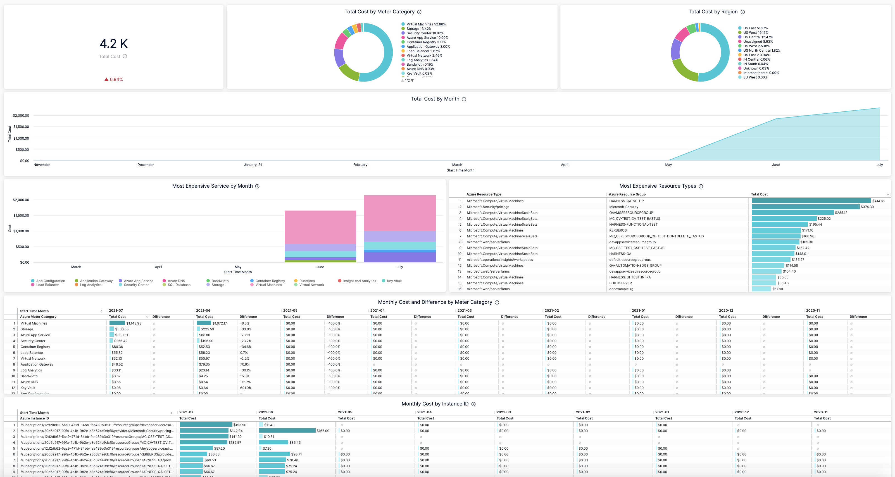
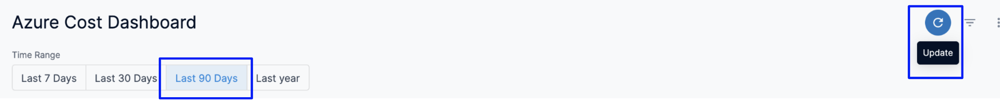
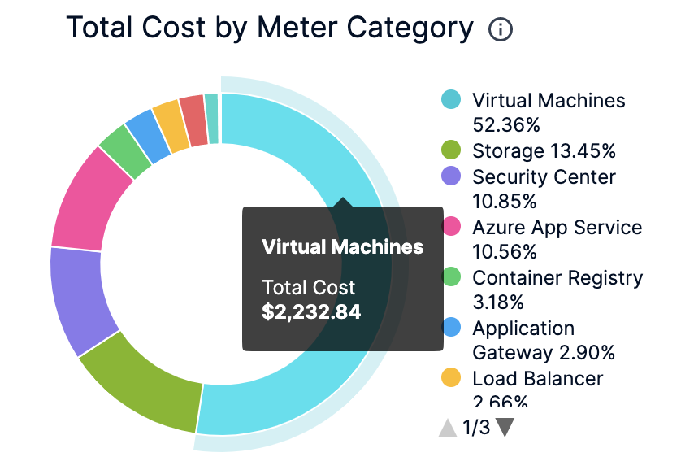
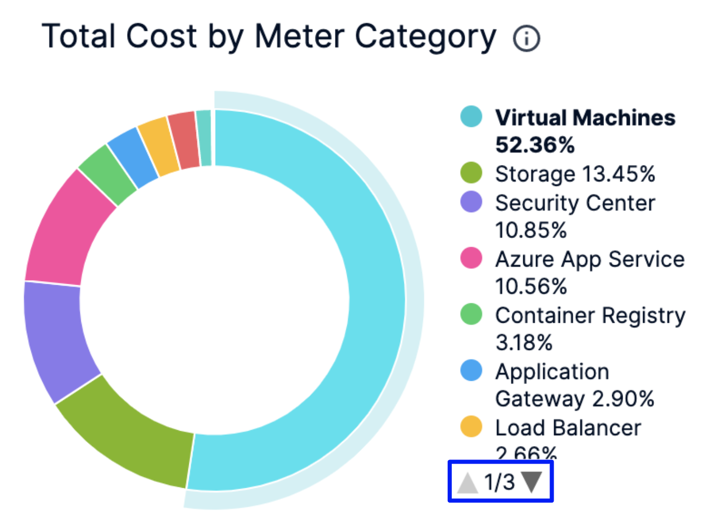
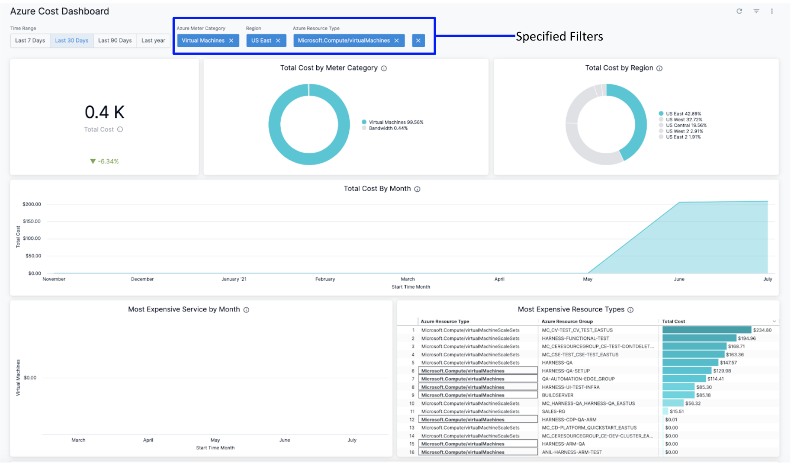
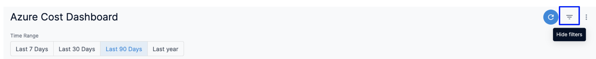

# View Azure Cost Dashboard

Harness provides preloaded **By Harness** (pre-defined) and **Custom** (user-defined) Dashboards to visualize cloud cost data across clusters and cloud accounts. Using the **Azure Cost Dashboard** you can:

* Discover new analytical insights into your Azure cloud costs
* Track various cloud cost indicators across different zones and time range
* Explore the cloud cost data in a logical and structured manner
* View your cloud costs at a glance, understand what is costing the most, and analyze cost trends

This topic describes how to view **By Harness** **Azure Cost Dashboard** and get more information about that data.

## Before You Begin

* [Set Up Cloud Cost Management for Azure](../../2-getting-started-ccm/4-set-up-cloud-cost-management/set-up-cost-visibility-for-azure.md)
* [Manage Access Control for CCM Dashboards](../../2-getting-started-ccm/5-access-control/manage-access-control-for-ccm-dashboards.md)

## Prerequisites

* Ensure that you have **Dashboard-All View** permissions assigned. Go to [Manage Access Control for CCM Dashboards](../../2-getting-started-ccm/5-access-control/manage-access-control-for-ccm-dashboards.md).
* Ensure that you have set up Cloud Cost Management (CCM) for the Azure account.
* Ensure that you have added all the required permissions for your cloud provider. The data available in the Dashboard depends on the permissions you provided to the Azure cloud provider when setting up CCM. 

## Data Ingestion for Azure Cost Dashboard

Once you have set up cost visibility for the Azure account and the data is available in the Perspective, you can view **Azure Cost Dashboard**. The data in the Dashboard is updated dynamically.

## View Azure Cost Dashboard

Perform the following steps to view Azure Cost Dashboard:

1. In the **Harness** application, click **Dashboards**.
2. Select **By Harness** and then, click **Azure Cost Dashboard**. The Azure Cost Dashboard is displayed. 

    

   
	 

| **Dimension** | **Description** |
| --- | --- |
| Total Cost | The total Azure cloud cost with cost trend. |
| Total Cost by Meter Category | The total cost of the meter. For example, Cloud services, Networking, and so on. |
| Total Cost by Region | The total cost of each Azure region you are currently running services in. |
| Total Cost by Month | The total Azure cloud cost by month. |
| Most Expensive Service by Month | The monthly cost of the most expensive Azure services, for example, Virtual Machines, Azure App Service, Azure DNS, etc. |
| Most Expensive Resource Types | The cost of the most expensive resource types. |
| Monthly Cost and Difference by Meter Category | The monthly meter cost and the differences in the cost from the previous month. |
| Monthly Cost by Instance ID | The monthly cost of the instance ID. Each VM in a scale set gets an instance ID that uniquely identifies it. |
| Monthly Cost by Service Name | The monthly cost of Azure services, for example, Virtual Machines, Azure App Service, Azure DNS, etc. |
| Monthly Cost by Resource Group | The monthly cost of the resource group. A resource group is a container that holds related resources that you want to manage as a group. |
3. Select **Time Range** to filter the data based on pre-defined time range filters. The available filters are:
	* Last 7 Days
	* Last 30 Days
	* Last 90 Days
	* Last 12 months
	* Last 24 months
4. Once you have selected the **Time Range**, click **Update**. The data is refreshed with the latest data from the database. By default, **Last 30 Days** is selected.
   
   
5. Hover on the chart to see the cost details.
   
     
6. In the **Cost by Meter Category** and **Total Cost by Region** click the up or down arrow button to scroll up or down the list. The list shows the percentage of each meter category with respect to the cost contribution.
   
     
7. You can further filter and customize your result in the Dashboard. Click on the individual dimension and field for which you want to see the data. For example, select **Virtual Machines** in **Azure Meter Category** and **US East** in the **Region**.  
  
The dashboard displays the data based on the set filter.

  
8. Click the Filter icon to hide or show the filters.
   

  

### See Also

Once you have set up cost visibility for your Kubernetes clusters, AWS, GCP, and Azure cloud providers, you can create your own Dashboards. Refer to the following topics to create your own Dashboard and chart data.

* [Create Dashboards](../../../platform/18_Dashboards/create-dashboards.md)
* [Create Visualizations and Graphs](../../../platform/18_Dashboards/create-visualizations-and-graphs.md)

### Next Steps

* [Use Dashboard Actions](../../../platform/18_Dashboards/use-dashboard-actions.md)
* [Download Dashboard Data](../../../platform/18_Dashboards/download-dashboard-data.md)
* [Create Conditional Alerts](../../../platform/18_Dashboards/create-conditional-alerts.md)
* [Schedule and Share Dashboards](../../../platform/18_Dashboards/share-dashboards.md)
* [View AWS Cost Dashboard](aws-dashboard.md)

