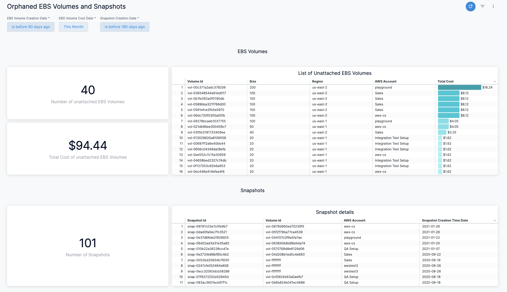
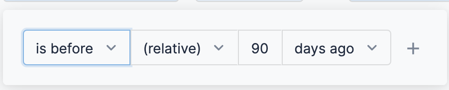
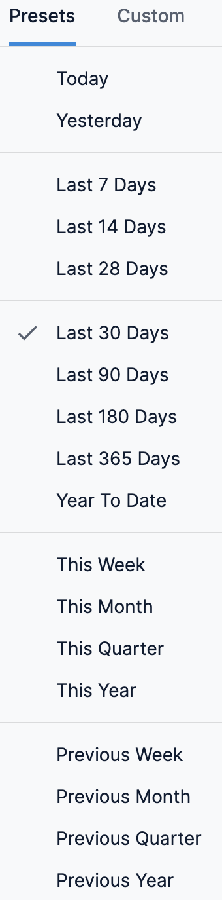

```mdx-code-block
import ebs_dashboard from './static/orphaned-ebs-volumes-and-snapshots-dashboard-75.png'
import custom_dashboard from './static/orphaned-ebs-volumes-and-snapshots-dashboard-77.png'
```

Harness provides preloaded **By Harness** (pre-defined) and **Custom** (user-defined) Dashboards to visualize cloud cost data across clusters and cloud accounts. Using the **Orphaned EBS Volumes and Snapshots** **Dashboard** you can:

* Discover new analytical insights into your EBS volumes and snapshots
* Explore the cloud cost data in a logical and structured manner
* View your cloud costs at a glance, understand what is costing the most, and analyze cost trends

This Dashboard will not be available if you have not selected **AWS ECS and Resource Inventory Management** feature when setting up [CCM for AWS](../../get-started/onboarding-guide/set-up-cost-visibility-for-aws.md).This topic describes how to view the **Orphaned EBS Volumes and Snapshots** **Dashboard** and get more information about that data.




## Prerequisites

* Ensure that you have **Dashboard-All View** permissions assigned. See [Manage Access Control for CCM Dashboards](../../get-started/5-access-control/manage-access-control-for-ccm-dashboards.md).
* Ensure that you have set up Cloud Cost Management (CCM) for the [AWS](../../get-started/onboarding-guide/set-up-cost-visibility-for-aws.md) cloud provider.
* Ensure that you have selected **AWS ECS and Resource Inventory Management** feature when creating the AWS connector. 
  
## Data Ingestion for Dashboard

Once you have set up cost visibility for the [AWS](../../get-started/onboarding-guide/set-up-cost-visibility-for-aws.md) cloud provider and the data is available for root cost analysis, you can view the dashboard. The data in the Dashboard is updated dynamically.

## View Orphaned EBS Volumes and Snapshots Dashboard

Perform the following steps to view Orphaned EBS Volumes and Snapshots Dashboard:

1. In Harness, click **Dashboards**.
2. Click **Orphaned EBS Volumes and Snapshots Dashboard**.
3. In **EBS Volume Creation Date**, select the date. You can add multiple OR conditions.
   
     
4. In **EBS Volume Cost Date**, select the date range.  
  
     By default, **This Month** is selected.
  * **Presets**: Select a Preset filter. For example, Today, Yesterday, etc.

    
  
  * **Custom**: Custom allows you to select the date range.
  
   ```mdx-code-block

     
       
       

5. In **Snapshot Creation Date**, select the date. You can add multiple OR conditions.
6. Once you have selected all the filters, click **Update**.  
  
The **Orphaned EBS Volumes and Snapshots Dashboard** is displayed.

### See Also

Once you have set up cost visibility for your Kubernetes clusters, AWS, GCP, and Azure cloud providers, you can create your own Dashboards. Refer to the following topics to create your own Dashboard and chart data.

* [Create Dashboards](/docs/platform/Dashboards/create-dashboards)
* [Create Visualizations and Graphs](/docs/platform/Dashboards/create-visualizations-and-graphs)

### Next Steps

* [Use Dashboard Actions](/docs/platform/Dashboards/use-dashboard-actions)
* [Download Dashboard Data](/docs/platform/Dashboards/download-dashboard-data)
* [Create Conditional Alerts](/docs/platform/Dashboards/create-conditional-alerts)
* [Schedule and Share Dashboards](/docs/platform/Dashboards/share-dashboards)

