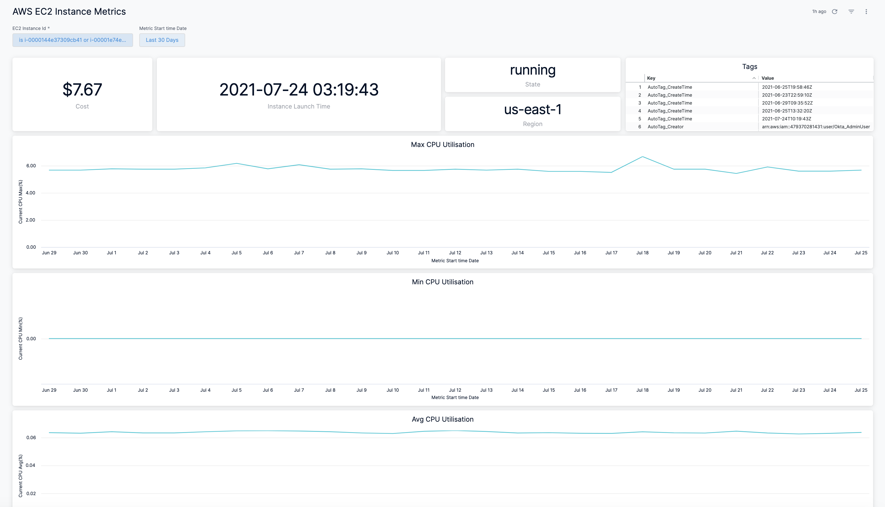
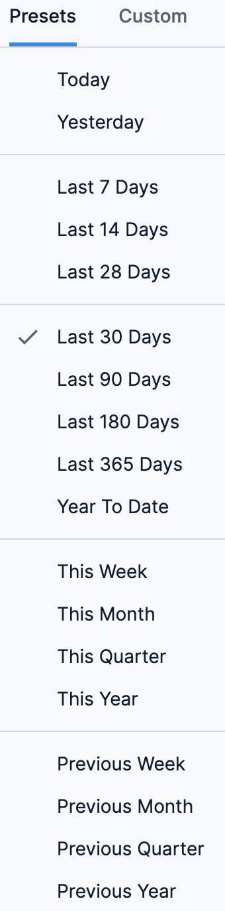
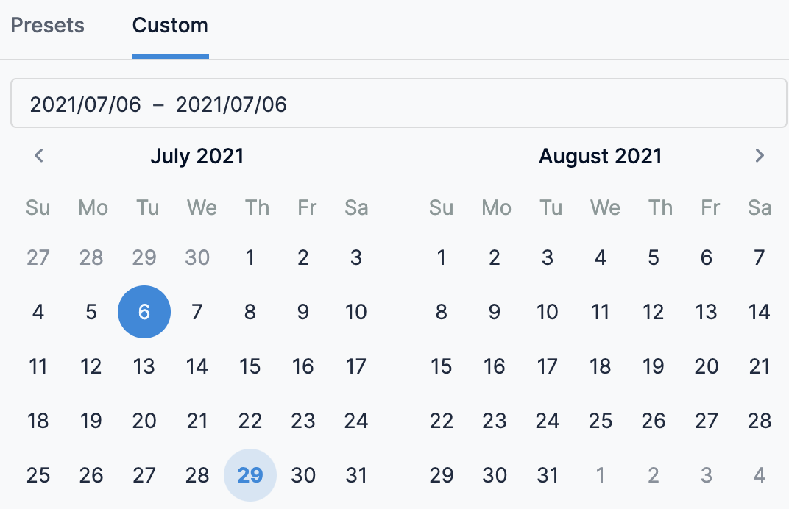

# View AWS EC2 Instance Metrics Dashboard

Harness provides preloaded **By Harness** (pre-defined) and **Custom** (user-defined) Dashboards to visualize cloud cost data across clusters and cloud accounts. Using the **AWS EC2** **Instance Metrics** **Dashboard** you can:

* Discover new analytical insights into your AWS EC2 instances metrics
* Track various cloud cost indicators across different zones and time range
* Explore the cloud cost data in a logical and structured manner
* View your cloud costs at a glance, understand what is costing the most, and analyze cost trends

This Dashboard will not be available if you have not selected **AWS ECS and Resource Inventory Management** feature when setting up [CCM for AWS](../../2-getting-started-ccm/4-set-up-cloud-cost-management/set-up-cost-visibility-for-aws.md).This topic describes how to view the **AWS EC2 Instance Metrics** **Dashboard** and get more information about that data.

## Prerequisites

* Ensure that you have **Dashboard-All View** permissions assigned. See [Manage Access Control for CCM Dashboards](../../2-getting-started-ccm/5-access-control/manage-access-control-for-ccm-dashboards.md).
* Ensure that you have set up Cloud Cost Management (CCM) for the [AWS](../../2-getting-started-ccm/4-set-up-cloud-cost-management/set-up-cost-visibility-for-aws.md) cloud provider.
* Ensure that you have selected **AWS ECS and Resource Inventory Management** feature when creating the AWS connector. 

## Data Ingestion for Dashboard

Once you have set up cost visibility for the AWS cloud provider and the data is available in the Perspective, you can view the dashboard. The data in the Dashboard is updated dynamically.

## View AWS EC2 Instance Metrics Dashboard

Perform the following steps to view AWS EC2 Instance Metrics Dashboard:

1. In Harness, click **Dashboards**.
2. Click **AWS EC2 Instance Metrics Dashboard**.
3. Select **EC2 Instance Id** from the drop-down list for which you want to view the details. You can select multiple IDs.
4. In **Metrics start time date**, select the time duration. You can select the preset value or use custom.  
By default, the **Last 30 Days** is selected.
   1. **Presets**: Select a Preset filter. For example, Today, Yesterday, etc.
   
     
   2. **Custom**: Custom allows you to select the date range.
   
     
5. Select the Public IP Address.
6. Once you have selected all the filters, click **Update**.  
  
The **EC2 Instance Metrics Dashboard** is displayed.

### See Also

Once you have set up cost visibility for your Kubernetes clusters, AWS, GCP, and Azure cloud providers, you can create your own Dashboards. Refer to the following topics to create your own Dashboard and chart data.

* [Create Dashboards](https://developer.harness.io/docs/platform/Dashboards/create-dashboards)
* [Create Visualizations and Graphs](https://developer.harness.io/docs/platform/Dashboards/create-visualizations-and-graphs)

### Next Steps

* [Use Dashboard Actions](https://developer.harness.io/docs/platform/Dashboards/use-dashboard-actions)
* [Download Dashboard Data](https://developer.harness.io/docs/platform/Dashboards/download-dashboard-data)
* [Create Conditional Alerts](https://developer.harness.io/docs/platform/Dashboards/create-conditional-alerts)
* [Schedule and Share Dashboards](https://developer.harness.io/docs/platform/Dashboards/share-dashboards)

