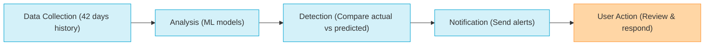

import Tabs from '@theme/Tabs';

import TabItem from '@theme/TabItem';

## Introduction

Infrastructure changes, new services, or inefficient resource utilization can lead to **unexpected fluctuations in cloud expenses**. Harness Cloud Cost Management (CCM) anomaly detection identifies **unusually high cost spikes** and promptly **notifies users**, ensuring better **cost control** and **transparency**.

Harness CCM leverages **advanced detection mechanisms** to monitor cost anomalies across your **Kubernetes clusters** and **cloud accounts**. This feature acts as a safeguard for **managing cloud costs effectively**. Additionally, it includes **built-in alerting capabilities**, sending notifications through notification channels including **email** and **Slack** to ensure stakeholders are informed as soon as anomalies are detected.

<DocVideo src="https://app.tango.us/app/embed/492131d4-a5ea-45e2-bf96-654db9ddf2f1?skipCover=false&defaultListView=false&skipBranding=false&makeViewOnly=true&hideAuthorAndDetails=true" title="Anomaly Detection in Harness CCM" />

## Get Started

Getting started with CCM anomaly detection is straightforward and requires just a few steps:

1. **Set up a Cloud Cost Connector** - Connect your cloud provider accounts (AWS, GCP, Azure) to Harness CCM using the appropriate connectors.

2. **Allow Data Collection** - Once connected, Harness will automatically begin collecting cost data from your cloud environments. The system requires approximately 42 days of historical data for optimal anomaly detection.

3. **Automatic Anomaly Detection** - After data starts flowing in, the anomaly detection system will automatically begin analyzing your cost patterns and identifying potential anomalies. No additional configuration is required for basic anomaly detection.

## Anomaly Detection Process 

CCM's anomaly detection process works through these key steps:

1. **Data Collection**: CCM collects 42 days of historical cost data for each cluster and cloud account
2. **Analysis**: The system processes this data using machine learning models to predict expected costs. CCM uses BigQuery ML (BQML) for advanced anomaly detection:
    -  Models are recreated weekly to forecast the next 8 days' costs for each entity.
    - Predicted costs are compared with actual costs using configurable thresholds.
    - Anomalies are flagged when costs exceed expected ranges.
3. **Detection**: Actual costs are compared against predicted costs to identify anomalies
4. **Notification**: When anomalies are detected, alerts are sent through configured channels

## Managing Anomalies

### Anomaly States

Anomalies exist in one of four states:

- **Active**: Newly detected anomalies that haven't been addressed yet
- **Resolved**: Anomalies that have been reviewed and marked as resolved
- **Ignored**: Anomalies that have been marked as ignored but remain visible for reference
- **Archived**: Anomalies automatically moved to archive after 90 days

### Anomaly Drilldown

Once an anomaly is detected, for each of the anomaly detected, CCM provides insights into what are the resources which might be causing the anomaly. 

When you select an anomaly, you'll see:

    - Cloud account/cluster details (ID, service)
    - Anomaly severity: [Low, Medium, High, Critical](/docs/cloud-cost-management/use-ccm-cost-reporting/anomaly-detection/getting-started-with-ccm-anomaly-detection#q---how-are-anomaly-severity-levels-determined-and-what-do-they-mean)
    - Details:
        - **Start Date**: When the anomaly was first detected
        - **End Date**: When the anomaly period concluded
        - **Duration**: Total time span of the anomalous behavior
        - **Cost Impact**: Financial difference between expected and actual costs
        - **Total Spend**: Complete expenditure during the anomaly period
        - **Expected Range**: Predicted cost range based on historical patterns
    - Cost Trend and Anomalies visualization with historical data (30 or 90 days). This includes data such as:
        - **Anomaly Threshold**: Upper and lower bounds that define normal spending behavior
        - **Expected Average Spend**: Predicted daily cost based on historical patterns
        - **Anomalous Spend**: Actual costs that exceeded the normal threshold range
        - **Spend within Range**: Daily costs that fall within expected parameters
    - Top resource changes contributing to the anomaly
    - Feedback options to improve detection accuracy:
        - **True Expected**: The cost increase was anticipated
        - **True Unexpected**: The cost increase was not anticipated
        - **False**: The system incorrectly identified this as an anomaly

    This feedback helps refine the anomaly detection algorithms for more accurate results over time.

<Tabs>
<TabItem value="screenshot" label="UI Image" default>

<DocImage path={require('./static/drilldown.png')} width="100%" height="100%" title="Click to view full size image" />

</TabItem>
<TabItem value="video" label="Interactive Walkthrough">

<DocVideo src="https://app.tango.us/app/embed/c2f0d526-f77e-4303-be51-a98c4bf2de88?skipCover=false&defaultListView=false&skipBranding=false&makeViewOnly=true&hideAuthorAndDetails=true" title="Anomaly Drilldown" />

</TabItem>
</Tabs>

## Advanced Settings

### Anomaly Alerts

Set up alerts to receive notifications when anomalies are detected without having to check the dashboard. Configuration Options available:

- **Scope**: Select all account data or specific perspectives for anomaly alerts. 
- **Configure the anomaly alert**: Alert conditions follow your set preferences. You may override these thresholds, but only to increase them. Currently, the user can set thresholds for “Alert when cost difference is over ($)” and/or “Alert when cost difference is over (%)” depending on whether they want to define a specific cost amount or a cost percentage.
- **Alert Channel**: Currently, Harness CCM supports Slack and/or e-mail as possible methods of sending alerts.

<Tabs>
<TabItem value="screenshot" label="UI Image" default>

<DocImage path={require('./static/alert.png')} width="100%" height="100%" title="Click to view full size image" />

</TabItem>
<TabItem value="video" label="Interactive Walkthrough">

<DocVideo src="https://app.tango.us/app/embed/3536272f-5e99-4280-a983-81f710de4199?skipCover=false&defaultListView=false&skipBranding=false&makeViewOnly=true&hideAuthorAndDetails=true" title="Anomaly Alerts" />

</TabItem>
</Tabs>

### Anomaly Preferences
Configure system-wide anomaly detection settings to ensure only significant anomalies are flagged:

**Available Settings:**

1. **Minimum Cost Impact (Amount)**: This setting allows you to set a threshold for the cost impact in USD, meaning that anomalies will only be shown if the financial impact exceeds the specified amount.
2. **Minimum Cost Impact (Percentage)**: Similar to the above, this setting enables you to define a threshold based on the percentage of cost increase. Anomalies will only be flagged if the cost increase exceeds the specified percentage of the baseline cost.
3. **Anomaly Persistence**: This setting allows the system to adjust the baseline cost of a resource if an anomaly persists beyond a specified number of days. If an anomaly is not resolved and continues to impact costs for the set duration, the resource's baseline cost is updated to reflect the higher cost. This helps maintain an accurate representation of the resource's true cost over time, ensuring that future anomalies are detected against the adjusted baseline.

<Tabs>
<TabItem value="screenshot" label="UI Image" default>

<DocImage path={require('./static/preferences.png')} width="100%" height="100%" title="Click to view full size image" />

</TabItem>
<TabItem value="video" label="Interactive Walkthrough">

<DocVideo src="https://app.tango.us/app/embed/1ccb1269-f454-40cc-876e-cb4ab0301896?skipCover=false&defaultListView=false&skipBranding=false&makeViewOnly=true&hideAuthorAndDetails=true" title="Anomaly Preferences" />

</TabItem>
</Tabs>

## FAQs

#### Q - What happens after CCM detects an anomaly and how does it help me identify the root cause?

CCM queries the cloud provider's cost data and identifies resources that have experienced significant cost increases compared to previous periods. The system:

- Aggregates total costs for each resource
- Computes cost increases/decreases compared to the previous day
- Ranks resources by highest cost increase
- Stores anomalies in a time series database with metadata (reported cost, expected cost, anomaly score)
- Flags anomalies for investigation and corrective action

#### Q -  How can I filter anomalies by cloud provider?

Harness provides filtering support for anomalies based on cloud account identifiers, ensuring alignment with perspective-based access control (RBAC) settings.

**Filtering Support by Cloud Provider:**

| Cloud Provider | Supported Filter | Limitations |
|----------------|------------------|-------------|
| **AWS** | AWS Account ID | Nested Cost Categories not supported |
| **GCP** | GCP Project ID | Nested Cost Categories not supported |
| **Azure** | Azure Subscription ID | Nested Cost Categories not supported |

#### Q - How are anomaly severity levels determined and what do they mean?

Anomalies are categorized by severity based on deviation from expected behaviour:

| Severity | Description |
|----------|-------------|
| **Low** | Minor deviations |
| **Medium** | Noticeable change, warrants review |
| **High** | Significant impact or deviation |
| **Critical** | Large cost jumps, requires immediate investigation |