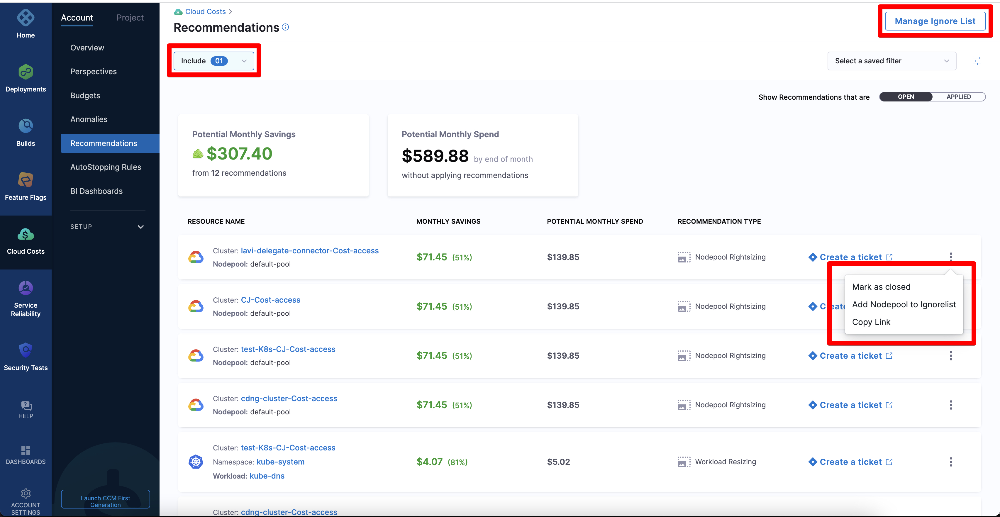
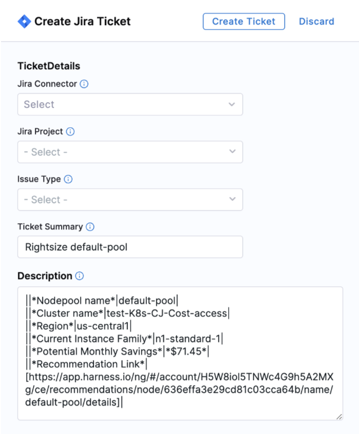
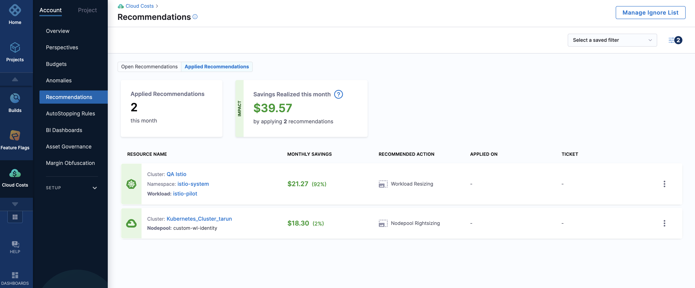
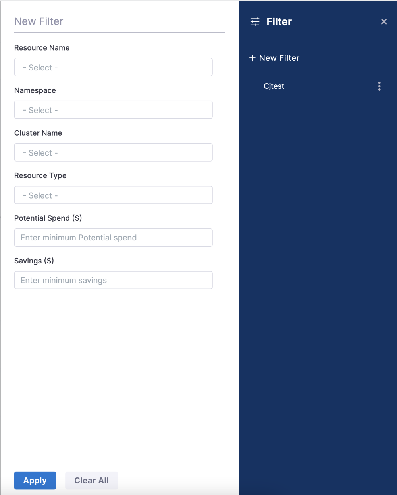

:::note
After you enable CCM, it may take up to 48 hours for the recommendations to appear in Cloud Costs. It depends on the time at which CCM receives the utilization data for the service. In **Cloud Costs**, go to the **Recommendations** page.
:::
## Before you begin
To know how these recommendations are computed, see the following topics:
* [Optimize AWS ECS Costs with Recommendations](../1-ccm-recommendations/ecs-recommendations.md)
* [Optimize Kubernetes Costs with Node Pool Recommendations](../1-ccm-recommendations/node-pool-recommendations.md)
* [Optimize Kubernetes Costs with Workload Recommendations](../1-ccm-recommendations/workload-recommendations.md)

## View recommendations
The Recommendations page displays the following information:

* A breakdown of all the available recommendations.
* **Potential Monthly Savings** across your ECS clusters if you apply the recommendations.
* **Forecasted Monthly Spend** across your ECS clusters if you do not apply the recommendations.
  
If you do not want to view the recommendations for the child resources such as Workloads, deselect the **Child Resources** checkbox in the **Include** dropdown list at the top of the page.

The **Recommendation Breakdown** displays the following information:

| Column name | Description |
| --- | --- |
| **Resource Name** | Name of the resource for which CCM displays the recommendation. |
| **Monthly Savings** | Potential monthly savings for your resource, if you apply the recommendations. |
| **Potential Monthly Spend** | The monthly cost of the recommendation. |
| **Recommendation Type** | Type of recommendation for your resource. For example, **rightsizing** or **resizing**. Based on your resource type, CCM recommends rightsizing or resizing your CPU, memory, or node counts. |

## Ignore list
You can ignore a recommendation for your node pool or workload. Click the **More actions** icon (three vertical dots), and then click **Add Nodepool to Ignore list** or **Add Workload to Ignore list**.

If you want to view the ignored recommendations in the table, select the **Ignore List** checkbox in the **Include** dropdown list at the top of the page.

To remove a recommendation from the ignore list, click **Manage Ignore List**. Then, click **Remove**.

## Apply recommendations
You can use the **Create a ticket** link to raise a JIRA ticket to apply the recommendations.

1. Click **Create a ticket**.
2. Enter the following details:
   * **Jira connector** — Select the connector if you have created one already. Otherwise, [create a new connector](1-home-recommendations.md#create-a-jira-connector). 
   * **Jira project** — Select the Jira project where you want to create a ticket. Go to [Create Jira Issues in CD Stages](/docs/continuous-delivery/x-platform-cd-features/cd-steps/ticketing-systems/create-jira-issues-in-cd-stages.md).
   * **Issue type** — Select a Jira issue type from the list of types in the Jira project you selected. Go to [Create Jira Issues in CD Stages](/docs/continuous-delivery/x-platform-cd-features/cd-steps/ticketing-systems/create-jira-issues-in-cd-stages.md).
   * **Ticket summary** — Add a summary of the issue.
   * **Description** — Add a description for the issue.
3. Click **Create Ticket**. 
   The status of the ticket is **To do**. You need to assign the ticket to apply the recommendations. After applying the recommendations, when the Jira status changes to **Done**, the recommendation is displayed in the **Applied** tab. 
   If you have not changed the Jira status to **Done** after applying the recommendation, you could use the **More actions** icon (three vertical dots), and then click **Mark as closed** to move the recommendation to the **Applied** tab.
   To view the recommendations that are applied, and the cost savings realized, click the **Applied** tab.

     

### Create a Jira connector
1. In the **Overview** step, enter the name. 
2. Optionally, enter a short description and tags.
3. In the **Details** step, enter the base URL. For example, https://mycompany.atlassian.net. For more information, go to [Configuring the base URL](https://confluence.atlassian.com/adminjiraserver071/configuring-the-base-url-802593107.html).
4. Enter the email ID used to log in to your Jira account.
5. Create or select a Harness encrypted test secret for the API key. To create a secret, go to [Add and reference text secrets](/docs/platform/Secrets/add-use-text-secrets).
6. In the **Delegates Setup** step, select one of the following options: 
   * **Use any available Delegate**: Select this option to let Harness choose a Delegate at runtime.
   When a task is ready to be assigned, the Harness Manager first validates its lists of Delegates to assign the task.
   The following information describes how the Harness Manager validates and assigns tasks to a Delegate:
     
      * **Heartbeats**: Running Delegates send heartbeats to the Harness Manager in one-minute intervals. If the Manager does not have a heartbeat for a Delegate when a task is ready to be assigned, it will not assign the task to that Delegate.
     
      * **Tags**: see [Select Delegates with Tags](../../../platform/2_Delegates/manage-delegates/select-delegates-with-selectors.md).
       
      * **Allowlisting**: After a Delegate is validated for a task, it is allowlisted for that task. This Delegate is likely to be used again for that task. The allowlisting criteria is the URL associated with the task, such as a connection to a cloud platform, repo, or API. A Delegate is allowlisted for all tasks using that URL. The Time-To-Live (TTL) for the allowlisting is 6 hours, and the TTL is reset with each successful task validation.
     
      * **Blocklisting**: If a Delegate fails to perform a task, it is blocklisted for that task. This Delegate is not selected again to perform that task. TTL is five minutes. This is true even if there is only one Delegate and the Delegate is selected for that task with a Selector.

   * **Only use Delegates with all of the following tags**: Select this option to use specific Delegates using their Tags. 
   You only need to select one of a Delegate's Tags to select it. All Delegates with the Tag are selected. This option is useful when you have installed specific software on specific Delegates and want to ensure that your Pipeline uses those Delegates.
7. Click **Save and Continue**. The Connector is created and validated. 

You can create and use filters to select resources and recommendations.

You can filter by:

* **Resource Name** — The name of the resource being monitored.
* **Namespace** — A namespace in the cluster.
* **Cluster Name** — A cluster in your infrastructure.
* **Resource Type** — The type of resources for which the recommendation is displayed. Currently, CCM supports ECS service, node pool, and workload.
* **Savings** — Enter the minimum monthly savings. For example, all the recommendations with potential monthly savings of more than $1000.
* **Potential Spend** — Filter by forecasted monthly spend greater than the specified amount. For example, all the recommendations with forecasted monthly spend of more than $1000.

The recommendation for the selected resource is displayed.

Click a recommendation to view its details.

Within a recommendation, select the number of days to compute recommendations based on the utilization data. You can select the last day, 7 days, or 30 days.

You can use this information to optimize your resources to potentially reduce your monthly cloud costs.