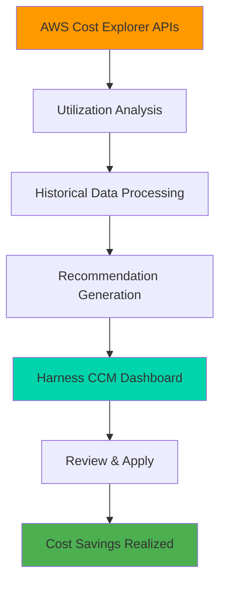

import Tabs from '@theme/Tabs';
import TabItem from '@theme/TabItem';

# AWS EC2 Recommendations

Optimize your AWS EC2 infrastructure costs with intelligent recommendations that analyze utilization patterns and suggest right-sizing opportunities. Harness CCM leverages AWS Cost Explorer APIs to provide actionable insights for reducing your EC2 spending by 20-40%.

## Overview

<Tabs>
<TabItem value="benefits" label="Key Benefits" default>
    
### Cost Optimization Benefits

| Benefit | Impact | Typical Savings |
|---------|--------|-----------------|
| **Right-sizing** | Optimize instance types based on actual usage | 20-30% |
| **Decommissioning** | Identify and remove unused instances | 10-15% |
| **Family Optimization** | Migrate to modern instance families | 15-25% |
| **Total Potential** | Combined optimization impact | **20-40%** |

### What You'll Achieve

- **Immediate Cost Reduction**: See savings within days of implementation
- **Performance Optimization**: Right-sized instances perform better
- **Resource Efficiency**: Eliminate waste and over-provisioning
- **Data-Driven Decisions**: AWS Cost Explorer powered insights

</TabItem>
<TabItem value="how-it-works" label="How It Works">
    
### Recommendation Process



### Data Sources & Analysis

- **Source**: AWS Cost Explorer APIs (not computed by Harness)
- **Analysis Period**: Last 30 days of utilization data
- **Metrics**: CPU and Memory utilization patterns
- **Accuracy**: AWS-native recommendations with proven savings calculations

</TabItem>
<TabItem value="types" label="Recommendation Types">
    
### Instance Resizing

**Optimize instance size based on actual usage patterns**

| Scenario | Current State | Recommendation | Expected Savings |
|----------|---------------|----------------|------------------|
| Over-provisioned | t3.large (2 vCPU, 8GB) | t3.medium (2 vCPU, 4GB) | 25-30% |
| Under-utilized | m5.xlarge (4 vCPU, 16GB) | m5.large (2 vCPU, 8GB) | 40-50% |
| Family upgrade | t2.medium (2 vCPU, 4GB) | t3.medium (2 vCPU, 4GB) | 15-20% |

### Decommissioning

**Identify instances for termination**

- **Idle Instances**: No significant activity for extended periods
- **Zombie Resources**: Instances running but not serving traffic
- **Development Cleanup**: Forgotten dev/test environments
- **Typical Impact**: 100% cost elimination for unused resources

</TabItem>
</Tabs>

## Prerequisites

### Required Setup

<Tabs>
<TabItem value="connector" label="AWS Connector Setup" default>
    
1. **Connect AWS Account**: [Set up cost visibility for AWS](../../../get-started/onboarding-guide/set-up-cost-visibility-for-aws.md)
2. **Enable Inventory Management**: Required for EC2 recommendations
3. **Cost Explorer Access**: Ensure proper IAM permissions

### Required Permissions

```json
{
    "Version": "2012-10-17",
    "Statement": [
        {
            "Effect": "Allow",
            "Action": [
                "ce:GetRightsizingRecommendation",
                "ce:GetUsageAndCosts",
                "support:DescribeTrustedAdvisorChecks"
            ],
            "Resource": "*"
        }
    ]
}
```

</TabItem>
<TabItem value="perspectives" label="Perspectives Setup">
    
### Organize Your Data

Create [Perspectives](../../../3-use-ccm-cost-reporting/1-ccm-perspectives/1-create-cost-perspectives.md) to:

- **Group by Environment**: Production, Staging, Development
- **Organize by Team**: Engineering, Marketing, Operations
- **Filter by Region**: us-east-1, eu-west-1, ap-south-1
- **Categorize by Purpose**: Web servers, Databases, Analytics

### 💡 Best Practices

- Create environment-specific perspectives for targeted optimization
- Use cost categories to align with business units
- Set up RBAC to control recommendation access

</TabItem>
<TabItem value="monitoring" label="Monitoring Setup">
    
### Enhanced Metrics Collection

#### CPU Metrics (Automatic)
- **CloudWatch**: Enabled by default
- **Collection**: Every 5 minutes
- **Retention**: 15 months

#### Memory Metrics (Optional)
- **CloudWatch Agent**: Install on instances
- **External Integration**: Datadog, Dynatrace, New Relic
- **AWS Compute Optimizer**: External metrics ingestion

### Important Notes

:::warning Memory Metrics Limitation
When using external metrics (e.g., Datadog), recommendations consider memory data but utilization graphs may not display memory metrics due to AWS API limitations.
:::

</TabItem>
</Tabs>

## How EC2 Recommendations Work

### Intelligence Behind Recommendations

:::info AWS-Powered Analysis
- **Data Source**: AWS Cost Explorer APIs
- **Calculation Reference**: [AWS EC2 Recommendations – Savings Calculation](https://docs.aws.amazon.com/cost-management/latest/userguide/understanding-rr-calc.html#savings-calc)
- **Exclusions**: Reserved Instance (RI) and Savings Plan (SP) discounts not factored
:::

### Analysis Process

1. **Data Collection**: 30 days of CPU/Memory utilization
2. **Pattern Recognition**: Identify usage trends and peaks
3. **Right-sizing Logic**: Match workload to optimal instance type
4. **Savings Calculation**: Compute potential monthly savings
5. **Recommendation Generation**: Present actionable insights

## Enable EC2 Recommendations

<Tabs>
<TabItem value="aws-setup" label="AWS Console Setup" default>
    
### AWS Configuration Steps

1. **Enable Cost Explorer**
   - Go to AWS Billing Console
   - Enable Cost Explorer (if not already enabled)
   - Wait 24 hours for data population

2. **Configure Compute Optimizer**
   - Navigate to AWS Compute Optimizer
   - Enable service for your account
   - Opt-in to recommendations

3. **Set IAM Permissions**
   - Add Cost Explorer permissions to your IAM role
   - Include Trusted Advisor access (if available)

**Detailed Guide**: [Enable EC2 recommendations](../../../get-started/onboarding-guide/set-up-cost-visibility-for-aws.md#enable-ec2-recommendations)

</TabItem>
<TabItem value="harness-setup" label="Harness Configuration">
    
### Harness CCM Setup

1. **Create AWS Connector**
   - Select **Inventory Management** feature
   - Configure cross-account IAM role
   - Test connection and permissions

2. **Add Cost Explorer Permissions**

<DocImage path={require('../static/aws-setup.png')} width="70%" height="70%" title="AWS CCM Connector Setup" />

3. **Verify Data Collection**
   - Wait 24-48 hours for initial data sync
   - Check Recommendations page for EC2 data

### Quick Validation

- Navigate to **Cloud Costs** → **Recommendations**
- Filter by `EC2_INSTANCE` type
- Verify recommendations appear

</TabItem>
</Tabs>

## View and Analyze Recommendations

<Tabs>
<TabItem value="dashboard" label="Recommendations Dashboard" default>
    
### Access Your Recommendations

1. **Navigate**: **Cloud Costs** → **Recommendations**
2. **Filter**: Select `EC2_INSTANCE` from **Recommendation Type**
3. **Analyze**: Click on specific recommendations for details

<DocImage path={require('../static/aws-ec-recommendation.png')} width="70%" height="70%" title="EC2 Recommendations Dashboard" />

### Key Metrics Displayed

| Metric | Description | Use Case |
|--------|-------------|----------|
| **Potential Monthly Savings** | Cost reduction estimate | Budget planning |
| **Current vs Recommended** | Configuration comparison | Technical review |
| **Utilization Graphs** | CPU/Memory usage patterns | Performance analysis |
| **Recommendation Type** | Resize or Decommission | Action planning |

</TabItem>
<TabItem value="details" label="Detailed Analysis">
    
### Recommendation Details

Each recommendation provides comprehensive insights:

#### Financial Impact
- **Current Monthly Cost**: Existing spend
- **Recommended Monthly Cost**: Projected spend
- **Monthly Savings**: Absolute and percentage reduction
- **Annual Impact**: Yearly savings projection

#### Technical Specifications
- **Instance Family**: Current vs recommended
- **CPU/Memory**: Resource allocation comparison
- **Region**: Geographic location
- **Utilization**: Historical usage patterns

#### Performance Data
- **CPU Utilization Graph**: Maximum and average usage
- **Memory Utilization**: Resource consumption patterns
- **Time Series**: 30-day historical view

</TabItem>
<TabItem value="tuning" label="Tune Recommendations">
    
### Customization Options

#### Recommendation Scope
- **Within Same Family**: Conservative approach, stay in current instance family
- **Across Families**: Aggressive optimization, maximum savings potential

#### Preset Options
- **Default Presets**: AWS standard recommendations
- **Custom Presets**: Your organization's specific requirements

#### Optimization Strategy

| Strategy | Risk Level | Savings Potential | Best For |
|----------|------------|-------------------|----------|
| **Conservative** | Low | 15-25% | Production workloads |
| **Balanced** | Medium | 25-35% | Most environments |
| **Aggressive** | Higher | 35-50% | Dev/test environments |

</TabItem>
</Tabs>

## Interactive Walkthrough

<Tabs>
<TabItem value="step-by-step" label="Step-by-Step Guide" default>
    
### Complete EC2 Optimization Walkthrough

Follow this interactive guide to optimize your EC2 costs:

<iframe 
    src="https://app.tango.us/app/embed/dad175fe-fa12-4235-96de-46c275839866" 
    title="AWS EC2 Recommendations - Complete Walkthrough" 
    style={{minHeight:'640px'}}
    width="100%" 
    height="100%" 
    referrerpolicy="strict-origin-when-cross-origin" 
    frameborder="0" 
    webkitallowfullscreen="webkitallowfullscreen" 
    mozallowfullscreen="mozallowfullscreen" 
    allowfullscreen="allowfullscreen">
</iframe>

</TabItem>
<TabItem value="quick-actions" label="Quick Actions">
    
### Common Actions

#### Filter Recommendations
1. Click the **Filter** icon
2. Select **Recommendation Type** → `EC2_INSTANCE`
3. Apply additional filters (Region, Account, etc.)
4. Click **Apply**

#### Analyze Specific Instance
1. Click on any recommendation row
2. Review utilization graphs
3. Compare current vs recommended specs
4. Note potential savings

#### Tune Recommendations
1. Scroll to **Tune Recommendations** section
2. Choose optimization scope
3. Apply presets or custom settings
4. Review updated recommendations

#### Apply Recommendations
1. Document the recommended changes
2. Plan implementation during maintenance window
3. Update instance configurations
4. Monitor performance post-change

</TabItem>
<TabItem value="best-practices" label="Best Practices">
    
### Implementation Best Practices

#### Phased Approach
1. **Start Small**: Begin with dev/test environments
2. **Monitor Impact**: Track performance and costs
3. **Scale Gradually**: Expand to production workloads
4. **Continuous Optimization**: Regular review cycles

#### Pre-Implementation Checklist
- [ ] Backup critical data
- [ ] Plan maintenance window
- [ ] Notify stakeholders
- [ ] Prepare rollback plan
- [ ] Monitor key metrics

#### Tuning Guidelines
- **Production**: Use conservative settings
- **Development**: Apply aggressive optimization
- **Staging**: Balance cost and performance
- **Analytics**: Optimize for batch processing patterns

#### Success Metrics
- **Cost Reduction**: Track monthly savings
- **Performance Impact**: Monitor application metrics
- **Resource Utilization**: Improved efficiency ratios
- **Team Satisfaction**: Reduced infrastructure overhead

</TabItem>
</Tabs>

## Advanced Configuration

### Enhanced Monitoring

<Tabs>
<TabItem value="cloudwatch" label="CloudWatch Integration" default>
    
#### CPU Metrics (Automatic)
- **Enabled by default** for all EC2 instances
- **Collection frequency**: Every 5 minutes
- **Retention period**: 15 months
- **No additional cost** for basic metrics

#### Memory Metrics (Advanced)
To enable memory utilization in recommendations:

1. **Install CloudWatch Agent**
   ```bash
   # Download and install CloudWatch agent
   wget https://s3.amazonaws.com/amazoncloudwatch-agent/amazon_linux/amd64/latest/amazon-cloudwatch-agent.rpm
   sudo rpm -U ./amazon-cloudwatch-agent.rpm
   ```

2. **Configure Memory Monitoring**
   ```json
   {
     "metrics": {
       "namespace": "CWAgent",
       "metrics_collected": {
         "mem": {
           "measurement": ["mem_used_percent"]
         }
       }
     }
   }
   ```

</TabItem>
<TabItem value="external-metrics" label="External Metrics">
    
#### Third-Party Integration

AWS Compute Optimizer supports external metrics from:

- **Datadog**: Application performance monitoring
- **Dynatrace**: Full-stack monitoring
- **Instana**: Automatic application monitoring  
- **New Relic**: Observability platform

#### Setup Process
1. Configure your monitoring tool
2. Enable AWS Compute Optimizer integration
3. Grant necessary permissions
4. Wait 24-48 hours for data ingestion

#### Important Limitation
:::warning External Metrics Display
When using external metrics, recommendations will consider the data but memory utilization graphs may not display in the Harness interface due to AWS API limitations.
:::

</TabItem>
</Tabs>

## Troubleshooting

### Common Issues

<Tabs>
<TabItem value="no-recommendations" label="No Recommendations" default>
    
#### No Recommendations Appearing

**Possible Causes:**
- Insufficient data (need 30+ days)
- Missing IAM permissions
- Cost Explorer not enabled
- Inventory Management feature disabled

**Solutions:**
1. **Check Data Age**: Ensure instances have 30+ days of data
2. **Verify Permissions**: Review IAM role permissions
3. **Enable Cost Explorer**: Activate in AWS Billing console
4. **Update Connector**: Ensure Inventory Management is enabled

</TabItem>
<TabItem value="permission-errors" label="Permission Issues">
    
#### Permission Errors

**Required IAM Permissions:**
```json
{
    "Version": "2012-10-17",
    "Statement": [
        {
            "Effect": "Allow",
            "Action": [
                "ce:GetRightsizingRecommendation",
                "ce:GetUsageAndCosts",
                "ce:ListCostCategoryDefinitions",
                "support:DescribeTrustedAdvisorChecks"
            ],
            "Resource": "*"
        }
    ]
}
```

**Validation Steps:**
1. Test IAM role in AWS console
2. Verify cross-account trust relationship
3. Check policy attachments
4. Test API calls manually

</TabItem>
<TabItem value="data-issues" label="Data Quality">
    
#### Data Quality Issues

**Missing Memory Data:**
- Install CloudWatch agent on instances
- Configure memory metrics collection
- Allow 24-48 hours for data population

**Inaccurate Recommendations:**
- Verify instance tagging
- Check for seasonal workload patterns
- Consider Reserved Instance usage
- Review external metrics integration

**Delayed Updates:**
- Recommendations update daily
- New instances need 30+ days of data
- Cost Explorer has 24-hour delay

</TabItem>
</Tabs>

## Next Steps

### Optimization Journey

1. **Start Here**: Review your first EC2 recommendations
2. **Expand Scope**: Explore [Container Recommendations](../container-recommendations/) for ECS workloads
3. **Comprehensive View**: Check [Governance Recommendations](../governance-recommendations/) for unused resources
4. **Advanced Features**: Configure [Currency Preferences](../settings/currency-preferences.md) for global teams

### Additional Resources

- **AWS Documentation**: [EC2 Right Sizing](https://docs.aws.amazon.com/AWSEC2/latest/UserGuide/ec2-instance-resize.html)
- **Best Practices**: [AWS Well-Architected Cost Optimization](https://docs.aws.amazon.com/wellarchitected/latest/cost-optimization-pillar/welcome.html)
- **Community**: [Harness Community Forum](https://community.harness.io)
- **Support**: [Contact Harness Support](mailto:support@harness.io)

---

**Ready to optimize your EC2 costs?** Start by reviewing your recommendations and implementing changes in a test environment first. Remember to monitor performance metrics after applying any changes to ensure optimal results.
