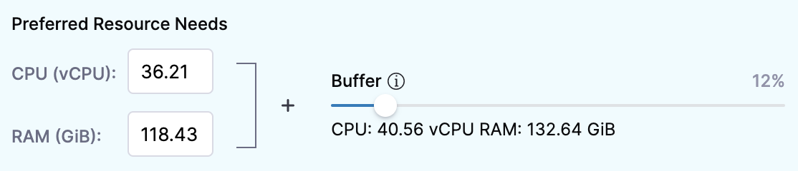
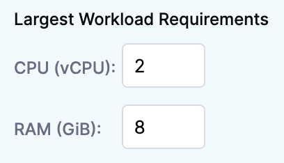
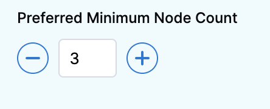
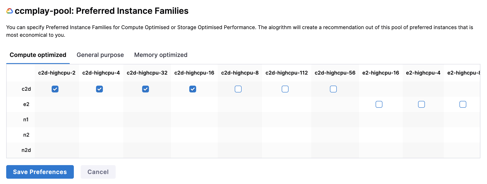
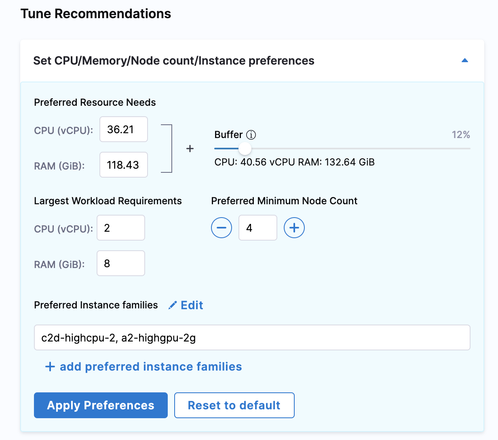

# Optimize Kubernetes costs with node pool recommendations
One of the most impactful ways to reduce spend on Kubernetes infrastructure is to make sure your clusters are optimally sized for the workloads and node pools they run. Harness CCM recommends optimal compute resources for your workloads and node pools to help you reduce costs and improve performance.

Recommendations are produced by analyzing your historical utilization metrics. CCM recommends you choose the optimal resource configuration based on your utilization data and requests metrics for pods.

This topic describes how CCM computes node pool recommendations and how you can use them to potentially reduce monthly costs.


:::note
Before using recommendations in your cluster environment, ensure that you evaluate their impact thoroughly. The person reviewing the recommendations should be able to understand the impacts identified in the recommendations, as well as the impact on the infrastructure and business.  
  
Using recommendations without proper assessment could result in unexpected changes, such as issues with system performance or poor reliability.
:::


:::important note
Recommendations will not be generated for nodepools with multiple instance families. This applies to both native-managed clusters and clusters that are managed by third-party tools like spot.io.
:::

## Before You begin

* [Set Up Cloud Cost Management for Kubernetes](../../2-getting-started-ccm/4-set-up-cloud-cost-management/set-up-cost-visibility-for-kubernetes.md)
* [CCM Perspectives](../../3-use-ccm-cost-reporting/1-ccm-perspectives/1-create-cost-perspectives.md)

## Prerequisites

Harness CCM uses labels to process node pool recommendations. Make sure to add one of the labels listed in the following table for the respective cloud providers:


|  **Cloud provider**| **Labels** |
| --- | --- |
| Amazon Web Services (AWS) |<ul><li>`eks.amazonaws.com/nodegroup​`</li> <li>`alpha.eksctl.io/nodegroup-name​`</li><li> `node-pool-name​`</li><li> `kops.k8s.io/instancegroup`</li><li>`nodegroup​`</li></ul>|
| Google Cloud Platform (GCP) |  <ul><li>`cloud.google.com/gke-nodepool`</li><li> `nodegroup​`</li><li>`kops.k8s.io/instancegroup`</li></ul>|
| Microsoft Azure | <ul><li> `Agentpool​`</li><li> `node-pool-name​` </li><li> `nodegroup​`</li><li>`kops.k8s.io/instancegroup`</li></ul>|

## How are node pool recommendations computed?

The node pool recommendations are computed by analyzing historical utilization data and requests metrics of Pods. CCM recommends the optimal resource configurations for the Spot and On-demand instances. It uses the following parameters to determine the maximum node counts:

* Total CPUs
* Total memory
* Max CPUs
* Max Memory

The recommendations are calculated by aggregating the resource utilization and request across all pods running across nodes in the node pool. You can select the number of days to compute recommendations based on the utilization data. The available options are last 1 day, 7 days, and 30 days.


```
CPU, Memory: Max at a given instant [Aggregated Max(resource Utilization, requests)]
```
Let's try to understand how the recommendations are computed using the following example. Assume there are two nodes in a node pool, each with two pods running.


```
Time Instant 1:  
Node1:  
  Pod1:  
  Util → 2.1 vCPU, Request → 4 vCPU  
  Pod2:  
  Util → 1.4 vCPU, Request → 1 vCPU  
  
Node2:  
  Pod1:  
  Util → 1.1 vCPU, Request → 4 vCPU  
  Pod2:  
  Util → 0.9 vCPU, Request → 1 vCPU  
  
Time Instant 2:  
Node1:  
  Pod1:  
  Util → 2.2 vCPU, Request → 4 vCPU  
  Pod2:  
  Util → 1.5vCPU, Request → 1 vCPU  
Node2:  
  Pod1:  
  Util → 2.0 vCPU, Request → 4 vCPU  
  Pod2:  
  Util → 0.3 vCPU, Request → 1 vCPU
```
The recommendations are calculated as the following:


```
Time Instant 1: [ Max (2.1, 4) + Max (1.4, 1)+ Max (1.1, 4)+ Max (0.9,1)] = [4 + 1.4 + 4 + 1] => 10.4  
  
Time Instant 2: [ Max (2.2, 4) + Max (1.5, 1)+ Max (2, 4)+ Max (0.3,1)] = [4 + 1.5 + 4 + 1] => 10.5  
  
So the Max CPU recommendation would be: Max (10.4, 10.5) = **10.5 vCPU**
```
Similarly, for memory, nodes will be the max number of nodes in the observation interval.

Node pool recommendations also offer the flexibility of tuning the recommendations by setting the resource configuration preferences. See **Tune Recommendations**.


### Tune and share recommendations

You can tune your recommendations by modifying the value of CPU, memory, node counts, and instances.

You can also add a buffer to the resource preferences.

CCM generates context-aware cluster sizing recommendations based on the resource configurations that you provide.

To tune your recommendations, set your preferences for the following resources:

* CPU
* RAM
* Preferred Minimum Node count
* Preferred Instance families

#### Option: Preferred resource needs

The value for CPU and memory is auto-populated by aggregating the resource utilization and request across all pods running across nodes in the node pool. 

* **CPU (vCPU)**: Set preferences for the CPU.
* **RAM (GiB)**: Set preferences for memory.
* **Buffer**: This section allows you to add an additional buffer to the resources for calculating the recommendations.

By default, the recommendation computation adds a 15% buffer to the recommended resources. This option allows you to add an additional buffer to your resources.



Once you apply the preferences, modified values are used for calculating the recommendations.

#### Option: Largest workload requirements

The maximum workload that is observed based on the historical utilization that is scheduled on the nodes is used to calculate the value for this field. You can customize your CPU (vCPU) and RAM options (GiB).



#### Option: Preferred minimum node count

This option allows you to set the number of minimum nodes that are used for the recommendation. Use the **+** button to increase the node count and click **-** to decrease the node count.



#### Option: Preferred instance families

You can use this option to limit the recommendations to a certain machine type/instance family. For example, you have RIs/commitments on a specific machine type and only want to use that instance family.

In **Preferred Instance families**, click **add preferred instance families**.

Select your preferences and click **Save Preferences**. The category of the instance families will depend on the cloud provider type. The following example shows the GKE.



Once, you've made all the changes, click **Apply Preferences** or click **Reset to default**.



#### Sharing recommendations

When you tune a recommendation, the URL for the recommendation captures your changes.

You can see the changes following `details?` in the URL. For example, `details?buffer=10&QoS="GUARANTEED"`.

Capturing your changes in the URL enables you to share your tuned recommendation and ensure others can see you tuning. Simply tune the recommendation and then share the URL.

### Next steps

* [Optimize Kubernetes Costs with Workload Recommendations](../../4-use-ccm-cost-optimization/1-ccm-recommendations/workload-recommendations.md)

