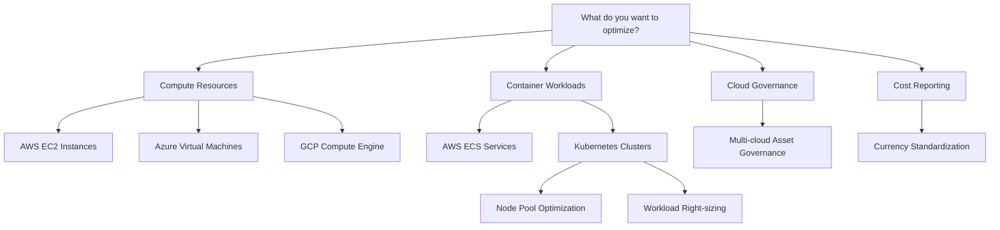

import Tabs from '@theme/Tabs';
import TabItem from '@theme/TabItem';

# CCM Recommendations Overview

Harness Cloud Cost Management (CCM) provides intelligent recommendations to help you optimize your cloud infrastructure costs. Our recommendations analyze your historical usage patterns and suggest right-sizing, resource optimization, and governance improvements across multiple cloud providers and resource types.

:::note
After you enable CCM, it may take up to 48 hours for recommendations to appear. The time depends on when CCM receives utilization data for your services.
:::

## Quick Start Guide

### 1. Choose Your Recommendation Type

Use this decision tree to find the right recommendations for your infrastructure:

### 2. Prerequisites by Cloud Provider

| Cloud Provider | Required Setup | Recommendation Types Available |
|---|---|---|
| **AWS** | [Cost Visibility Setup](../../get-started/onboarding-guide/set-up-cost-visibility-for-aws.md) + Inventory Management | EC2, ECS, Governance |
| **Azure** | [Cost Visibility Setup](../../get-started/onboarding-guide/set-up-cost-visibility-for-azure.md) + Inventory Management | Virtual Machines, Governance |
| **GCP** | [Cost Visibility Setup](../../get-started/onboarding-guide/set-up-cost-visibility-for-gcp.md) + Cloud Governance | Governance |
| **Kubernetes** | [K8s Cost Visibility Setup](../../get-started/onboarding-guide/set-up-cost-visibility-for-kubernetes.md) | Node Pools, Workloads |

## Recommendation Types Comparison

### Compute Recommendations
Optimize individual virtual machines and compute instances based on utilization patterns.

| Type | Cloud Provider | Optimization Focus | Typical Savings |
|---|---|---|---|
| **EC2 Recommendations** | AWS | Instance right-sizing, family optimization | 20-40% |
| **Azure VM Recommendations** | Azure | VM right-sizing, shutdown idle VMs | 15-35% |

**Best for**: Traditional workloads, long-running services, predictable usage patterns

[→ Explore Compute Recommendations](./compute-recommendations/)

### Container Recommendations
Optimize containerized workloads and orchestration platforms.

| Type | Platform | Optimization Focus | Typical Savings |
|---|---|---|---|
| **ECS Recommendations** | AWS ECS | Task definition optimization, resource allocation | 25-45% |
| **Node Pool Recommendations** | Kubernetes | Cluster node optimization, instance family selection | 20-40% |
| **Workload Recommendations** | Kubernetes | Pod resource requests/limits optimization | 30-50% |

**Best for**: Microservices, dynamic workloads, containerized applications

[→ Explore Container Recommendations](./container-recommendations/)

### Governance Recommendations
Identify unused, idle, or misconfigured resources across your cloud infrastructure.

| Cloud Provider | Resource Coverage | Focus Areas |
|---|---|---|
| **AWS** | EC2, EBS, ELB, S3, Lambda, RDS, CloudFormation | Unused resources, security compliance |
| **Azure** | VMs, Storage, App Services, Cosmos DB, SQL | Idle resources, cost optimization |
| **GCP** | Compute Engine, Cloud Storage, App Engine, Cloud SQL | Resource cleanup, efficiency |

**Best for**: Cost governance, compliance, resource cleanup

[→ Explore Governance Recommendations](./governance-recommendations/)

## How to Use Recommendations

### 1. View Recommendations
1. Navigate to **Cloud Costs** → **Recommendations**
2. Use filters to focus on specific:
   - Recommendation types
   - Cloud providers
   - Cost categories
   - Resource names

### 2. Analyze Impact
Each recommendation shows:
- **Potential Monthly Savings**: Cost reduction estimate
- **Current vs Recommended**: Resource configuration comparison
- **Utilization Data**: Historical usage patterns
- **Risk Assessment**: Performance impact analysis

### 3. Apply Recommendations
- **Manual Implementation**: Use provided configuration details
- **Ticketing Integration**: Create Jira/ServiceNow tickets
- **Track Applied Recommendations**: Monitor actual vs estimated savings

## Latest Features

:::tip [Latest Features Released in 1.47.0](/release-notes/cloud-cost-management#april-2025---version-1470)
<Tabs>
  <TabItem value="Improved Recommendation Tracking" label="Improved Recommendation Tracking">
    Users can now specify estimated savings when marking recommendations as applied and track actual vs estimated savings over time.
  </TabItem>
  <TabItem value="Cost Categories Integration" label="Cost Categories Integration">
    Filter recommendations by Cost Categories for better organization in large-scale environments with thousands of recommendations.
  </TabItem>
  <TabItem value="Recommendations Filter Revamp" label="Recommendations Filter Revamp">
    Enhanced filter panel provides a more streamlined experience for finding relevant recommendations.
  </TabItem>
</Tabs>
:::

## Best Practices

### Before Applying Recommendations
1. **Evaluate Impact**: Understand performance implications
2. **Test in Non-Production**: Validate changes in staging environments
3. **Plan Maintenance Windows**: Schedule changes during low-traffic periods
4. **Monitor Post-Implementation**: Track performance and cost metrics

### Recommendation Tuning
- **Adjust Buffer Percentages**: Add safety margins for resource allocation
- **Set Quality of Service**: Choose between cost-optimized vs performance-optimized
- **Configure Presets**: Save custom tuning parameters for consistent application

### Governance and Compliance
- **Regular Reviews**: Schedule monthly recommendation reviews
- **RBAC Integration**: Ensure recommendations respect perspective-based access controls
- **Documentation**: Track applied recommendations and their outcomes

## Getting Started

1. **New to CCM?** Start with [Compute Recommendations](./compute-recommendations/) for immediate cost savings
2. **Running Containers?** Explore [Container Recommendations](./container-recommendations/) for workload optimization
3. **Need Governance?** Check [Governance Recommendations](./governance-recommendations/) for resource cleanup
4. **Multi-Currency?** Configure [Currency Preferences](./settings/currency-preferences.md) for consistent reporting

## Support and Resources

- **Documentation**: Detailed guides for each recommendation type
- **Community**: Join our [community forum](https://community.harness.io) for best practices
- **Support**: Contact [Harness Support](mailto:support@harness.io) for technical assistance
- **Training**: Access [Harness University](https://university.harness.io) for comprehensive training

---

**Next Steps**: Choose your recommendation type above or explore our [detailed comparison guide](./compute-recommendations/overview.md) to understand which recommendations best fit your infrastructure needs.
