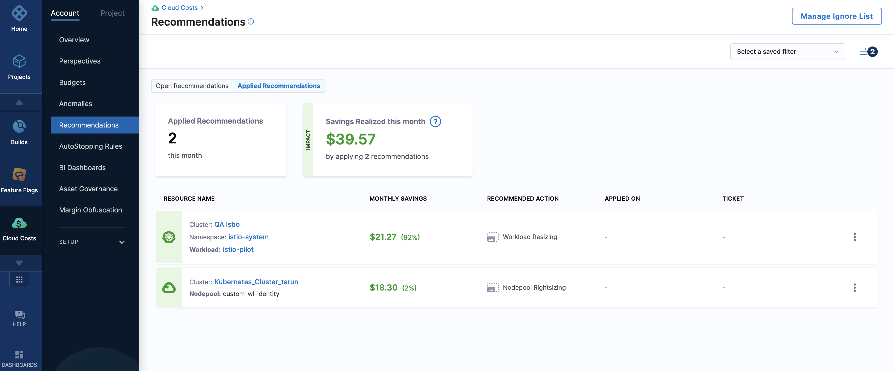

import Tabs from '@theme/Tabs';
import TabItem from '@theme/TabItem';

# CCM Recommendations Overview

:::note Recommendation Availability
After enabling CCM, recommendations may take up to 48 hours to appear in Cloud Costs. This timing depends on when CCM receives the utilization data for your services. Access recommendations in **Cloud Costs** > **Recommendations**.
:::

## Supported Recommendation Types

Harness CCM provides intelligent cost optimization recommendations for the following resource types:

| Resource Type | Description |
|---------------|-------------|
| Azure VM | Optimize Azure virtual machine sizing and utilization |
| AWS EC2 | Right-size EC2 instances based on actual usage patterns |
| AWS ECS | Optimize container services for better resource efficiency |
| Kubernetes Nodepool | Improve cluster node configuration and count |
| Kubernetes Workload | Optimize container resource requests and limits |
| Governance | Identify policy violations and optimization opportunities |

:::tip What's New in 1.47.0
<Tabs>
  <TabItem value="Improved Recommendation Tracking" label="Improved Recommendation Tracking">
    **Enhanced Savings Tracking**
    
    Users can now specify estimated savings when marking a recommendation as applied, confirm whether estimated savings matched actual savings, and edit savings data in the Applied Recommendations section.
  </TabItem>
  <TabItem value="Cost Categories Integration" label="Cost Categories Integration">
    **Filter by Cost Categories**
    
    The Recommendations filter panel now includes Cost Categories filtering, particularly valuable for large organizations managing thousands of recommendations that need structured views for effective action.
  </TabItem>
  <TabItem value="Recommendations Filter Revamp" label="Recommendations Filter Revamp">
    **Streamlined Filtering Experience**
    
    The Recommendations filter panel has been redesigned to provide a more intuitive and efficient filtering experience.
  </TabItem>
</Tabs>
:::

## Accessing Recommendations

Navigate to the **Recommendations** tab in the Cloud Costs section to access the recommendations dashboard. The page is organized into two main tabs:

1. **Open Recommendations** - Displays all available recommendations that haven't been applied yet
2. **Applied Recommendations** - Shows recommendations that have already been implemented

### Open Recommendations Dashboard


The Open Recommendations dashboard provides comprehensive information and actions:

| Feature | Description |
|---------|-------------|
| Potential Monthly Savings | Total estimated cost reduction from implementing all recommendations |
| Potential Monthly Spend | Projected spend without applying the recommendations |
| Export CSV | Download all recommendation data for offline analysis |
| Create Ticket | Generate tickets in your integrated ticketing system |
| Settings | Configure recommendation preferences and presets |
| Manage Ignore List | View and manage resources excluded from recommendations |

#### Filtering Options

Refine your recommendations view using multiple filters:

- Recommendation Type (EC2, ECS, Nodepool, etc.)
- Cloud Provider (AWS, Azure, GCP)
- Cost Categories (for enterprise-scale filtering)
- Additional filters for precise targeting:


### Applied Recommendations


### Recommendation Details

Click on any recommendation to view its detailed breakdown, including:
- Resource specifications
- Current vs. recommended configuration
- Estimated savings calculation
- Historical utilization data
- Implementation guidance

## Resource-Specific Recommendations

### Azure VM Recommendations

Optimize Azure VM costs by right-sizing virtual machines based on actual utilization patterns. The detailed view provides comprehensive insights into current usage and recommended configurations.


### AWS EC2 Recommendations

Identify over-provisioned EC2 instances and receive tailored recommendations for optimal instance types based on your workload requirements.


### AWS ECS Recommendations

Optimize container resource allocation and service configuration to eliminate waste while maintaining performance.


### Kubernetes Nodepool Recommendations

Receive guidance on cluster node count and configuration to balance performance and cost efficiency.


### Kubernetes Workload Recommendations

Fine-tune container resource requests and limits based on actual usage patterns to eliminate waste.


### Governance Recommendations

Identify policy violations and optimization opportunities across your cloud infrastructure.

**Detailed Documentation by Cloud Provider:**
- [Azure Governance Recommendations](https://developer.harness.io/docs/category/governance-for-azure)
- [GCP Governance Recommendations](https://developer.harness.io/docs/category/governance-for-gcp)
- [AWS Governance Recommendations](https://developer.harness.io/docs/category/governance-for-aws)

## Customizing Recommendations

:::note Update Timing
New recommendation preferences may take up to 24 hours to fully propagate across the platform. Changes appear immediately on drill-down pages, while the Overview page may update more gradually.
:::

Harness CCM allows you to tailor recommendations to your specific requirements through comprehensive settings. Access these options by clicking **Settings** in the Recommendations dashboard.

### Recommendation Preferences

<DocImage path={require('./static/preferences.png')} width="70%" height="70%" title="Click to view full size image" />

#### General Preferences

| Preference | Description | Use Case |
|------------|-------------|----------|
| Show Recommendations on Parent Resources | Enable optimization suggestions for high-level infrastructure (Nodepool, EC2, ECS Services) | For infrastructure teams focusing on platform-level optimization |
| Show Recommendations on Child Resources | Display recommendations for individual workloads and application components | For application teams needing component-level optimization |
| Show Recommendations on Ignored Resources | Continue displaying recommendations for resources in the ignore list | For monitoring previously excluded resources |

#### Resource-Specific Preferences

Select preset configurations for each resource type and set the default analysis time range to ensure recommendations match your operational patterns.

### Managing Recommendation Presets

:::note Default vs. Custom Settings
Harness CCM provides default presets for all resource types. For custom tuning, click on any recommendation and expand the "Tune Recommendations" section.
:::

Presets allow you to save customized recommendation configurations for different resource types and use cases.

<DocImage path={require('./static/managepresets.png')} width="70%" height="70%" title="Click to view full size image" />

#### Benefits of Using Presets

- **Time-Saving Automation**: Eliminate repetitive manual adjustments when generating recommendations
- **Flexible Customization**: Create different presets for various environments or workload types
- **Simplified Management**: Easily control and standardize recommendation settings across your organization

#### Supported Tuning Parameters by Resource Type

| Resource Type | Available Tuning Parameters | Purpose |
|---------------|------------------------------|----------|
| Kubernetes Workload | Quality of Service (QoS), CPU/Memory Buffer % | Balance performance and efficiency for containerized applications |
| Kubernetes Nodepool | Minimum Node Count, CPU/Memory Buffer % | Ensure cluster stability while optimizing infrastructure |
| AWS EC2 | Instance Family Scope (Same/Cross-family) | Control recommendation scope based on migration complexity |
| AWS ECS | CPU/Memory Buffer % | Maintain container performance while reducing waste |

### Resource-Specific Preset Configurations

#### Kubernetes Workload Presets

Tune container resource optimization with these parameters:

- **Quality of Service (QoS)**: Define the performance tier for your workloads
- **CPU/Memory Buffer Percentage**: Add safety margins to prevent resource constraints

<DocImage path={require('./static/workload-preset.png')} width="70%" height="70%" title="Kubernetes Workload Preset Configuration" />

#### Kubernetes Nodepool Presets

Optimize cluster infrastructure with these settings:

- **Minimum Node Count**: Ensure sufficient capacity for your workloads
- **CPU/Memory Buffer Percentage**: Maintain headroom for unexpected demand spikes

<DocImage path={require('./static/nodepool-preset.png')} width="70%" height="70%" title="Kubernetes Nodepool Preset Configuration" />

#### AWS ECS Presets

Fine-tune container service optimization:

- **CPU/Memory Buffer Percentage**: Balance resource efficiency with performance requirements

<DocImage path={require('./static/ecs-preset.png')} width="70%" height="70%" title="AWS ECS Preset Configuration" />

#### AWS EC2 Presets

Control the scope of instance recommendations:

- **Within Same Instance Family**: Optimize while maintaining hardware compatibility and minimizing migration complexity
- **Across Instance Families**: Maximize potential savings by considering all compatible instance types

<DocImage path={require('./static/ec-preset.png')} width="70%" height="70%" title="AWS EC2 Preset Configuration" />

## Managing the Ignore List

The Ignore List allows you to exclude specific resources from receiving recommendations, helping you focus on actionable items.

### Adding Resources to the Ignore List

You can add any of the following to your Ignore List:
- EC2 instances
- Azure VMs
- ECS Services
- Kubernetes Nodepools
- Kubernetes Workloads
- Governance recommendations

:::note Granular Governance Ignores
For Governance recommendations, Harness supports [Granular Recommendations](https://developer.harness.io/docs/cloud-cost-management/use-ccm-cost-governance/asset-governance/aws/aws-recommendations#granular-recommendations). When adding a governance recommendation to the Ignore List, you can specify the exact scope at which you want to ignore it.
:::

### Managing Ignored Resources

1. From the Recommendations dashboard, click **Manage Ignore List**
2. Review all currently ignored resources
3. To restore a resource to active recommendations, select it and click **Remove**

## Implementing Recommendations

Harness CCM integrates with your existing ticketing systems to streamline the implementation process.

### Configuring Ticketing Integration

1. Navigate to **Cloud Costs** > **Setup** > **Default Settings**
2. Expand the **Cloud Cost Management** section
3. Under **Ticketing preferences**, configure:
   - **Ticketing tool**: Select Jira (default) or ServiceNow
   - **Ticketing tool connector**: Choose an existing connector or [create a new one](#create-a-jira-or-servicenow-connector)
4. Click **Save** to apply your settings

### Creating Implementation Tickets

Once your ticketing integration is configured:

1. Select the recommendation(s) you want to implement
2. Click **Create Ticket**
3. Add any additional details specific to your implementation process
4. Submit the ticket to your development or operations team
5. Track implementation status through your ticketing system
6. Mark recommendations as applied once implemented

<DocImage path={require('./static/ticketing-tool-selector.png')} width="70%" height="70%" title="Click to view full size image" />


:::note
 Switching your ticketing tool between Jira and ServiceNow results in the removal of the existing recommendation tickets. The status of the tickets changes to **Create a ticket**.
:::


Go to the **Recommendations** page and create tickets to apply recommendations.

Perform the following steps to raise a ticket to apply recommendations:

1. Select **Create a ticket**. In case you haven't set up your ticketing tool settings on the account level, you will see a prompt guiding you to access the **Default Settings** page to configure both the ticketing tool and the associated connector.


2. Enter the following ticket details:


<Tabs>
  <TabItem value="Cost Reporting" label="Jira">


* **Jira project** — Select the Jira project where you want to create a ticket. Go to [Create Jira Issues in CD Stages](/docs/continuous-delivery/x-platform-cd-features/cd-steps/ticketing-systems/create-jira-issues-in-cd-stages.md).
* **Issue type** — Select a Jira issue type from the list of types in the Jira project you selected. Go to [Create Jira Issues in CD Stages](/docs/continuous-delivery/x-platform-cd-features/cd-steps/ticketing-systems/create-jira-issues-in-cd-stages.md).
* **Ticket summary** — Add a summary of the issue.
* **Description** — Add a description for the issue.


</TabItem>
  <TabItem value="Cost Optimization" label="ServiceNow">


   * **Ticket Type** - Select the ticket type from the dropdown list. For example, change request, Data Management task, and so on. Based on the selected ticket type, you might need to enter more required inputs.
   * **Short Description** - Enter a brief description of the task. This is the title of the ticket.
   * **Description** - Enter a more detailed description about the recommendation.


</TabItem>
</Tabs>

  
The ticket is created. The status of the ticket changes to **To do**. You need to assign the ticket to apply the recommendations. After applying the recommendations, when the ticket status changes to **Done**, the recommendation is displayed in the **Applied Recommendations** tab. 
If you have not changed the ticket status to **Done** after applying the recommendation, you could use the **More actions** icon (three vertical dots), and then select **Mark as applied** to move the recommendation to the **Applied Recommendations** tab.
To view the recommendations that are applied, and the cost savings realized, select the **Applied Recommendations** tab.

   


### Create a Jira or ServiceNow connector
1. In the **Overview** step, enter the name. 
2. Optionally, enter a short description and tags.
3. In the **Details** step, enter the base URL. For example, https://mycompany.atlassian.net. For more information, go to [Configuring the base URL](https://confluence.atlassian.com/adminjiraserver071/configuring-the-base-url-802593107.html).
4. Enter the email ID used to log in to your Jira account.
5. Create or select a Harness encrypted test secret for the API key. To create a secret, go to [Add and reference text secrets](/docs/platform/secrets/add-use-text-secrets).
6. In the **Delegates Setup** step, select one of the following options: 
   * **Use any available Delegate**: Select this option to let Harness choose a Delegate at runtime.
   When a task is ready to be assigned, the Harness Manager first validates its lists of Delegates to assign the task.
   The following information describes how the Harness Manager validates and assigns tasks to a Delegate:
     
      * **Heartbeats**: Running Delegates send heartbeats to the Harness Manager in one-minute intervals. If the Manager does not have a heartbeat for a Delegate when a task is ready to be assigned, it will not assign the task to that Delegate.
     
      * **Tags**: Go to [Use delegate selectors](../../../platform/delegates/manage-delegates/select-delegates-with-selectors.md).
       
      * **Allowlisting**: After a Delegate is validated for a task, it is allowlisted for that task. This Delegate is likely to be used again for that task. The allowlisting criteria is the URL associated with the task, such as a connection to a cloud platform, repo, or API. A Delegate is allowlisted for all tasks using that URL. The Time-To-Live (TTL) for the allowlisting is 6 hours, and the TTL is reset with each successful task validation.
     
      * **Blocklisting**: If a Delegate fails to perform a task, it is blocklisted for that task. This Delegate is not selected again to perform that task. TTL is five minutes. This is true even if there is only one Delegate and the Delegate is selected for that task with a Selector.

   * **Only use Delegates with all the following tags**: Select this option to use specific Delegates using their Tags. 
   You only need to select one of a Delegate's Tags to select it. All Delegates with the Tag are selected. This option is useful when you have installed specific software on specific Delegates and want to ensure that your Pipeline uses those Delegates.
7. Select **Save and Continue**. The Connector is created and validated. 

You can create and use filters to select resources and recommendations.

You can filter by:

* **Resource Name** — The name of the resource being monitored.
* **Namespace** — A namespace in the cluster.
* **Cluster Name** — A cluster in your infrastructure.
* **Resource Type** — The type of resources for which the recommendation is displayed. Currently, CCM supports ECS service, node pool, and workload.
* **Savings** — Enter the minimum monthly savings. For example, all the recommendations with potential monthly savings of more than $1000.
* **Potential Spend** — Filter by forecasted monthly spend greater than the specified amount. For example, all the recommendations with forecasted monthly spend of more than $1000.

The recommendation for the selected resource is displayed.

Select a recommendation to view its details.

Within a recommendation, select the number of days to compute recommendations based on the utilization data. You can select the last day, 7 days, or 30 days.

You can use this information to optimize your resources to potentially reduce your monthly cloud costs.

#### ServiceNow ticket

<DocImage path={require('./static/servicenow_Example.png')} width="80%" height="80%" title="Click to view full size image" />

The Description field contains relevant information about the recommendation for which this ticket was created. Harness CCM retrieves the following data from ServiceNow:

When a user opens the dialog box to create a ServiceNow ticket, a request is made to obtain all possible ticket types. Here is a sample response:

```json
{
    "status": "SUCCESS",
    "data": [
        {
            "key": "asset_reclamation_request",
            "name": "Asset Reclamation Request"
        },
        {
            "key": "asset_task",
            "name": "Asset Task"
        },
        {
            "key": "business_app_request",
            "name": "Business Application Request"
        }
    ]
}
```

Once the user selects a ticket type, another request retrieves the fields associated with that ticket type to determine the required fields. Here is a sample response:

```json
{
    "data": [
        {
            "key": "parent",
            "name": "Parent",
            "required": false,
            "schema": {
                "array": false,
                "typeStr": "",
                "type": "unknown",
                "customType": null,
                "multilineText": false
            },
            "internalType": null,
            "allowedValues": [],
            "readOnly": false,
            "custom": false
        },
        {
            "key": "made_sla",
            "name": "Made SLA",
            "required": false,
            "schema": {
                "array": false,
                "typeStr": "boolean",
                "type": "boolean",
                "customType": null,
                "multilineText": false
            },
            "internalType": null,
            "allowedValues": [],
            "readOnly": false,
            "custom": false
        }
    ]
}
```

When the user clicks "Create Ticket," an API call is made to ServiceNow to create the ticket with the provided inputs. Additionally, there is an internal call that periodically checks if the ticket has been closed. Based on this status, the recommendation is moved to the applied state.

## Export recommendations data

You can export your Recommendations as comma-separated values (CSV) files. Exporting allows you to use the data in other software. Export respects the filters applied by the user in the filter panel.

### Limitations

- Only comma-separated values files (CSV) are supported.
- The maximum number of rows allowed in one export is 10,000 rows.
- The more rows you export, the slower the export will be.

### Create a Recommendations Export

1. Open Recommendations.

  
2. Click **Export CSV**.

3. Enter a name for the CSV file.

4. In **Export rows up to**, enter the number of rows you want exported. The number of rows should be greater than or equal to 1.

5. Click **Download**. The file is downloaded to your computer.

## Recommendations Filtering Support 

Harness provides filtering support for recommendations based on cloud account identifiers and Kubernetes attributes. This allows for better cost optimization insights while maintaining alignment with perspective-based RBAC settings.

### Filtering Support for Recommendations 

- **AWS EC2**: Filtering is supported on AWS Account ID. Nested Cost Categories are not supported.  

- **AWS ECS**: Filtering is supported on AWS Account ID. Nested Cost Categories are not supported.  

- **Azure VM**: Filtering is not supported.  

- **Kubernetes**: Filtering is supported on Labels and Cluster Name. Nested Cost Categories are not supported.  

- **Governance Recommendations**:

  -   **AWS**: No filtering support.  
  -   **Azure**: No filtering support.  
  -   **GCP**: No filtering support.  

:::note

Filtering support for recommendations extends to **RBAC configurations based on perspective folder access settings**, ensuring that cost-saving suggestions are appropriately scoped to the right teams. 

:::