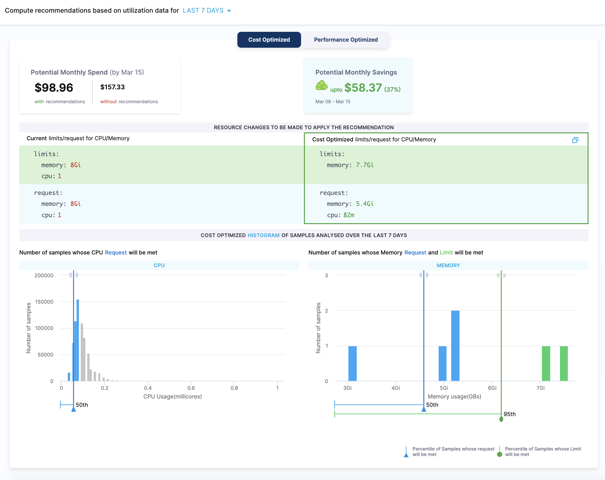
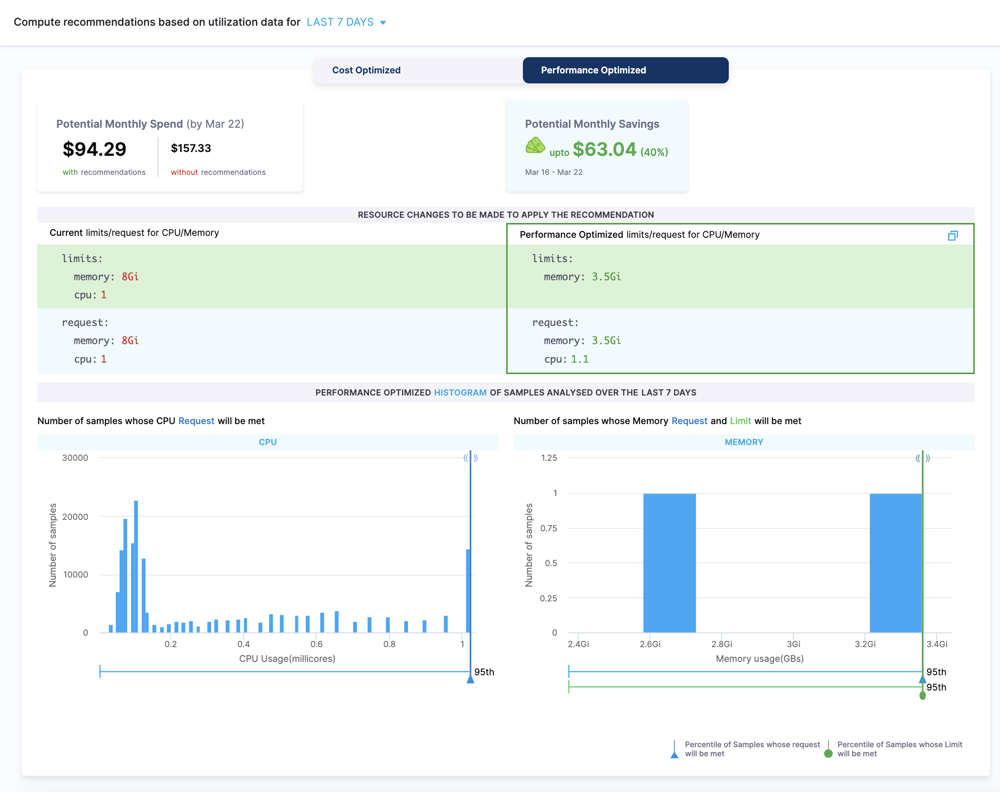
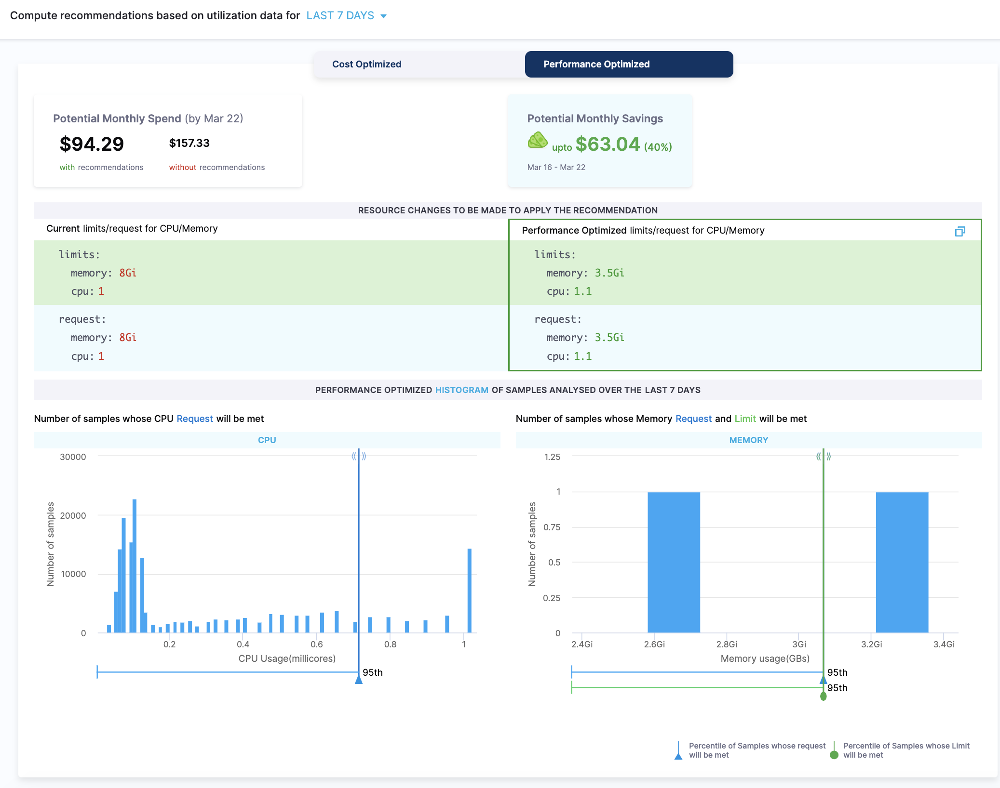
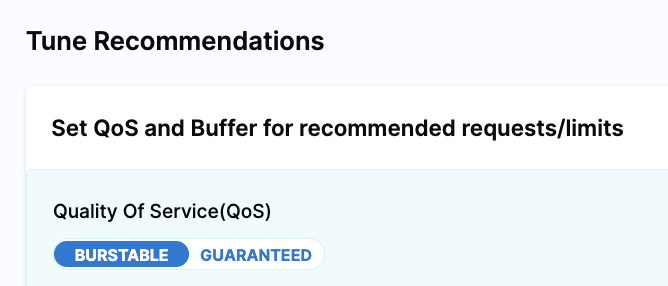
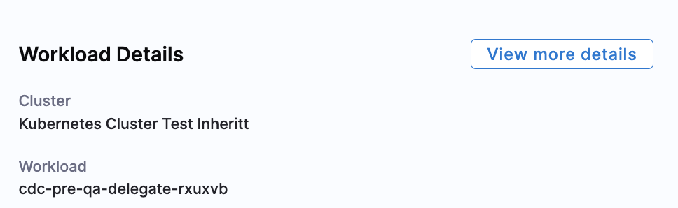
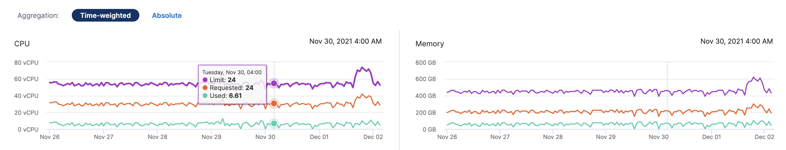
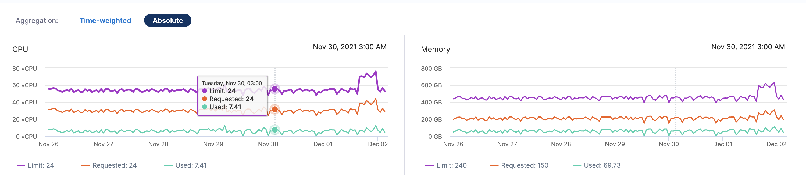

# Optimize Kubernetes costs with workload recommendations
One of the most impactful ways to reduce spend on Kubernetes infrastructure is to make sure your clusters are optimally sized for the workloads and node pools they run. Harness Cloud Cost Management (CCM) provides recommendations for your Kubernetes clusters to show you resource optimization opportunities to potentially reduce your monthly spend.

The recommendations are computed by analyzing the past utilization of CPU and memory of your workload. The implementation uses a histogram method to compute recommendations.

You can also tune recommendations by changing the Quality of Service (QoS) and the percentage of recommended CPU and memory requests/limits buffer.

This topic describes how CCM computes workload recommendations and how you can use them to potentially reduce monthly costs.

Before using recommendations in your cluster environment, ensure that you evaluate their impact thoroughly. The person reviewing the recommendations should be able to understand the impacts identified in the recommendations, as well as the impact on the infrastructure and business.  
Using recommendations without proper assessment could result in unexpected changes, such as issues with system performance or poor reliability.

## Before You begin

* [Set Up Cloud Cost Management for Kubernetes](../../2-getting-started-ccm/4-set-up-cloud-cost-management/set-up-cost-visibility-for-kubernetes.md)
* [CCM Perspectives](../../3-use-ccm-cost-reporting/1-ccm-perspectives/1-create-cost-perspectives.md)

## How are workload recommendations computed?

In Harness CCM, the workload recommendations are computed by analyzing the past utilization of CPU and memory of your workload. The implementation uses a histogram method to compute the recommendations.

The computation adds a 15% buffer to the recommended resources by default. CCM also allows you to add any additional buffer using the Tune recommendations option.

When you enable [Cost Visibility](../../2-getting-started-ccm/4-set-up-cloud-cost-management/set-up-cost-visibility-for-kubernetes.md) for your [Kubernetes Cluster](/docs/platform/Connectors/Cloud-providers/add-a-kubernetes-cluster-connector), the [Delegate](../../../platform/2_Delegates/delegate-concepts/delegate-overview.md) associated with your Connector starts collecting CPU and memory resource utilization metrics for every node and pod (including individual containers) present in the cluster every minute using a metrics server.  CCM relies on the Metrics Server and initializes recommendations after an initial data collection of 24-48 hours. The Metrics Server is queried by the controller every minute for utilization data.

The utilization data collected every minute is then aggregated in the Delegate for a 20-minute window. The 20-minute aggregated data is then sent to Harness:

* **CPU**: For CPU values, a partial histogram for the last 20 minutes is sent.
* **Memory**: The maximum value of the memory is sent as a single data point.

We use this data for further processing and to compute the complete histogram displayed in the UI (partial histograms are merged for the CPU and memory histogram is computed using the data points).

Each of these daily histograms has an equal weightage for a given workload. As a result, if you select the last 30 days of data to aggregate, we will assign equal weightage to each of the 30 days.



You can choose to tune the recommendations by changing the Quality of Service (QoS) and the percentage of recommended CPU and memory requests/limits buffer. See Tune Recommendations.

You can also customize your recommendations by increasing or decreasing the request and limit coverage of the CPU and memory samples. Simply drag the slider of the number of samples to adjust the percentile. The slider indicates the percentile of all the CPU and memory samples that are covered to compute the resource recommendations. Based on your selection, the recommendations for your workload are made.

## Why Histogram?

A histogram is used to account for the seasonality of high resource utilization on certain days of the week. Assume your application receives a lot of traffic (and thus a lot of resource utilization) on weekends and we're using a decaying histogram. In that case:

* If you view workload recommendation on Friday and selected the last seven days of utilization data, then Saturday will be given the least weightage, followed by Sunday, hence the recommended resources will be low.
* If you view the workload recommendation on Monday, Sunday will be given the most weightage, hence your recommended resources may be high.

To avoid this, we use the histogram method and give equal weight to all previous days.

##  Types of workload recommendations

The recommendations are categorized as the following:

* Cost Optimized
* Performance Optimized

### Cost Optimized

The cost-optimized recommendations are computed as the following:

* The lower bound is based on the 50th percentiles of CPU samples and memory peaks.
* There is no upper bound for CPU samples and memory peaks are based on the 95th percentile. It is recommended not to set the upper bound for the CPU samples, because the CPU is considered a compressible resource. If your application starts hitting the CPU limits, Kubernetes starts throttling the pods.
* There is no limit set for the CPU. This is to avoid the throttling of the workloads when there is a spike in CPU usage. The usage of the CPU may go up in certain conditions, for example during the pod start. In such a scenario, the CPU can burst and get the required additional resources.
* The potential monthly spend and savings are calculated based on the 90th percentiles of CPU samples and memory peaks.

Since the recommendations are computed using the 50th percentile of the CPU samples and memory peaks, this may potentially lead to system performance issues. Before using cost-optimized recommendations, ensure that you evaluate the recommendation's impact thoroughly.


### Performance Optimized

The performance-optimized recommendations are computed using the 95th percentile of CPU samples and memory peaks. Because of this, the probability of having any effect on the performance is minimum. However, the cost may go high for the resources that are optimized using this method.

The potential monthly spend and savings are calculated based on the 90th percentiles of CPU samples and memory peaks.



#### Example

Let's try to understand how the recommendations are computed using the following example. The following example illustrates how the resources can be optimized using the cost-optimized recommendations:


```
Current Resources:  
  limits:  
    memory: 8Gi  
    cpu: 1  
   requests:  
     memory: 8Gi  
     cpu: 1  
   
Recommended Resources based on utilization data for the last 7 days (QoS: Guaranteed, %of buffer: 0)  
  
 limits:  
  memory: 3.5Gi  
  cpu: 1.1  
requests:  
  memory: 3.5Gi  
  cpu: 1.1
```
The current resources are provisioned using `8Gi memory` and `1 CPU`, the recommended resources require only `3.5Gi memory` and `1.1m CPU` for limits and requests both.


## Step: Tune and share recommendations

Tune the recommendations by changing the Quality of Service (QoS) and the percentage of recommended CPU and memory requests/limits buffer.

### Quality Of Service(QoS) for Workloads

You can set burstable or guaranteed QoS for recommended requests/limits. For more information on QoS, see [Configure Quality of Service for Pods](https://kubernetes.io/docs/tasks/configure-pod-container/quality-service-pod/).

#### Burstable

A pod is assigned to a QoS class of burstable if:

* The pod does not meet the criteria for QoS class Guaranteed.
* At least one container in the pod has a memory or CPU request.

In this QoS class, resources can go beyond requests up to the limits. This recommended action does not affect other workloads and stays within bounds of usage. The scheduler uses the request to place the pod on a node, but the pod can use more resources up to the limit before it’s killed or throttled. For more information, see the [QoS class of Burstable](https://kubernetes.io/docs/tasks/configure-pod-container/quality-service-pod/#create-a-pod-that-gets-assigned-a-qos-class-of-burstable).

We do not recommend CPU limits in the case of burstable QoS.

#### Guaranteed

In this Quality of Service (QoS) class, resource requests and limits are set to the same values. Setting them to the same values guarantees that the resources requested by the container will be available to it when it is scheduled. This is considered as the ideal QoS class for the most stable Kubernetes clusters.

For a pod to be given a QoS class of guaranteed:

* Every container in the pod must have a memory limit and a memory request, and they must be the same.
* Every container in the pod must have a CPU limit and a CPU request, and they must be the same.

For more information, see the [QoS class of Guaranteed](https://kubernetes.io/docs/tasks/configure-pod-container/quality-service-pod/#create-a-pod-that-gets-assigned-a-qos-class-of-guaranteed).

To change the QoS, do the following:

1. In the Recommendations details page, go to the **Tune** **Recommendations** section.
2. In **Quality Of Service (QoS)**, select **Burstable** or **Guaranteed**.
   
     
   
   Based on your selection, the recommendations for your resources are made.

### Buffer for workloads

You can set the percentage of buffer for recommended requests/limits.

By default, the recommendation computation adds a 15% buffer to the recommended resources. This option allows you to add an additional buffer to your resources.In the Recommendations details page, go to the **Tune** **Recommendations** section.

In **% Buffer to be considered for CPU/Memory values**, drag the slider to increase or decrease the percentage of the buffer. By default, it is set to 0.

The resource recommendations are based on the percentage of the buffer you set.

### Set CPU/Memory/Node count/Instance preferences

See [Optimize Kubernetes Costs with Node Pool Recommendations](node-pool-recommendations.md).

### Sharing recommendations

When you tune a recommendation, the URL for the recommendation captures your changes.

You can see the changes following `details?` in the URL. For example, `details?buffer=10&QoS="GUARANTEED"`.

Capturing your changes in the URL enables you to share your tuned recommendation and ensure others can see you tuning. Simply tune the recommendation and then share the URL.

## View workload details

You can also view the following information:

* Details of the pods associated with the workload.
* CPU and memory utilization of the workload.

In the Recommendations details page, in **Workload Details**, click **View more details**.



The following details are displayed:

* **Workload details**: The following information is displayed:
	+ Workload
	+ Namespace
	+ Workload Type
	+ Cluster
* **Cost details**: The following cost details are displayed:
	+ **Total Cost**: For Kubernetes clusters, the total cost is the sum of all the node costs. For ECS clusters, the sum of all container instances.
	+ **Idle Cost**: Idle cost is the cost of idle resources (CPU and memory) allocated to a Kubernetes pod or an Amazon ECS task but is not utilized. For more information, see [Idle Cost](../../2-getting-started-ccm/2-harness-key-cloud-cost-concepts.md#idle-cost).
	+ **Utilized Cost**: Utilized cost is the cost estimate for the utilized node or pod resources.
* **Aggregation**: The aggregated CPU and memory utilization value of your workload. The values are displayed as the following:
	+ **Time-weighted**: This considers the active duration of pods when calculating the CPU and memory utilization.
  
      
	+ **Absolute**: This simply aggregates the CPU and memory utilization values.

Let's try to understand how **time-weighted** and **absolute** values are calculated using the following examples:

#### Example 1

Let's assume you want to check the CPU requests of your workload between 3 a.m. and 4 a.m. Imagine there were two pods during that duration:

1. Each pod requesting 0.4 CPU
2. 1st pod was deleted at 3:53 a.m. So the 1st pod was active for 53 minutes in that duration
3. 2nd pod was created at 3.53 a.m., so it was active for 7 mins in that duration

In the case of **time-weighted**, the utilization value is calculated as the following:

`[(cpu request of pod 1) * (active time) + (cpu request of pod 2) * (active time)]/ total duration`

which is equal to `[(0.4*53) + (0.4*7)]/60 = 0.4`

In the case of **absolute**, the utilization value is calculated as the following:

`(cpu request of pod 1) + (cpu request of pod 2)`

which is equal to `0.4 + 0.4 = 0.8`

#### Example 2

Let's assume you want to check the CPU requests of three workloads in your cluster:

1. Each workload requesting 0.4 CPU
2. Workload 1 runs from 0-25 mins into the hour
3. Workload 2 runs from 15-40 mins into the hour
4. Workload 3 runs from 35-60 mins into the hour

In the case of **time-weighted**, the utilization value is calculated as the following:

`[(cpu request of pod 1) * (active time) + (cpu request of pod 2) * (active time) + (cpu request of pod 3) * (active time)]/ total duration`

which is equal to `((0.4*25) + (0.4*25) + (0.4*25))/60 = 0.5`

In the case of **absolute**, the utilization value is calculated as the following:

`(cpu request of pod 1) + (cpu request of pod 2) + (cpu request of pod 3)`

which is equal to `0.4 + 0.4 + 0.4 = 1.2`

### Next steps

* [Optimize Kubernetes Costs with Node Pool Recommendations](../../4-use-ccm-cost-optimization/1-ccm-recommendations/node-pool-recommendations.md)
* [Analyze Cost for Kubernetes Using Perspectives](../../3-use-ccm-cost-reporting/3-root-cost-analysis/analyze-cost-for-k8s-ecs-using-perspectives.md)

### See also

The following blog post walks you through workload recommendations:

[Cloud Cost Workload Recommendations](https://harness.io/blog/recommendations-deep-dive/)

