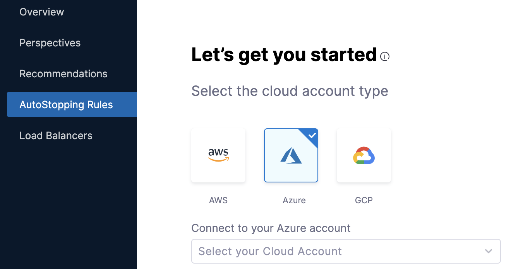

Connectors allow Harness to connect to your deployment environments, such as Kubernetes Clusters, AWS, Google Cloud Platform, Azure, etc. To create an AutoStopping Rule for your Azure instances, you first need to connect Harness to your Azure account. This topic describes how to connect your Azure cloud account to Harness.

### Before you begin

* [AutoStopping Rules Overview](../1-auto-stopping-rules.md)

### Prerequisites

* Make sure that you have the **Application Administrator** role assigned for your Azure AD. Users in this role can create and manage all aspects of enterprise applications, application registrations, and application proxy settings. See [Application Administrator](https://docs.microsoft.com/en-us/azure/active-directory/roles/permissions-reference#application-administrator).
* Many Azure CLI commands act within a subscription. Ensure that you have selected the right subscription before executing the commands. If you need to switch the subscription, use the following command:  
`az account set -s <`*`subs id/name`*`>`  
For more information, see [Manage Subscriptions](https://docs.microsoft.com/en-us/cli/azure/manage-azure-subscriptions-azure-cli).

### Add your Azure Cloud account

Perform the following steps to link your Azure cloud account to Harness.

1. In **Cloud Costs**, click **New AutoStopping Rule**.
   
     
2. In **AutoStopping Rules**, select **Azure**. It is the cloud account in which your workloads are running that you want to manage using AutoStopping rules.
   
     
3. Click **Connect to your Azure account** drop-down list and then click **New Connector**.
4. See [Set up Cloud Cost Management for Azure](../../../2-getting-started-ccm/4-set-up-cloud-cost-management/set-up-cost-visibility-for-azure.md) for further instructions.

### Next Steps

* [Create AutoStopping Rules for Azure](../4-create-auto-stopping-rules/create-auto-stopping-rules-for-azure.md)
* [Use AutoStopping Rules Dashboard](../4-create-auto-stopping-rules/autostopping-dashboard.md)

