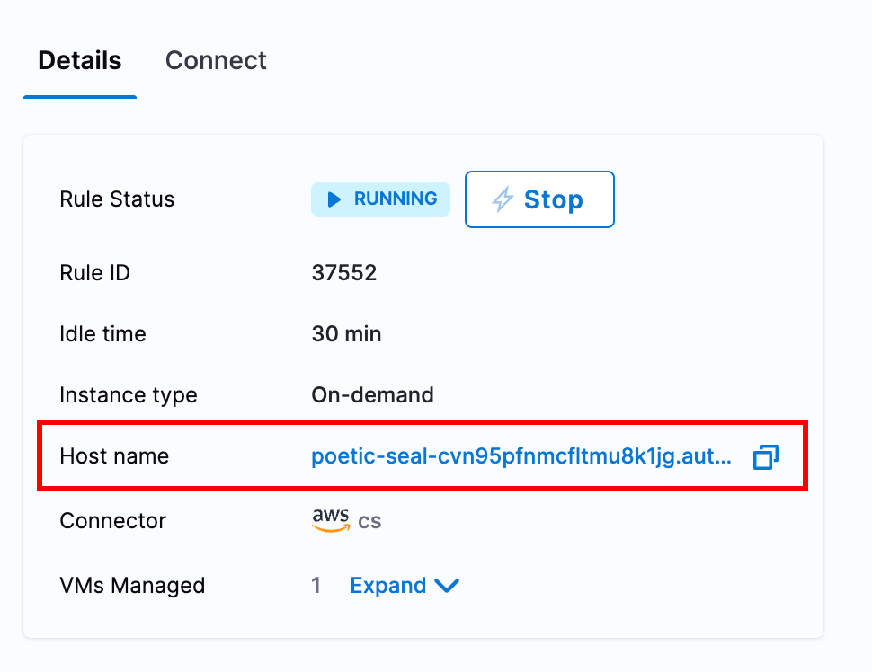

This topic describes how to configure ECG on Windows for AutoStopping Rules. You can assume ECG as an **event emitter** for your rule. It sends usage records for the configured rules.

When the ECG is configured on an instance, it will send activity metrics to Harness to prevent the instance from being shut down. The ECG does not support turning the instance back on automatically (as the instance has to be on for the process to run).

## Pre-Requisites

You will need an existing Windows machine, and autostopping rule configured in your account for the same machine. Make sure no other VMs are specific on the autostopping rule other than the machine you are installing the ECG on.

## Installation of the ECG on Windows

The following install should be done from a Powershell terminal running as an administrator.

### Download the binary

Download the ECG file [from S3](https://lightwing-downloads-temp.s3.ap-south-1.amazonaws.com/ecg/harness_autostop_ecg_windows_amd64.zip).

```
Invoke-WebRequest -Uri "https://lightwing-downloads-temp.s3.ap-south-1.amazonaws.com/ecg/harness_autostop_ecg_windows_amd64.zip" -OutFile "./Downloads\harness_autostop_ecg_windows_amd64.zip"
```

Unzip the file and move the binary into a new Harness directory

```
Expand-Archive -Path "./Downloads\harness_autostop_ecg_windows_amd64.zip" -DestinationPath "./Downloads\harness_autostop_ecg_windows_amd64"
cd ecg_1.2.0_linux_amd64

mkdir C:\Users\Administrator\harness
mv .\Downloads\harness_autostop_ecg_windows_amd64\harness_autostop_ecg_windows_amd64 C:\Users\Administrator\harness\harness_autostop_ecg_windows_amd64.exe
```

### Configure the Agent

We will configure the ECG by setting environment variables on the system

To configure your Harness account and the autostopping rule tied to this machine:
```
setx ECG_accountID "{account_id}" /M
setx ECG_apiURL "https://app.harness.io/gateway/lw/api" /M
setx ECG_ruleHostName "{host_name}" /M
```

Where you should replace `{account_id}` with your Harness account id, and `{host_name}` with the hostname of your autostopping rule (without the `http://`)



If you use a non-standard Harness URL, you can change the `apiURL` accordingly.

To watch for user sessions (any user is logged into the machine):
```
setx ECG_user_session_watch "true" /M
```

### Install the ECG

Finally install the ECG as a Windows service and start it

```
cd C:\Users\Administrator\harness
./harness_autostop_ecg_windows_amd64.exe install
Start-Service Harness-ecg
```

## Validation

At this point you should be able to see activity metrics being sent to Harness via the log on your autostopping rule.

The service should restart manually on reboot, such that after a successful shutdown by Harness, when a user restarts the machine and logs in the machine won't be deemed "idle" until all users have logged off the machine.
