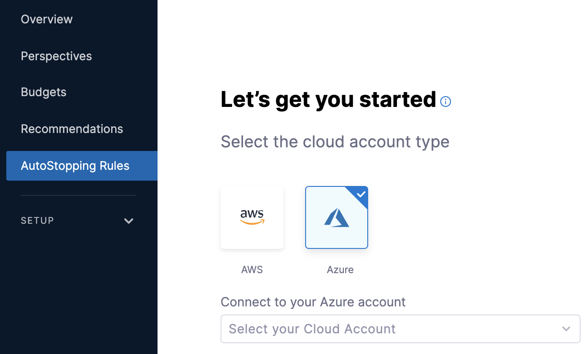
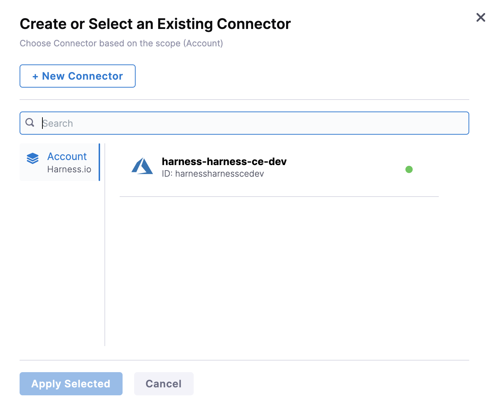
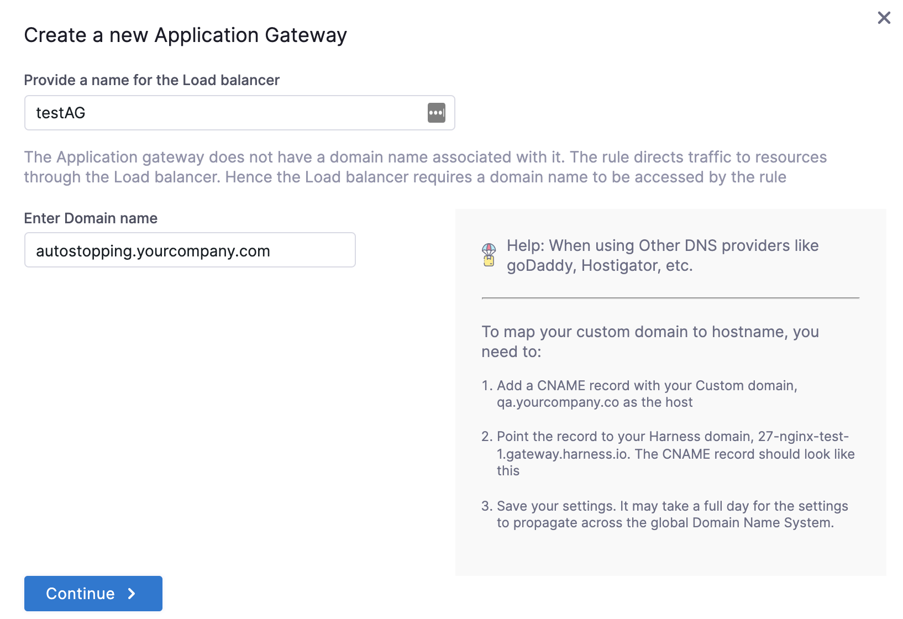

# Create an Application Gateway for Azure

Azure Application Gateway is a web traffic load balancer that enables you to manage traffic to your web applications. Application Gateway can make routing decisions based on additional attributes of an HTTP request, for example, URI path or host headers.

### Before You Begin

* [Connect to an Azure Connector](../1-add-connectors/add-azure-connector.md)
* [Create AutoStopping Rules for Azure](../4-create-auto-stopping-rules/create-auto-stopping-rules-for-azure.md)

### Create a New Application Gateway

Perform the following steps to create a new Application Gateway in Azure.

1. In **Cloud Costs**, click **New AutoStopping Rule**.

  
2. In **AutoStopping Rules**, select **Azure**. It is the cloud account in which your workloads are running that you want to manage using AutoStopping rules.
   
     
3. If you have already linked your Azure account and want to use that account, then select the Azure account from the list.
4. If you have not added your cloud account, click **New Connector**. For the detailed steps, see [Connect to an Azure Connector](../1-add-connectors/add-azure-connector.md).  

  
5. Define an AutoStopping Rule. See [Step 2: Add a New AutoStopping Rule](../4-create-auto-stopping-rules/create-auto-stopping-rules-for-azure.md).
6. Select the resources to be managed by the AutoStopping Rule. See Step: [Select the Resources to be Managed by the AutoStopping Rule](../4-create-auto-stopping-rules/create-auto-stopping-rules-for-azure.md#select-the-resources-to-be-managed-by-the-autostopping-rule)
7. Select the instance fulfillment type. See Step 3: Select the Instance Fulfillment Type.
8. (Optional) Set up advanced configuration. See Step: Set Up Advanced Configuration.
9. In **Setup Access**, select **DNS Link**.
10. In **Select Application Gateway**, click **New Application Gateway** to add an application gateway.
11. In **Create a new Application Gateway**, in **Provide a name for the Load balancer**, enter a name for your application gateway. This name will appear in your application gateway list.
12. In Enter Domain Name, enter a domain name. For example, `autostopping.yourcompany.com`.  

  
13. Click **Continue**.
14. Select region from the drop-down list to install the Access Point.
15. Select a **Resource Group** from the drop-down list.
16. (Optional) Upload a **Certificate**.
17. Select **Virtual Network**.
18. Select **Subnet**.
19. Select **Frontend IP**.
20. Select **SKU**.
21. Click **Save**.  
  
Your application gateway is listed under the **Application Gateway**.

